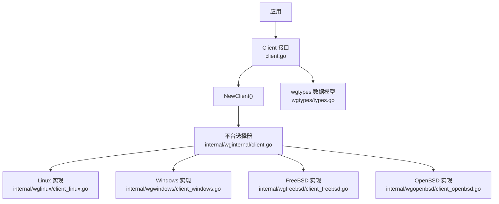
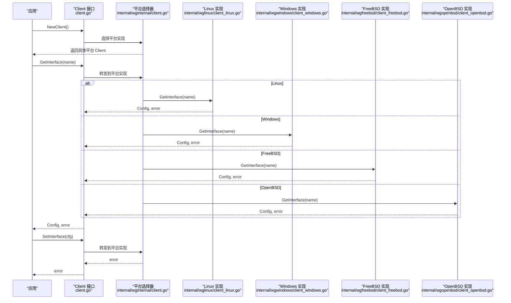
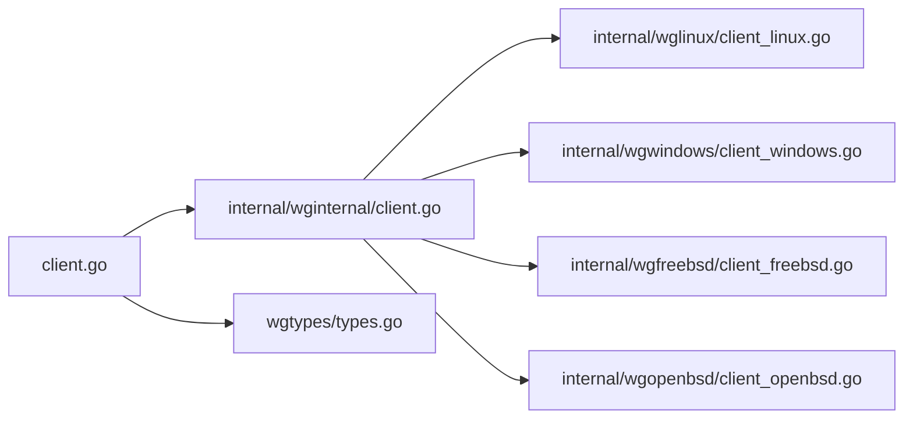
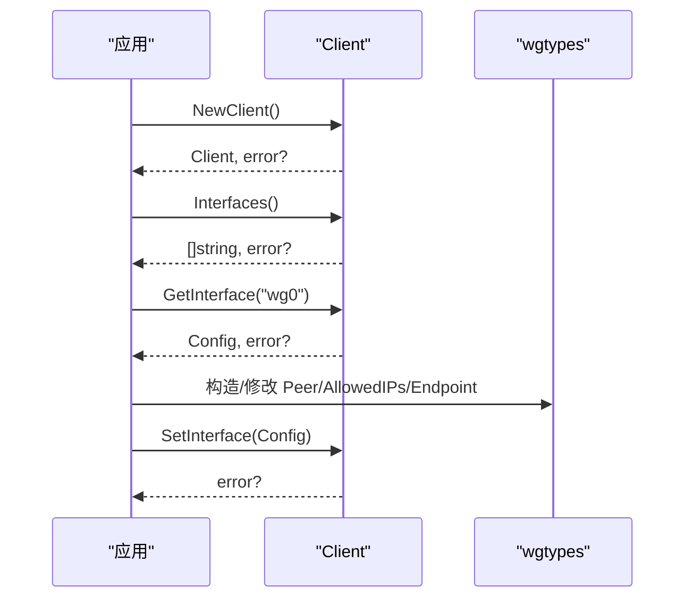

# Go 库 API 参考

<cite>
**本文引用的文件**
- [client.go](file://client.go)
- [doc.go](file://doc.go)
- [wgtypes/types.go](file://wgtypes/types.go)
- [wgtypes/errors.go](file://wgtypes/errors.go)
- [internal/wginternal/client.go](file://internal/wginternal/client.go)
- [internal/wglinux/client_linux.go](file://internal/wglinux/client_linux.go)
- [internal/wgwindows/client_windows.go](file://internal/wgwindows/client_windows.go)
- [internal/wgfreebsd/client_freebsd.go](file://internal/wgfreebsd/client_freebsd.go)
- [internal/wgopenbsd/client_openbsd.go](file://internal/wgopenbsd/client_openbsd.go)
- [cmd/wgctrl/main.go](file://cmd/wgctrl/main.go)
</cite>

## 目录
1. [简介](#简介)
2. [项目结构](#项目结构)
3. [核心组件](#核心组件)
4. [架构总览](#架构总览)
5. [详细组件分析](#详细组件分析)
6. [依赖关系分析](#依赖关系分析)
7. [性能考虑](#性能考虑)
8. [故障排查指南](#故障排查指南)
9. [结论](#结论)
10. [附录：API 参考与示例](#附录api-参考与示例)

## 简介
wgctrl-go 是一个用于管理 WireGuard 接口的 Go 客户端库。它提供统一的 Client 接口，屏蔽不同操作系统（Linux、Windows、FreeBSD、OpenBSD）的实现差异，支持查询和配置 WireGuard 接口、对等体、密钥、监听端口等。wgtypes 包定义了配置与状态的数据类型，如 Config、Peer、Key 等，供上层应用使用。

本参考文档聚焦于公共 API：Client 接口及其方法（NewClient、GetInterface、SetInterface 等），wgtypes 包中的数据类型定义与用法，错误处理模式、并发安全注意事项与性能优化建议，并提供完整的代码示例路径以便快速上手。

## 项目结构
仓库采用“平台无关的顶层 API + 内部平台实现”的分层组织方式：
- 顶层 client.go 暴露统一 Client 接口与 NewClient 构造器
- wgtypes 包定义通用数据结构
- internal 下按平台拆分实现（wglinux、wgwindows、wgfreebsd、wgopenbsd）
- cmd 提供命令行工具示例

图表来源
- [client.go:1-200](file://client.go#L1-L200)
- [internal/wginternal/client.go:1-200](file://internal/wginternal/client.go#L1-L200)
- [internal/wglinux/client_linux.go:1-200](file://internal/wglinux/client_linux.go#L1-L200)
- [internal/wgwindows/client_windows.go:1-200](file://internal/wgwindows/client_windows.go#L1-L200)
- [internal/wgfreebsd/client_freebsd.go:1-200](file://internal/wgfreebsd/client_freebsd.go#L1-L200)
- [internal/wgopenbsd/client_openbsd.go:1-200](file://internal/wgopenbsd/client_openbsd.go#L1-L200)
- [wgtypes/types.go:1-200](file://wgtypes/types.go#L1-L200)

章节来源
- [client.go:1-200](file://client.go#L1-L200)
- [doc.go:1-200](file://doc.go#L1-L200)
- [internal/wginternal/client.go:1-200](file://internal/wginternal/client.go#L1-L200)

## 核心组件
- Client 接口：对外暴露的 WireGuard 管理接口，包含获取/设置接口、列出接口等方法。
- NewClient：根据运行环境创建具体平台的 Client 实例。
- wgtypes 数据模型：Config、Peer、Key、PrivateKey、PublicKey、PresharedKey、Endpoint、AllowedIPs 等。

章节来源
- [client.go:1-200](file://client.go#L1-L200)
- [wgtypes/types.go:1-200](file://wgtypes/types.go#L1-L200)

## 架构总览
下图展示了从应用调用到平台实现的完整流程，包括错误返回与返回值传递。

图表来源
- [client.go:1-200](file://client.go#L1-L200)
- [internal/wginternal/client.go:1-200](file://internal/wginternal/client.go#L1-L200)
- [internal/wglinux/client_linux.go:1-200](file://internal/wglinux/client_linux.go#L1-L200)
- [internal/wgwindows/client_windows.go:1-200](file://internal/wgwindows/client_windows.go#L1-L200)
- [internal/wgfreebsd/client_freebsd.go:1-200](file://internal/wgfreebsd/client_freebsd.go#L1-L200)
- [internal/wgopenbsd/client_openbsd.go:1-200](file://internal/wgopenbsd/client_openbsd.go#L1-L200)

## 详细组件分析

### Client 接口与方法
- NewClient
  - 作用：根据当前操作系统创建并返回一个可用的 Client 实例。
  - 参数：无。
  - 返回值：Client 实例；若初始化失败则返回错误。
  - 错误处理：当系统不支持或底层权限不足时可能返回错误。
  - 最佳实践：在程序启动时尽早创建并复用 Client，避免重复创建开销。
- GetInterface(name string) (wgtypes.Config, error)
  - 作用：读取指定名称的 WireGuard 接口的当前配置与状态。
  - 参数：接口名（字符串）。
  - 返回值：配置对象与可能的错误。
  - 错误处理：接口不存在、权限不足或内核/驱动不可用时返回错误。
  - 最佳实践：对 name 进行非空校验；捕获并记录错误上下文。
- SetInterface(cfg wgtypes.Config) error
  - 作用：将配置应用到指定接口。
  - 参数：wgtypes.Config 结构体。
  - 返回值：成功或错误。
  - 错误处理：非法配置、权限不足、内核拒绝更新时会返回错误。
  - 最佳实践：先 GetInterface 再增量修改后 SetInterface，减少误覆盖风险。
- Interfaces() ([]string, error)
  - 作用：列出系统中所有已存在的 WireGuard 接口名。
  - 返回值：接口名列表与可能的错误。
  - 最佳实践：遍历结果前检查错误；为空列表表示无可用接口。

注意：以上方法签名与行为基于平台抽象，实际行为由 internal 下的平台实现决定。

章节来源
- [client.go:1-200](file://client.go#L1-L200)
- [internal/wginternal/client.go:1-200](file://internal/wginternal/client.go#L1-L200)

### wgtypes 数据类型
- Key / PrivateKey / PublicKey / PresharedKey
  - 用途：表示固定长度的密钥或公钥，确保长度与格式正确性。
  - 字段：内部字节数组，提供长度校验与转换方法。
  - 最佳实践：使用提供的构造函数或解析函数生成，避免手动拼接。
- Endpoint
  - 用途：表示远端地址与端口。
  - 字段：IP/主机名与端口。
  - 最佳实践：优先使用标准库解析，确保端口范围合法。
- AllowedIPs
  - 用途：允许的 IP/CIDR 列表，用于路由过滤。
  - 字段：CIDR 字符串切片。
  - 最佳实践：避免重复与冲突条目；提交前做去重与合法性校验。
- Peer
  - 用途：描述一个对等体，包含公钥、预共享密钥、允许 IP、持久保持连接、端点、最近握手时间等。
  - 关键字段：
    - 公钥：标识对等体身份。
    - 预共享密钥：可选，增强安全性。
    - 允许 IP：控制流量路由。
    - 持久保持连接：是否主动维持连接。
    - 端点：对端可达地址。
    - 最近握手时间：调试与监控用。
  - 最佳实践：仅设置必要字段；未设置的字段通常表示不变更。
- Config
  - 用途：WireGuard 接口的整体配置，包含私钥、监听端口、对等体列表等。
  - 关键字段：
    - 私钥：接口身份。
    - 监听端口：本地 UDP 端口。
    - 对等体列表：多个 Peer 配置。
  - 最佳实践：通过 GetInterface 获取现有配置后增量修改，再 SetInterface 提交。

章节来源
- [wgtypes/types.go:1-200](file://wgtypes/types.go#L1-L200)

### 平台实现要点
- Linux
  - 通过 netlink 与内核交互，支持查询与配置。
  - 典型错误：权限不足、netlink 通信失败。
- Windows
  - 通过 IOCTL 与内核驱动交互。
  - 典型错误：驱动不可用、句柄无效。
- FreeBSD/OpenBSD
  - 通过系统特定机制访问 wg 模块。
  - 典型错误：模块未加载、权限不足。

章节来源
- [internal/wglinux/client_linux.go:1-200](file://internal/wglinux/client_linux.go#L1-L200)
- [internal/wgwindows/client_windows.go:1-200](file://internal/wgwindows/client_windows.go#L1-L200)
- [internal/wgfreebsd/client_freebsd.go:1-200](file://internal/wgfreebsd/client_freebsd.go#L1-L200)
- [internal/wgopenbsd/client_openbsd.go:1-200](file://internal/wgopenbsd/client_openbsd.go#L1-L200)

## 依赖关系分析
- 顶层 client.go 依赖 internal/wginternal/client.go 进行平台选择。
- 各平台实现分别依赖各自系统的底层能力（netlink、IOCTL、系统模块）。
- wgtypes 为纯数据模型，无外部依赖。

图表来源
- [client.go:1-200](file://client.go#L1-L200)
- [internal/wginternal/client.go:1-200](file://internal/wginternal/client.go#L1-L200)
- [internal/wglinux/client_linux.go:1-200](file://internal/wglinux/client_linux.go#L1-L200)
- [internal/wgwindows/client_windows.go:1-200](file://internal/wgwindows/client_windows.go#L1-L200)
- [internal/wgfreebsd/client_freebsd.go:1-200](file://internal/wgfreebsd/client_freebsd.go#L1-L200)
- [internal/wgopenbsd/client_openbsd.go:1-200](file://internal/wgopenbsd/client_openbsd.go#L1-L200)
- [wgtypes/types.go:1-200](file://wgtypes/types.go#L1-L200)

章节来源
- [client.go:1-200](file://client.go#L1-L200)
- [internal/wginternal/client.go:1-200](file://internal/wginternal/client.go#L1-L200)

## 性能考虑
- 复用 Client：避免频繁创建/销毁，降低系统调用开销。
- 批量操作：尽量合并多次 SetInterface 调用，减少内核态切换。
- 最小化配置变更：先 GetInterface，再增量修改，避免全量覆盖。
- 合理超时与重试：网络或内核通信失败时设置合理超时与退避策略。
- 日志与指标：记录关键操作的耗时与错误率，便于定位瓶颈。

[本节为通用指导，无需引用具体文件]

## 故障排查指南
- 常见错误类型
  - 权限不足：需要管理员/root 权限执行。
  - 接口不存在：确认接口名正确且已创建。
  - 内核/驱动不可用：检查内核模块或驱动是否加载。
  - 配置非法：检查 CIDR、端口、密钥长度等。
- 排查步骤
  - 打印错误信息并记录上下文（接口名、配置片段）。
  - 使用 Interfaces() 枚举可用接口，确认目标存在。
  - 逐步缩小问题范围：先 GetInterface，再最小化变更测试。
  - 查看系统日志（dmesg、事件查看器等）以定位内核侧错误。

章节来源
- [wgtypes/errors.go:1-200](file://wgtypes/errors.go#L1-L200)

## 结论
wgctrl-go 提供了跨平台的 WireGuard 管理能力，通过统一的 Client 接口简化了不同操作系统间的差异。结合 wgtypes 的数据模型，开发者可以安全、高效地查询与配置接口。遵循最佳实践与错误处理模式，可构建稳定可靠的网络管理应用。

[本节为总结，无需引用具体文件]

## 附录：API 参考与示例

### Client 接口参考
- NewClient() (Client, error)
  - 说明：创建平台特定的 Client 实例。
  - 返回：Client 与可能的错误。
  - 示例路径：[cmd/wgctrl/main.go:1-200](file://cmd/wgctrl/main.go#L1-L200)
- GetInterface(name string) (wgtypes.Config, error)
  - 说明：读取指定接口的配置与状态。
  - 返回：配置与可能的错误。
  - 示例路径：[cmd/wgctrl/main.go:1-200](file://cmd/wgctrl/main.go#L1-L200)
- SetInterface(cfg wgtypes.Config) error
  - 说明：将配置应用到接口。
  - 返回：错误或 nil。
  - 示例路径：[cmd/wgctrl/main.go:1-200](file://cmd/wgctrl/main.go#L1-L200)
- Interfaces() ([]string, error)
  - 说明：列出所有可用接口名。
  - 返回：接口名列表与可能的错误。
  - 示例路径：[cmd/wgctrl/main.go:1-200](file://cmd/wgctrl/main.go#L1-L200)

章节来源
- [client.go:1-200](file://client.go#L1-L200)
- [cmd/wgctrl/main.go:1-200](file://cmd/wgctrl/main.go#L1-L200)

### wgtypes 数据模型参考
- Key / PrivateKey / PublicKey / PresharedKey
  - 说明：固定长度密钥类型，提供长度校验与转换。
  - 使用方式：通过解析函数或构造函数生成，避免手工拼接。
  - 示例路径：[wgtypes/types.go:1-200](file://wgtypes/types.go#L1-L200)
- Endpoint
  - 说明：远端地址与端口。
  - 使用方式：使用标准库解析并确保端口合法。
  - 示例路径：[wgtypes/types.go:1-200](file://wgtypes/types.go#L1-L200)
- AllowedIPs
  - 说明：允许的 IP/CIDR 列表。
  - 使用方式：提交前去重与合法性校验。
  - 示例路径：[wgtypes/types.go:1-200](file://wgtypes/types.go#L1-L200)
- Peer
  - 说明：对等体配置，包含公钥、预共享密钥、允许 IP、持久保持连接、端点、最近握手时间等。
  - 使用方式：仅设置必要字段，未设置表示不变更。
  - 示例路径：[wgtypes/types.go:1-200](file://wgtypes/types.go#L1-L200)
- Config
  - 说明：接口整体配置，包含私钥、监听端口、对等体列表等。
  - 使用方式：先 GetInterface 再增量修改后 SetInterface。
  - 示例路径：[wgtypes/types.go:1-200](file://wgtypes/types.go#L1-L200)

章节来源
- [wgtypes/types.go:1-200](file://wgtypes/types.go#L1-L200)

### 典型使用流程（序列图）

图表来源
- [client.go:1-200](file://client.go#L1-L200)
- [wgtypes/types.go:1-200](file://wgtypes/types.go#L1-L200)
- [cmd/wgctrl/main.go:1-200](file://cmd/wgctrl/main.go#L1-L200)

### 错误处理模式
- 统一错误检查：每次调用后检查 error，记录上下文。
- 降级与恢复：在部分失败时回滚或重试，保证一致性。
- 权限与可用性：提前检查权限与内核/驱动可用性，给出明确提示。

章节来源
- [wgtypes/errors.go:1-200](file://wgtypes/errors.go#L1-L200)

### 并发安全与性能优化
- 并发安全：Client 方法在不同平台实现中通常不是并发安全的，建议在应用层加锁或使用单协程串行调用。
- 性能优化：复用 Client、批量配置、最小化变更、合理超时与重试。

[本节为通用指导，无需引用具体文件]