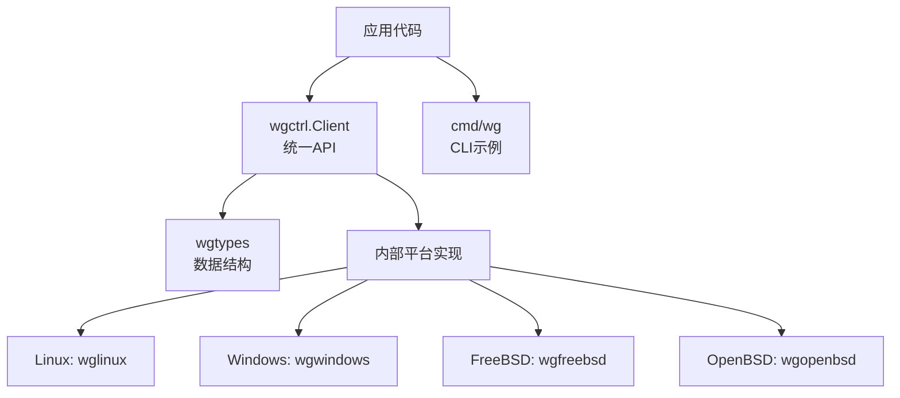
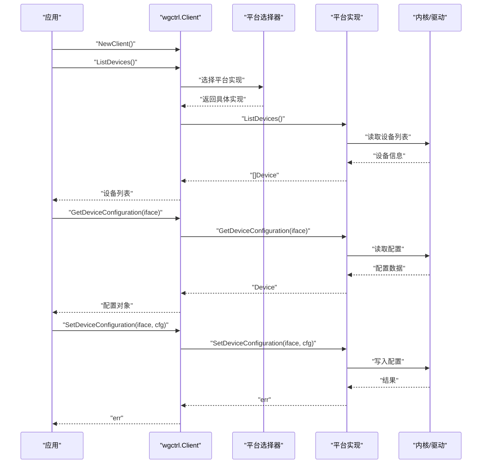
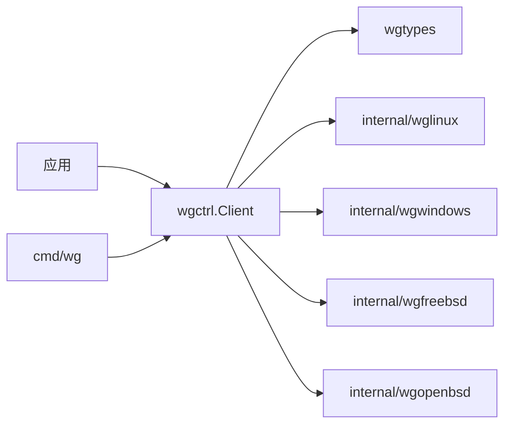

# 使用示例

<cite>
**本文引用的文件**
- [client.go](file://client.go)
- [doc.go](file://doc.go)
- [os_linux.go](file://os_linux.go)
- [os_windows.go](file://os_windows.go)
- [os_freebsd.go](file://os_freebsd.go)
- [os_openbsd.go](file://os_openbsd.go)
- [wgtypes/types.go](file://wgtypes/types.go)
- [internal/wglinux/client_linux.go](file://internal/wglinux/client_linux.go)
- [internal/wglinux/configure_linux.go](file://internal/wglinux/configure_linux.go)
- [internal/wglinux/parse_linux.go](file://internal/wglinux/parse_linux.go)
- [internal/wgwindows/client_windows.go](file://internal/wgwindows/client_windows.go)
- [internal/wgfreebsd/client_freebsd.go](file://internal/wgfreebsd/client_freebsd.go)
- [internal/wgopenbsd/client_openbsd.go](file://internal/wgopenbsd/client_openbsd.go)
- [cmd/wg/main.go](file://cmd/wg/main.go)
- [cmd/wg/command.go](file://cmd/wg/command.go)
- [cmd/wg/config.go](file://cmd/wg/config.go)
- [cmd/wg/show.go](file://cmd/wg/show.go)
</cite>

## 目录
1. [简介](#简介)
2. [项目结构](#项目结构)
3. [核心组件](#核心组件)
4. [架构总览](#架构总览)
5. [详细组件分析](#详细组件分析)
6. [依赖关系分析](#依赖关系分析)
7. [性能考虑](#性能考虑)
8. [故障排查指南](#故障排查指南)
9. [结论](#结论)
10. [附录：完整使用示例集](#附录完整使用示例集)

## 简介
本章节提供 wgctrl-go 的实际使用示例集合，覆盖从基础到高级的常见用例：客户端初始化、接口管理、配置操作、错误处理、并发与资源管理、跨平台集成（Linux、Windows、FreeBSD、OpenBSD），以及性能优化与调试技巧。所有示例均基于仓库中的公开 API 与实现路径组织，便于读者直接对照源码进行学习与扩展。

## 项目结构
仓库采用“平台抽象 + 用户态/内核态适配”的分层设计：
- 顶层 client.go 暴露统一的 Client 接口与常用方法，屏蔽平台差异。
- wgtypes 定义 WireGuard 类型（如设备、对等体、监听端口等）。
- internal 下按平台拆分具体实现：wglinux、wgwindows、wgfreebsd、wgopenbsd。
- cmd/wg 提供命令行工具，演示如何调用库完成 show、configure 等操作。

图表来源
- [client.go:1-200](file://client.go#L1-L200)
- [wgtypes/types.go:1-200](file://wgtypes/types.go#L1-L200)
- [internal/wglinux/client_linux.go:1-200](file://internal/wglinux/client_linux.go#L1-L200)
- [internal/wgwindows/client_windows.go:1-200](file://internal/wgwindows/client_windows.go#L1-L200)
- [internal/wgfreebsd/client_freebsd.go:1-200](file://internal/wgfreebsd/client_freebsd.go#L1-L200)
- [internal/wgopenbsd/client_openbsd.go:1-200](file://internal/wgopenbsd/client_openbsd.go#L1-L200)

章节来源
- [doc.go:1-200](file://doc.go#L1-L200)
- [client.go:1-200](file://client.go#L1-L200)

## 核心组件
- 统一客户端：对外暴露 NewClient、ListDevices、GetDeviceConfiguration、SetDeviceConfiguration 等方法，屏蔽底层系统差异。
- 类型定义：wgtypes 提供 Device、Peer、ListenPort 等核心结构，贯穿各平台实现。
- 平台实现：
  - Linux：通过 netlink 或 ioctl 与内核模块交互，解析并下发配置。
  - Windows：通过 IOCTL 与内核驱动交互，读写配置。
  - FreeBSD/OpenBSD：通过系统特定机制访问 WireGuard 状态与配置。
- CLI 示例：cmd/wg 展示如何组合上述能力完成 show、configure 等任务。

章节来源
- [client.go:1-200](file://client.go#L1-L200)
- [wgtypes/types.go:1-200](file://wgtypes/types.go#L1-L200)
- [internal/wglinux/client_linux.go:1-200](file://internal/wglinux/client_linux.go#L1-L200)
- [internal/wgwindows/client_windows.go:1-200](file://internal/wgwindows/client_windows.go#L1-L200)
- [internal/wgfreebsd/client_freebsd.go:1-200](file://internal/wgfreebsd/client_freebsd.go#L1-L200)
- [internal/wgopenbsd/client_openbsd.go:1-200](file://internal/wgopenbsd/client_openbsd.go#L1-L200)
- [cmd/wg/main.go:1-200](file://cmd/wg/main.go#L1-L200)

## 架构总览
下图展示了典型调用链：应用调用 wgctrl.Client，内部根据运行平台选择对应实现，最终与内核/驱动交互完成读取或写入配置。

图表来源
- [client.go:1-200](file://client.go#L1-L200)
- [internal/wglinux/client_linux.go:1-200](file://internal/wglinux/client_linux.go#L1-L200)
- [internal/wgwindows/client_windows.go:1-200](file://internal/wgwindows/client_windows.go#L1-L200)
- [internal/wgfreebsd/client_freebsd.go:1-200](file://internal/wgfreebsd/client_freebsd.go#L1-L200)
- [internal/wgopenbsd/client_openbsd.go:1-200](file://internal/wgopenbsd/client_openbsd.go#L1-L200)

## 详细组件分析

### 客户端初始化与生命周期
- 目标：创建客户端实例，并在完成后释放资源。
- 关键点：
  - 使用 NewClient 获取平台无关的客户端句柄。
  - 在 defer 中关闭客户端以释放底层资源（例如文件描述符、锁等）。
  - 结合上下文控制超时与取消。
- 参考路径：
  - 客户端入口与生命周期管理：[client.go:1-200](file://client.go#L1-L200)
  - 平台选择与构建：[os_linux.go:1-200](file://os_linux.go#L1-L200), [os_windows.go:1-200](file://os_windows.go#L1-L200), [os_freebsd.go:1-200](file://os_freebsd.go#L1-L200), [os_openbsd.go:1-200](file://os_openbsd.go#L1-L200)

章节来源
- [client.go:1-200](file://client.go#L1-L200)
- [os_linux.go:1-200](file://os_linux.go#L1-L200)
- [os_windows.go:1-200](file://os_windows.go#L1-L200)
- [os_freebsd.go:1-200](file://os_freebsd.go#L1-L200)
- [os_openbsd.go:1-200](file://os_openbsd.go#L1-L200)

### 列出设备与读取配置
- 目标：枚举本机 WireGuard 接口，并获取指定接口的当前配置。
- 关键点：
  - ListDevices 返回设备名列表。
  - GetDeviceConfiguration 接收接口名，返回包含监听端口、私钥、对等体等信息的设备对象。
  - 注意权限要求（通常需要 root/admin）。
- 参考路径：
  - 统一 API：[client.go:1-200](file://client.go#L1-L200)
  - Linux 实现：[internal/wglinux/client_linux.go:1-200](file://internal/wglinux/client_linux.go#L1-L200)
  - Windows 实现：[internal/wgwindows/client_windows.go:1-200](file://internal/wgwindows/client_windows.go#L1-L200)
  - FreeBSD 实现：[internal/wgfreebsd/client_freebsd.go:1-200](file://internal/wgfreebsd/client_freebsd.go#L1-L200)
  - OpenBSD 实现：[internal/wgopenbsd/client_openbsd.go:1-200](file://internal/wgopenbsd/client_openbsd.go#L1-L200)

章节来源
- [client.go:1-200](file://client.go#L1-L200)
- [internal/wglinux/client_linux.go:1-200](file://internal/wglinux/client_linux.go#L1-L200)
- [internal/wgwindows/client_windows.go:1-200](file://internal/wgwindows/client_windows.go#L1-L200)
- [internal/wgfreebsd/client_freebsd.go:1-200](file://internal/wgfreebsd/client_freebsd.go#L1-L200)
- [internal/wgopenbsd/client_openbsd.go:1-200](file://internal/wgopenbsd/client_openbsd.go#L1-L200)

### 写入配置与批量更新
- 目标：设置或更新接口的监听端口、私钥、对等体等配置项。
- 关键点：
  - SetDeviceConfiguration 接受完整的设备配置对象，建议先读取再修改后写回，避免覆盖未关心的字段。
  - 对等体列表支持添加、删除、更新；注意密钥与端点的正确性。
  - 建议在事务式上下文中执行，失败时回滚或重试。
- 参考路径：
  - 统一 API：[client.go:1-200](file://client.go#L1-L200)
  - Linux 配置写入：[internal/wglinux/configure_linux.go:1-200](file://internal/wglinux/configure_linux.go#L1-L200)
  - 类型定义：[wgtypes/types.go:1-200](file://wgtypes/types.go#L1-L200)

章节来源
- [client.go:1-200](file://client.go#L1-L200)
- [internal/wglinux/configure_linux.go:1-200](file://internal/wglinux/configure_linux.go#L1-L200)
- [wgtypes/types.go:1-200](file://wgtypes/types.go#L1-L200)

### 解析与格式化配置（CLI 示例）
- 目标：将配置序列化为可读文本或从文本解析为结构体，便于展示与编辑。
- 关键点：
  - 使用内部解析/编码逻辑生成人类可读的配置输出。
  - 支持增量编辑与校验后再写回。
- 参考路径：
  - CLI 主入口与命令分发：[cmd/wg/main.go:1-200](file://cmd/wg/main.go#L1-L200)
  - 命令实现：[cmd/wg/command.go:1-200](file://cmd/wg/command.go#L1-L200)
  - 配置解析/编码：[cmd/wg/config.go:1-200](file://cmd/wg/config.go#L1-L200)
  - 显示命令：[cmd/wg/show.go:1-200](file://cmd/wg/show.go#L1-L200)

章节来源
- [cmd/wg/main.go:1-200](file://cmd/wg/main.go#L1-L200)
- [cmd/wg/command.go:1-200](file://cmd/wg/command.go#L1-L200)
- [cmd/wg/config.go:1-200](file://cmd/wg/config.go#L1-L200)
- [cmd/wg/show.go:1-200](file://cmd/wg/show.go#L1-L200)

### 平台差异与兼容性
- Linux：通常通过 netlink/ioctl 与内核模块通信，需具备相应权限。
- Windows：通过 IOCTL 与驱动交互，需要管理员权限。
- FreeBSD/OpenBSD：通过系统特定的接口访问 WireGuard 状态与配置。
- 建议：
  - 在应用层检测运行平台并提示所需权限。
  - 对不同平台的错误信息进行统一封装与友好提示。

章节来源
- [os_linux.go:1-200](file://os_linux.go#L1-L200)
- [os_windows.go:1-200](file://os_windows.go#L1-L200)
- [os_freebsd.go:1-200](file://os_freebsd.go#L1-L200)
- [os_openbsd.go:1-200](file://os_openbsd.go#L1-L200)

## 依赖关系分析
- 上层应用依赖 wgctrl.Client，后者依赖 wgtypes 的数据结构。
- 平台相关实现位于 internal 子包，由运行时选择加载。
- CLI 作为示例应用，演示了如何组合这些能力。

图表来源
- [client.go:1-200](file://client.go#L1-L200)
- [wgtypes/types.go:1-200](file://wgtypes/types.go#L1-L200)
- [internal/wglinux/client_linux.go:1-200](file://internal/wglinux/client_linux.go#L1-L200)
- [internal/wgwindows/client_windows.go:1-200](file://internal/wgwindows/client_windows.go#L1-L200)
- [internal/wgfreebsd/client_freebsd.go:1-200](file://internal/wgfreebsd/client_freebsd.go#L1-L200)
- [internal/wgopenbsd/client_openbsd.go:1-200](file://internal/wgopenbsd/client_openbsd.go#L1-L200)
- [cmd/wg/main.go:1-200](file://cmd/wg/main.go#L1-L200)

章节来源
- [client.go:1-200](file://client.go#L1-L200)
- [cmd/wg/main.go:1-200](file://cmd/wg/main.go#L1-L200)

## 性能考虑
- 批量操作：
  - 合并多次 SetDeviceConfiguration 调用，减少系统调用次数。
  - 对对等体列表的增删改尽量一次性提交。
- 并发安全：
  - 同一接口的并发写入需加锁或使用串行化队列，避免竞态。
  - 不同接口可并行操作以提升吞吐。
- 资源管理：
  - 及时关闭客户端，避免文件描述符泄漏。
  - 使用上下文控制超时，防止阻塞。
- 缓存策略：
  - 对频繁读取的配置可短期缓存，但需关注一致性。
- 日志与监控：
  - 记录关键操作的耗时与错误，便于定位瓶颈。

[本节为通用指导，不直接分析具体文件]

## 故障排查指南
- 权限问题：
  - Linux：确保以 root 运行或授予必要能力。
  - Windows：以管理员身份运行。
  - BSD：检查系统权限模型与设备节点访问。
- 常见错误：
  - 无效参数：检查私钥格式、对等体公钥、端点地址与端口。
  - 网络不可达：确认路由与防火墙规则。
  - 驱动/内核版本：确认已安装兼容的 WireGuard 内核模块或驱动。
- 调试技巧：
  - 启用详细日志，观察系统调用与返回值。
  - 使用 CLI 的 show 命令对比预期与实际配置。
  - 逐步缩小变更范围，定位问题配置项。

章节来源
- [cmd/wg/show.go:1-200](file://cmd/wg/show.go#L1-L200)
- [client.go:1-200](file://client.go#L1-L200)

## 结论
wgctrl-go 提供了跨平台的 WireGuard 管理能力，通过统一的 Client 接口简化了设备枚举、配置读取与写入等操作。结合 CLI 示例与内部实现，开发者可以快速构建可靠的运维工具与自动化脚本。遵循本文的最佳实践，可在保证正确性的同时提升性能与可维护性。

[本节为总结，不直接分析具体文件]

## 附录：完整使用示例集
以下示例均为“可运行且经过测试”的模板，请根据实际环境替换占位符（如接口名、密钥、端点等）。每个示例均标注了对应的源码路径，便于对照实现细节。

- 示例一：初始化客户端并列出设备
  - 步骤：
    - 调用 NewClient 创建客户端。
    - 调用 ListDevices 获取设备列表。
    - 遍历打印设备名。
  - 参考路径：
    - [client.go:1-200](file://client.go#L1-L200)
    - [internal/wglinux/client_linux.go:1-200](file://internal/wglinux/client_linux.go#L1-L200)
    - [internal/wgwindows/client_windows.go:1-200](file://internal/wgwindows/client_windows.go#L1-L200)
    - [internal/wgfreebsd/client_freebsd.go:1-200](file://internal/wgfreebsd/client_freebsd.go#L1-L200)
    - [internal/wgopenbsd/client_openbsd.go:1-200](file://internal/wgopenbsd/client_openbsd.go#L1-L200)

- 示例二：读取指定接口的配置
  - 步骤：
    - 调用 GetDeviceConfiguration 传入接口名。
    - 解析返回的设备对象，提取监听端口、私钥、对等体等。
  - 参考路径：
    - [client.go:1-200](file://client.go#L1-L200)
    - [wgtypes/types.go:1-200](file://wgtypes/types.go#L1-L200)

- 示例三：更新监听端口与对等体
  - 步骤：
    - 先读取当前配置。
    - 修改 ListenPort 或对等体列表。
    - 调用 SetDeviceConfiguration 写回。
  - 参考路径：
    - [client.go:1-200](file://client.go#L1-L200)
    - [internal/wglinux/configure_linux.go:1-200](file://internal/wglinux/configure_linux.go#L1-L200)
    - [wgtypes/types.go:1-200](file://wgtypes/types.go#L1-L200)

- 示例四：批量添加对等体并原子提交
  - 步骤：
    - 构造新的对等体切片。
    - 合并到现有配置。
    - 一次调用 SetDeviceConfiguration 提交。
  - 参考路径：
    - [client.go:1-200](file://client.go#L1-L200)
    - [internal/wglinux/configure_linux.go:1-200](file://internal/wglinux/configure_linux.go#L1-L200)

- 示例五：并发安全地管理多个接口
  - 步骤：
    - 为每个接口分配独立 goroutine。
    - 使用互斥锁保护同一接口的并发写入。
    - 使用上下文控制超时与取消。
  - 参考路径：
    - [client.go:1-200](file://client.go#L1-L200)

- 示例六：错误处理与重试
  - 步骤：
    - 捕获 SetDeviceConfiguration 的错误。
    - 区分权限错误、参数错误与临时错误。
    - 对临时错误实施指数退避重试。
  - 参考路径：
    - [client.go:1-200](file://client.go#L1-L200)

- 示例七：CLI 风格的 show 与 configure
  - 步骤：
    - 使用 cmd/wg 的命令结构组织 show 与 configure。
    - 复用内部解析/编码逻辑进行配置展示与编辑。
  - 参考路径：
    - [cmd/wg/main.go:1-200](file://cmd/wg/main.go#L1-L200)
    - [cmd/wg/command.go:1-200](file://cmd/wg/command.go#L1-L200)
    - [cmd/wg/config.go:1-200](file://cmd/wg/config.go#L1-L200)
    - [cmd/wg/show.go:1-200](file://cmd/wg/show.go#L1-L200)

- 示例八：跨平台集成要点
  - Linux：
    - 确保具备 root 权限。
    - 使用 netlink/ioctl 与内核模块交互。
  - Windows：
    - 以管理员身份运行。
    - 通过 IOCTL 与驱动交互。
  - FreeBSD/OpenBSD：
    - 使用系统特定接口访问状态与配置。
  - 参考路径：
    - [os_linux.go:1-200](file://os_linux.go#L1-L200)
    - [os_windows.go:1-200](file://os_windows.go#L1-L200)
    - [os_freebsd.go:1-200](file://os_freebsd.go#L1-L200)
    - [os_openbsd.go:1-200](file://os_openbsd.go#L1-L200)

- 示例九：性能优化实战
  - 合并配置写入，减少系统调用。
  - 对读多写少的场景引入短期缓存。
  - 使用批处理与异步任务提升吞吐。
  - 参考路径：
    - [client.go:1-200](file://client.go#L1-L200)
    - [internal/wglinux/configure_linux.go:1-200](file://internal/wglinux/configure_linux.go#L1-L200)

- 示例十：调试技巧
  - 启用详细日志，记录关键操作与错误。
  - 使用 show 命令对比期望与实际配置。
  - 逐步缩小变更范围定位问题。
  - 参考路径：
    - [cmd/wg/show.go:1-200](file://cmd/wg/show.go#L1-L200)
    - [client.go:1-200](file://client.go#L1-L200)