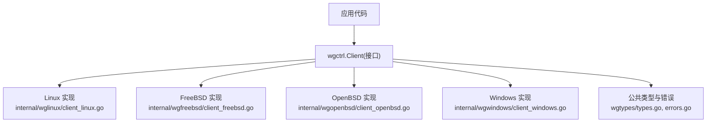
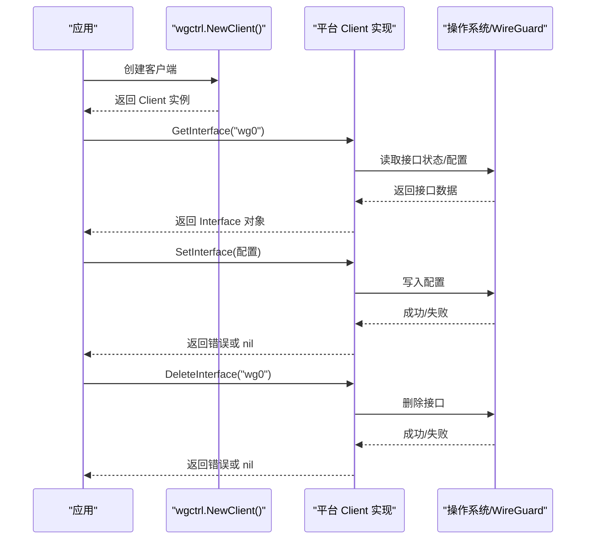
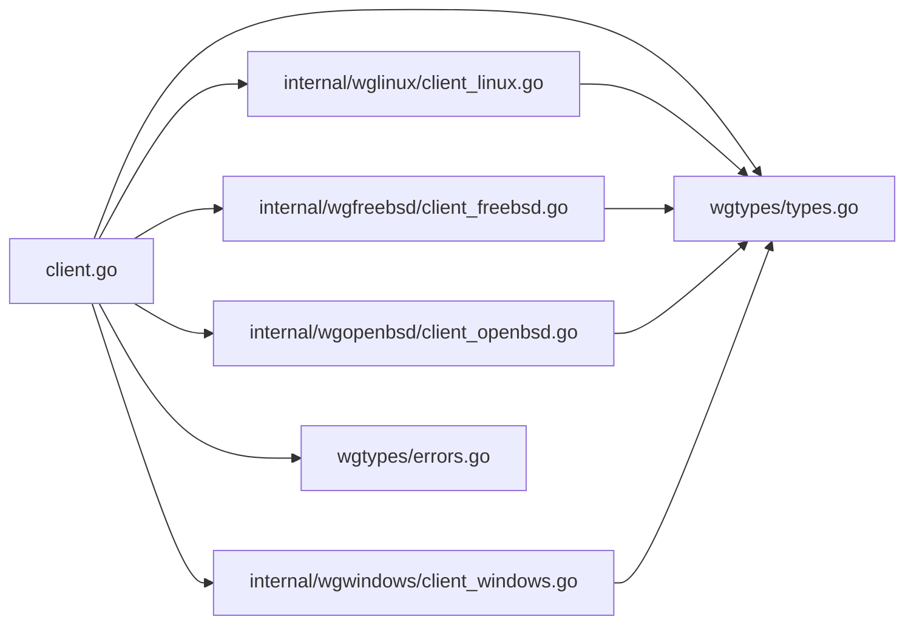

# 客户端接口

<cite>
**本文引用的文件**
- [client.go](file://client.go)
- [doc.go](file://doc.go)
- [os_linux.go](file://os_linux.go)
- [os_freebsd.go](file://os_freebsd.go)
- [os_openbsd.go](file://os_openbsd.go)
- [os_windows.go](file://os_windows.go)
- [os_userspace.go](file://os_userspace.go)
- [internal/wglinux/client_linux.go](file://internal/wglinux/client_linux.go)
- [internal/wgfreebsd/client_freebsd.go](file://internal/wgfreebsd/client_freebsd.go)
- [internal/wgopenbsd/client_openbsd.go](file://internal/wgopenbsd/client_openbsd.go)
- [internal/wgwindows/client_windows.go](file://internal/wgwindows/client_windows.go)
- [internal/wginternal/client.go](file://internal/wginternal/client.go)
- [wgtypes/types.go](file://wgtypes/types.go)
- [wgtypes/errors.go](file://wgtypes/errors.go)
</cite>

## 目录
1. [简介](#简介)
2. [项目结构](#项目结构)
3. [核心组件](#核心组件)
4. [架构总览](#架构总览)
5. [详细组件分析](#详细组件分析)
6. [依赖关系分析](#依赖关系分析)
7. [性能考虑](#性能考虑)
8. [故障排查指南](#故障排查指南)
9. [结论](#结论)
10. [附录：完整使用示例与最佳实践](#附录完整使用示例与最佳实践)

## 简介
本文件面向 wgctrl-go 的客户端 API，聚焦于跨平台 WireGuard 管理接口的统一抽象。文档重点说明 Client 接口的初始化、连接管理与生命周期，并逐一记录核心方法（如获取接口信息、设置/删除接口等）的参数类型、返回值、错误处理与使用要点。同时提供并发安全说明与最佳实践建议，帮助开发者在 Linux、FreeBSD、OpenBSD 与 Windows 上以一致的方式操作 WireGuard 接口。

## 项目结构
wgctrl-go 采用“顶层抽象 + 平台实现”的分层组织方式：
- 顶层 client.go 暴露统一的 Client 接口与工厂方法，屏蔽平台差异。
- 各平台子包提供具体实现：Linux、FreeBSD、OpenBSD、Windows。
- wgtypes 定义通用数据类型与错误类型。
- internal/wginternal 提供内部共享逻辑（如锁、路径等）。

图表来源
- [client.go:1-200](file://client.go#L1-L200)
- [internal/wglinux/client_linux.go:1-200](file://internal/wglinux/client_linux.go#L1-L200)
- [internal/wgfreebsd/client_freebsd.go:1-200](file://internal/wgfreebsd/client_freebsd.go#L1-L200)
- [internal/wgopenbsd/client_openbsd.go:1-200](file://internal/wgopenbsd/client_openbsd.go#L1-L200)
- [internal/wgwindows/client_windows.go:1-200](file://internal/wgwindows/client_windows.go#L1-L200)
- [wgtypes/types.go:1-200](file://wgtypes/types.go#L1-L200)
- [wgtypes/errors.go:1-200](file://wgtypes/errors.go#L1-L200)

章节来源
- [client.go:1-200](file://client.go#L1-L200)
- [doc.go:1-200](file://doc.go#L1-L200)

## 核心组件
- Client 接口：对外暴露的统一操作入口，包含查询、配置、删除等操作。
- NewClient：根据运行平台创建对应的 Client 实例。
- 平台实现：分别封装内核或用户态交互细节（ioctl/netlink/nvlist/IOCTL 等），对上层透明。
- 类型与错误：wgtypes 提供接口、密钥、对等体等数据结构及错误类型。

章节来源
- [client.go:1-200](file://client.go#L1-L200)
- [wgtypes/types.go:1-200](file://wgtypes/types.go#L1-L200)
- [wgtypes/errors.go:1-200](file://wgtypes/errors.go#L1-L200)

## 架构总览
wgctrl-go 通过平台选择器将调用路由到对应实现，保证一致的 API 语义。典型流程如下：

图表来源
- [client.go:1-200](file://client.go#L1-L200)
- [internal/wglinux/client_linux.go:1-200](file://internal/wglinux/client_linux.go#L1-L200)
- [internal/wgfreebsd/client_freebsd.go:1-200](file://internal/wgfreebsd/client_freebsd.go#L1-L200)
- [internal/wgopenbsd/client_openbsd.go:1-200](file://internal/wgopenbsd/client_openbsd.go#L1-L200)
- [internal/wgwindows/client_windows.go:1-200](file://internal/wgwindows/client_windows.go#L1-L200)

## 详细组件分析

### Client 接口与方法总览
- NewClient：创建客户端实例。无参数；返回 Client 和可能的错误。用于后续所有操作。
- GetInterface(name string)：按名称获取接口详情。返回接口对象与错误。
- SetInterface(cfg)：设置/更新接口配置。接受配置对象，返回错误。
- DeleteInterface(name string)：删除指定接口。返回错误。
- 其他辅助方法：如列出接口、批量操作等（依平台实现而定）。

注意：
- 不同平台的具体行为可能受权限、内核版本、驱动可用性影响。
- 错误类型来自 wgtypes，常见包括“不存在”、“权限不足”、“无效参数”等。

章节来源
- [client.go:1-200](file://client.go#L1-L200)
- [wgtypes/errors.go:1-200](file://wgtypes/errors.go#L1-L200)

### 初始化与连接管理
- 初始化：NewClient 会根据当前操作系统选择对应实现，建立必要的句柄或资源。
- 连接管理：多数平台为“按需访问”，无需显式连接/断开；但某些平台可能在首次操作时建立内核通信通道。
- 生命周期：Client 实例可复用；建议在进程内单例化，避免重复创建带来的开销。

章节来源
- [client.go:1-200](file://client.go#L1-L200)
- [os_linux.go:1-200](file://os_linux.go#L1-L200)
- [os_freebsd.go:1-200](file://os_freebsd.go#L1-L200)
- [os_openbsd.go:1-200](file://os_openbsd.go#L1-L200)
- [os_windows.go:1-200](file://os_windows.go#L1-L200)
- [os_userspace.go:1-200](file://os_userspace.go#L1-L200)

### 核心操作详解

#### GetInterface(name string)
- 作用：获取指定名称的 WireGuard 接口详细信息。
- 参数：name 字符串，表示接口名（例如 "wg0"）。
- 返回：接口对象与错误。若接口不存在，返回相应错误。
- 错误处理：检查错误是否为“不存在”类错误，以便区分未找到与其他系统错误。
- 使用场景：展示当前配置、诊断问题、动态发现可用接口。

章节来源
- [client.go:1-200](file://client.go#L1-L200)
- [internal/wglinux/client_linux.go:1-200](file://internal/wglinux/client_linux.go#L1-L200)
- [internal/wgfreebsd/client_freebsd.go:1-200](file://internal/wgfreebsd/client_freebsd.go#L1-L200)
- [internal/wgopenbsd/client_openbsd.go:1-200](file://internal/wgopenbsd/client_openbsd.go#L1-L200)
- [internal/wgwindows/client_windows.go:1-200](file://internal/wgwindows/client_windows.go#L1-L200)

#### SetInterface(cfg)
- 作用：设置或更新接口配置。
- 参数：配置对象，包含监听端口、私钥、对等体列表、允许 IP、保留策略等字段。
- 返回：错误。若配置非法或权限不足，返回相应错误。
- 注意事项：
  - 原子性：尽量一次性提交完整配置，避免中间状态。
  - 幂等性：重复设置相同配置应无副作用。
  - 回滚：若部分步骤失败，确保恢复到稳定状态。
- 使用场景：创建新接口、更新对等体、切换监听端口、调整 MTU 等。

章节来源
- [client.go:1-200](file://client.go#L1-L200)
- [internal/wglinux/configure_linux.go:1-200](file://internal/wglinux/configure_linux.go#L1-L200)
- [wgtypes/types.go:1-200](file://wgtypes/types.go#L1-L200)

#### DeleteInterface(name string)
- 作用：删除指定接口。
- 参数：name 字符串，接口名。
- 返回：错误。若接口不存在或权限不足，返回相应错误。
- 使用场景：清理临时接口、重置环境、释放资源。

章节来源
- [client.go:1-200](file://client.go#L1-L200)
- [internal/wglinux/client_linux.go:1-200](file://internal/wglinux/client_linux.go#L1-L200)
- [internal/wgfreebsd/client_freebsd.go:1-200](file://internal/wgfreebsd/client_freebsd.go#L1-L200)
- [internal/wgopenbsd/client_openbsd.go:1-200](file://internal/wgopenbsd/client_openbsd.go#L1-L200)
- [internal/wgwindows/client_windows.go:1-200](file://internal/wgwindows/client_windows.go#L1-L200)

### 并发安全说明
- 同一 Client 实例在不同 goroutine 中调用方法是安全的，底层实现会进行必要的同步。
- 推荐做法：
  - 进程内单例化 Client，避免重复创建。
  - 对同一接口的连续写操作尽量串行化，避免竞态。
  - 读多写少场景下，GetInterface 可并发执行。
- 注意事项：
  - 高并发写时，建议在上层加锁或使用队列，减少内核冲突。
  - 错误重试需考虑退避策略，避免风暴。

章节来源
- [internal/wginternal/client.go:1-200](file://internal/wginternal/client.go#L1-L200)
- [client.go:1-200](file://client.go#L1-L200)

### 错误处理与诊断
- 常见错误：
  - 接口不存在：当查询或删除不存在的接口时返回。
  - 权限不足：需要 root/Administrator 权限。
  - 参数非法：配置项缺失或格式错误。
  - 系统限制：内核不支持或驱动未加载。
- 建议：
  - 根据错误类型分支处理，区分“可恢复”与“不可恢复”。
  - 记录上下文信息（接口名、操作、时间戳）便于定位。
  - 对网络相关错误实施指数退避重试。

章节来源
- [wgtypes/errors.go:1-200](file://wgtypes/errors.go#L1-L200)
- [client.go:1-200](file://client.go#L1-L200)

## 依赖关系分析
wgctrl 的依赖关系清晰分层：
- 顶层 client.go 定义接口与工厂方法。
- 平台实现位于 internal/* 子包，负责与内核/用户态交互。
- wgtypes 提供公共类型与错误。
- os_* 文件用于平台选择与构建标签控制。

图表来源
- [client.go:1-200](file://client.go#L1-L200)
- [internal/wglinux/client_linux.go:1-200](file://internal/wglinux/client_linux.go#L1-L200)
- [internal/wgfreebsd/client_freebsd.go:1-200](file://internal/wgfreebsd/client_freebsd.go#L1-L200)
- [internal/wgopenbsd/client_openbsd.go:1-200](file://internal/wgopenbsd/client_openbsd.go#L1-L200)
- [internal/wgwindows/client_windows.go:1-200](file://internal/wgwindows/client_windows.go#L1-L200)
- [wgtypes/types.go:1-200](file://wgtypes/types.go#L1-L200)
- [wgtypes/errors.go:1-200](file://wgtypes/errors.go#L1-L200)

章节来源
- [client.go:1-200](file://client.go#L1-L200)
- [os_linux.go:1-200](file://os_linux.go#L1-L200)
- [os_freebsd.go:1-200](file://os_freebsd.go#L1-L200)
- [os_openbsd.go:1-200](file://os_openbsd.go#L1-L200)
- [os_windows.go:1-200](file://os_windows.go#L1-L200)
- [os_userspace.go:1-200](file://os_userspace.go#L1-L200)

## 性能考虑
- 避免频繁创建 Client：复用实例可减少系统调用与资源分配。
- 批量配置：合并多次 SetInterface 为一次原子提交，降低内核压力。
- 并发读多写少：GetInterface 可并发；写操作建议串行或加锁。
- 错误重试：对瞬态错误采用指数退避，避免雪崩。
- 日志与指标：记录关键操作的耗时与错误率，便于容量规划与优化。

[本节为通用指导，不直接分析具体文件]

## 故障排查指南
- 权限问题：确认以 root/Administrator 运行。
- 接口不存在：先调用 GetInterface 验证存在性，再执行删除或修改。
- 配置错误：逐项校验必填字段与格式，必要时分步设置。
- 内核/驱动问题：检查模块是否加载、版本是否支持。
- 日志定位：结合错误类型与上下文信息快速定位问题。

章节来源
- [wgtypes/errors.go:1-200](file://wgtypes/errors.go#L1-L200)
- [client.go:1-200](file://client.go#L1-L200)

## 结论
wgctrl-go 提供了跨平台的 WireGuard 管理客户端接口，通过统一的 Client 抽象屏蔽平台差异。开发者可使用 NewClient 创建实例，并通过 GetInterface、SetInterface、DeleteInterface 等方法完成查询、配置与删除操作。遵循并发安全与错误处理的最佳实践，可在生产环境中稳定高效地管理 WireGuard 接口。

[本节为总结，不直接分析具体文件]

## 附录：完整使用示例与最佳实践

### 初始化客户端
- 调用 NewClient 创建客户端实例。
- 捕获并处理可能的初始化错误。
- 在进程内复用该实例。

章节来源
- [client.go:1-200](file://client.go#L1-L200)

### 获取接口信息
- 使用 GetInterface 查询指定接口。
- 处理“不存在”与系统错误。
- 打印或解析返回的配置用于展示或诊断。

章节来源
- [client.go:1-200](file://client.go#L1-L200)
- [internal/wglinux/client_linux.go:1-200](file://internal/wglinux/client_linux.go#L1-L200)

### 设置接口配置
- 构造完整的配置对象，包含必要字段。
- 调用 SetInterface 进行原子更新。
- 处理权限与参数错误，必要时回滚。

章节来源
- [client.go:1-200](file://client.go#L1-L200)
- [internal/wglinux/configure_linux.go:1-200](file://internal/wglinux/configure_linux.go#L1-L200)
- [wgtypes/types.go:1-200](file://wgtypes/types.go#L1-L200)

### 删除接口
- 调用 DeleteInterface 删除指定接口。
- 处理“不存在”与权限错误。
- 在清理流程中确保幂等。

章节来源
- [client.go:1-200](file://client.go#L1-L200)
- [internal/wglinux/client_linux.go:1-200](file://internal/wglinux/client_linux.go#L1-L200)

### 并发与生命周期最佳实践
- 单例 Client：进程内只创建一个实例。
- 写操作串行化：对同一接口的连续写加锁或排队。
- 读操作并发：GetInterface 可并发执行。
- 错误重试：对瞬态错误采用指数退避。
- 资源清理：在程序退出时确保不再持有内核引用（通常由系统回收）。

章节来源
- [internal/wginternal/client.go:1-200](file://internal/wginternal/client.go#L1-L200)
- [client.go:1-200](file://client.go#L1-L200)