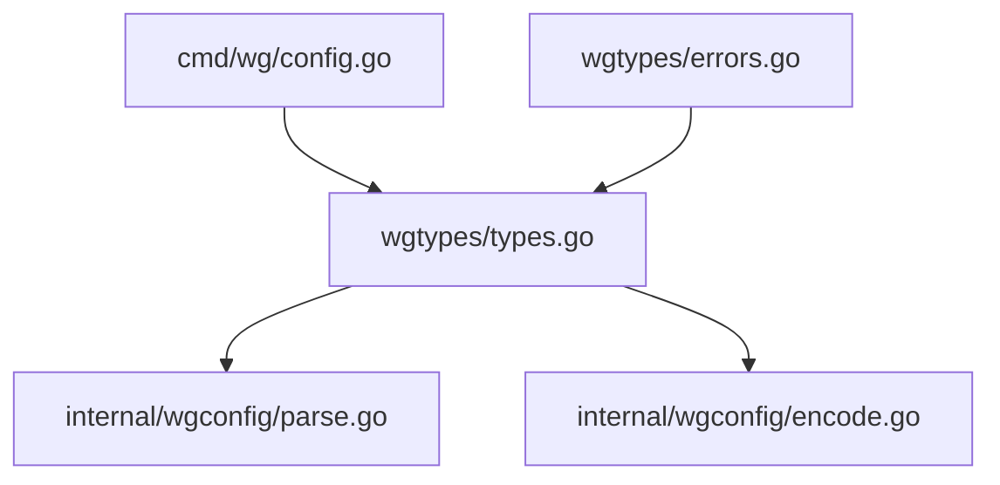
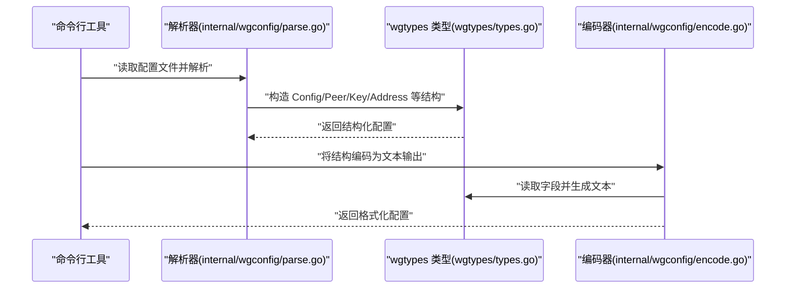
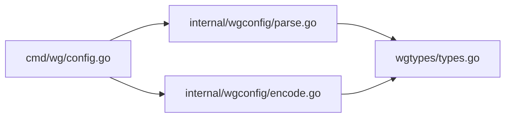

# 数据类型定义

<cite>
**本文引用的文件**
- [wgtypes/types.go](file://wgtypes/types.go)
- [wgtypes/errors.go](file://wgtypes/errors.go)
- [wgtypes/doc.go](file://wgtypes/doc.go)
- [internal/wgconfig/parse.go](file://internal/wgconfig/parse.go)
- [internal/wgconfig/encode.go](file://internal/wgconfig/encode.go)
- [cmd/wg/config.go](file://cmd/wg/config.go)
</cite>

## 目录
1. [简介](#简介)
2. [项目结构](#项目结构)
3. [核心组件](#核心组件)
4. [架构总览](#架构总览)
5. [详细组件分析](#详细组件分析)
6. [依赖关系分析](#依赖关系分析)
7. [性能考虑](#性能考虑)
8. [故障排查指南](#故障排查指南)
9. [结论](#结论)
10. [附录](#附录)

## 简介
本参考文档聚焦于 wgctrl-go 的 wgtypes 包，系统化梳理其核心数据结构与类型定义，包括配置、对等体、密钥、地址等关键类型。文档说明每个字段的含义、数据类型、验证规则与默认值，解释结构体之间的关系与依赖，并提供初始化与使用示例（以路径引用形式给出），以及数据验证规则与业务逻辑约束的说明。

## 项目结构
wgtypes 包位于仓库根目录下的 wgtypes 子目录中，主要包含：
- types.go：核心数据结构定义（如 Config、Peer、Key、Address 等）
- errors.go：错误类型定义
- doc.go：包的文档说明

此外，wgtypes 的数据在内部模块中被解析与编码：
- internal/wgconfig/parse.go：将文本配置解析为 wgtypes 结构
- internal/wgconfig/encode.go：将 wgtypes 结构编码为文本配置
- cmd/wg/config.go：命令行工具中对配置的读取与展示

图表来源
- [wgtypes/types.go:1-200](file://wgtypes/types.go#L1-L200)
- [internal/wgconfig/parse.go:1-200](file://internal/wgconfig/parse.go#L1-L200)
- [internal/wgconfig/encode.go:1-200](file://internal/wgconfig/encode.go#L1-L200)
- [cmd/wg/config.go:1-200](file://cmd/wg/config.go#L1-L200)

章节来源
- [wgtypes/types.go:1-200](file://wgtypes/types.go#L1-L200)
- [wgtypes/errors.go:1-200](file://wgtypes/errors.go#L1-L200)
- [wgtypes/doc.go:1-200](file://wgtypes/doc.go#L1-L200)
- [internal/wgconfig/parse.go:1-200](file://internal/wgconfig/parse.go#L1-L200)
- [internal/wgconfig/encode.go:1-200](file://internal/wgconfig/encode.go#L1-L200)
- [cmd/wg/config.go:1-200](file://cmd/wg/config.go#L1-L200)

## 核心组件
本节概述 wgtypes 中的核心数据结构及其职责：
- Config：WireGuard 接口的整体配置，包含接口名称、私钥、监听端口、对等体列表等
- Peer：单个对等体的配置，包含公钥、预共享密钥、端点、允许 IP、持久保持连接等
- Key：用于表示私钥或公钥的二进制数据
- Address：IP 地址与掩码的组合，用于描述路由或允许的 IP 范围
- 其他辅助类型：如端口、时间戳、标志位等

这些类型共同构成 WireGuard 配置的数据模型，并在解析与编码过程中被广泛使用。

章节来源
- [wgtypes/types.go:1-200](file://wgtypes/types.go#L1-L200)

## 架构总览
下图展示了 wgtypes 类型在解析与编码流程中的位置与作用：

图表来源
- [internal/wgconfig/parse.go:1-200](file://internal/wgconfig/parse.go#L1-L200)
- [wgtypes/types.go:1-200](file://wgtypes/types.go#L1-L200)
- [internal/wgconfig/encode.go:1-200](file://internal/wgconfig/encode.go#L1-L200)

## 详细组件分析

### 结构体：Config（接口配置）
- 作用：描述一个 WireGuard 接口的完整配置
- 关键字段（示意）：
  - 接口名：字符串类型，用于标识系统上的网络接口
  - 私钥：Key 类型，二进制数据，长度固定且需满足加密算法要求
  - 监听端口：整数类型，取值范围受操作系统限制
  - 对等体列表：Peer 切片，可空；若为空则仅作为服务端
  - 其他扩展字段：如 MTU、防火墙标记等（依实现而定）
- 验证规则：
  - 私钥必须为有效长度的二进制数据
  - 监听端口必须在合法范围内
  - 对等体列表中至少包含一个有效的 Peer
- 默认值：
  - 未设置的字段通常采用零值；具体默认行为取决于解析器与平台实现
- 初始化与使用示例（路径引用）：
  - 创建接口配置：[wgtypes/types.go:1-200](file://wgtypes/types.go#L1-L200)
  - 解析文本配置到结构：[internal/wgconfig/parse.go:1-200](file://internal/wgconfig/parse.go#L1-L200)
  - 将结构编码为文本：[internal/wgconfig/encode.go:1-200](file://internal/wgconfig/encode.go#L1-L200)

章节来源
- [wgtypes/types.go:1-200](file://wgtypes/types.go#L1-L200)
- [internal/wgconfig/parse.go:1-200](file://internal/wgconfig/parse.go#L1-L200)
- [internal/wgconfig/encode.go:1-200](file://internal/wgconfig/encode.go#L1-L200)

### 结构体：Peer（对等体配置）
- 作用：描述与远端对等体的连接参数
- 关键字段（示意）：
  - 公钥：Key 类型，二进制数据，长度固定
  - 预共享密钥：可选的 Key 类型，增强安全性
  - 端点：字符串或地址类型，包含主机与端口
  - 允许 IP：Address 切片，定义可通过该对等体访问的网段
  - 持久保持连接：布尔标志，控制是否持续尝试连接
  - 传输统计：发送/接收字节数等（只读）
- 验证规则：
  - 公钥必须为有效长度
  - 允许 IP 必须为合法的 CIDR 表示
  - 端点格式需符合主机:端口规范
- 默认值：
  - 未设置的对等体字段采用零值；解析器可能提供合理默认
- 初始化与使用示例（路径引用）：
  - 构建对等体对象：[wgtypes/types.go:1-200](file://wgtypes/types.go#L1-L200)
  - 解析对等体段落：[internal/wgconfig/parse.go:1-200](file://internal/wgconfig/parse.go#L1-L200)
  - 编码对等体段落：[internal/wgconfig/encode.go:1-200](file://internal/wgconfig/encode.go#L1-L200)

章节来源
- [wgtypes/types.go:1-200](file://wgtypes/types.go#L1-L200)
- [internal/wgconfig/parse.go:1-200](file://internal/wgconfig/parse.go#L1-L200)
- [internal/wgconfig/encode.go:1-200](file://internal/wgconfig/encode.go#L1-L200)

### 类型：Key（密钥）
- 作用：统一表示私钥或公钥的二进制数据
- 数据类型：固定长度的字节切片
- 验证规则：
  - 私钥长度必须符合加密算法要求（例如 32 字节）
  - 公钥长度必须符合对应算法要求（例如 32 字节）
- 默认值：
  - 零值表示空密钥，通常不允许直接使用
- 初始化与使用示例（路径引用）：
  - 定义与校验：[wgtypes/types.go:1-200](file://wgtypes/types.go#L1-L200)
  - 从文本解析密钥：[internal/wgconfig/parse.go:1-200](file://internal/wgconfig/parse.go#L1-L200)
  - 编码密钥为文本：[internal/wgconfig/encode.go:1-200](file://internal/wgconfig/encode.go#L1-L200)

章节来源
- [wgtypes/types.go:1-200](file://wgtypes/types.go#L1-L200)
- [internal/wgconfig/parse.go:1-200](file://internal/wgconfig/parse.go#L1-L200)
- [internal/wgconfig/encode.go:1-200](file://internal/wgconfig/encode.go#L1-L200)

### 类型：Address（地址）
- 作用：表示 IP 地址与掩码的组合，常用于“允许 IP”或路由
- 数据类型：IP 与掩码长度（CIDR）
- 验证规则：
  - 必须为合法的 IPv4 或 IPv6 地址
  - 掩码长度需在有效范围内
- 默认值：
  - 零值表示无效地址，不应出现在最终配置中
- 初始化与使用示例（路径引用）：
  - 定义与校验：[wgtypes/types.go:1-200](file://wgtypes/types.go#L1-L200)
  - 解析 CIDR 字符串：[internal/wgconfig/parse.go:1-200](file://internal/wgconfig/parse.go#L1-L200)
  - 编码为 CIDR 字符串：[internal/wgconfig/encode.go:1-200](file://internal/wgconfig/encode.go#L1-L200)

章节来源
- [wgtypes/types.go:1-200](file://wgtypes/types.go#L1-L200)
- [internal/wgconfig/parse.go:1-200](file://internal/wgconfig/parse.go#L1-L200)
- [internal/wgconfig/encode.go:1-200](file://internal/wgconfig/encode.go#L1-L200)

### 错误类型：errors.go
- 作用：定义 wgtypes 相关错误类型，便于调用方区分错误原因
- 常见错误：
  - 非法密钥长度
  - 非法地址格式
  - 端口超出范围
  - 解析失败
- 使用建议：
  - 在解析与编码阶段捕获并处理错误
  - 向用户反馈明确的错误信息

章节来源
- [wgtypes/errors.go:1-200](file://wgtypes/errors.go#L1-L200)

## 依赖关系分析
wgtypes 的类型被解析器与编码器依赖，形成如下依赖链：

图表来源
- [internal/wgconfig/parse.go:1-200](file://internal/wgconfig/parse.go#L1-L200)
- [internal/wgconfig/encode.go:1-200](file://internal/wgconfig/encode.go#L1-L200)
- [wgtypes/types.go:1-200](file://wgtypes/types.go#L1-L200)
- [cmd/wg/config.go:1-200](file://cmd/wg/config.go#L1-L200)

章节来源
- [internal/wgconfig/parse.go:1-200](file://internal/wgconfig/parse.go#L1-L200)
- [internal/wgconfig/encode.go:1-200](file://internal/wgconfig/encode.go#L1-L200)
- [wgtypes/types.go:1-200](file://wgtypes/types.go#L1-L200)
- [cmd/wg/config.go:1-200](file://cmd/wg/config.go#L1-L200)

## 性能考虑
- 密钥与地址的解析与校验应尽量避免重复计算，可在解析阶段缓存结果
- 大量对等体时，注意切片扩容与内存分配的影响
- 编码阶段应避免不必要的字符串拼接，使用高效缓冲区

## 故障排查指南
常见问题与定位方法：
- 密钥长度不匹配：检查 Key 类型的长度校验逻辑
- 地址格式错误：确认 Address 的 CIDR 解析与验证
- 端口越界：核对监听端口的合法范围
- 解析失败：查看 errors.go 中的错误类型，结合解析日志定位

章节来源
- [wgtypes/errors.go:1-200](file://wgtypes/errors.go#L1-L200)
- [internal/wgconfig/parse.go:1-200](file://internal/wgconfig/parse.go#L1-L200)

## 结论
wgtypes 包提供了 WireGuard 配置的核心数据结构，通过严格的类型定义与验证规则确保配置的正确性与一致性。配合 internal/wgconfig 的解析与编码能力，可实现从文本到结构的双向转换，支撑上层工具的功能实现。建议在开发与集成过程中严格遵循字段验证与默认值约定，以获得稳定可靠的配置管理体验。

## 附录
- 初始化与使用示例（路径引用）：
  - 创建 Config：[wgtypes/types.go:1-200](file://wgtypes/types.go#L1-L200)
  - 添加 Peer：[wgtypes/types.go:1-200](file://wgtypes/types.go#L1-L200)
  - 设置 Key：[wgtypes/types.go:1-200](file://wgtypes/types.go#L1-L200)
  - 配置 Address：[wgtypes/types.go:1-200](file://wgtypes/types.go#L1-L200)
  - 解析配置：[internal/wgconfig/parse.go:1-200](file://internal/wgconfig/parse.go#L1-L200)
  - 编码配置：[internal/wgconfig/encode.go:1-200](file://internal/wgconfig/encode.go#L1-L200)
  - 命令行使用：[cmd/wg/config.go:1-200](file://cmd/wg/config.go#L1-L200)