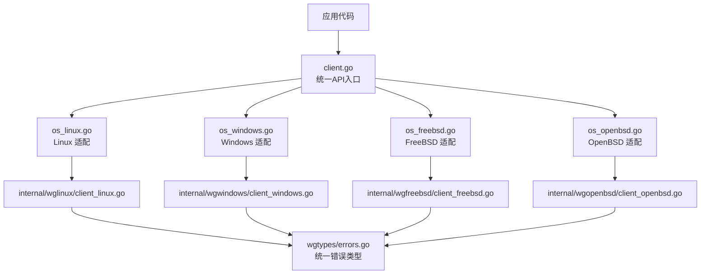
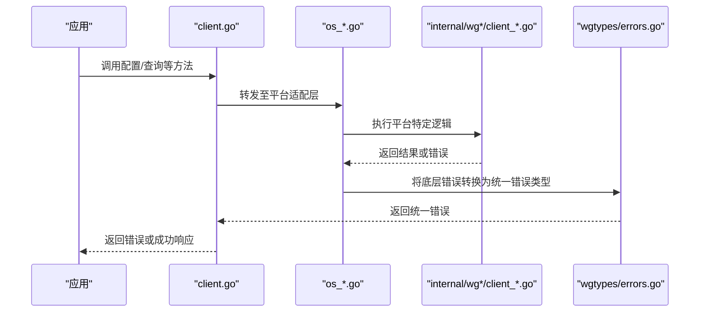
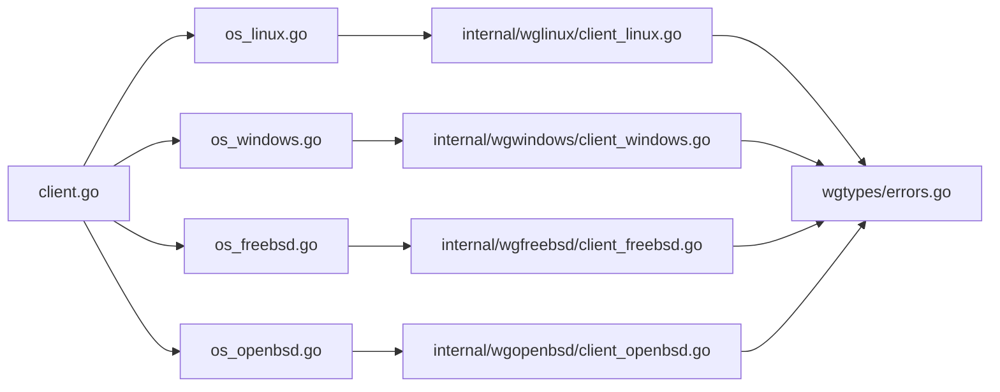
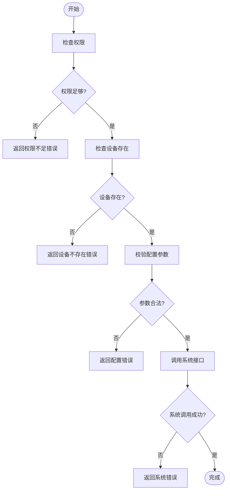

# 错误处理

<cite>
**本文引用的文件**
- [wgtypes/errors.go](file://wgtypes/errors.go)
- [client.go](file://client.go)
- [os_linux.go](file://os_linux.go)
- [os_windows.go](file://os_windows.go)
- [os_freebsd.go](file://os_freebsd.go)
- [os_openbsd.go](file://os_openbsd.go)
- [internal/wglinux/client_linux.go](file://internal/wglinux/client_linux.go)
- [internal/wgwindows/client_windows.go](file://internal/wgwindows/client_windows.go)
- [internal/wgfreebsd/client_freebsd.go](file://internal/wgfreebsd/client_freebsd.go)
- [internal/wgopenbsd/client_openbsd.go](file://internal/wgopenbsd/client_openbsd.go)
- [cmd/wg/main.go](file://cmd/wg/main.go)
- [cmd/wg/command.go](file://cmd/wg/command.go)
</cite>

## 目录
1. [简介](#简介)
2. [项目结构](#项目结构)
3. [核心组件](#核心组件)
4. [架构总览](#架构总览)
5. [详细组件分析](#详细组件分析)
6. [依赖关系分析](#依赖关系分析)
7. [性能考量](#性能考量)
8. [故障排除指南](#故障排除指南)
9. [结论](#结论)
10. [附录](#附录)

## 简介
本文件聚焦 wgctrl-go 的错误处理机制，系统性梳理预定义错误类型与错误码、触发条件与含义、错误传播与恢复策略、最佳实践模式、常见错误场景的处理示例以及调试与日志记录技巧。目标是帮助开发者在跨平台（Linux/Windows/FreeBSD/OpenBSD）环境下稳定使用 wgctrl-go，并快速定位和修复问题。

## 项目结构
wgctrl-go 将错误处理分为两层：
- 公共错误类型层：位于 wgtypes/errors.go，提供统一的错误语义（如无效参数、权限不足等），供上层调用方进行类型判断与分支处理。
- 平台实现层：各平台的客户端实现（internal/wglinux、internal/wgwindows、internal/wgfreebsd、internal/wgopenbsd）负责与内核或系统接口交互，并将底层错误转换为统一错误类型，通过 os_*.go 的封装暴露给 client.go 的统一 API。

图表来源
- [client.go:1-200](file://client.go#L1-L200)
- [os_linux.go:1-200](file://os_linux.go#L1-L200)
- [os_windows.go:1-200](file://os_windows.go#L1-L200)
- [os_freebsd.go:1-200](file://os_freebsd.go#L1-L200)
- [os_openbsd.go:1-200](file://os_openbsd.go#L1-L200)
- [internal/wglinux/client_linux.go:1-200](file://internal/wglinux/client_linux.go#L1-L200)
- [internal/wgwindows/client_windows.go:1-200](file://internal/wgwindows/client_windows.go#L1-L200)
- [internal/wgfreebsd/client_freebsd.go:1-200](file://internal/wgfreebsd/client_freebsd.go#L1-L200)
- [internal/wgopenbsd/client_openbsd.go:1-200](file://internal/wgopenbsd/client_openbsd.go#L1-L200)
- [wgtypes/errors.go:1-200](file://wgtypes/errors.go#L1-L200)

章节来源
- [client.go:1-200](file://client.go#L1-L200)
- [wgtypes/errors.go:1-200](file://wgtypes/errors.go#L1-L200)

## 核心组件
- 统一错误类型（wgtypes/errors.go）：集中定义所有可被上层识别的错误类别，便于按类型进行分支处理与用户提示。
- 平台客户端（internal/*）：封装各平台与内核/系统接口的交互细节，捕获并转换底层错误为统一错误类型。
- 操作系统适配层（os_*.go）：屏蔽平台差异，向上层 client.go 暴露一致的方法签名与错误语义。
- 统一 API（client.go）：对外暴露配置、查询、管理等方法，内部委托到平台实现，保证错误传播的一致性。

章节来源
- [wgtypes/errors.go:1-200](file://wgtypes/errors.go#L1-L200)
- [client.go:1-200](file://client.go#L1-L200)
- [os_linux.go:1-200](file://os_linux.go#L1-L200)
- [os_windows.go:1-200](file://os_windows.go#L1-L200)
- [os_freebsd.go:1-200](file://os_freebsd.go#L1-L200)
- [os_openbsd.go:1-200](file://os_openbsd.go#L1-L200)
- [internal/wglinux/client_linux.go:1-200](file://internal/wglinux/client_linux.go#L1-L200)
- [internal/wgwindows/client_windows.go:1-200](file://internal/wgwindows/client_windows.go#L1-L200)
- [internal/wgfreebsd/client_freebsd.go:1-200](file://internal/wgfreebsd/client_freebsd.go#L1-L200)
- [internal/wgopenbsd/client_openbsd.go:1-200](file://internal/wgopenbsd/client_openbsd.go#L1-L200)

## 架构总览
下图展示了从应用调用到平台实现再到统一错误类型的完整错误传播路径。

图表来源
- [client.go:1-200](file://client.go#L1-L200)
- [os_linux.go:1-200](file://os_linux.go#L1-L200)
- [internal/wglinux/client_linux.go:1-200](file://internal/wglinux/client_linux.go#L1-L200)
- [wgtypes/errors.go:1-200](file://wgtypes/errors.go#L1-L200)

## 详细组件分析

### 统一错误类型（wgtypes/errors.go）
- 职责：定义所有可被上层识别的错误类别，确保跨平台一致性。
- 典型错误类别（基于命名与用途推断）：
  - 无效参数类：当传入参数不符合预期时触发，例如空名称、非法字段值。
  - 权限不足类：当进程缺少必要权限（如写入 /dev/net/tun 或调用系统 ioctl）时触发。
  - 设备不存在类：当请求的目标接口不存在或不可用时触发。
  - 配置解析/编码错误类：当配置文件格式不合法或无法序列化时触发。
  - 系统调用失败类：当底层系统调用返回错误时触发（不同平台可能映射为不同具体原因）。
- 建议：上层通过类型断言或错误匹配来区分这些类别，从而给出明确的用户提示或重试策略。

章节来源
- [wgtypes/errors.go:1-200](file://wgtypes/errors.go#L1-L200)

### Linux 平台实现（internal/wglinux/client_linux.go + os_linux.go）
- 职责：通过 netlink/ioctl 等机制与内核 WireGuard 模块交互，捕获系统级错误并转换为统一错误类型。
- 常见错误场景：
  - 权限不足：无 root 权限导致无法访问内核接口。
  - 设备不存在：目标接口未创建或未启用。
  - 配置冲突：重复键、非法值导致内核拒绝。
- 错误传播：平台实现将底层错误包装为 wgtypes 中的统一错误类型，再经 os_linux.go 透传到 client.go。

章节来源
- [internal/wglinux/client_linux.go:1-200](file://internal/wglinux/client_linux.go#L1-L200)
- [os_linux.go:1-200](file://os_linux.go#L1-L200)
- [wgtypes/errors.go:1-200](file://wgtypes/errors.go#L1-L200)

### Windows 平台实现（internal/wgwindows/client_windows.go + os_windows.go）
- 职责：通过 Windows 网络栈接口与 WireGuard 驱动交互，捕获系统级错误并转换为统一错误类型。
- 常见错误场景：
  - 权限不足：需要管理员权限。
  - 驱动未加载：WireGuard 驱动未安装或未启动。
  - 配置错误：参数不合法导致驱动拒绝。
- 错误传播：平台实现将错误转换为统一类型，经 os_windows.go 透传至 client.go。

章节来源
- [internal/wgwindows/client_windows.go:1-200](file://internal/wgwindows/client_windows.go#L1-L200)
- [os_windows.go:1-200](file://os_windows.go#L1-L200)
- [wgtypes/errors.go:1-200](file://wgtypes/errors.go#L1-L200)

### FreeBSD 平台实现（internal/wgfreebsd/client_freebsd.go + os_freebsd.go）
- 职责：通过 FreeBSD 内核接口与 WireGuard 交互，捕获系统级错误并转换为统一错误类型。
- 常见错误场景：
  - 权限不足：需 root 权限。
  - 设备节点缺失：/dev/wg* 不存在或权限不正确。
  - 配置冲突：内核拒绝非法配置。
- 错误传播：平台实现将错误转换为统一类型，经 os_freebsd.go 透传到 client.go。

章节来源
- [internal/wgfreebsd/client_freebsd.go:1-200](file://internal/wgfreebsd/client_freebsd.go#L1-L200)
- [os_freebsd.go:1-200](file://os_freebsd.go#L1-L200)
- [wgtypes/errors.go:1-200](file://wgtypes/errors.go#L1-L200)

### OpenBSD 平台实现（internal/wgopenbsd/client_openbsd.go + os_openbsd.go）
- 职责：通过 OpenBSD 内核接口与 WireGuard 交互，捕获系统级错误并转换为统一错误类型。
- 常见错误场景：
  - 权限不足：需 root 权限。
  - 设备不可用：内核模块未加载或设备节点异常。
  - 配置错误：内核拒绝非法配置。
- 错误传播：平台实现将错误转换为统一类型，经 os_openbsd.go 透传到 client.go。

章节来源
- [internal/wgopenbsd/client_openbsd.go:1-200](file://internal/wgopenbsd/client_openbsd.go#L1-L200)
- [os_openbsd.go:1-200](file://os_openbsd.go#L1-L200)
- [wgtypes/errors.go:1-200](file://wgtypes/errors.go#L1-L200)

### 命令行工具的错误处理（cmd/wg）
- 职责：对用户输入进行校验，调用 client.go 的 API，并根据返回的错误类型输出友好提示。
- 常见错误场景：
  - 参数缺失或格式错误：立即返回并提示用法。
  - 权限不足：提示以管理员/root 运行。
  - 设备不存在：提示检查接口名或状态。
- 错误传播：命令层捕获 client.go 返回的错误，根据类型决定退出码与提示信息。

章节来源
- [cmd/wg/main.go:1-200](file://cmd/wg/main.go#L1-L200)
- [cmd/wg/command.go:1-200](file://cmd/wg/command.go#L1-L200)
- [client.go:1-200](file://client.go#L1-L200)

## 依赖关系分析
- 耦合性：
  - client.go 与 os_*.go 解耦平台细节，仅依赖统一错误类型。
  - 平台实现 internal/wg*/client_*.go 强依赖各自系统的接口，但对外仅暴露统一错误类型。
- 内聚性：
  - wgtypes/errors.go 高内聚地管理错误语义，便于测试与维护。
  - 各平台实现内聚于各自的系统交互逻辑。
- 外部依赖：
  - 各平台实现依赖系统内核/驱动接口，错误语义由系统行为决定，但通过统一错误类型抽象。

图表来源
- [client.go:1-200](file://client.go#L1-L200)
- [os_linux.go:1-200](file://os_linux.go#L1-L200)
- [os_windows.go:1-200](file://os_windows.go#L1-L200)
- [os_freebsd.go:1-200](file://os_freebsd.go#L1-L200)
- [os_openbsd.go:1-200](file://os_openbsd.go#L1-L200)
- [internal/wglinux/client_linux.go:1-200](file://internal/wglinux/client_linux.go#L1-L200)
- [internal/wgwindows/client_windows.go:1-200](file://internal/wgwindows/client_windows.go#L1-L200)
- [internal/wgfreebsd/client_freebsd.go:1-200](file://internal/wgfreebsd/client_freebsd.go#L1-L200)
- [internal/wgopenbsd/client_openbsd.go:1-200](file://internal/wgopenbsd/client_openbsd.go#L1-L200)
- [wgtypes/errors.go:1-200](file://wgtypes/errors.go#L1-L200)

章节来源
- [client.go:1-200](file://client.go#L1-L200)
- [wgtypes/errors.go:1-200](file://wgtypes/errors.go#L1-L200)

## 性能考量
- 错误路径开销：错误构造与传播应尽量轻量，避免在热路径中频繁分配。
- 重试与退避：对瞬时错误（如资源忙）可采用指数退避重试，避免风暴。
- 日志粒度：仅在关键路径记录错误上下文，避免过多 I/O 影响性能。
- 批量操作：在批量配置时，尽量合并错误收集，减少多次系统调用。

[本节为通用指导，无需引用具体文件]

## 故障排除指南
- 权限不足
  - 现象：调用配置或查询接口时报错，提示权限不足。
  - 处理：以管理员/root 运行；检查进程权限与 SELinux/AppArmor 策略。
  - 参考：平台实现与统一错误类型中对权限错误的定义与传播。
- 设备不存在
  - 现象：指定接口名后报错，提示设备不存在。
  - 处理：确认接口已创建且处于 UP 状态；检查内核模块是否加载。
  - 参考：平台实现中对设备存在性的检查与错误转换。
- 配置冲突/非法参数
  - 现象：配置提交失败，提示参数非法或冲突。
  - 处理：校验配置项合法性；移除重复键或修正值域。
  - 参考：统一错误类型中对参数错误的分类。
- 系统调用失败
  - 现象：底层系统调用返回错误，表现为通用系统错误。
  - 处理：查看系统日志（dmesg/journalctl/事件查看器）；确认驱动/内核版本兼容性。
  - 参考：平台实现中对系统调用的封装与错误转换。

章节来源
- [wgtypes/errors.go:1-200](file://wgtypes/errors.go#L1-L200)
- [internal/wglinux/client_linux.go:1-200](file://internal/wglinux/client_linux.go#L1-L200)
- [internal/wgwindows/client_windows.go:1-200](file://internal/wgwindows/client_windows.go#L1-L200)
- [internal/wgfreebsd/client_freebsd.go:1-200](file://internal/wgfreebsd/client_freebsd.go#L1-L200)
- [internal/wgopenbsd/client_openbsd.go:1-200](file://internal/wgopenbsd/client_openbsd.go#L1-L200)

## 结论
wgctrl-go 通过统一错误类型与平台实现的解耦设计，提供了清晰、一致的错误语义与传播机制。开发者应优先依据错误类型进行分支处理，结合平台特性进行权限、设备与配置的校验与修复。在复杂场景中，采用重试与退避策略，并配合适当的日志记录，可有效提升系统的健壮性与可维护性。

[本节为总结，无需引用具体文件]

## 附录

### 错误检查与处理的最佳实践
- 类型优先：优先使用类型断言或错误匹配区分错误类别，而非字符串比较。
- 分层处理：在命令层做用户友好的提示，在库层保持错误原样返回以便上层决策。
- 幂等与回滚：对非幂等操作，失败时应尽可能回滚已变更状态。
- 重试策略：对瞬时错误采用指数退避；对确定性错误直接失败。
- 日志上下文：记录关键上下文（接口名、操作类型、时间戳），避免敏感信息泄露。

[本节为通用指导，无需引用具体文件]

### 常见错误场景流程图

[此图为概念流程，不直接映射具体源码，故无图表来源]