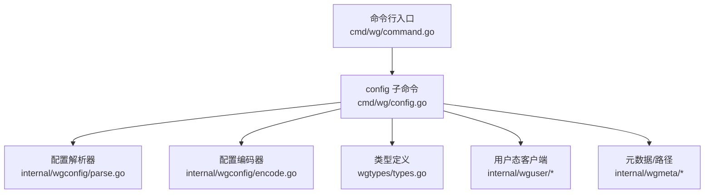
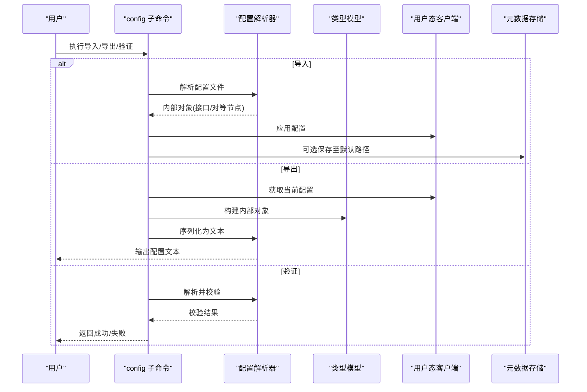
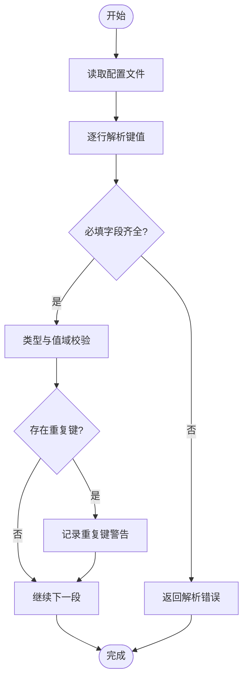
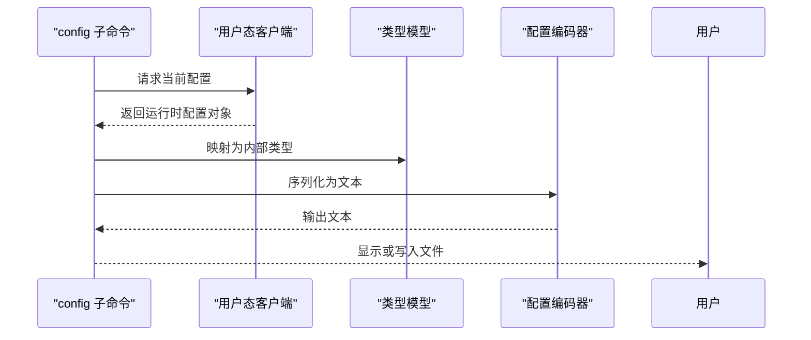
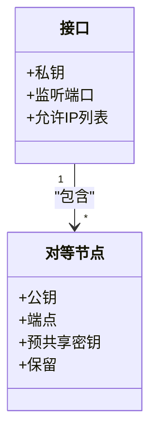
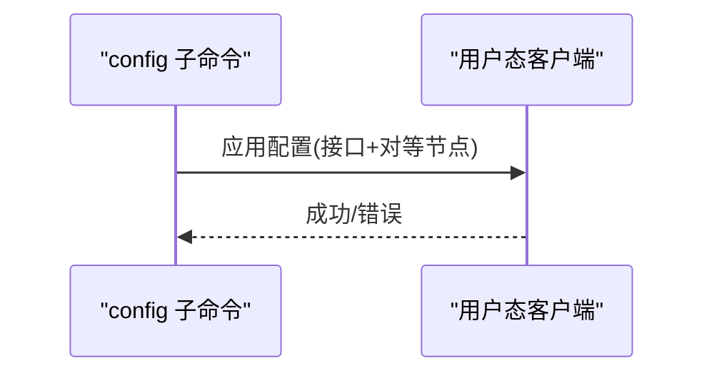
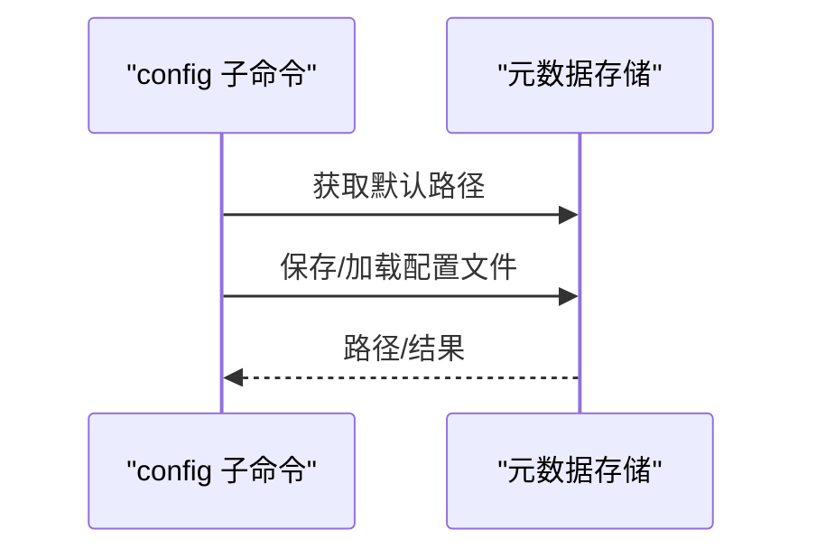
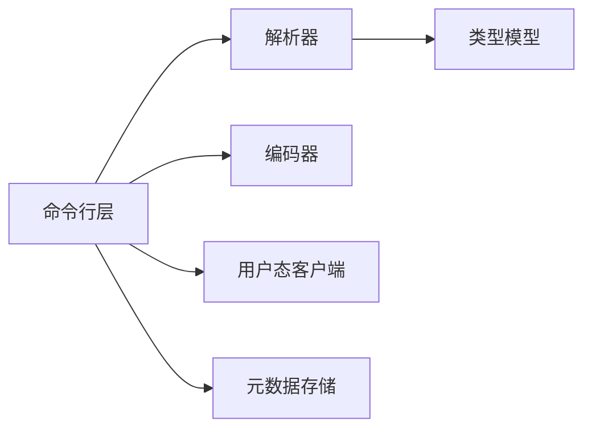

# config 命令参考

<cite>
**本文引用的文件**
- [cmd/wg/config.go](file://cmd/wg/config.go)
- [cmd/wg/command.go](file://cmd/wg/command.go)
- [internal/wgconfig/parse.go](file://internal/wgconfig/parse.go)
- [internal/wgconfig/encode.go](file://internal/wgconfig/encode.go)
- [wgtypes/types.go](file://wgtypes/types.go)
- [internal/wguser/parse.go](file://internal/wguser/parse.go)
- [internal/wguser/configure.go](file://internal/wguser/configure.go)
- [internal/wgmeta/store.go](file://internal/wgmeta/store.go)
- [internal/wgmeta/path.go](file://internal/wgmeta/path.go)
</cite>

## 目录
1. [简介](#简介)
2. [项目结构](#项目结构)
3. [核心组件](#核心组件)
4. [架构总览](#架构总览)
5. [详细组件分析](#详细组件分析)
6. [依赖关系分析](#依赖关系分析)
7. [性能考虑](#性能考虑)
8. [故障排查指南](#故障排查指南)
9. [结论](#结论)
10. [附录](#附录)

## 简介
本参考文档面向使用 wgctrl-go 的“config”命令，覆盖配置文件的导入、导出与验证能力；详细说明配置文件格式规范（接口配置段、对等节点设置、私钥管理等）；给出语法规则、必填字段与可选参数；提供模板与示例；说明配置验证规则与常见错误处理；并包含备份、恢复与迁移操作指南。

## 项目结构
“config”命令的实现由命令行入口、配置解析/编码、内核/用户态客户端以及元数据存储等模块协作完成：
- 命令行层：定义子命令与参数解析
- 配置层：负责解析与序列化 WireGuard 风格的配置文本
- 类型层：定义对等节点、接口等数据结构
- 客户端层：将配置下发到系统内核或用户态实现
- 存储层：管理配置文件路径与持久化

图表来源
- [cmd/wg/command.go](file://cmd/wg/command.go)
- [cmd/wg/config.go](file://cmd/wg/config.go)
- [internal/wgconfig/parse.go](file://internal/wgconfig/parse.go)
- [internal/wgconfig/encode.go](file://internal/wgconfig/encode.go)
- [wgtypes/types.go](file://wgtypes/types.go)
- [internal/wguser/parse.go](file://internal/wguser/parse.go)
- [internal/wguser/configure.go](file://internal/wguser/configure.go)
- [internal/wgmeta/store.go](file://internal/wgmeta/store.go)
- [internal/wgmeta/path.go](file://internal/wgmeta/path.go)

章节来源
- [cmd/wg/command.go](file://cmd/wg/command.go)
- [cmd/wg/config.go](file://cmd/wg/config.go)

## 核心组件
- 配置解析器：将文本配置转换为内部类型对象，支持接口段与对等节点段，校验必填字段与值域。
- 配置编码器：将内部类型对象序列化为标准文本格式，便于导出与展示。
- 类型模型：定义接口、对等节点、密钥等数据结构，约束长度与合法性。
- 用户态客户端：在用户态环境中应用配置，兼容不同平台。
- 元数据存储：管理配置文件默认路径、命名约定与持久化。

章节来源
- [internal/wgconfig/parse.go](file://internal/wgconfig/parse.go)
- [internal/wgconfig/encode.go](file://internal/wgconfig/encode.go)
- [wgtypes/types.go](file://wgtypes/types.go)
- [internal/wguser/configure.go](file://internal/wguser/configure.go)
- [internal/wgmeta/store.go](file://internal/wgmeta/store.go)
- [internal/wgmeta/path.go](file://internal/wgmeta/path.go)

## 架构总览
“config”命令的工作流如下：
- 导入：读取配置文件 → 解析为内部对象 → 校验必填字段与值域 → 通过客户端应用到系统 → 可选持久化到默认路径
- 导出：从系统读取当前运行配置 → 序列化为文本 → 输出到文件或标准输出
- 验证：仅解析与校验，不修改系统状态

图表来源
- [cmd/wg/config.go](file://cmd/wg/config.go)
- [internal/wgconfig/parse.go](file://internal/wgconfig/parse.go)
- [internal/wgconfig/encode.go](file://internal/wgconfig/encode.go)
- [internal/wguser/configure.go](file://internal/wguser/configure.go)
- [internal/wgmeta/store.go](file://internal/wgmeta/store.go)

## 详细组件分析

### 配置解析器（导入与验证）
- 功能要点
  - 支持按段解析：接口段与对等节点段
  - 必填字段校验：如接口私钥、监听端口；对等节点的公钥、端点等
  - 值域校验：端口范围、IP/掩码格式、时间戳单位等
  - 重复键与未知键处理策略
- 典型流程

图表来源
- [internal/wgconfig/parse.go](file://internal/wgconfig/parse.go)

章节来源
- [internal/wgconfig/parse.go](file://internal/wgconfig/parse.go)

### 配置编码器（导出）
- 功能要点
  - 将内部对象序列化为标准文本格式
  - 保持段顺序与可读性
  - 支持只读导出，不影响系统状态
- 典型流程

图表来源
- [internal/wgconfig/encode.go](file://internal/wgconfig/encode.go)
- [internal/wguser/configure.go](file://internal/wguser/configure.go)

章节来源
- [internal/wgconfig/encode.go](file://internal/wgconfig/encode.go)

### 类型模型（接口与对等节点）
- 关键概念
  - 接口：包含私钥、监听端口、允许 IP 列表等
  - 对等节点：包含公钥、端点、预共享密钥、保留字段等
  - 私钥/公钥：长度与格式校验
- 关系示意

图表来源
- [wgtypes/types.go](file://wgtypes/types.go)

章节来源
- [wgtypes/types.go](file://wgtypes/types.go)

### 用户态客户端（应用配置）
- 功能要点
  - 将解析后的配置应用到系统
  - 在不同平台上提供统一接口
  - 错误传播与诊断信息
- 典型调用链

图表来源
- [internal/wguser/configure.go](file://internal/wguser/configure.go)

章节来源
- [internal/wguser/configure.go](file://internal/wguser/configure.go)

### 元数据存储（默认路径与持久化）
- 功能要点
  - 提供默认配置文件路径与命名约定
  - 支持保存/加载配置到磁盘
- 典型交互

图表来源
- [internal/wgmeta/store.go](file://internal/wgmeta/store.go)
- [internal/wgmeta/path.go](file://internal/wgmeta/path.go)

章节来源
- [internal/wgmeta/store.go](file://internal/wgmeta/store.go)
- [internal/wgmeta/path.go](file://internal/wgmeta/path.go)

## 依赖关系分析
- 命令行层依赖配置解析器与编码器
- 配置解析器依赖类型模型进行结构与值域校验
- 应用配置依赖用户态客户端
- 持久化依赖元数据存储

图表来源
- [cmd/wg/config.go](file://cmd/wg/config.go)
- [internal/wgconfig/parse.go](file://internal/wgconfig/parse.go)
- [internal/wgconfig/encode.go](file://internal/wgconfig/encode.go)
- [wgtypes/types.go](file://wgtypes/types.go)
- [internal/wguser/configure.go](file://internal/wguser/configure.go)
- [internal/wgmeta/store.go](file://internal/wgmeta/store.go)

章节来源
- [cmd/wg/config.go](file://cmd/wg/config.go)
- [internal/wgconfig/parse.go](file://internal/wgconfig/parse.go)
- [internal/wgconfig/encode.go](file://internal/wgconfig/encode.go)
- [wgtypes/types.go](file://wgtypes/types.go)
- [internal/wguser/configure.go](file://internal/wguser/configure.go)
- [internal/wgmeta/store.go](file://internal/wgmeta/store.go)

## 性能考虑
- 大配置文件的解析与导出应避免不必要的复制与重分配
- 对等节点数量较多时，建议分批应用与校验
- 导出时尽量使用流式输出以减少内存占用
- 避免重复解析同一配置文件

[本节为通用指导，无需特定文件引用]

## 故障排查指南
- 常见错误
  - 必填字段缺失：如接口私钥、监听端口或对等节点公钥未设置
  - 值域非法：端口超出范围、IP/掩码格式不正确、时间戳单位无效
  - 重复键：同一段内出现重复键导致歧义
  - 未知键：不支持的键将被忽略或报错（取决于实现）
- 处理方法
  - 使用“验证”模式先检查配置语法与语义
  - 根据错误提示定位具体段与键
  - 修正后重新导入或再次验证
  - 若涉及权限问题，确保以足够权限运行命令

章节来源
- [internal/wgconfig/parse.go](file://internal/wgconfig/parse.go)
- [wgtypes/types.go](file://wgtypes/types.go)

## 结论
“config”命令提供了完整的配置导入、导出与验证能力，基于清晰的解析与编码层，结合类型模型与用户态客户端，确保配置的正确性与可移植性。通过元数据存储，可实现配置的默认路径管理与便捷持久化。遵循本文档的规范与最佳实践，可有效减少配置错误并提升运维效率。

[本节为总结，无需特定文件引用]

## 附录

### 配置文件格式规范
- 段结构
  - 接口段：包含接口级配置项
  - 对等节点段：包含单个对等节点的配置项
- 必填字段
  - 接口：私钥、监听端口
  - 对等节点：公钥、端点
- 可选参数
  - 允许 IP 列表、预共享密钥、保留字段、超时等
- 语法规则
  - 键值对形式，支持注释
  - 段用标题标识
  - 值需符合类型与范围要求

[本节为通用规范说明，无需特定文件引用]

### 模板与示例
- 接口段模板
  - 包含私钥、监听端口、允许 IP 列表
- 对等节点段模板
  - 包含公钥、端点、预共享密钥、保留字段
- 完整示例
  - 一个接口段加多个对等节点段的组合

[本节为通用示例说明，无需特定文件引用]

### 配置验证规则
- 必填字段完整性检查
- 值域与格式校验
- 重复键检测
- 未知键处理策略

章节来源
- [internal/wgconfig/parse.go](file://internal/wgconfig/parse.go)
- [wgtypes/types.go](file://wgtypes/types.go)

### 备份、恢复与迁移
- 备份
  - 导出当前运行配置到文件
- 恢复
  - 从文件导入配置并应用到系统
- 迁移
  - 在不同主机间迁移配置时，注意密钥与端点的适配
  - 使用“验证”模式在新环境先行检查

章节来源
- [internal/wgconfig/encode.go](file://internal/wgconfig/encode.go)
- [internal/wgconfig/parse.go](file://internal/wgconfig/parse.go)
- [internal/wgmeta/store.go](file://internal/wgmeta/store.go)
- [internal/wgmeta/path.go](file://internal/wgmeta/path.go)