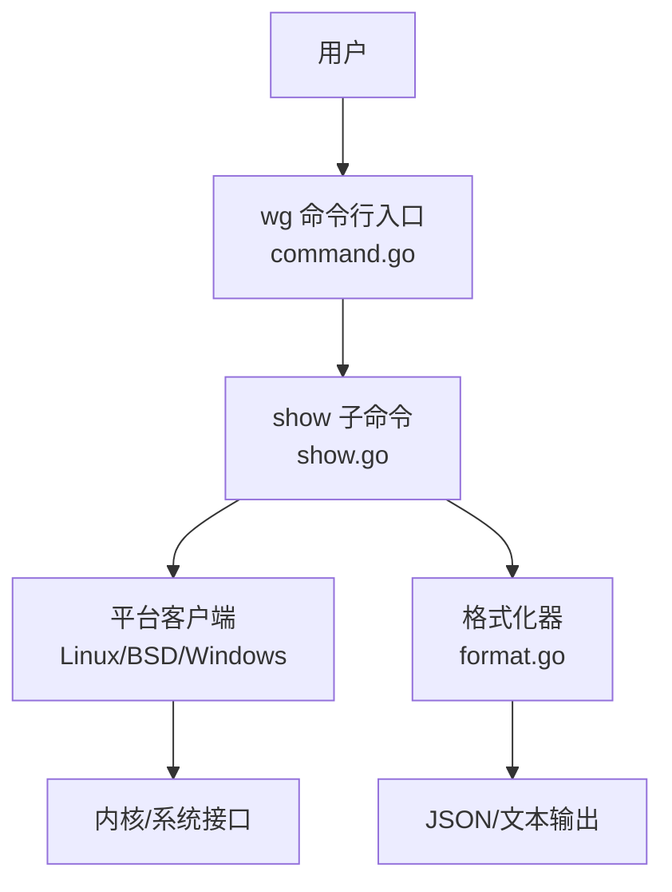
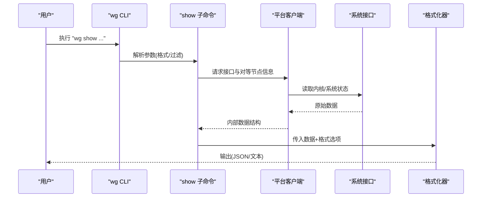
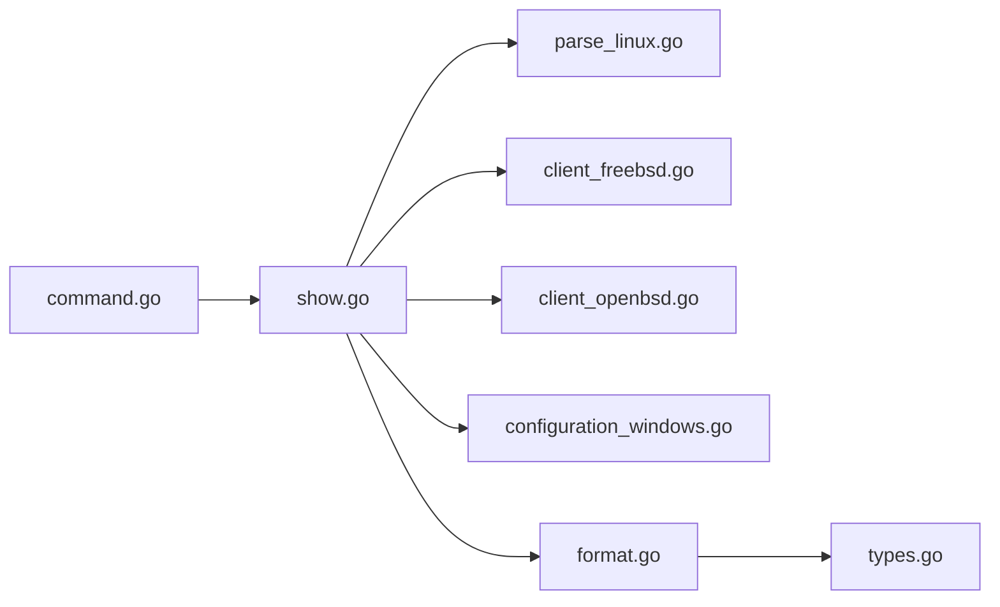

# show 命令参考

<cite>
**本文引用的文件**
- [cmd/wg/show.go](file://cmd/wg/show.go)
- [cmd/wg/command.go](file://cmd/wg/command.go)
- [internal/wgcli/format.go](file://internal/wgcli/format.go)
- [wgtypes/types.go](file://wgtypes/types.go)
- [internal/wglinux/parse_linux.go](file://internal/wglinux/parse_linux.go)
- [internal/wgfreebsd/client_freebsd.go](file://internal/wgfreebsd/client_freebsd.go)
- [internal/wgopenbsd/client_openbsd.go](file://internal/wgopenbsd/client_openbsd.go)
- [internal/wgwindows/configuration_windows.go](file://internal/wgwindows/internal/ioctl/configuration_windows.go)
</cite>

## 目录
1. [简介](#简介)
2. [项目结构](#项目结构)
3. [核心组件](#核心组件)
4. [架构总览](#架构总览)
5. [详细组件分析](#详细组件分析)
6. [依赖关系分析](#依赖关系分析)
7. [性能注意事项](#性能注意事项)
8. [故障排查指南](#故障排查指南)
9. [结论](#结论)
10. [附录](#附录)

## 简介
本参考文档面向使用 wg CLI 的 show 子命令，系统化说明其选项、输出格式与字段含义，覆盖接口信息展示、对等节点状态显示、连接统计信息等。文档同时解释 JSON 与文本两种输出格式的差异、过滤条件的使用方式，并提供常见使用场景的命令示例与排错建议，帮助读者快速定位问题并高效获取所需信息。

## 项目结构
show 命令的实现位于 cmd/wg 目录下，由命令解析、参数处理、平台客户端调用以及格式化输出模块共同协作完成：
- 命令入口与参数解析：cmd/wg/command.go、cmd/wg/show.go
- 数据获取：各平台的客户端实现（Linux/BSD/Windows）
- 输出格式化：internal/wgcli/format.go
- 数据类型定义：wgtypes/types.go

图表来源
- [cmd/wg/command.go:1-200](file://cmd/wg/command.go#L1-L200)
- [cmd/wg/show.go:1-200](file://cmd/wg/show.go#L1-L200)
- [internal/wgcli/format.go:1-200](file://internal/wgcli/format.go#L1-L200)

章节来源
- [cmd/wg/command.go:1-200](file://cmd/wg/command.go#L1-L200)
- [cmd/wg/show.go:1-200](file://cmd/wg/show.go#L1-L200)

## 核心组件
- show 子命令：负责解析 show 相关参数（如输出格式、过滤条件），调用平台客户端获取 WireGuard 接口与对等节点信息，并将结果交给格式化器输出。
- 平台客户端：封装不同操作系统下读取 WireGuard 配置与运行时状态的底层能力（例如 Linux 的 netlink/procfs、BSD 的 sysctl/nv、Windows 的 IOCTL）。
- 格式化器：将内部数据结构渲染为 JSON 或人类可读的文本格式，支持字段选择与对齐。
- 类型定义：统一表示接口、对等节点、地址、端口、统计等信息的数据模型。

章节来源
- [cmd/wg/show.go:1-200](file://cmd/wg/show.go#L1-L200)
- [internal/wgcli/format.go:1-200](file://internal/wgcli/format.go#L1-L200)
- [wgtypes/types.go:1-200](file://wgtypes/types.go#L1-L200)
- [internal/wglinux/parse_linux.go:1-200](file://internal/wglinux/parse_linux.go#L1-L200)
- [internal/wgfreebsd/client_freebsd.go:1-200](file://internal/wgfreebsd/client_freebsd.go#L1-L200)
- [internal/wgopenbsd/client_openbsd.go:1-200](file://internal/wgopenbsd/client_openbsd.go#L1-L200)
- [internal/wgwindows/internal/ioctl/configuration_windows.go:1-200](file://internal/wgwindows/internal/ioctl/configuration_windows.go#L1-L200)

## 架构总览
show 命令的执行流程如下：
1. 解析 show 子命令的参数（输出格式、过滤条件）。
2. 根据当前操作系统选择对应的平台客户端。
3. 通过平台客户端查询所有 WireGuard 接口及其对等节点信息。
4. 将查询结果转换为内部数据结构。
5. 使用格式化器按指定格式输出（JSON 或文本）。

图表来源
- [cmd/wg/show.go:1-200](file://cmd/wg/show.go#L1-L200)
- [internal/wgcli/format.go:1-200](file://internal/wgcli/format.go#L1-L200)
- [internal/wglinux/parse_linux.go:1-200](file://internal/wglinux/parse_linux.go#L1-L200)
- [internal/wgfreebsd/client_freebsd.go:1-200](file://internal/wgfreebsd/client_freebsd.go#L1-L200)
- [internal/wgopenbsd/client_openbsd.go:1-200](file://internal/wgopenbsd/client_openbsd.go#L1-L200)
- [internal/wgwindows/internal/ioctl/configuration_windows.go:1-200](file://internal/wgwindows/internal/ioctl/configuration_windows.go#L1-L200)

## 详细组件分析

### show 子命令与参数
- 功能职责
  - 解析 show 子命令的参数，包括输出格式（JSON/文本）、过滤条件（如按接口名筛选）。
  - 调用平台客户端获取接口与对等节点信息。
  - 将结果传递给格式化器进行渲染。
- 关键行为
  - 当未指定输出格式时，默认使用文本格式；指定 JSON 时输出结构化数据。
  - 支持按接口名称过滤，仅返回匹配接口的信息。
  - 若未找到任何接口或无权限访问系统接口，会返回错误提示。

章节来源
- [cmd/wg/show.go:1-200](file://cmd/wg/show.go#L1-L200)
- [cmd/wg/command.go:1-200](file://cmd/wg/command.go#L1-L200)

### 平台客户端（数据获取）
- Linux
  - 通过系统接口读取 WireGuard 接口与对等节点信息，解析为内部数据结构。
- BSD（FreeBSD/OpenBSD）
  - 通过系统工具或内核接口获取相同信息。
- Windows
  - 通过 IOCTL 与系统驱动交互获取配置与状态。

章节来源
- [internal/wglinux/parse_linux.go:1-200](file://internal/wglinux/parse_linux.go#L1-L200)
- [internal/wgfreebsd/client_freebsd.go:1-200](file://internal/wgfreebsd/client_freebsd.go#L1-L200)
- [internal/wgopenbsd/client_openbsd.go:1-200](file://internal/wgopenbsd/client_openbsd.go#L1-L200)
- [internal/wgwindows/internal/ioctl/configuration_windows.go:1-200](file://internal/wgwindows/internal/ioctl/configuration_windows.go#L1-L200)

### 输出格式化（JSON/文本）
- 文本格式
  - 以人类可读的方式列出每个接口的关键信息，包括接口名称、监听端口、公共密钥、允许的 IP、对等节点列表（包含对等节点的公钥、端点、传输字节数、最后握手时间等）。
  - 字段之间采用对齐排版，便于阅读。
- JSON 格式
  - 输出结构化数据，便于程序化处理。
  - 顶层通常包含接口数组，每个接口对象包含其属性与对等节点数组。
  - 字段命名遵循统一的规范（如小写、下划线分隔）。

章节来源
- [internal/wgcli/format.go:1-200](file://internal/wgcli/format.go#L1-L200)

### 数据类型模型
- 接口（Interface）
  - 包含接口名称、监听端口、公共密钥、允许的 IP 列表等。
- 对等节点（Peer）
  - 包含对等节点公钥、端点（IP:端口）、传输字节数、接收字节数、最后握手时间戳、允许 IP 列表等。
- 其他辅助字段
  - 如状态标志、统计计数等，用于展示连接与流量信息。

章节来源
- [wgtypes/types.go:1-200](file://wgtypes/types.go#L1-L200)

## 依赖关系分析
show 命令依赖以下模块：
- 命令解析层：command.go、show.go
- 平台客户端层：Linux/BSD/Windows 的具体实现
- 格式化层：format.go
- 类型定义层：types.go

图表来源
- [cmd/wg/command.go:1-200](file://cmd/wg/command.go#L1-L200)
- [cmd/wg/show.go:1-200](file://cmd/wg/show.go#L1-L200)
- [internal/wgcli/format.go:1-200](file://internal/wgcli/format.go#L1-L200)
- [wgtypes/types.go:1-200](file://wgtypes/types.go#L1-L200)
- [internal/wglinux/parse_linux.go:1-200](file://internal/wglinux/parse_linux.go#L1-L200)
- [internal/wgfreebsd/client_freebsd.go:1-200](file://internal/wgfreebsd/client_freebsd.go#L1-L200)
- [internal/wgopenbsd/client_openbsd.go:1-200](file://internal/wgopenbsd/client_openbsd.go#L1-L200)
- [internal/wgwindows/internal/ioctl/configuration_windows.go:1-200](file://internal/wgwindows/internal/ioctl/configuration_windows.go#L1-L200)

章节来源
- [cmd/wg/command.go:1-200](file://cmd/wg/command.go#L1-L200)
- [cmd/wg/show.go:1-200](file://cmd/wg/show.go#L1-L200)
- [internal/wgcli/format.go:1-200](file://internal/wgcli/format.go#L1-L200)
- [wgtypes/types.go:1-200](file://wgtypes/types.go#L1-L200)

## 性能注意事项
- 大量接口或对等节点时，JSON 输出更适合自动化处理；文本输出适合人工查看。
- 过滤条件可减少输出量，提高响应速度。
- 在受限环境（权限不足、内核接口不可用）下，应避免频繁调用导致系统开销增加。

[本节提供通用指导，不直接分析具体文件]

## 故障排查指南
- 无权限访问系统接口
  - 现象：无法列出接口或显示为空。
  - 处理：以管理员/root 权限运行 wg 命令。
- 平台不支持或内核模块未加载
  - 现象：报错提示无法读取 WireGuard 状态。
  - 处理：确认系统已安装并启用 WireGuard 内核模块或对应驱动。
- 输出格式不正确
  - 现象：JSON 解析失败或文本对齐异常。
  - 处理：检查是否使用了正确的输出格式选项，并确保终端支持 UTF-8。

章节来源
- [cmd/wg/show.go:1-200](file://cmd/wg/show.go#L1-L200)
- [internal/wgcli/format.go:1-200](file://internal/wgcli/format.go#L1-L200)

## 结论
show 命令提供了统一的接口与对等节点信息查询能力，支持 JSON 与文本两种输出格式，并可通过过滤条件精准获取所需信息。结合平台客户端的跨平台实现，能够在不同操作系统上稳定工作。建议在生产环境中优先使用 JSON 输出以便自动化监控与告警，在日常运维中可使用文本格式进行快速诊断。

[本节总结性内容，不直接分析具体文件]

## 附录

### 命令选项与用法
- 基本用法
  - 列出所有接口与对等节点信息（文本格式）
  - 示例：wg show
- 输出格式
  - 指定 JSON 输出
  - 示例：wg show --json
- 过滤条件
  - 按接口名称过滤
  - 示例：wg show <interface_name>

[本节为概念性说明，不直接分析具体文件]

### 输出字段含义（文本格式）
- 接口级别
  - 接口名称：WireGuard 接口标识
  - 监听端口：本地 UDP 监听端口
  - 公共密钥：接口的公钥
  - 允许的 IP：该接口允许的路由网段
- 对等节点级别
  - 对等节点公钥：远端设备的公钥
  - 端点：对等节点的可达地址（IP:端口）
  - 发送字节数：自上次重置以来的上行流量
  - 接收字节数：自上次重置以来的下行流量
  - 最后握手时间：最近一次成功握手的时间戳
  - 允许的 IP：对该对等节点允许的路由网段

[本节为概念性说明，不直接分析具体文件]

### 输出字段含义（JSON 格式）
- 顶层结构
  - 接口数组：包含多个接口对象
- 接口对象字段
  - name：接口名称
  - listen_port：监听端口
  - public_key：公共密钥
  - allowed_ips：允许的 IP 列表
  - peers：对等节点数组
- 对等节点对象字段
  - public_key：对等节点公钥
  - endpoint：端点字符串（IP:端口）
  - rx_bytes：接收字节数
  - tx_bytes：发送字节数
  - last_handshake_time_sec：最后握手时间（秒级时间戳）
  - allowed_ips：允许的 IP 列表

[本节为概念性说明，不直接分析具体文件]

### 常见使用场景示例
- 查看特定接口状态
  - 示例：wg show <interface_name>
- 显示所有接口信息
  - 示例：wg show
- 导出为 JSON 供脚本处理
  - 示例：wg show --json

[本节为概念性说明，不直接分析具体文件]