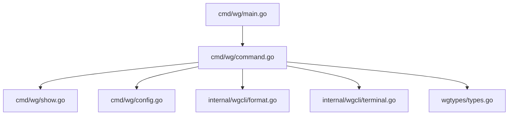
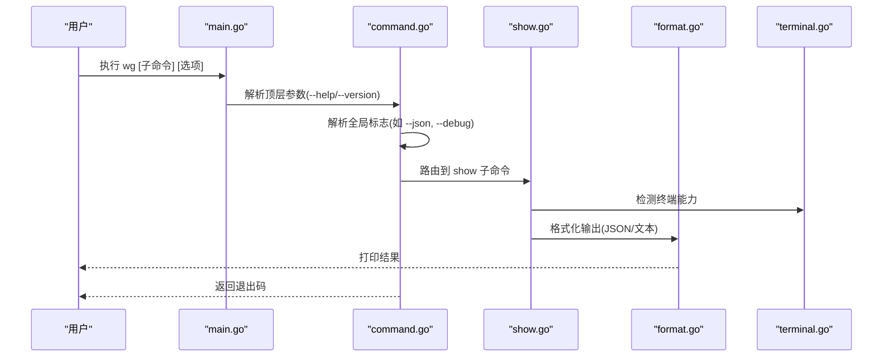
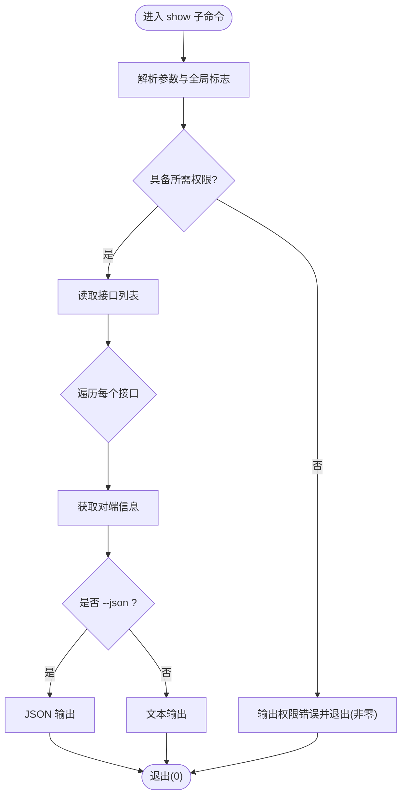
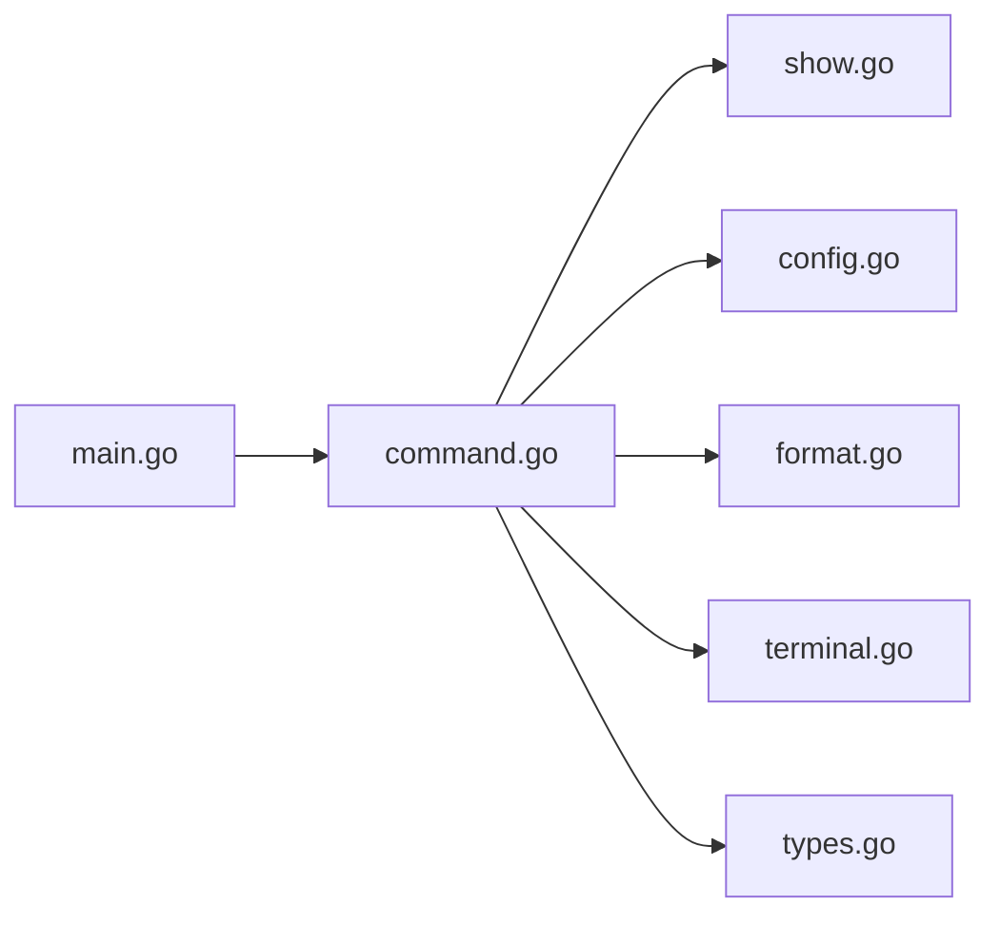

# wg 命令详解

<cite>
**本文引用的文件**
- [cmd/wg/main.go](file://cmd/wg/main.go)
- [cmd/wg/command.go](file://cmd/wg/command.go)
- [cmd/wg/show.go](file://cmd/wg/show.go)
- [cmd/wg/config.go](file://cmd/wg/config.go)
- [internal/wgcli/format.go](file://internal/wgcli/format.go)
- [internal/wgcli/terminal.go](file://internal/wgcli/terminal.go)
- [wgtypes/types.go](file://wgtypes/types.go)
- [README.md](file://README.md)
</cite>

## 目录
1. [简介](#简介)
2. [项目结构](#项目结构)
3. [核心组件](#核心组件)
4. [架构总览](#架构总览)
5. [详细组件分析](#详细组件分析)
6. [依赖关系分析](#依赖关系分析)
7. [性能与行为特性](#性能与行为特性)
8. [故障排查指南](#故障排查指南)
9. [结论](#结论)
10. [附录：命令语法与选项速查](#附录命令语法与选项速查)

## 简介
本文件面向使用 wg 命令行工具的用户与维护者，系统性说明 wg 主命令的语法、全局选项、子命令结构、执行流程、参数解析机制、错误处理策略、帮助与版本信息获取方式、调试模式使用方法，以及退出码含义。wg 是 WireGuard 配置与查询的命令行入口，提供查看接口状态、导出/导入配置等能力，并在不同操作系统上通过平台客户端实现底层交互。

## 项目结构
wg 命令位于 cmd/wg 目录下，采用“主程序 + 子命令”的组织方式：
- main.go：进程入口，负责初始化、解析顶层参数（如 --help、--version）、选择并运行子命令。
- command.go：定义通用命令框架、全局标志、子命令注册与调度逻辑。
- show.go：实现 show 子命令，用于查询当前系统上的 WireGuard 接口与对端信息。
- config.go：实现配置相关子命令（如导出/导入），封装配置读写与校验。
- internal/wgcli/*：格式化输出、终端检测等通用能力。
- wgtypes/*：类型定义与错误类型，供上层复用。

图表来源
- [cmd/wg/main.go](file://cmd/wg/main.go)
- [cmd/wg/command.go](file://cmd/wg/command.go)
- [cmd/wg/show.go](file://cmd/wg/show.go)
- [cmd/wg/config.go](file://cmd/wg/config.go)
- [internal/wgcli/format.go](file://internal/wgcli/format.go)
- [internal/wgcli/terminal.go](file://internal/wgcli/terminal.go)
- [wgtypes/types.go](file://wgtypes/types.go)

章节来源
- [cmd/wg/main.go](file://cmd/wg/main.go)
- [cmd/wg/command.go](file://cmd/wg/command.go)
- [cmd/wg/show.go](file://cmd/wg/show.go)
- [cmd/wg/config.go](file://cmd/wg/config.go)
- [internal/wgcli/format.go](file://internal/wgcli/format.go)
- [internal/wgcli/terminal.go](file://internal/wgcli/terminal.go)
- [wgtypes/types.go](file://wgtypes/types.go)

## 核心组件
- 主入口（main.go）
  - 负责解析顶层参数（例如 --help、--version），调用命令框架并返回相应退出码。
- 命令框架（command.go）
  - 定义全局标志（如 --json、--debug 等，具体以代码为准）、子命令注册表、统一错误处理与退出码约定。
  - 提供统一的帮助生成与版本信息输出。
- show 子命令（show.go）
  - 读取系统 WireGuard 接口列表与对端信息，按格式输出。
- config 子命令（config.go）
  - 提供配置的导出/导入等功能，包含输入校验与错误提示。
- 输出与终端（internal/wgcli）
  - 根据终端能力与 --json 等标志决定输出格式（人类可读或机器可读）。
- 类型与错误（wgtypes）
  - 定义共享的数据结构与错误类型，保证跨模块一致性。

章节来源
- [cmd/wg/main.go](file://cmd/wg/main.go)
- [cmd/wg/command.go](file://cmd/wg/command.go)
- [cmd/wg/show.go](file://cmd/wg/show.go)
- [cmd/wg/config.go](file://cmd/wg/config.go)
- [internal/wgcli/format.go](file://internal/wgcli/format.go)
- [internal/wgcli/terminal.go](file://internal/wgcli/terminal.go)
- [wgtypes/types.go](file://wgtypes/types.go)

## 架构总览
wg 命令的执行流程如下：
- 进程启动后，main.go 解析顶层参数（--help、--version 等）。
- 进入 command.go 的命令框架，解析全局标志，识别子命令。
- 将控制权交给对应子命令处理器（show、config 等）。
- 子命令调用内部库进行数据读取/写入，并通过 internal/wgcli 格式化输出。
- 根据执行结果设置退出码并返回。

图表来源
- [cmd/wg/main.go](file://cmd/wg/main.go)
- [cmd/wg/command.go](file://cmd/wg/command.go)
- [cmd/wg/show.go](file://cmd/wg/show.go)
- [internal/wgcli/format.go](file://internal/wgcli/format.go)
- [internal/wgcli/terminal.go](file://internal/wgcli/terminal.go)

## 详细组件分析

### 主命令与全局选项
- 顶层参数
  - --help：显示帮助信息并退出。
  - --version：输出版本信息并退出。
- 全局选项（示例，具体以代码为准）
  - --json：强制 JSON 输出，便于脚本解析。
  - --debug：开启调试日志，输出更详细的诊断信息。
- 行为
  - 当同时出现冲突选项时，优先遵循显式指定项；未指定时使用默认值。
  - 遇到未知选项或非法组合时，输出错误信息并返回非零退出码。

章节来源
- [cmd/wg/main.go](file://cmd/wg/main.go)
- [cmd/wg/command.go](file://cmd/wg/command.go)

### 子命令：show
- 功能
  - 列出本地所有 WireGuard 接口及其对端信息。
  - 支持按名称过滤（若实现）。
- 参数
  - 可选：接口名（精确匹配）。
  - 全局选项：--json、--debug 等。
- 输出
  - 文本模式：人类可读表格或键值对。
  - JSON 模式：结构化数据，便于自动化处理。
- 错误处理
  - 无权限或内核接口不可用时，给出明确错误提示并返回非零退出码。

图表来源
- [cmd/wg/show.go](file://cmd/wg/show.go)
- [internal/wgcli/format.go](file://internal/wgcli/format.go)
- [internal/wgcli/terminal.go](file://internal/wgcli/terminal.go)

章节来源
- [cmd/wg/show.go](file://cmd/wg/show.go)
- [internal/wgcli/format.go](file://internal/wgcli/format.go)
- [internal/wgcli/terminal.go](file://internal/wgcli/terminal.go)

### 子命令：config（配置）
- 功能
  - 导出当前配置到文件或标准输出。
  - 从文件或标准输入导入配置（若实现）。
- 参数
  - 必需：操作类型（导出/导入）。
  - 可选：目标路径（导出）或源路径（导入）。
  - 全局选项：--json、--debug。
- 校验与错误
  - 路径不存在、权限不足、格式不合法时，输出错误并返回非零退出码。

章节来源
- [cmd/wg/config.go](file://cmd/wg/config.go)
- [cmd/wg/command.go](file://cmd/wg/command.go)

### 输出与终端适配
- terminal.go
  - 检测终端是否支持彩色/交互式输出，影响展示样式。
- format.go
  - 根据 --json 标志与终端能力，选择 JSON 或人类可读格式。
  - 确保在管道环境中自动降级为稳定格式。

章节来源
- [internal/wgcli/terminal.go](file://internal/wgcli/terminal.go)
- [internal/wgcli/format.go](file://internal/wgcli/format.go)

### 类型与错误
- wgtypes/types.go
  - 定义共享数据结构与错误类型，确保各子命令一致的错误语义。
  - 常见错误包括：权限不足、内核接口不可用、参数非法、I/O 失败等。

章节来源
- [wgtypes/types.go](file://wgtypes/types.go)

## 依赖关系分析
wg 命令依赖以下层次：
- 顶层：main.go 与 command.go 负责参数解析与调度。
- 子命令层：show.go、config.go 实现具体业务。
- 公共库：internal/wgcli 提供输出与终端能力。
- 类型层：wgtypes 提供共享类型与错误。

图表来源
- [cmd/wg/main.go](file://cmd/wg/main.go)
- [cmd/wg/command.go](file://cmd/wg/command.go)
- [cmd/wg/show.go](file://cmd/wg/show.go)
- [cmd/wg/config.go](file://cmd/wg/config.go)
- [internal/wgcli/format.go](file://internal/wgcli/format.go)
- [internal/wgcli/terminal.go](file://internal/wgcli/terminal.go)
- [wgtypes/types.go](file://wgtypes/types.go)

章节来源
- [cmd/wg/command.go](file://cmd/wg/command.go)
- [cmd/wg/show.go](file://cmd/wg/show.go)
- [cmd/wg/config.go](file://cmd/wg/config.go)
- [internal/wgcli/format.go](file://internal/wgcli/format.go)
- [internal/wgcli/terminal.go](file://internal/wgcli/terminal.go)
- [wgtypes/types.go](file://wgtypes/types.go)

## 性能与行为特性
- 输出性能
  - 大量接口或对端时，JSON 模式更适合批量处理；文本模式适合人工阅读。
- I/O 与权限
  - 读取内核接口通常需要较高权限；建议以最小权限原则运行，必要时使用提权机制。
- 可观测性
  - 使用 --debug 可获得更详细的执行轨迹，便于定位问题。

[本节为通用指导，不直接分析具体文件]

## 故障排查指南
- 常见问题
  - 权限不足：确认当前用户具有访问内核接口的权限。
  - 无可用接口：检查系统是否加载了 WireGuard 模块或驱动。
  - 参数错误：核对子命令与参数组合是否符合预期。
- 诊断步骤
  - 使用 --help 查看帮助信息。
  - 使用 --debug 输出详细日志。
  - 使用 --json 将输出转为结构化数据，便于进一步分析。
- 退出码
  - 成功：0
  - 一般错误：非零（具体分类见错误类型定义）
  - 权限/内核不可用：非零（结合错误消息判断）

章节来源
- [wgtypes/types.go](file://wgtypes/types.go)
- [cmd/wg/command.go](file://cmd/wg/command.go)

## 结论
wg 命令通过清晰的参数解析与子命令拆分，提供了稳定的接口查询与配置管理能力。借助 --json 与 --debug 等全局选项，既能满足日常使用，也能支撑自动化与排障场景。建议在需要稳定输出的环境优先使用 JSON 模式，并结合权限与内核可用性进行部署与运维。

[本节为总结性内容，不直接分析具体文件]

## 附录：命令语法与选项速查
- 基本语法
  - wg [全局选项] <子命令> [子命令参数]
- 全局选项
  - --help：显示帮助信息并退出。
  - --version：输出版本信息并退出。
  - --json：强制 JSON 输出。
  - --debug：开启调试日志。
- 子命令
  - show：列出接口与对端信息。
    - 参数：可选接口名（精确匹配）。
    - 输出：文本或 JSON（受 --json 控制）。
  - config：导出/导入配置。
    - 参数：操作类型与路径（视具体实现而定）。
    - 输出：配置文件或提示信息。
- 退出码
  - 0：成功。
  - 非零：发生错误（权限、内核不可用、参数非法等）。

章节来源
- [cmd/wg/main.go](file://cmd/wg/main.go)
- [cmd/wg/command.go](file://cmd/wg/command.go)
- [cmd/wg/show.go](file://cmd/wg/show.go)
- [cmd/wg/config.go](file://cmd/wg/config.go)
- [README.md](file://README.md)