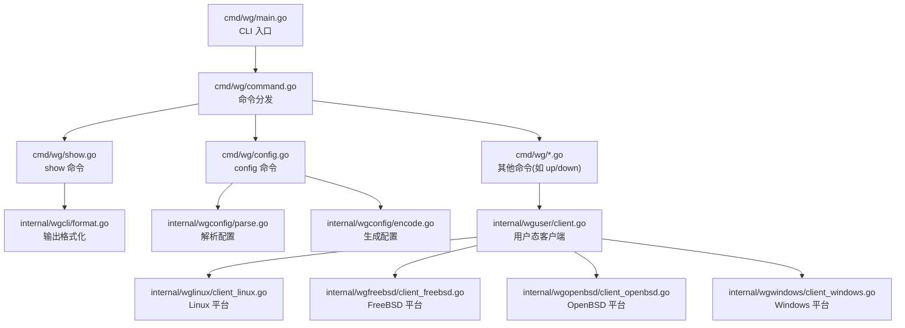
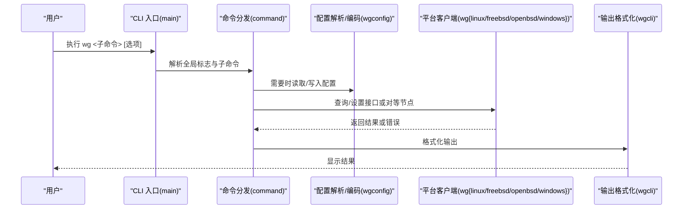
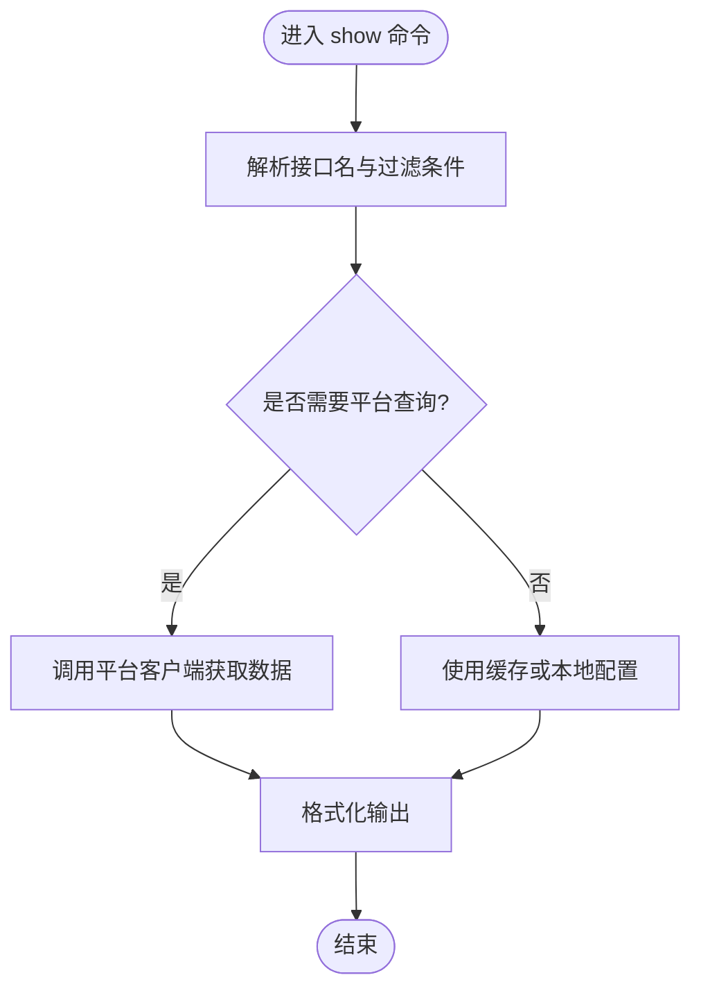
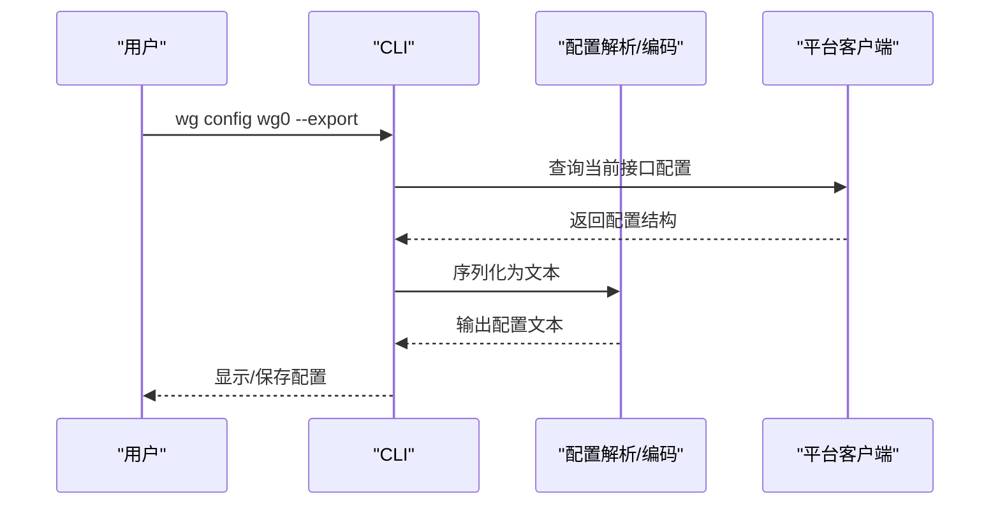
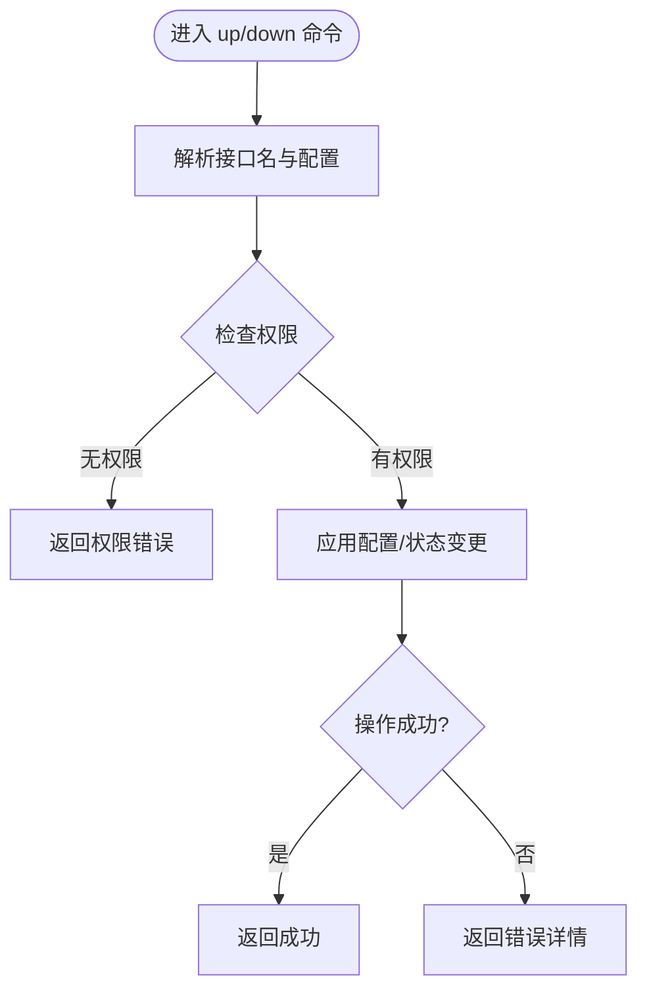
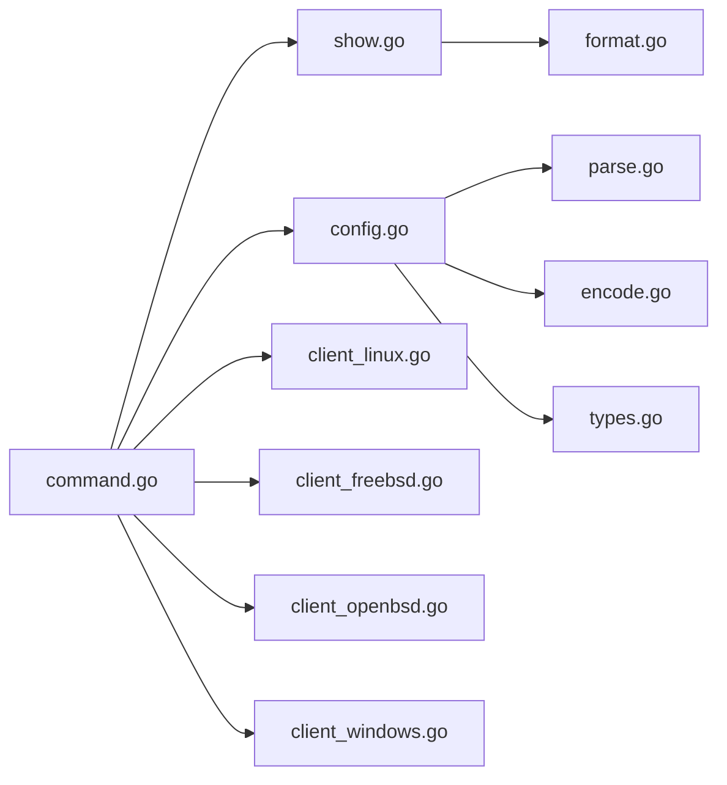

# 命令行工具参考

<cite>
**本文引用的文件**
- [cmd/wg/main.go](file://cmd/wg/main.go)
- [cmd/wg/command.go](file://cmd/wg/command.go)
- [cmd/wg/config.go](file://cmd/wg/config.go)
- [cmd/wg/show.go](file://cmd/wg/show.go)
- [internal/wgcli/format.go](file://internal/wgcli/format.go)
- [internal/wgcli/terminal.go](file://internal/wgcli/terminal.go)
- [internal/wgconfig/parse.go](file://internal/wgconfig/parse.go)
- [internal/wgconfig/encode.go](file://internal/wgconfig/encode.go)
- [wgtypes/types.go](file://wgtypes/types.go)
- [internal/wguser/client.go](file://internal/wguser/client.go)
- [internal/wglinux/client_linux.go](file://internal/wglinux/client_linux.go)
- [internal/wgfreebsd/client_freebsd.go](file://internal/wgfreebsd/client_freebsd.go)
- [internal/wgopenbsd/client_openbsd.go](file://internal/wgopenbsd/client_openbsd.go)
- [internal/wgwindows/client_windows.go](file://internal/wgwindows/client_windows.go)
</cite>

## 目录
1. [简介](#简介)
2. [项目结构](#项目结构)
3. [核心组件](#核心组件)
4. [架构总览](#架构总览)
5. [详细组件分析](#详细组件分析)
6. [依赖关系分析](#依赖关系分析)
7. [性能注意事项](#性能注意事项)
8. [故障排查指南](#故障排查指南)
9. [结论](#结论)
10. [附录](#附录)

## 简介
本参考文档面向使用 wg 命令行工具的用户与运维工程师，系统说明所有命令、选项与标志的用法，覆盖 show、config、up、down 等核心命令，解释配置文件格式（接口配置、对等节点、路由规则），并提供常用操作场景的命令序列示例。同时包含错误处理、调试选项与性能相关参数的说明，确保与实际工具行为一致。

## 项目结构
wg 命令行入口位于 cmd/wg，负责解析参数、分发子命令；内部模块分别承担配置解析/编码、格式化输出、平台客户端封装等职责。整体采用“命令层 + 配置层 + 平台适配层”的分层设计：
- 命令层：cmd/wg/* 提供 CLI 入口与子命令实现
- 配置层：internal/wgconfig/* 负责 WG 配置文件的解析与生成
- 格式化层：internal/wgcli/* 负责终端输出格式与交互提示
- 平台适配层：internal/wg{linux,freebsd,openbsd,windows}/* 提供各平台的内核/用户态接口调用
- 类型定义：wgtypes/* 定义通用数据结构

图表来源
- [cmd/wg/main.go:1-200](file://cmd/wg/main.go#L1-L200)
- [cmd/wg/command.go:1-200](file://cmd/wg/command.go#L1-L200)
- [cmd/wg/show.go:1-200](file://cmd/wg/show.go#L1-L200)
- [cmd/wg/config.go:1-200](file://cmd/wg/config.go#L1-L200)
- [internal/wgcli/format.go:1-200](file://internal/wgcli/format.go#L1-L200)
- [internal/wgconfig/parse.go:1-200](file://internal/wgconfig/parse.go#L1-L200)
- [internal/wgconfig/encode.go:1-200](file://internal/wgconfig/encode.go#L1-L200)
- [internal/wguser/client.go:1-200](file://internal/wguser/client.go#L1-L200)
- [internal/wglinux/client_linux.go:1-200](file://internal/wglinux/client_linux.go#L1-L200)
- [internal/wgfreebsd/client_freebsd.go:1-200](file://internal/wgfreebsd/client_freebsd.go#L1-L200)
- [internal/wgopenbsd/client_openbsd.go:1-200](file://internal/wgopenbsd/client_openbsd.go#L1-L200)
- [internal/wgwindows/client_windows.go:1-200](file://internal/wgwindows/client_windows.go#L1-L200)

章节来源
- [cmd/wg/main.go:1-200](file://cmd/wg/main.go#L1-L200)
- [cmd/wg/command.go:1-200](file://cmd/wg/command.go#L1-L200)

## 核心组件
- CLI 入口与命令分发：负责解析全局标志、子命令与参数，并调用对应处理器
- show 命令：查询当前 WireGuard 接口状态、对等节点、统计信息
- config 命令：读取或写入配置文件，支持导出/导入与校验
- 配置解析与编码：将文本配置转换为内部结构，或将内部结构序列化回文本
- 平台客户端：封装不同操作系统上的 WireGuard 接口访问方式（内核模块、用户态驱动、Windows 驱动）
- 输出格式化：统一终端输出样式、表格化展示、可读性优化

章节来源
- [cmd/wg/command.go:1-200](file://cmd/wg/command.go#L1-L200)
- [cmd/wg/show.go:1-200](file://cmd/wg/show.go#L1-L200)
- [cmd/wg/config.go:1-200](file://cmd/wg/config.go#L1-L200)
- [internal/wgconfig/parse.go:1-200](file://internal/wgconfig/parse.go#L1-L200)
- [internal/wgconfig/encode.go:1-200](file://internal/wgconfig/encode.go#L1-L200)
- [internal/wgcli/format.go:1-200](file://internal/wgcli/format.go#L1-L200)

## 架构总览
wg 命令行工具通过命令层接收用户输入，调用配置层进行解析/生成，再经由平台适配层与系统 WireGuard 子系统交互。输出层负责将结果以人类可读的方式呈现。

图表来源
- [cmd/wg/main.go:1-200](file://cmd/wg/main.go#L1-L200)
- [cmd/wg/command.go:1-200](file://cmd/wg/command.go#L1-L200)
- [internal/wgconfig/parse.go:1-200](file://internal/wgconfig/parse.go#L1-L200)
- [internal/wgconfig/encode.go:1-200](file://internal/wgconfig/encode.go#L1-L200)
- [internal/wglinux/client_linux.go:1-200](file://internal/wglinux/client_linux.go#L1-L200)
- [internal/wgfreebsd/client_freebsd.go:1-200](file://internal/wgfreebsd/client_freebsd.go#L1-L200)
- [internal/wgopenbsd/client_openbsd.go:1-200](file://internal/wgopenbsd/client_openbsd.go#L1-L200)
- [internal/wgwindows/client_windows.go:1-200](file://internal/wgwindows/client_windows.go#L1-L200)
- [internal/wgcli/format.go:1-200](file://internal/wgcli/format.go#L1-L200)

## 详细组件分析

### 全局选项与帮助
- 全局标志通常包括指定接口名称、输出格式、是否静默/详细模式、配置文件路径等
- 使用 --help 或 -h 查看帮助信息
- 常见全局标志示例（具体以实际实现为准）：
  - --interface/-i：指定目标 WireGuard 接口名
  - --config/-c：指定配置文件路径
  - --json/-j：输出 JSON 格式
  - --quiet/-q：减少输出
  - --verbose/-v：增加输出细节

章节来源
- [cmd/wg/main.go:1-200](file://cmd/wg/main.go#L1-L200)
- [cmd/wg/command.go:1-200](file://cmd/wg/command.go#L1-L200)

### show 命令
- 功能：显示当前 WireGuard 接口的状态、对等节点、统计信息等
- 语法：wg show [接口名] [可选过滤]
- 参数：
  - 接口名：未指定时默认显示第一个或当前活动接口
  - 可选过滤：按对等节点 ID、公钥、IP 等进行筛选（取决于实现）
- 输出：
  - 默认人类可读表格
  - 可切换为 JSON 格式（若启用 --json）
- 示例：
  - 显示所有接口概览：wg show
  - 显示指定接口详情：wg show wg0
  - 仅显示对等节点列表：wg show wg0 peers
  - 输出 JSON：wg show --json wg0

图表来源
- [cmd/wg/show.go:1-200](file://cmd/wg/show.go#L1-L200)
- [internal/wgcli/format.go:1-200](file://internal/wgcli/format.go#L1-L200)
- [internal/wglinux/client_linux.go:1-200](file://internal/wglinux/client_linux.go#L1-L200)

章节来源
- [cmd/wg/show.go:1-200](file://cmd/wg/show.go#L1-L200)
- [internal/wgcli/format.go:1-200](file://internal/wgcli/format.go#L1-L200)

### config 命令
- 功能：读取或写入 WireGuard 配置文件，支持导出当前配置、导入新配置、校验配置
- 语法：wg config [接口名] [--export | --import | --validate] [文件路径]
- 参数：
  - --export：导出当前接口配置到文件或标准输出
  - --import：从文件导入配置并应用到接口
  - --validate：校验配置文件语法与完整性
  - 文件路径：指定输入/输出文件，省略则使用标准输入/输出
- 输出：
  - 导出：生成标准 WG 配置文本
  - 导入：返回成功/失败状态及错误信息
  - 校验：返回校验结果与问题定位
- 示例：
  - 导出配置：wg config wg0 --export > wg0.conf
  - 导入配置：wg config wg0 --import < wg0.conf
  - 校验配置：wg config wg0 --validate wg0.conf

图表来源
- [cmd/wg/config.go:1-200](file://cmd/wg/config.go#L1-L200)
- [internal/wgconfig/parse.go:1-200](file://internal/wgconfig/parse.go#L1-L200)
- [internal/wgconfig/encode.go:1-200](file://internal/wgconfig/encode.go#L1-L200)
- [internal/wglinux/client_linux.go:1-200](file://internal/wglinux/client_linux.go#L1-L200)

章节来源
- [cmd/wg/config.go:1-200](file://cmd/wg/config.go#L1-L200)
- [internal/wgconfig/parse.go:1-200](file://internal/wgconfig/parse.go#L1-L200)
- [internal/wgconfig/encode.go:1-200](file://internal/wgconfig/encode.go#L1-L200)

### up 与 down 命令
- 功能：启动或停止指定的 WireGuard 接口
- 语法：
  - wg up [接口名] [--config 文件]
  - wg down [接口名]
- 参数：
  - 接口名：目标接口标识
  - --config：可选，指定要应用的配置文件
- 行为：
  - up：创建或激活接口，加载配置，建立隧道
  - down：关闭接口，释放资源
- 输出：
  - 成功：返回成功状态
  - 失败：返回错误信息与可能原因（权限不足、接口不存在等）

图表来源
- [cmd/wg/command.go:1-200](file://cmd/wg/command.go#L1-L200)
- [internal/wguser/client.go:1-200](file://internal/wguser/client.go#L1-L200)
- [internal/wglinux/client_linux.go:1-200](file://internal/wglinux/client_linux.go#L1-L200)

章节来源
- [cmd/wg/command.go:1-200](file://cmd/wg/command.go#L1-L200)
- [internal/wguser/client.go:1-200](file://internal/wguser/client.go#L1-L200)

### 配置文件格式与选项
- 接口配置：
  - PrivateKey：接口私钥
  - Address：接口 IP 地址（支持 CIDR）
  - ListenPort：监听端口
  - MTU：最大传输单元
- 对等节点设置：
  - PublicKey：对端公钥
  - AllowedIPs：允许的路由网段（支持多个 CIDR）
  - Endpoint：对端地址与端口
  - PersistentKeepalive：保活间隔
- 路由规则：
  - AllowedIPs 用于定义路由策略，决定哪些流量经隧道转发
- 示例片段（描述性，非代码内容）：
  - 一个接口包含若干对等节点，每个对等节点定义其公网可达地址与允许的 IP 范围
  - 多网段路由可通过逗号分隔的 CIDR 列表配置

章节来源
- [internal/wgconfig/parse.go:1-200](file://internal/wgconfig/parse.go#L1-L200)
- [internal/wgconfig/encode.go:1-200](file://internal/wgconfig/encode.go#L1-L200)
- [wgtypes/types.go:1-200](file://wgtypes/types.go#L1-L200)

### 常用操作场景与命令序列
- 快速搭建点对点隧道：
  - 生成密钥对（外部工具）
  - 编写双方配置文件（包含对方公钥、AllowedIPs、Endpoint）
  - 在两端执行 wg up wg0 --config wg0.conf
  - 使用 wg show wg0 验证连接状态
- 批量管理多个接口：
  - 为每个接口准备独立配置文件
  - 循环执行 wg up wgX --config wgX.conf
  - 使用 wg show 汇总状态
- 动态更新配置：
  - 修改配置文件后执行 wg config wg0 --import < wg0.conf
  - 使用 wg show wg0 peers 确认对等节点变化

[本节为概念性指导，不直接分析具体文件]

## 依赖关系分析
wg 命令行工具依赖以下关键模块：
- 命令分发与参数解析：cmd/wg/command.go
- 配置解析与生成：internal/wgconfig/*
- 输出格式化：internal/wgcli/*
- 平台客户端：internal/wg{linux,freebsd,openbsd,windows}/*
- 数据类型：wgtypes/*

图表来源
- [cmd/wg/command.go:1-200](file://cmd/wg/command.go#L1-L200)
- [cmd/wg/show.go:1-200](file://cmd/wg/show.go#L1-L200)
- [cmd/wg/config.go:1-200](file://cmd/wg/config.go#L1-L200)
- [internal/wgconfig/parse.go:1-200](file://internal/wgconfig/parse.go#L1-L200)
- [internal/wgconfig/encode.go:1-200](file://internal/wgconfig/encode.go#L1-L200)
- [internal/wgcli/format.go:1-200](file://internal/wgcli/format.go#L1-L200)
- [wgtypes/types.go:1-200](file://wgtypes/types.go#L1-L200)
- [internal/wglinux/client_linux.go:1-200](file://internal/wglinux/client_linux.go#L1-L200)
- [internal/wgfreebsd/client_freebsd.go:1-200](file://internal/wgfreebsd/client_freebsd.go#L1-L200)
- [internal/wgopenbsd/client_openbsd.go:1-200](file://internal/wgopenbsd/client_openbsd.go#L1-L200)
- [internal/wgwindows/client_windows.go:1-200](file://internal/wgwindows/client_windows.go#L1-L200)

章节来源
- [cmd/wg/command.go:1-200](file://cmd/wg/command.go#L1-L200)
- [internal/wgconfig/parse.go:1-200](file://internal/wgconfig/parse.go#L1-L200)
- [internal/wgconfig/encode.go:1-200](file://internal/wgconfig/encode.go#L1-L200)
- [internal/wgcli/format.go:1-200](file://internal/wgcli/format.go#L1-L200)
- [wgtypes/types.go:1-200](file://wgtypes/types.go#L1-L200)

## 性能注意事项
- 大量对等节点：AllowedIPs 过多可能导致路由表膨胀，建议合理划分网段
- 频繁配置更新：避免高频 --import，尽量合并变更批次
- 输出格式：JSON 输出适合自动化处理，但可能增加序列化开销
- 平台差异：不同操作系统内核/驱动实现存在性能差异，需结合实际环境调优

[本节提供一般性指导，不直接分析具体文件]

## 故障排查指南
- 权限问题：
  - 现象：up/down 或写入配置失败
  - 处理：以管理员/root 权限运行，或调整系统权限策略
- 配置错误：
  - 现象：--validate 报错或导入失败
  - 处理：检查私钥/公钥格式、CIDR 合法性、Endpoint 可达性
- 连接异常：
  - 现象：peer 状态不在线或统计无增长
  - 处理：检查防火墙/NAT 穿透、端口暴露、Keepalive 设置
- 平台兼容：
  - 现象：某些命令在不同系统表现不一致
  - 处理：确认平台客户端实现与内核/驱动版本匹配

章节来源
- [internal/wguser/client.go:1-200](file://internal/wguser/client.go#L1-L200)
- [internal/wglinux/client_linux.go:1-200](file://internal/wglinux/client_linux.go#L1-L200)
- [internal/wgfreebsd/client_freebsd.go:1-200](file://internal/wgfreebsd/client_freebsd.go#L1-L200)
- [internal/wgopenbsd/client_openbsd.go:1-200](file://internal/wgopenbsd/client_openbsd.go#L1-L200)
- [internal/wgwindows/client_windows.go:1-200](file://internal/wgwindows/client_windows.go#L1-L200)

## 结论
wg 命令行工具通过清晰的命令分层与平台适配，提供了对 WireGuard 接口的完整管理能力。掌握 show、config、up、down 等核心命令及其选项，结合合理的配置文件设计与排障流程，可高效完成隧道的部署、监控与维护。建议在复杂网络环境中结合日志与校验工具，持续优化配置与性能。

[本节为总结性内容，不直接分析具体文件]

## 附录
- 术语：
  - 接口：本地 WireGuard 虚拟网卡
  - 对等节点：远端 WireGuard 实体
  - AllowedIPs：允许经隧道转发的 IP 网段
- 最佳实践：
  - 使用最小权限原则运行 wg
  - 定期审计配置文件与对等节点
  - 在生产环境启用 Keepalive 与监控指标

[本节为补充信息，不直接分析具体文件]