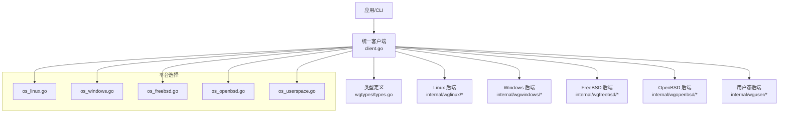
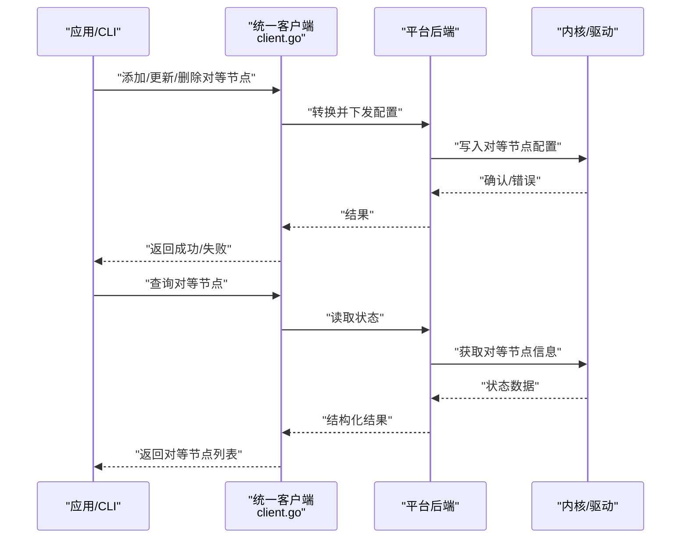
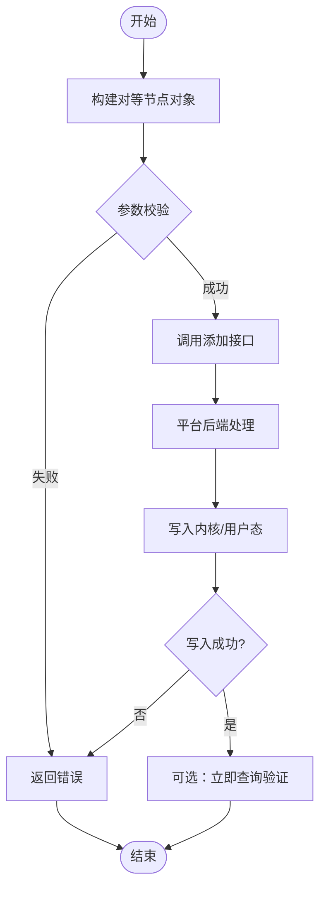
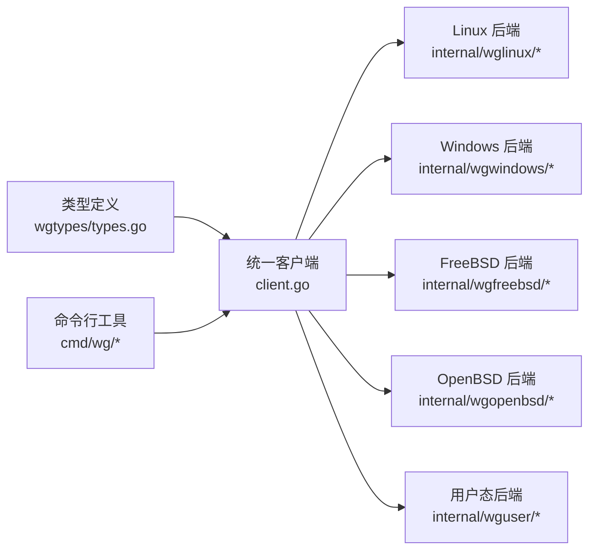

# 对等节点管理

<cite>
**本文引用的文件**
- [client.go](file://client.go)
- [types.go](file://wgtypes/types.go)
- [errors.go](file://wgtypes/errors.go)
- [doc.go](file://doc.go)
- [os_linux.go](file://os_linux.go)
- [os_windows.go](file://os_windows.go)
- [os_freebsd.go](file://os_freebsd.go)
- [os_openbsd.go](file://os_openbsd.go)
- [os_userspace.go](file://os_userspace.go)
- [configure_linux.go](file://internal/wglinux/configure_linux.go)
- [parse_linux.go](file://internal/wglinux/parse_linux.go)
- [configuration_windows.go](file://internal/wgwindows/internal/ioctl/configuration_windows.go)
- [client_freebsd.go](file://internal/wgfreebsd/client_freebsd.go)
- [client_openbsd.go](file://internal/wgopenbsd/client_openbsd.go)
- [client.go](file://internal/wginternal/client.go)
- [configure.go](file://internal/wguser/configure.go)
- [parse.go](file://internal/wguser/parse.go)
- [command.go](file://cmd/wg/command.go)
- [config.go](file://cmd/wg/config.go)
- [show.go](file://cmd/wg/show.go)
</cite>

## 目录
1. [简介](#简介)
2. [项目结构](#项目结构)
3. [核心组件](#核心组件)
4. [架构总览](#架构总览)
5. [详细组件分析](#详细组件分析)
6. [依赖关系分析](#依赖关系分析)
7. [性能考虑](#性能考虑)
8. [故障排查指南](#故障排查指南)
9. [结论](#结论)
10. [附录](#附录)

## 简介
本文件面向 WireGuard 对等节点（Peer）的管理能力，覆盖添加、删除、更新与查询操作的完整流程；解释对等节点配置参数（公钥、端点地址、持久保持连接、允许的 IP 等）；提供配置示例与最佳实践；说明连接状态监控与故障排查方法；并给出批量操作与对等节点组管理的实用技巧。文档基于仓库中的跨平台客户端实现与各平台后端（Linux、Windows、FreeBSD、OpenBSD、用户态）进行梳理，确保读者既能理解高层 API，也能掌握底层差异。

## 项目结构
该仓库采用“统一 API + 多平台后端”的分层设计：
- 顶层 client.go 暴露统一的对等节点管理接口（添加、删除、更新、查询）。
- wgtypes/types.go 定义对等节点的数据模型与字段语义。
- internal/* 下按平台或用途组织后端实现：
  - Linux: internal/wglinux
  - Windows: internal/wgwindows
  - FreeBSD/OpenBSD: internal/wgfreebsd / internal/wgopenbsd
  - 用户态: internal/wguser
- cmd/wg 提供命令行工具，便于演示与日常使用。

图表来源
- [client.go:1-200](file://client.go#L1-L200)
- [types.go:1-200](file://wgtypes/types.go#L1-L200)
- [os_linux.go:1-100](file://os_linux.go#L1-L100)
- [os_windows.go:1-100](file://os_windows.go#L1-L100)
- [os_freebsd.go:1-100](file://os_freebsd.go#L1-L100)
- [os_openbsd.go:1-100](file://os_openbsd.go#L1-L100)
- [os_userspace.go:1-100](file://os_userspace.go#L1-L100)

章节来源
- [client.go:1-200](file://client.go#L1-L200)
- [types.go:1-200](file://wgtypes/types.go#L1-L200)
- [doc.go:1-100](file://doc.go#L1-L100)

## 核心组件
- 统一客户端（client.go）
  - 提供对等节点的增删改查入口，内部根据运行平台选择对应后端。
  - 负责将高层请求转换为平台特定的配置变更与查询。
- 类型定义（wgtypes/types.go）
  - 定义对等节点数据结构与字段含义，如公钥、预共享密钥、端点、允许 IP、持久保持连接、传输统计等。
- 平台后端
  - Linux: 通过 netlink 与内核 WireGuard 模块交互，完成配置下发与状态读取。
  - Windows: 通过 IOCTL 与内核驱动交互。
  - FreeBSD/OpenBSD: 通过系统特定接口访问内核模块。
  - 用户态: 在无法直接访问内核时，提供用户态模拟或辅助能力。
- 命令行工具（cmd/wg）
  - 封装常用操作，便于演示与日常运维。

章节来源
- [client.go:1-200](file://client.go#L1-L200)
- [types.go:1-200](file://wgtypes/types.go#L1-L200)
- [configure_linux.go:1-200](file://internal/wglinux/configure_linux.go#L1-L200)
- [configuration_windows.go:1-200](file://internal/wgwindows/internal/ioctl/configuration_windows.go#L1-L200)
- [client_freebsd.go:1-200](file://internal/wgfreebsd/client_freebsd.go#L1-L200)
- [client_openbsd.go:1-200](file://internal/wgopenbsd/client_openbsd.go#L1-L200)
- [configure.go:1-200](file://internal/wguser/configure.go#L1-L200)
- [parse.go:1-200](file://internal/wguser/parse.go#L1-L200)
- [command.go:1-200](file://cmd/wg/command.go#L1-L200)
- [config.go:1-200](file://cmd/wg/config.go#L1-L200)
- [show.go:1-200](file://cmd/wg/show.go#L1-L200)

## 架构总览
统一客户端屏蔽了平台差异，对外暴露一致的增删改查接口。调用方传入对等节点对象，客户端将其序列化为平台可理解的配置结构，并通过对应后端写入内核或用户态实现。查询时，后端从内核或用户态读取当前对等节点状态并返回给调用方。

图表来源
- [client.go:1-200](file://client.go#L1-L200)
- [configure_linux.go:1-200](file://internal/wglinux/configure_linux.go#L1-L200)
- [configuration_windows.go:1-200](file://internal/wgwindows/internal/ioctl/configuration_windows.go#L1-L200)
- [client_freebsd.go:1-200](file://internal/wgfreebsd/client_freebsd.go#L1-L200)
- [client_openbsd.go:1-200](file://internal/wgopenbsd/client_openbsd.go#L1-L200)
- [configure.go:1-200](file://internal/wguser/configure.go#L1-L200)

## 详细组件分析

### 对等节点数据模型与配置参数
- 公钥（PublicKey）
  - 标识对等节点身份，用于加密握手与数据包校验。
  - 必填项，缺失会导致配置无效。
- 预共享密钥（PresharedKey，可选）
  - 增强安全性，增加一层对称加密保护。
  - 若启用需两端一致。
- 端点地址（Endpoint）
  - 指定对等节点的可达地址（IP:Port），用于主动发起连接。
  - 支持 IPv4/IPv6。
- 允许的 IP（AllowedIPs）
  - 路由规则，决定哪些目的地址流量经此对等节点转发。
  - 支持 CIDR 表示法，可配置多条。
- 持久保持连接（PersistentKeepalive）
  - 周期性发送保活包，穿透 NAT/防火墙，维持会话。
  - 通常用于客户端侧，服务端一般不设置。
- 传输统计（Rx/Tx Bytes/Packets）
  - 只读字段，反映自上次重置以来的收发字节与包数。
  - 可用于健康检查与容量规划。
- 最后活动时间与最近握手时间
  - 用于判断对等节点是否活跃、是否需要重连。
  - 结合日志与告警可实现自动恢复。

章节来源
- [types.go:1-200](file://wgtypes/types.go#L1-L200)

### 添加对等节点
- 调用统一客户端的添加接口，传入包含公钥、端点、允许 IP 等的对等节点对象。
- 客户端根据平台选择后端，将配置写入内核或用户态。
- 成功后可通过查询接口验证新增的对等节点。

图表来源
- [client.go:1-200](file://client.go#L1-L200)
- [configure_linux.go:1-200](file://internal/wglinux/configure_linux.go#L1-L200)
- [configuration_windows.go:1-200](file://internal/wgwindows/internal/ioctl/configuration_windows.go#L1-L200)
- [client_freebsd.go:1-200](file://internal/wgfreebsd/client_freebsd.go#L1-L200)
- [client_openbsd.go:1-200](file://internal/wgopenbsd/client_openbsd.go#L1-L200)
- [configure.go:1-200](file://internal/wguser/configure.go#L1-L200)

章节来源
- [client.go:1-200](file://client.go#L1-L200)
- [types.go:1-200](file://wgtypes/types.go#L1-L200)

### 删除对等节点
- 通过统一客户端的删除接口，传入目标对等节点的公钥。
- 后端从内核或用户态移除对应条目。
- 建议删除后执行一次查询以确认状态。

章节来源
- [client.go:1-200](file://client.go#L1-L200)
- [types.go:1-200](file://wgtypes/types.go#L1-L200)

### 更新对等节点
- 适用于修改端点、允许 IP、持久保持连接等参数。
- 推荐策略：先删除再添加，或直接更新（取决于后端支持）。
- 更新后应验证生效，避免配置漂移。

章节来源
- [client.go:1-200](file://client.go#L1-L200)
- [configure_linux.go:1-200](file://internal/wglinux/configure_linux.go#L1-L200)
- [configuration_windows.go:1-200](file://internal/wgwindows/internal/ioctl/configuration_windows.go#L1-L200)

### 查询对等节点
- 通过统一客户端的查询接口获取当前所有对等节点的状态。
- 返回字段包括公钥、端点、允许 IP、统计信息与活动时间戳。
- 可用于健康检查、审计与可视化展示。

章节来源
- [client.go:1-200](file://client.go#L1-L200)
- [parse_linux.go:1-200](file://internal/wglinux/parse_linux.go#L1-L200)
- [parse.go:1-200](file://internal/wguser/parse.go#L1-L200)

### 对等节点配置示例与最佳实践
- 最小可用配置
  - 必须包含公钥与至少一条允许 IP。
  - 若需要主动连接，补充端点地址。
- 安全加固
  - 启用预共享密钥以提升抗攻击能力。
  - 严格限制允许 IP，遵循最小权限原则。
- 连通性保障
  - 客户端侧设置合理的持久保持连接间隔。
  - 合理配置端点与 NAT 穿透策略。
- 可观测性
  - 定期采集统计信息，设置阈值告警。
  - 记录最后活动与握手时间，异常时触发重连。
- 变更管理
  - 变更前备份当前配置。
  - 变更后立即验证，必要时回滚。

章节来源
- [types.go:1-200](file://wgtypes/types.go#L1-L200)
- [command.go:1-200](file://cmd/wg/command.go#L1-L200)
- [config.go:1-200](file://cmd/wg/config.go#L1-L200)
- [show.go:1-200](file://cmd/wg/show.go#L1-L200)

### 连接状态监控与故障排查
- 关键指标
  - 最后活动时间与最近握手时间：判断是否活跃。
  - Rx/Tx 字节与包数：检测数据流是否正常。
  - 端点可达性与 DNS 解析：网络层问题定位。
- 常见故障
  - 公钥不匹配：握手失败，检查两端公钥一致性。
  - 端点不可达：检查路由、NAT、防火墙策略。
  - 允许 IP 配置错误：流量未命中隧道，核对 CIDR。
  - 持久保持连接过大/过小：影响功耗与存活率，调优间隔。
- 排查步骤
  - 使用查询接口获取当前状态。
  - 对比期望配置与实际配置。
  - 逐步缩小范围：网络连通性、DNS、端口、ACL。
  - 结合日志与指标，定位根因并修复。

章节来源
- [types.go:1-200](file://wgtypes/types.go#L1-L200)
- [errors.go:1-200](file://wgtypes/errors.go#L1-L200)
- [parse_linux.go:1-200](file://internal/wglinux/parse_linux.go#L1-L200)
- [parse.go:1-200](file://internal/wguser/parse.go#L1-L200)

### 批量操作与对等节点组管理
- 批量添加/更新/删除
  - 将多个对等节点对象放入集合，循环调用统一客户端接口。
  - 建议分批提交，控制单次事务规模，降低失败面。
- 对等节点组管理
  - 通过标签或命名约定组织对等节点（例如按站点、业务线）。
  - 配合脚本或配置管理工具实现版本化与回滚。
- 幂等性与重试
  - 对重复添加做幂等处理，避免重复条目。
  - 对失败操作实施指数退避重试。
- 一致性校验
  - 批量变更后执行全量查询，比对期望状态。
  - 发现不一致时自动修复或告警。

章节来源
- [client.go:1-200](file://client.go#L1-L200)
- [command.go:1-200](file://cmd/wg/command.go#L1-L200)
- [config.go:1-200](file://cmd/wg/config.go#L1-L200)

## 依赖关系分析
- 统一客户端依赖类型定义与平台后端。
- 各平台后端依赖操作系统提供的接口（netlink、IOCTL、系统调用）。
- 命令行工具依赖统一客户端与类型定义，便于演示与运维。

图表来源
- [types.go:1-200](file://wgtypes/types.go#L1-L200)
- [client.go:1-200](file://client.go#L1-L200)
- [configure_linux.go:1-200](file://internal/wglinux/configure_linux.go#L1-L200)
- [configuration_windows.go:1-200](file://internal/wgwindows/internal/ioctl/configuration_windows.go#L1-L200)
- [client_freebsd.go:1-200](file://internal/wgfreebsd/client_freebsd.go#L1-L200)
- [client_openbsd.go:1-200](file://internal/wgopenbsd/client_openbsd.go#L1-L200)
- [configure.go:1-200](file://internal/wguser/configure.go#L1-L200)
- [command.go:1-200](file://cmd/wg/command.go#L1-L200)

章节来源
- [client.go:1-200](file://client.go#L1-L200)
- [types.go:1-200](file://wgtypes/types.go#L1-L200)

## 性能考虑
- 批量操作分批次提交，避免单次配置过大导致内核压力。
- 合理设置持久保持连接间隔，平衡存活率与能耗。
- 限制允许 IP 数量与粒度，减少路由表膨胀。
- 监控统计指标，识别热点对等节点并优化。
- 在高并发场景下，避免频繁重建对等节点，优先采用更新。

[本节为通用指导，无需具体文件引用]

## 故障排查指南
- 快速定位
  - 使用查询接口获取对等节点状态，关注最后活动与握手时间。
  - 检查端点可达性与 DNS 解析结果。
- 常见问题
  - 公钥不匹配：核对两端公钥，重新生成或同步。
  - 允许 IP 错误：修正 CIDR，确保流量命中隧道。
  - 端点不可达：检查路由、NAT、防火墙与端口开放。
  - 持久保持连接不当：调整间隔，观察存活情况。
- 恢复策略
  - 删除并重新添加对等节点，清理残留状态。
  - 回滚到已知良好配置，逐步变更。
  - 结合日志与指标，持续观察恢复效果。

章节来源
- [errors.go:1-200](file://wgtypes/errors.go#L1-L200)
- [parse_linux.go:1-200](file://internal/wglinux/parse_linux.go#L1-L200)
- [parse.go:1-200](file://internal/wguser/parse.go#L1-L200)

## 结论
通过对等节点管理功能，用户可以安全、可靠地维护 WireGuard 隧道的成员与路由策略。统一客户端屏蔽了平台差异，提供了简洁的增删改查接口；类型定义明确了配置参数的语义；各平台后端实现了与内核或用户态的交互。结合监控与故障排查方法，可以实现高可用的对等节点管理。建议在大规模部署中采用批量操作与组管理策略，提升效率与一致性。

[本节为总结，无需具体文件引用]

## 附录
- 术语
  - 对等节点（Peer）：WireGuard 隧道另一端实体。
  - 公钥（PublicKey）：对等节点的身份标识。
  - 端点（Endpoint）：对等节点的可达地址。
  - 允许 IP（AllowedIPs）：经此对等节点转发的目的地址集合。
  - 持久保持连接（PersistentKeepalive）：周期性保活机制。
- 参考
  - 统一客户端接口与平台后端实现路径见上文“章节来源”。

[本节为补充说明，无需具体文件引用]