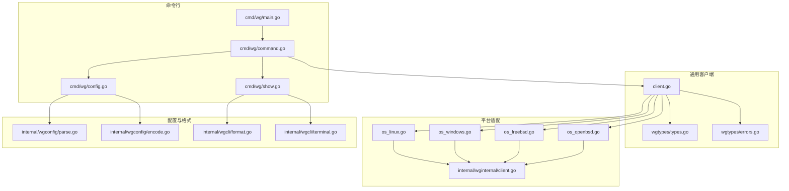
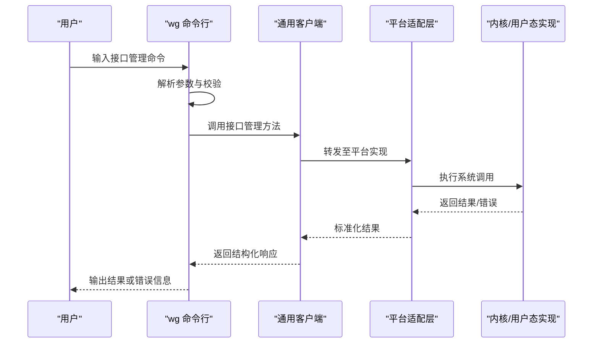
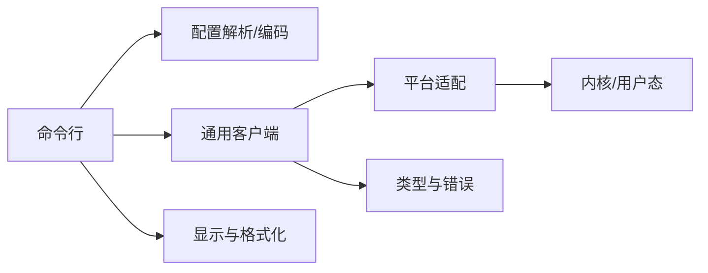
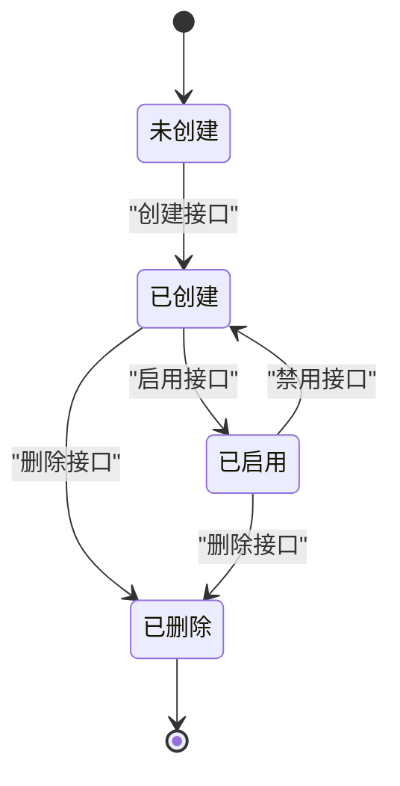

# 接口管理命令

<cite>
**本文引用的文件**
- [README.md](file://README.md)
- [readme_cn.md](file://readme_cn.md)
- [cmd/wg/main.go](file://cmd/wg/main.go)
- [cmd/wg/command.go](file://cmd/wg/command.go)
- [cmd/wg/config.go](file://cmd/wg/config.go)
- [cmd/wg/show.go](file://cmd/wg/show.go)
- [internal/wgcli/format.go](file://internal/wgcli/format.go)
- [internal/wgcli/terminal.go](file://internal/wgcli/terminal.go)
- [internal/wgconfig/parse.go](file://internal/wgconfig/parse.go)
- [internal/wgconfig/encode.go](file://internal/wgconfig/encode.go)
- [client.go](file://client.go)
- [wgtypes/types.go](file://wgtypes/types.go)
- [wgtypes/errors.go](file://wgtypes/errors.go)
- [internal/wginternal/client.go](file://internal/wginternal/client.go)
- [os_linux.go](file://os_linux.go)
- [os_windows.go](file://os_windows.go)
- [os_freebsd.go](file://os_freebsd.go)
- [os_openbsd.go](file://os_openbsd.go)
</cite>

## 目录
1. [简介](#简介)
2. [项目结构](#项目结构)
3. [核心组件](#核心组件)
4. [架构总览](#架构总览)
5. [详细组件分析](#详细组件分析)
6. [依赖关系分析](#依赖关系分析)
7. [性能考虑](#性能考虑)
8. [故障排查指南](#故障排查指南)
9. [结论](#结论)
10. [附录](#附录)

## 简介
本文件面向使用 wgctrl-go 的运维与开发者，系统化说明“接口管理”相关命令的使用方式、参数选项、返回值与执行结果，覆盖接口的创建、删除、启用、禁用等生命周期操作。文档同时提供常见场景示例（如新建接口、修改配置、清理废弃接口），并解释状态转换与错误处理机制，帮助读者在 Linux、Windows、FreeBSD、OpenBSD 等多平台上正确管理与维护 WireGuard 接口。

## 项目结构
仓库采用分层组织：命令行入口位于 cmd/wg；通用客户端能力集中在 client.go；平台差异通过 os_*.go 分发到 internal/* 下的具体实现；类型定义与错误定义位于 wgtypes；配置解析与编码位于 internal/wgconfig；终端输出格式化位于 internal/wgcli。

图表来源
- [cmd/wg/main.go:1-200](file://cmd/wg/main.go#L1-L200)
- [cmd/wg/command.go:1-200](file://cmd/wg/command.go#L1-L200)
- [client.go:1-200](file://client.go#L1-L200)
- [os_linux.go:1-200](file://os_linux.go#L1-L200)
- [os_windows.go:1-200](file://os_windows.go#L1-L200)
- [os_freebsd.go:1-200](file://os_freebsd.go#L1-L200)
- [os_openbsd.go:1-200](file://os_openbsd.go#L1-L200)
- [internal/wginternal/client.go:1-200](file://internal/wginternal/client.go#L1-L200)
- [internal/wgconfig/parse.go:1-200](file://internal/wgconfig/parse.go#L1-L200)
- [internal/wgconfig/encode.go:1-200](file://internal/wgconfig/encode.go#L1-L200)
- [internal/wgcli/format.go:1-200](file://internal/wgcli/format.go#L1-L200)
- [internal/wgcli/terminal.go:1-200](file://internal/wgcli/terminal.go#L1-L200)

章节来源
- [README.md:1-200](file://README.md#L1-L200)
- [readme_cn.md:1-200](file://readme_cn.md#L1-L200)

## 核心组件
- 命令行入口与路由：负责解析子命令（如 show、up/down、create/delete 等）并调用对应处理器。
- 通用客户端：封装对底层系统调用的统一访问，屏蔽平台差异。
- 平台适配层：将通用请求映射到各系统的内核或用户态实现。
- 配置解析与编码：将配置文件/CLI 参数转换为内部结构，或将内部结构编码为可持久化格式。
- 类型与错误：统一定义接口属性、状态、以及错误码与错误语义。

章节来源
- [cmd/wg/main.go:1-200](file://cmd/wg/main.go#L1-L200)
- [cmd/wg/command.go:1-200](file://cmd/wg/command.go#L1-L200)
- [client.go:1-200](file://client.go#L1-L200)
- [wgtypes/types.go:1-200](file://wgtypes/types.go#L1-L200)
- [wgtypes/errors.go:1-200](file://wgtypes/errors.go#L1-L200)

## 架构总览
下图展示了从 CLI 到平台内核/用户态的完整调用链，以及配置解析与输出的位置。

图表来源
- [cmd/wg/main.go:1-200](file://cmd/wg/main.go#L1-L200)
- [cmd/wg/command.go:1-200](file://cmd/wg/command.go#L1-L200)
- [client.go:1-200](file://client.go#L1-L200)
- [os_linux.go:1-200](file://os_linux.go#L1-L200)
- [os_windows.go:1-200](file://os_windows.go#L1-L200)
- [os_freebsd.go:1-200](file://os_freebsd.go#L1-L200)
- [os_openbsd.go:1-200](file://os_openbsd.go#L1-L200)

## 详细组件分析

### 命令行与子命令路由
- 作用：解析全局选项与子命令，分派到具体处理器；支持 show、up/down、create/delete 等接口管理命令。
- 关键点：参数校验、默认值填充、错误提示与退出码。

章节来源
- [cmd/wg/main.go:1-200](file://cmd/wg/main.go#L1-L200)
- [cmd/wg/command.go:1-200](file://cmd/wg/command.go#L1-L200)

### 配置解析与编码
- 作用：将配置文件或 CLI 参数解析为内部结构；将内部结构编码为可持久化的配置文本。
- 关键点：字段合法性检查、缺失必填项报错、兼容不同版本配置。

章节来源
- [internal/wgconfig/parse.go:1-200](file://internal/wgconfig/parse.go#L1-L200)
- [internal/wgconfig/encode.go:1-200](file://internal/wgconfig/encode.go#L1-L200)
- [cmd/wg/config.go:1-200](file://cmd/wg/config.go#L1-L200)

### 通用客户端与平台适配
- 作用：对外暴露统一的接口管理 API；对内根据运行平台选择具体实现。
- 关键点：跨平台一致性、错误标准化、资源释放。

章节来源
- [client.go:1-200](file://client.go#L1-L200)
- [internal/wginternal/client.go:1-200](file://internal/wginternal/client.go#L1-L200)
- [os_linux.go:1-200](file://os_linux.go#L1-L200)
- [os_windows.go:1-200](file://os_windows.go#L1-L200)
- [os_freebsd.go:1-200](file://os_freebsd.go#L1-L200)
- [os_openbsd.go:1-200](file://os_openbsd.go#L1-L200)

### 类型与错误
- 作用：统一定义接口属性、状态枚举、错误类型与错误码。
- 关键点：错误分类（参数错误、权限不足、系统调用失败）、可恢复与不可恢复错误区分。

章节来源
- [wgtypes/types.go:1-200](file://wgtypes/types.go#L1-L200)
- [wgtypes/errors.go:1-200](file://wgtypes/errors.go#L1-L200)

### 显示与格式化
- 作用：将查询结果以人类可读的方式输出；支持表格、键值对等格式。
- 关键点：终端检测、列宽自适应、颜色开关。

章节来源
- [cmd/wg/show.go:1-200](file://cmd/wg/show.go#L1-L200)
- [internal/wgcli/format.go:1-200](file://internal/wgcli/format.go#L1-L200)
- [internal/wgcli/terminal.go:1-200](file://internal/wgcli/terminal.go#L1-L200)

## 依赖关系分析
- 命令行依赖配置解析与客户端；客户端依赖平台适配；平台适配依赖内核/用户态实现；显示模块依赖格式化与终端能力。
- 类型与错误被多处复用，保证一致性与可维护性。

图表来源
- [cmd/wg/main.go:1-200](file://cmd/wg/main.go#L1-L200)
- [cmd/wg/command.go:1-200](file://cmd/wg/command.go#L1-L200)
- [client.go:1-200](file://client.go#L1-L200)
- [os_linux.go:1-200](file://os_linux.go#L1-L200)
- [wgtypes/types.go:1-200](file://wgtypes/types.go#L1-L200)
- [wgtypes/errors.go:1-200](file://wgtypes/errors.go#L1-L200)

## 性能考虑
- 批量操作：尽量合并多次系统调用，减少上下文切换与锁竞争。
- 配置缓存：对频繁读取的配置进行内存缓存，避免重复解析。
- 输出优化：大表输出时按需分页或限制列数，降低终端渲染开销。
- 并发安全：确保同一接口在同一时刻仅被一个写操作修改，避免竞态。

[本节为通用指导，不直接分析具体文件]

## 故障排查指南
- 权限问题：确认当前用户具备修改网络接口的权限（如 Linux 下 root）。
- 参数错误：检查必填字段是否缺失、值域是否合法（如 IP、端口、密钥格式）。
- 系统调用失败：查看底层错误码，定位是内核不支持、驱动异常还是资源占用。
- 状态不一致：若接口状态与预期不符，先查询当前状态，再重试操作。
- 日志与调试：开启更详细的日志级别，结合平台工具（如 ip、netsh、ifconfig）交叉验证。

章节来源
- [wgtypes/errors.go:1-200](file://wgtypes/errors.go#L1-L200)
- [cmd/wg/command.go:1-200](file://cmd/wg/command.go#L1-L200)

## 结论
wgctrl-go 提供了跨平台的 WireGuard 接口管理能力。通过统一的命令行与客户端抽象，用户可以便捷地完成接口的创建、删除、启用、禁用与配置更新。理解其架构与错误模型有助于在生产环境中稳定地管理接口生命周期。

[本节为总结，不直接分析具体文件]

## 附录

### 接口生命周期与状态转换
- 典型状态：未创建、已创建、已启用、已禁用、已删除。
- 转换规则：
  - 创建后处于“已创建”但未启用；
  - 启用后进入“已启用”，开始收发流量；
  - 禁用后回到“已创建”但不可用；
  - 删除后彻底移除接口对象。

[此图为概念示意，不绑定具体源码文件]

### 常见操作流程与命令参考

- 创建新接口
  - 步骤：准备配置（名称、监听端口、私钥、对等体等）→ 调用创建命令 → 验证状态。
  - 关键参数：接口名、监听地址/端口、私钥、对等体公钥/端点/允许 IP 等。
  - 返回值：成功返回接口标识或空；失败返回错误码与原因。
  - 结果：接口处于“已创建”状态，需显式启用。

- 修改接口配置
  - 步骤：查询当前配置 → 增量修改（如添加/移除对等体、更新 MTU、更改监听端口）→ 应用配置 → 验证生效。
  - 注意：部分属性可能要求接口处于特定状态才能修改。

- 启用/禁用接口
  - 启用：将接口置于活跃状态，开始处理流量。
  - 禁用：停止流量处理，保留配置以便后续启用。

- 删除不再使用的接口
  - 步骤：确认无流量与依赖 → 删除接口 → 清理本地配置备份（如有）。
  - 注意：删除前建议先禁用，避免残留会话。

- 查询接口状态与统计
  - 用途：确认接口状态、对等体连接情况、数据量统计等。
  - 输出：表格或键值对形式，便于自动化脚本解析。

章节来源
- [cmd/wg/command.go:1-200](file://cmd/wg/command.go#L1-L200)
- [cmd/wg/show.go:1-200](file://cmd/wg/show.go#L1-L200)
- [internal/wgconfig/parse.go:1-200](file://internal/wgconfig/parse.go#L1-L200)
- [internal/wgconfig/encode.go:1-200](file://internal/wgconfig/encode.go#L1-L200)
- [client.go:1-200](file://client.go#L1-L200)

### 错误处理机制
- 参数校验失败：返回明确的参数错误，提示缺失或非法字段。
- 权限不足：提示需要提升权限（如 sudo/root）。
- 系统调用失败：返回底层错误码，便于定位内核/驱动问题。
- 状态冲突：当接口处于不允许的状态时拒绝操作，并给出建议。

章节来源
- [wgtypes/errors.go:1-200](file://wgtypes/errors.go#L1-L200)
- [cmd/wg/command.go:1-200](file://cmd/wg/command.go#L1-L200)

### 平台差异与注意事项
- Linux：通常通过 netlink 与内核交互，需 root 权限。
- Windows：通过 NDIS/NetCfg 接口管理，可能需要管理员权限。
- FreeBSD/OpenBSD：通过各自的内核接口或用户态代理实现。

章节来源
- [os_linux.go:1-200](file://os_linux.go#L1-L200)
- [os_windows.go:1-200](file://os_windows.go#L1-L200)
- [os_freebsd.go:1-200](file://os_freebsd.go#L1-L200)
- [os_openbsd.go:1-200](file://os_openbsd.go#L1-L200)