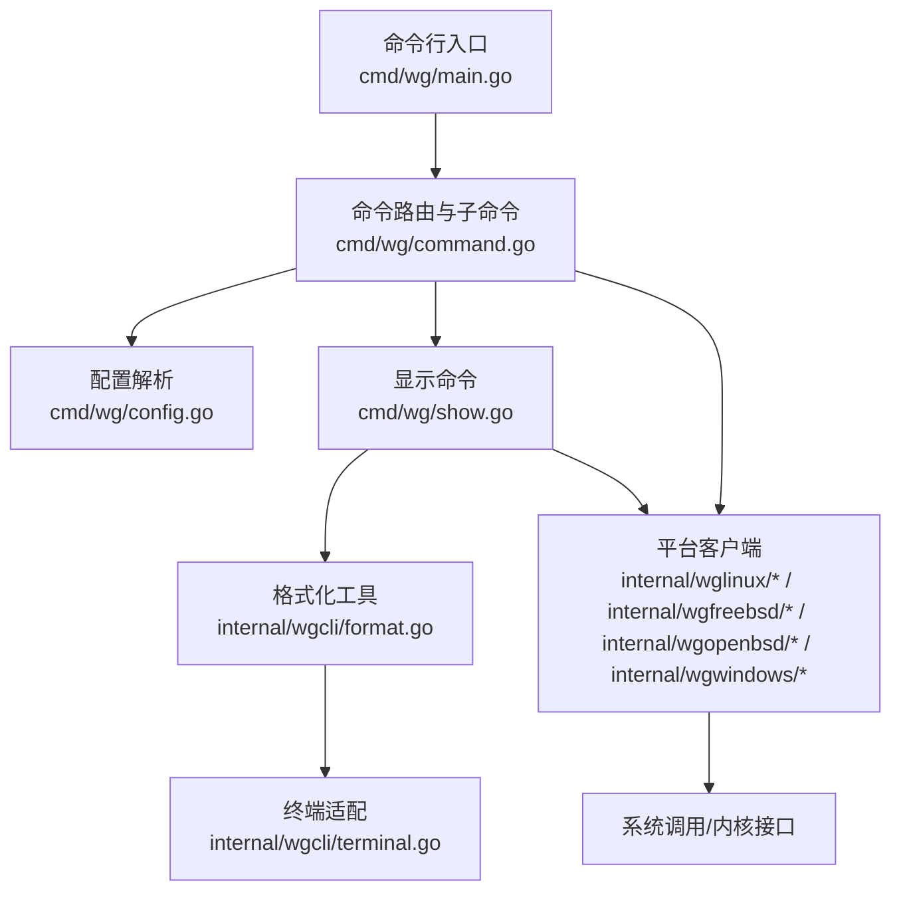
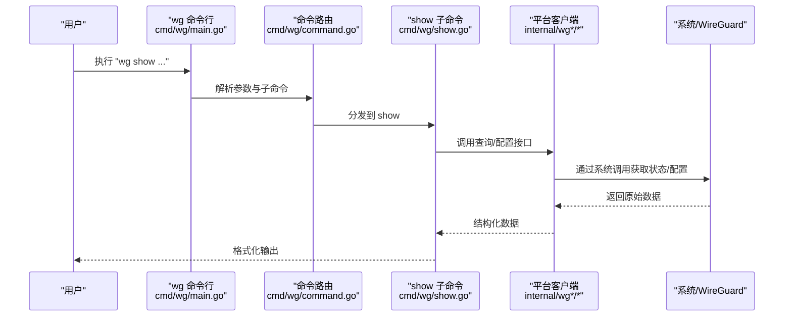
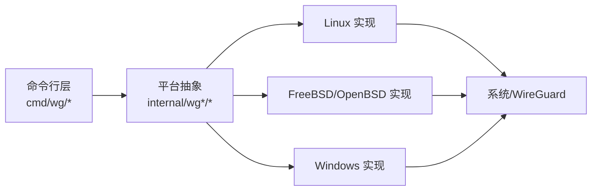

# 调试和诊断工具

<cite>
**本文引用的文件**
- [README.md](file://README.md)
- [readme_cn.md](file://readme_cn.md)
- [cmd/wg/main.go](file://cmd/wg/main.go)
- [cmd/wg/command.go](file://cmd/wg/command.go)
- [cmd/wg/config.go](file://cmd/wg/config.go)
- [cmd/wg/show.go](file://cmd/wg/show.go)
- [internal/wgcli/format.go](file://internal/wgcli/format.go)
- [internal/wgcli/terminal.go](file://internal/wgcli/terminal.go)
- [internal/wglinux/client_linux.go](file://internal/wglinux/client_linux.go)
- [internal/wglinux/configure_linux.go](file://internal/wglinux/configure_linux.go)
- [internal/wglinux/parse_linux.go](file://internal/wglinux/parse_linux.go)
- [internal/wgfreebsd/client_freebsd.go](file://internal/wgfreebsd/client_freebsd.go)
- [internal/wgopenbsd/client_openbsd.go](file://internal/wgopenbsd/client_openbsd.go)
- [internal/wgwindows/client_windows.go](file://internal/wgwindows/client_windows.go)
- [wgtypes/errors.go](file://wgtypes/errors.go)
- [client.go](file://client.go)
</cite>

## 目录
1. [简介](#简介)
2. [项目结构](#项目结构)
3. [核心组件](#核心组件)
4. [架构总览](#架构总览)
5. [详细组件分析](#详细组件分析)
6. [依赖关系分析](#依赖关系分析)
7. [性能考虑](#性能考虑)
8. [故障排查指南](#故障排查指南)
9. [结论](#结论)
10. [附录](#附录)

## 简介
本参考文档聚焦于 wgctrl-go 的调试与诊断能力，覆盖以下主题：
- 如何启用调试模式与调试输出选项
- 日志级别控制、性能监控和网络诊断功能的使用要点
- 如何使用内置的诊断命令进行问题定位
- 常见问题排查步骤与解决方案
- 性能分析与瓶颈识别方法
- 如何收集与分析调试信息以协助问题定位

本项目提供跨平台（Linux、FreeBSD、OpenBSD、Windows）的 WireGuard 用户态/内核态客户端封装，并通过命令行工具 wg 暴露常用诊断能力。

## 项目结构
从调试与诊断视角看，关键入口与模块如下：
- 命令行入口与参数解析：cmd/wg/main.go、cmd/wg/command.go、cmd/wg/config.go
- 显示与格式化：cmd/wg/show.go、internal/wgcli/format.go、internal/wgcli/terminal.go
- 平台客户端实现：internal/wglinux/*、internal/wgfreebsd/*、internal/wgopenbsd/*、internal/wgwindows/*
- 类型与错误：wgtypes/errors.go
- 顶层客户端接口：client.go

图表来源
- [cmd/wg/main.go:1-200](file://cmd/wg/main.go#L1-L200)
- [cmd/wg/command.go:1-200](file://cmd/wg/command.go#L1-L200)
- [cmd/wg/config.go:1-200](file://cmd/wg/config.go#L1-L200)
- [cmd/wg/show.go:1-200](file://cmd/wg/show.go#L1-L200)
- [internal/wgcli/format.go:1-200](file://internal/wgcli/format.go#L1-L200)
- [internal/wgcli/terminal.go:1-200](file://internal/wgcli/terminal.go#L1-L200)
- [internal/wglinux/client_linux.go:1-200](file://internal/wglinux/client_linux.go#L1-L200)

章节来源
- [cmd/wg/main.go:1-200](file://cmd/wg/main.go#L1-L200)
- [cmd/wg/command.go:1-200](file://cmd/wg/command.go#L1-L200)
- [cmd/wg/config.go:1-200](file://cmd/wg/config.go#L1-L200)
- [cmd/wg/show.go:1-200](file://cmd/wg/show.go#L1-L200)
- [internal/wgcli/format.go:1-200](file://internal/wgcli/format.go#L1-L200)
- [internal/wgcli/terminal.go:1-200](file://internal/wgcli/terminal.go#L1-L200)
- [internal/wglinux/client_linux.go:1-200](file://internal/wglinux/client_linux.go#L1-L200)

## 核心组件
- 命令行入口与参数解析：负责启动流程、全局标志解析、子命令分发。
- 显示与格式化：将查询结果渲染为人类可读或机器可读格式，并适配终端特性。
- 平台客户端：封装各平台的 WireGuard 配置读取、状态查询、网络接口操作等。
- 错误与类型：统一的错误类型定义与传输数据结构。

章节来源
- [cmd/wg/main.go:1-200](file://cmd/wg/main.go#L1-L200)
- [cmd/wg/command.go:1-200](file://cmd/wg/command.go#L1-L200)
- [cmd/wg/config.go:1-200](file://cmd/wg/config.go#L1-L200)
- [cmd/wg/show.go:1-200](file://cmd/wg/show.go#L1-L200)
- [internal/wgcli/format.go:1-200](file://internal/wgcli/format.go#L1-L200)
- [internal/wgcli/terminal.go:1-200](file://internal/wgcli/terminal.go#L1-L200)
- [internal/wglinux/client_linux.go:1-200](file://internal/wglinux/client_linux.go#L1-L200)
- [wgtypes/errors.go:1-200](file://wgtypes/errors.go#L1-L200)
- [client.go:1-200](file://client.go#L1-L200)

## 架构总览
下图展示了“wg”命令到平台客户端的调用链，以及数据在显示层的流转过程。

图表来源
- [cmd/wg/main.go:1-200](file://cmd/wg/main.go#L1-L200)
- [cmd/wg/command.go:1-200](file://cmd/wg/command.go#L1-L200)
- [cmd/wg/show.go:1-200](file://cmd/wg/show.go#L1-L200)
- [internal/wglinux/client_linux.go:1-200](file://internal/wglinux/client_linux.go#L1-L200)

## 详细组件分析

### 命令行与调试开关
- 全局标志与调试选项：在命令行入口中集中解析，便于统一开启/关闭调试输出。
- 子命令路由：根据子命令（如 show）选择对应处理逻辑。
- 配置解析：支持从文件或环境变量加载配置，便于在不同环境复用。

建议实践
- 使用全局调试开关配合具体子命令，避免无关输出干扰。
- 将调试输出重定向至文件，便于后续离线分析。

章节来源
- [cmd/wg/main.go:1-200](file://cmd/wg/main.go#L1-L200)
- [cmd/wg/command.go:1-200](file://cmd/wg/command.go#L1-L200)
- [cmd/wg/config.go:1-200](file://cmd/wg/config.go#L1-L200)

### 显示与格式化（show 子命令）
- 数据展示：将底层状态转换为易读文本或结构化格式。
- 终端适配：根据终端能力调整输出样式与分页行为。
- 可测试性：格式化逻辑与终端解耦，便于单元测试与自动化比对。

建议实践
- 在脚本化场景中优先使用结构化输出，减少解析成本。
- 对大输出启用分页或限制字段，避免终端卡顿。

章节来源
- [cmd/wg/show.go:1-200](file://cmd/wg/show.go#L1-L200)
- [internal/wgcli/format.go:1-200](file://internal/wgcli/format.go#L1-L200)
- [internal/wgcli/terminal.go:1-200](file://internal/wgcli/terminal.go#L1-L200)

### 平台客户端（Linux/FreeBSD/OpenBSD/Windows）
- Linux：通过 netlink/procfs 等机制读取 WireGuard 接口状态与配置。
- FreeBSD/OpenBSD：通过系统提供的管理接口访问 WireGuard 状态。
- Windows：通过系统 API 与驱动交互，获取接口信息与统计。

建议实践
- 针对大流量场景，关注统计计数器的溢出与精度。
- 在高并发查询时注意锁与资源释放，避免阻塞。

章节来源
- [internal/wglinux/client_linux.go:1-200](file://internal/wglinux/client_linux.go#L1-L200)
- [internal/wglinux/configure_linux.go:1-200](file://internal/wglinux/configure_linux.go#L1-L200)
- [internal/wglinux/parse_linux.go:1-200](file://internal/wglinux/parse_linux.go#L1-L200)
- [internal/wgfreebsd/client_freebsd.go:1-200](file://internal/wgfreebsd/client_freebsd.go#L1-L200)
- [internal/wgopenbsd/client_openbsd.go:1-200](file://internal/wgopenbsd/client_openbsd.go#L1-L200)
- [internal/wgwindows/client_windows.go:1-200](file://internal/wgwindows/client_windows.go#L1-L200)

### 错误与类型
- 统一错误类型：便于上层捕获、分类与提示。
- 数据结构：定义接口、对端、统计等核心实体，保证跨平台一致性。

建议实践
- 在日志中附带上下文（如接口名、对端标识），提升排障效率。
- 区分可恢复与不可恢复错误，指导重试策略。

章节来源
- [wgtypes/errors.go:1-200](file://wgtypes/errors.go#L1-L200)
- [client.go:1-200](file://client.go#L1-L200)

## 依赖关系分析
- 低耦合：命令行层仅依赖平台客户端抽象，屏蔽差异。
- 高内聚：平台客户端内部聚合系统调用与解析逻辑。
- 可扩展：新增平台只需实现相应客户端接口。

图表来源
- [cmd/wg/command.go:1-200](file://cmd/wg/command.go#L1-L200)
- [internal/wglinux/client_linux.go:1-200](file://internal/wglinux/client_linux.go#L1-L200)
- [internal/wgfreebsd/client_freebsd.go:1-200](file://internal/wgfreebsd/client_freebsd.go#L1-L200)
- [internal/wgopenbsd/client_openbsd.go:1-200](file://internal/wgopenbsd/client_openbsd.go#L1-L200)
- [internal/wgwindows/client_windows.go:1-200](file://internal/wgwindows/client_windows.go#L1-L200)

章节来源
- [cmd/wg/command.go:1-200](file://cmd/wg/command.go#L1-L200)
- [internal/wglinux/client_linux.go:1-200](file://internal/wglinux/client_linux.go#L1-L200)
- [internal/wgfreebsd/client_freebsd.go:1-200](file://internal/wgfreebsd/client_freebsd.go#L1-L200)
- [internal/wgopenbsd/client_openbsd.go:1-200](file://internal/wgopenbsd/client_openbsd.go#L1-L200)
- [internal/wgwindows/client_windows.go:1-200](file://internal/wgwindows/client_windows.go#L1-L200)

## 性能考虑
- 查询频率：避免高频轮询导致系统调用开销过大；必要时合并查询或降低采样率。
- 输出大小：对大输出进行过滤或分页，减少 I/O 与渲染压力。
- 统计精度：关注计数器溢出与单位换算，确保指标解读正确。
- 并发安全：确保多 goroutine 并发查询时的锁粒度合理，避免争用。

[本节为通用性能建议，不直接引用具体文件]

## 故障排查指南

### 启用调试与收集日志
- 启用调试：通过命令行全局标志开启调试输出，以便记录更详细的执行路径与中间状态。
- 输出选项：结合子命令的输出选项，控制输出格式与字段范围，便于快速定位问题。
- 日志收集：将调试输出重定向到文件，保留时间戳与上下文，便于后续离线分析。

章节来源
- [cmd/wg/main.go:1-200](file://cmd/wg/main.go#L1-L200)
- [cmd/wg/command.go:1-200](file://cmd/wg/command.go#L1-L200)
- [cmd/wg/config.go:1-200](file://cmd/wg/config.go#L1-L200)

### 使用内置诊断命令
- 查看接口与对端状态：使用 show 子命令获取当前接口、对端、统计等信息。
- 格式化输出：根据需要选择人类可读或结构化输出，便于脚本化处理。
- 终端适配：在受限终端环境下自动降级输出，保证可用性。

章节来源
- [cmd/wg/show.go:1-200](file://cmd/wg/show.go#L1-L200)
- [internal/wgcli/format.go:1-200](file://internal/wgcli/format.go#L1-L200)
- [internal/wgcli/terminal.go:1-200](file://internal/wgcli/terminal.go#L1-L200)

### 常见问题的调试步骤
- 无法列出接口：检查权限与平台客户端初始化；确认系统是否加载 WireGuard 模块/驱动。
- 对端状态异常：核对密钥、端口、存活检测与 NAT 穿透设置；观察统计计数变化。
- 性能下降：检查丢包、重传、MTU 设置与队列深度；对比不同负载下的统计趋势。
- 跨平台差异：对照各平台客户端实现差异，确认系统调用返回值与错误码含义。

章节来源
- [internal/wglinux/client_linux.go:1-200](file://internal/wglinux/client_linux.go#L1-L200)
- [internal/wgfreebsd/client_freebsd.go:1-200](file://internal/wgfreebsd/client_freebsd.go#L1-L200)
- [internal/wgopenbsd/client_openbsd.go:1-200](file://internal/wgopenbsd/client_openbsd.go#L1-L200)
- [internal/wgwindows/client_windows.go:1-200](file://internal/wgwindows/client_windows.go#L1-L200)
- [wgtypes/errors.go:1-200](file://wgtypes/errors.go#L1-L200)

### 性能分析与瓶颈识别
- 采集基线：在无业务负载下采集接口统计，建立性能基线。
- 增量对比：在业务负载前后对比统计差值，识别异常增长项。
- 热点定位：结合系统级工具（如 CPU/内存/IO 监控）与 wg 统计，定位瓶颈点。
- 回归验证：修复后复测相同场景，确认性能回退未发生。

[本节为通用分析方法，不直接引用具体文件]

### 收集与分析调试信息的最佳实践
- 标准化采集：固定命令组合与输出格式，便于横向对比。
- 上下文标注：在日志中加入时间、主机名、接口名、对端标识等上下文。
- 分层归档：按时间与环境维度归档，便于回溯与关联分析。
- 自动化处理：编写脚本对输出进行清洗、聚合与可视化。

[本节为通用方法论，不直接引用具体文件]

## 结论
wgctrl-go 提供了跨平台的 WireGuard 诊断能力，通过命令行入口、显示格式化与平台客户端三层协作，能够高效完成问题定位与性能分析。建议在生产环境中：
- 启用适度调试与结构化输出
- 定期采集基线与快照
- 结合系统监控进行交叉验证
- 建立标准化的排障流程与知识库

[本节为总结性内容，不直接引用具体文件]

## 附录

### 快速上手清单
- 启用调试：在命令行入口处开启全局调试标志
- 运行诊断：使用 show 子命令获取接口与对端状态
- 导出结果：将输出重定向到文件并附加时间戳
- 分析指标：关注统计计数变化与错误码
- 复现与回归：在相同条件下重复测试，验证修复效果

章节来源
- [cmd/wg/main.go:1-200](file://cmd/wg/main.go#L1-L200)
- [cmd/wg/show.go:1-200](file://cmd/wg/show.go#L1-L200)
- [wgtypes/errors.go:1-200](file://wgtypes/errors.go#L1-L200)