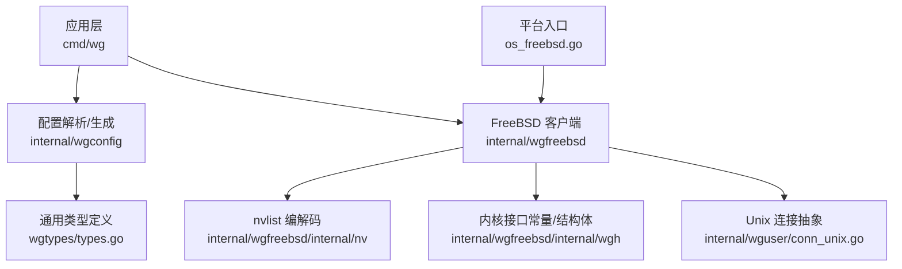
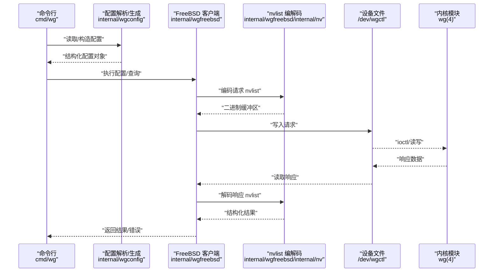
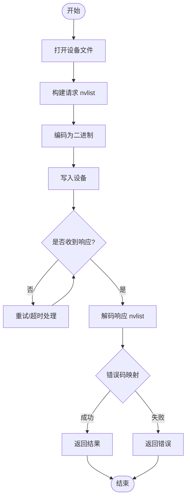
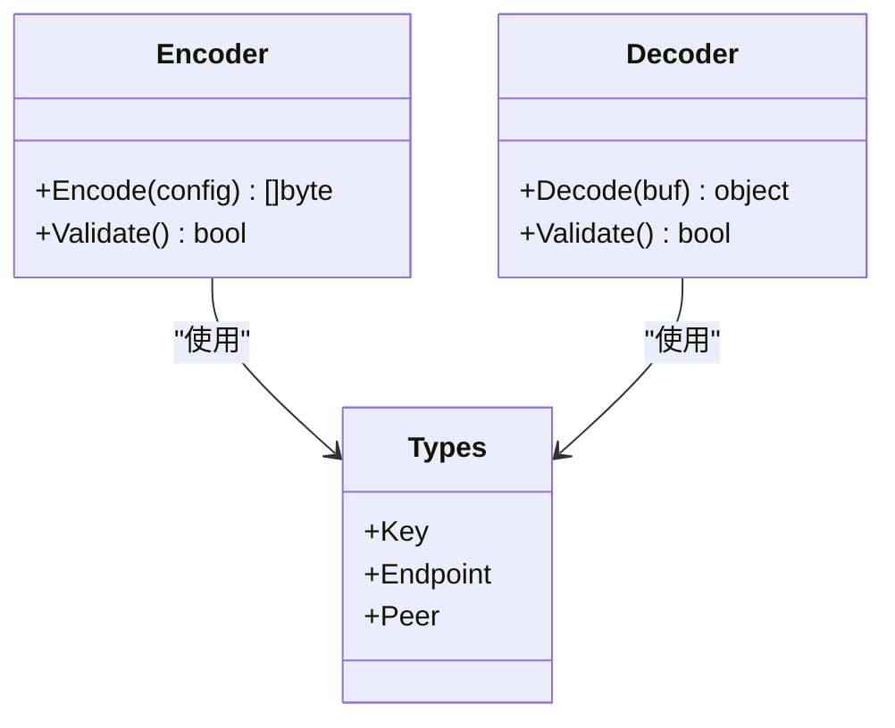
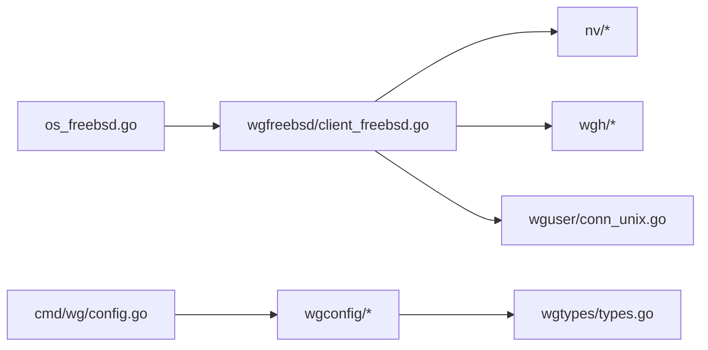

# FreeBSD 平台实现

<cite>
**本文引用的文件**
- [os_freebsd.go](file://os_freebsd.go)
- [internal/wgfreebsd/client_freebsd.go](file://internal/wgfreebsd/client_freebsd.go)
- [internal/wgfreebsd/doc.go](file://internal/wgfreebsd/doc.go)
- [internal/wgfreebsd/internal/nv/decode.go](file://internal/wgfreebsd/internal/nv/decode.go)
- [internal/wgfreebsd/internal/nv/encode.go](file://internal/wgfreebsd/internal/nv/encode.go)
- [internal/wgfreebsd/internal/nv/types.go](file://internal/wgfreebsd/internal/nv/types.go)
- [internal/wgfreebsd/internal/wgh/defs.go](file://internal/wgfreebsd/internal/wgh/defs.go)
- [internal/wgfreebsd/internal/wgh/defs_freebsd_amd64.go](file://internal/wgfreebsd/internal/wgh/defs_freebsd_amd64.go)
- [cmd/wg/config.go](file://cmd/wg/config.go)
- [internal/wgconfig/parse.go](file://internal/wgconfig/parse.go)
- [internal/wgconfig/encode.go](file://internal/wgconfig/encode.go)
- [wgtypes/types.go](file://wgtypes/types.go)
- [internal/wguser/conn_unix.go](file://internal/wguser/conn_unix.go)
</cite>

## 目录
1. [简介](#简介)
2. [项目结构](#项目结构)
3. [核心组件](#核心组件)
4. [架构总览](#架构总览)
5. [详细组件分析](#详细组件分析)
6. [依赖关系分析](#依赖关系分析)
7. [性能考虑](#性能考虑)
8. [故障排除指南](#故障排除指南)
9. [结论](#结论)
10. [附录](#附录)

## 简介
本文件聚焦于 FreeBSD 平台的 WireGuard 控制面实现，围绕内核模块接口、nvlist 数据结构的编解码、用户态与内核态通信协议、FreeBSD 特定的系统调用与设备文件操作、权限控制机制、配置解析与生成、版本兼容性与差异说明、安装配置与故障排除，以及利用 FreeBSD 网络监控工具进行问题诊断等方面进行系统化文档化。目标是帮助读者理解并正确使用该实现，同时为扩展与维护提供清晰的技术参考。

## 项目结构
FreeBSD 相关代码主要位于 internal/wgfreebsd 及其子目录中，并通过顶层 os_freebsd.go 暴露平台选择逻辑；配置解析与生成由 internal/wgconfig 与 cmd/wg 协同完成；通用类型定义在 wgtypes/types.go；Unix 平台通用的连接抽象在 internal/wguser/conn_unix.go。

图表来源
- [os_freebsd.go:1-200](file://os_freebsd.go#L1-L200)
- [internal/wgfreebsd/client_freebsd.go:1-300](file://internal/wgfreebsd/client_freebsd.go#L1-L300)
- [internal/wgfreebsd/internal/nv/decode.go:1-200](file://internal/wgfreebsd/internal/nv/decode.go#L1-L200)
- [internal/wgfreebsd/internal/nv/encode.go:1-200](file://internal/wgfreebsd/internal/nv/encode.go#L1-L200)
- [internal/wgfreebsd/internal/wgh/defs.go:1-200](file://internal/wgfreebsd/internal/wgh/defs.go#L1-L200)
- [cmd/wg/config.go:1-200](file://cmd/wg/config.go#L1-L200)
- [internal/wgconfig/parse.go:1-200](file://internal/wgconfig/parse.go#L1-L200)
- [internal/wgconfig/encode.go:1-200](file://internal/wgconfig/encode.go#L1-L200)
- [wgtypes/types.go:1-200](file://wgtypes/types.go#L1-L200)
- [internal/wguser/conn_unix.go:1-200](file://internal/wguser/conn_unix.go#L1-L200)

章节来源
- [os_freebsd.go:1-200](file://os_freebsd.go#L1-L200)
- [internal/wgfreebsd/doc.go:1-200](file://internal/wgfreebsd/doc.go#L1-L200)

## 核心组件
- 平台选择与入口：os_freebsd.go 负责在 FreeBSD 上选择 wgfreebsd 客户端实现，屏蔽平台差异。
- FreeBSD 客户端：internal/wgfreebsd/client_freebsd.go 封装与内核模块的交互，包括打开设备、发送/接收 nvlist 消息、错误处理与重试策略。
- nvlist 编解码：internal/wgfreebsd/internal/nv/* 提供对内核/用户空间共享的 nvlist 格式的序列化与反序列化，确保字段对齐、字节序与长度一致性。
- 内核接口定义：internal/wgfreebsd/internal/wgh/* 包含 ioctl 命令、数据结构布局等与内核模块对接所需的常量与结构体声明（按架构分文件）。
- 配置解析与生成：internal/wgconfig/* 与 cmd/wg/config.go 将高层配置转换为内核可识别的数据结构，或从内核状态解析回人类可读的配置。
- 通用类型：wgtypes/types.go 定义密钥、端点、对等体等通用模型，供各平台复用。
- Unix 连接抽象：internal/wguser/conn_unix.go 提供基于字符设备的连接能力，用于 FreeBSD 上的设备文件访问。

章节来源
- [os_freebsd.go:1-200](file://os_freebsd.go#L1-L200)
- [internal/wgfreebsd/client_freebsd.go:1-300](file://internal/wgfreebsd/client_freebsd.go#L1-L300)
- [internal/wgfreebsd/internal/nv/decode.go:1-200](file://internal/wgfreebsd/internal/nv/decode.go#L1-L200)
- [internal/wgfreebsd/internal/nv/encode.go:1-200](file://internal/wgfreebsd/internal/nv/encode.go#L1-L200)
- [internal/wgfreebsd/internal/wgh/defs.go:1-200](file://internal/wgfreebsd/internal/wgh/defs.go#L1-L200)
- [internal/wgconfig/parse.go:1-200](file://internal/wgconfig/parse.go#L1-L200)
- [internal/wgconfig/encode.go:1-200](file://internal/wgconfig/encode.go#L1-L200)
- [wgtypes/types.go:1-200](file://wgtypes/types.go#L1-L200)
- [internal/wguser/conn_unix.go:1-200](file://internal/wguser/conn_unix.go#L1-L200)

## 架构总览
下图展示了从命令行到内核模块的完整调用链：命令行通过配置解析生成内核请求，经由 FreeBSD 客户端以 nvlist 形式通过设备文件与内核交互，内核返回状态后再反向解析为用户可见的配置。

图表来源
- [cmd/wg/config.go:1-200](file://cmd/wg/config.go#L1-L200)
- [internal/wgconfig/parse.go:1-200](file://internal/wgconfig/parse.go#L1-L200)
- [internal/wgconfig/encode.go:1-200](file://internal/wgconfig/encode.go#L1-L200)
- [internal/wgfreebsd/client_freebsd.go:1-300](file://internal/wgfreebsd/client_freebsd.go#L1-L300)
- [internal/wgfreebsd/internal/nv/encode.go:1-200](file://internal/wgfreebsd/internal/nv/encode.go#L1-L200)
- [internal/wgfreebsd/internal/nv/decode.go:1-200](file://internal/wgfreebsd/internal/nv/decode.go#L1-L200)

## 详细组件分析

### FreeBSD 客户端与内核通信
- 职责：封装与内核模块的交互，包括打开设备、构建请求、发送/接收数据、错误码映射与重试。
- 关键点：
  - 使用 Unix 平台连接抽象访问字符设备，保证跨平台一致的设备 I/O 行为。
  - 通过 nvlist 进行数据交换，确保字段名、类型与长度与内核一致。
  - 对内核返回的错误进行语义化转换，便于上层处理。

图表来源
- [internal/wgfreebsd/client_freebsd.go:1-300](file://internal/wgfreebsd/client_freebsd.go#L1-L300)
- [internal/wguser/conn_unix.go:1-200](file://internal/wguser/conn_unix.go#L1-L200)
- [internal/wgfreebsd/internal/nv/encode.go:1-200](file://internal/wgfreebsd/internal/nv/encode.go#L1-L200)
- [internal/wgfreebsd/internal/nv/decode.go:1-200](file://internal/wgfreebsd/internal/nv/decode.go#L1-L200)

章节来源
- [internal/wgfreebsd/client_freebsd.go:1-300](file://internal/wgfreebsd/client_freebsd.go#L1-L300)
- [internal/wguser/conn_unix.go:1-200](file://internal/wguser/conn_unix.go#L1-L200)

### nvlist 数据结构编解码
- 职责：将高层配置对象序列化为内核可识别的二进制格式，并将内核响应反序列化为对象。
- 关键点：
  - 严格遵循字段名、类型与长度约定，避免跨版本漂移导致的兼容性问题。
  - 处理嵌套结构与数组，确保边界条件（空值、零长度）正确编码。
  - 针对大小端与对齐进行适配，保证在不同架构下的一致性。

图表来源
- [internal/wgfreebsd/internal/nv/encode.go:1-200](file://internal/wgfreebsd/internal/nv/encode.go#L1-L200)
- [internal/wgfreebsd/internal/nv/decode.go:1-200](file://internal/wgfreebsd/internal/nv/decode.go#L1-L200)
- [internal/wgfreebsd/internal/nv/types.go:1-200](file://internal/wgfreebsd/internal/nv/types.go#L1-L200)
- [wgtypes/types.go:1-200](file://wgtypes/types.go#L1-L200)

章节来源
- [internal/wgfreebsd/internal/nv/encode.go:1-200](file://internal/wgfreebsd/internal/nv/encode.go#L1-L200)
- [internal/wgfreebsd/internal/nv/decode.go:1-200](file://internal/wgfreebsd/internal/nv/decode.go#L1-L200)
- [internal/wgfreebsd/internal/nv/types.go:1-200](file://internal/wgfreebsd/internal/nv/types.go#L1-L200)

### 内核接口常量与结构体（wgh）
- 职责：定义与内核模块交互所需的 ioctl 命令、数据结构布局与常量，按架构分别维护。
- 关键点：
  - 不同架构下的结构体偏移与对齐可能不同，需通过对应 defs_freebsd_*.go 文件精确描述。
  - 保持与内核头文件的同步，必要时通过脚本生成以减少手工维护成本。

章节来源
- [internal/wgfreebsd/internal/wgh/defs.go:1-200](file://internal/wgfreebsd/internal/wgh/defs.go#L1-L200)
- [internal/wgfreebsd/internal/wgh/defs_freebsd_amd64.go:1-200](file://internal/wgfreebsd/internal/wgh/defs_freebsd_amd64.go#L1-L200)

### 配置解析与生成
- 职责：将用户提供的配置文件解析为内部对象，或将内核状态解析为可读配置；同时将内部对象编码为内核可接受的请求。
- 关键点：
  - 支持常见配置项（监听端口、对等体、预共享密钥、保留字段等），并提供校验与默认值填充。
  - 与内核版本兼容性：当内核新增或变更字段时，通过可选字段与降级策略维持向后兼容。

章节来源
- [cmd/wg/config.go:1-200](file://cmd/wg/config.go#L1-L200)
- [internal/wgconfig/parse.go:1-200](file://internal/wgconfig/parse.go#L1-L200)
- [internal/wgconfig/encode.go:1-200](file://internal/wgconfig/encode.go#L1-L200)
- [wgtypes/types.go:1-200](file://wgtypes/types.go#L1-L200)

### 设备文件操作与权限控制
- 职责：通过 Unix 平台连接抽象访问 /dev/wgctl 等设备节点，执行读写与 ioctl 操作。
- 关键点：
  - 权限要求：需要 root 或具备相应设备访问权限的用户组。
  - 错误处理：区分设备不存在、权限不足、内核不支持等错误场景，给出明确提示。

章节来源
- [internal/wguser/conn_unix.go:1-200](file://internal/wguser/conn_unix.go#L1-L200)

## 依赖关系分析
- 平台选择：os_freebsd.go 依赖 wgfreebsd 客户端实现。
- 客户端依赖：nv 编解码、wgh 常量、Unix 连接抽象。
- 配置层：wgconfig 依赖 wgtypes 通用类型，并为 wgfreebsd 提供请求/响应对象。
- 内核接口：wgh 定义与内核模块的契约，需与内核保持一致。

图表来源
- [os_freebsd.go:1-200](file://os_freebsd.go#L1-L200)
- [internal/wgfreebsd/client_freebsd.go:1-200](file://internal/wgfreebsd/client_freebsd.go#L1-L200)
- [internal/wgfreebsd/internal/nv/decode.go:1-200](file://internal/wgfreebsd/internal/nv/decode.go#L1-L200)
- [internal/wgfreebsd/internal/nv/encode.go:1-200](file://internal/wgfreebsd/internal/nv/encode.go#L1-L200)
- [internal/wgfreebsd/internal/wgh/defs.go:1-200](file://internal/wgfreebsd/internal/wgh/defs.go#L1-L200)
- [internal/wgconfig/parse.go:1-200](file://internal/wgconfig/parse.go#L1-L200)
- [internal/wgconfig/encode.go:1-200](file://internal/wgconfig/encode.go#L1-L200)
- [wgtypes/types.go:1-200](file://wgtypes/types.go#L1-L200)
- [cmd/wg/config.go:1-200](file://cmd/wg/config.go#L1-L200)
- [internal/wguser/conn_unix.go:1-200](file://internal/wguser/conn_unix.go#L1-L200)

章节来源
- [os_freebsd.go:1-200](file://os_freebsd.go#L1-L200)
- [internal/wgfreebsd/client_freebsd.go:1-200](file://internal/wgfreebsd/client_freebsd.go#L1-L200)

## 性能考虑
- 减少不必要的内存拷贝：在 nvlist 编解码阶段尽量复用缓冲区，避免频繁分配。
- 批量操作：合并多个配置变更请求，降低设备 I/O 次数。
- 超时与重试：合理设置超时时间，避免阻塞；对瞬态错误进行有限次重试。
- 并发安全：确保对设备连接的并发访问受控，避免竞态条件。

[本节为通用指导，不直接分析具体文件]

## 故障排除指南
- 常见问题定位步骤：
  - 检查设备文件是否存在且权限正确：确认 /dev/wgctl 存在，当前用户具备访问权限。
  - 查看内核日志：使用 dmesg 或 journal 类工具查看内核模块加载与错误信息。
  - 验证配置语法：使用配置解析工具检查配置文件是否正确。
  - 捕获通信错误：关注 nvlist 编解码错误、ioctl 返回值与错误码映射。
- 常用诊断命令（FreeBSD）：
  - ifconfig：查看接口状态与地址。
  - netstat：查看路由与连接统计。
  - sockstat：查看套接字使用情况。
  - dmesg：查看内核日志。
- 建议：
  - 在最小化配置下复现问题，逐步添加配置项定位异常。
  - 记录内核版本与用户态版本，便于排查版本兼容性问题。

章节来源
- [internal/wgfreebsd/client_freebsd.go:1-200](file://internal/wgfreebsd/client_freebsd.go#L1-L200)
- [internal/wgfreebsd/internal/nv/decode.go:1-200](file://internal/wgfreebsd/internal/nv/decode.go#L1-L200)
- [internal/wgfreebsd/internal/nv/encode.go:1-200](file://internal/wgfreebsd/internal/nv/encode.go#L1-L200)

## 结论
本实现通过清晰的层次划分与严格的 nvlist 协议，实现了 FreeBSD 平台上与内核模块的稳定通信。借助统一的配置解析与生成、完善的错误处理与诊断支持，用户可以在不同内核版本间获得一致的体验。建议在升级内核或调整配置时，优先验证 nvlist 字段兼容性与设备权限，结合 FreeBSD 网络监控工具快速定位问题。

[本节为总结性内容，不直接分析具体文件]

## 附录
- 安装与配置要点：
  - 确保内核模块已加载，设备文件可用。
  - 以具备适当权限的用户运行工具，或使用 sudo。
  - 首次使用时建议从最小配置开始，逐步增加对等体与隧道参数。
- 版本兼容性：
  - 若内核新增字段，用户态应支持可选字段与降级策略。
  - 若内核移除或重命名字段，需在用户态进行适配与迁移。
- 调试技巧：
  - 启用详细日志输出，记录请求与响应。
  - 使用抓包工具观察实际网络流量，辅助判断隧道建立与数据传输问题。

[本节为补充信息，不直接分析具体文件]