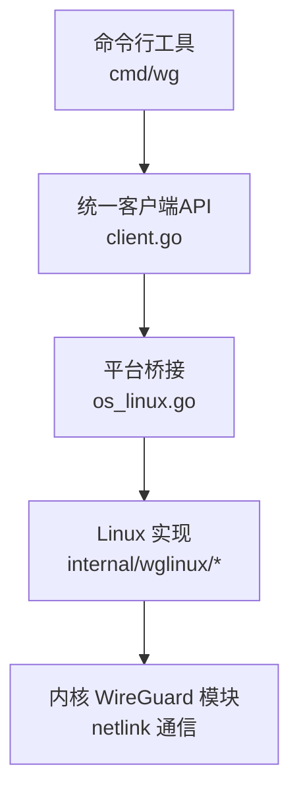
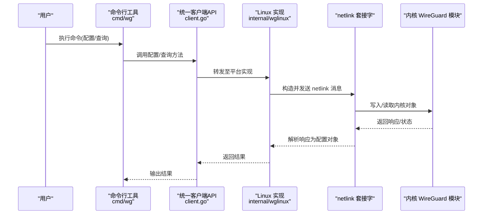
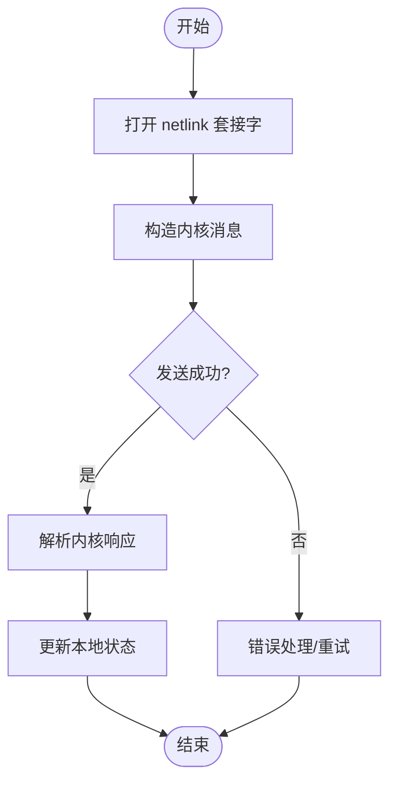
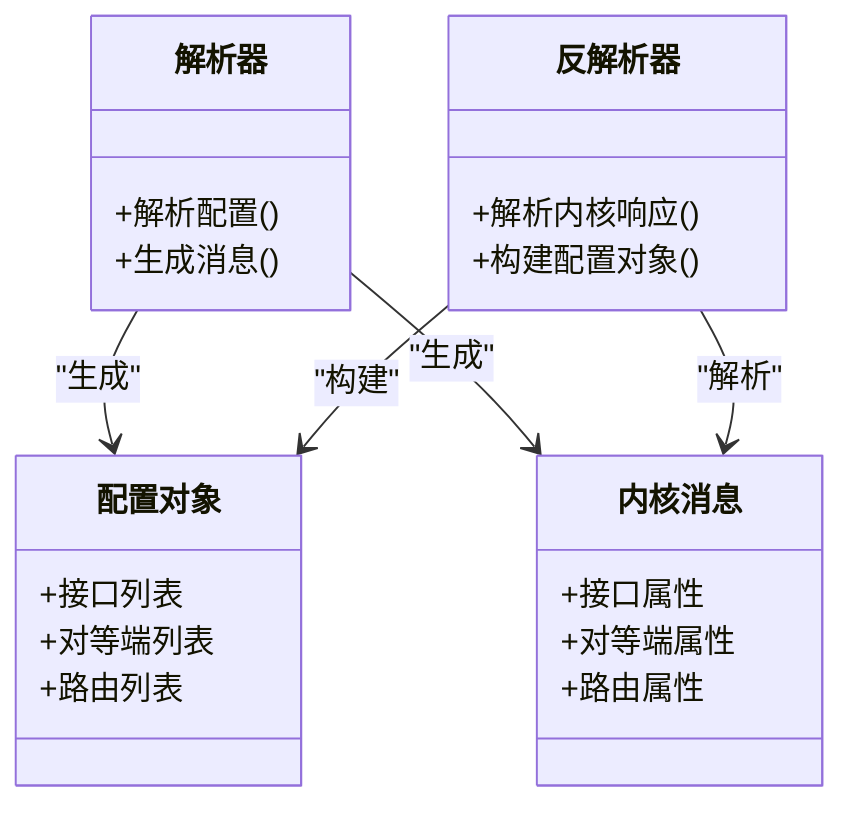
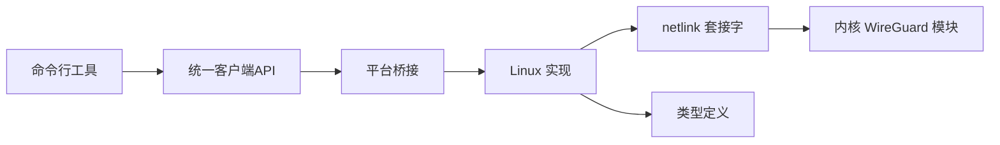

# Linux 平台实现

<cite>
**本文引用的文件**
- [os_linux.go](file://os_linux.go)
- [client.go](file://client.go)
- [internal/wglinux/client_linux.go](file://internal/wglinux/client_linux.go)
- [internal/wglinux/configure_linux.go](file://internal/wglinux/configure_linux.go)
- [internal/wglinux/parse_linux.go](file://internal/wglinux/parse_linux.go)
- [wgtypes/types.go](file://wgtypes/types.go)
- [cmd/wg/command.go](file://cmd/wg/command.go)
- [cmd/wg/show.go](file://cmd/wg/show.go)
</cite>

## 目录
1. [简介](#简介)
2. [项目结构](#项目结构)
3. [核心组件](#核心组件)
4. [架构总览](#架构总览)
5. [详细组件分析](#详细组件分析)
6. [依赖关系分析](#依赖关系分析)
7. [性能考虑](#性能考虑)
8. [故障排查指南](#故障排查指南)
9. [结论](#结论)
10. [附录](#附录)

## 简介
本文件聚焦于 Linux 平台的 WireGuard 控制库实现，重点阐述基于 netlink 的接口管理机制：内核模块通信、配置同步与状态监控。文档涵盖 netlink socket 的使用方式、消息格式与数据交换协议、Linux 特定系统调用、权限要求与内核版本兼容性；并详细说明配置解析与生成（对等节点管理、密钥处理、路由配置）、性能优化技巧、调试方法与常见问题解决方案，以及如何扩展 Linux 平台特定功能。

## 项目结构
本项目采用按平台分层的组织方式，Linux 相关逻辑集中在 internal/wglinux 目录中，并通过顶层 os_linux.go 进行平台选择与导出。高层 client.go 提供跨平台统一 API，内部 wglinux 实现则通过 netlink 与内核 WireGuard 模块交互。命令行工具 cmd/wg 负责将用户意图转化为配置变更或查询请求。

图表来源
- [os_linux.go](file://os_linux.go)
- [client.go](file://client.go)
- [internal/wglinux/client_linux.go](file://internal/wglinux/client_linux.go)
- [internal/wglinux/configure_linux.go](file://internal/wglinux/configure_linux.go)
- [internal/wglinux/parse_linux.go](file://internal/wglinux/parse_linux.go)

章节来源
- [os_linux.go](file://os_linux.go)
- [client.go](file://client.go)
- [internal/wglinux/client_linux.go](file://internal/wglinux/client_linux.go)
- [internal/wglinux/configure_linux.go](file://internal/wglinux/configure_linux.go)
- [internal/wglinux/parse_linux.go](file://internal/wglinux/parse_linux.go)

## 核心组件
- 平台桥接层：根据运行环境选择具体实现，Linux 下导出 netlink 客户端能力。
- 统一客户端 API：对外暴露创建、配置、查询等接口，屏蔽底层差异。
- Linux netlink 客户端：封装 netlink socket 生命周期、消息构造与解析、错误处理。
- 配置编解码：将高层配置对象序列化为内核可识别的消息，或将内核状态反序列化为配置对象。
- 类型定义：对等端、密钥、接口、路由等数据结构定义，供各层共享。

章节来源
- [os_linux.go](file://os_linux.go)
- [client.go](file://client.go)
- [internal/wglinux/client_linux.go](file://internal/wglinux/client_linux.go)
- [internal/wglinux/configure_linux.go](file://internal/wglinux/configure_linux.go)
- [internal/wglinux/parse_linux.go](file://internal/wglinux/parse_linux.go)
- [wgtypes/types.go](file://wgtypes/types.go)

## 架构总览
下图展示了从命令行到内核的完整调用链，包括配置下发与状态查询两个主要流程。

图表来源
- [cmd/wg/command.go](file://cmd/wg/command.go)
- [client.go](file://client.go)
- [internal/wglinux/client_linux.go](file://internal/wglinux/client_linux.go)
- [internal/wglinux/configure_linux.go](file://internal/wglinux/configure_linux.go)
- [internal/wglinux/parse_linux.go](file://internal/wglinux/parse_linux.go)

## 详细组件分析

### Linux netlink 客户端（配置与查询）
- 职责：维护 netlink 套接字，构造并发送配置/查询消息，解析内核返回的数据，封装错误与重试策略。
- 关键流程：
  - 初始化：打开 netlink 套接字，绑定组以接收事件（如接口状态变化）。
  - 配置下发：将高层配置转换为内核消息，批量写入接口、对等端、路由等。
  - 状态查询：发送查询消息，解析接口统计、对等端信息、路由表等。
  - 错误处理：区分权限不足、参数非法、内核不支持等错误，提供可读提示。

图表来源
- [internal/wglinux/client_linux.go](file://internal/wglinux/client_linux.go)
- [internal/wglinux/configure_linux.go](file://internal/wglinux/configure_linux.go)
- [internal/wglinux/parse_linux.go](file://internal/wglinux/parse_linux.go)

章节来源
- [internal/wglinux/client_linux.go](file://internal/wglinux/client_linux.go)
- [internal/wglinux/configure_linux.go](file://internal/wglinux/configure_linux.go)
- [internal/wglinux/parse_linux.go](file://internal/wglinux/parse_linux.go)

### 配置解析与生成（对等节点、密钥、路由）
- 对等节点管理：
  - 解析：将配置中的对等端条目映射为内核消息字段（公钥、预共享密钥、允许 IP、端口、持久保持等）。
  - 生成：将内核返回的对等端状态反序列化为配置对象（包含连接计数、最后握手时间等）。
- 密钥处理：
  - 使用安全存储与内存清理策略，避免敏感信息泄露。
  - 校验密钥长度与格式，确保符合内核期望。
- 路由配置：
  - 支持添加/删除/替换路由，处理冲突与优先级。
  - 与接口地址、对等端 AllowIPs 协同工作。

图表来源
- [internal/wglinux/configure_linux.go](file://internal/wglinux/configure_linux.go)
- [internal/wglinux/parse_linux.go](file://internal/wglinux/parse_linux.go)
- [wgtypes/types.go](file://wgtypes/types.go)

章节来源
- [internal/wglinux/configure_linux.go](file://internal/wglinux/configure_linux.go)
- [internal/wglinux/parse_linux.go](file://internal/wglinux/parse_linux.go)
- [wgtypes/types.go](file://wgtypes/types.go)

### 命令行集成（show 与配置）
- show：调用统一客户端 API 获取接口与对等端状态，格式化输出。
- 配置：将用户输入的配置转换为内核消息并下发，处理部分失败与回滚策略。

章节来源
- [cmd/wg/command.go](file://cmd/wg/command.go)
- [cmd/wg/show.go](file://cmd/wg/show.go)
- [client.go](file://client.go)

## 依赖关系分析
- 上层依赖：
  - 命令行工具依赖统一客户端 API。
  - 统一客户端 API 依赖平台桥接层。
- 平台层依赖：
  - Linux 实现依赖 netlink 套接字与内核 WireGuard 模块。
  - 配置编解码依赖 wgtypes 类型定义。
- 外部依赖：
  - 内核版本需支持相应 netlink 特性（如接口属性、对等端属性、路由操作）。
  - 权限要求：通常需 root 或具备 CAP_NET_ADMIN 能力。

图表来源
- [client.go](file://client.go)
- [os_linux.go](file://os_linux.go)
- [internal/wglinux/client_linux.go](file://internal/wglinux/client_linux.go)
- [wgtypes/types.go](file://wgtypes/types.go)

章节来源
- [client.go](file://client.go)
- [os_linux.go](file://os_linux.go)
- [internal/wglinux/client_linux.go](file://internal/wglinux/client_linux.go)
- [wgtypes/types.go](file://wgtypes/types.go)

## 性能考虑
- 批量化操作：尽量将多个配置变更合并为单次 netlink 消息，减少系统调用次数。
- 增量更新：仅下发变化的配置项，避免全量重写导致抖动。
- 缓存与去重：在应用层缓存接口与对等端状态，减少重复查询。
- 并发控制：对同一接口的并发写操作加锁，避免竞态条件。
- 内存管理：及时释放缓冲区，避免大对象长期驻留内存。
- 超时与重试：合理设置 netlink 操作超时，对瞬态错误进行有限重试。

[本节为通用指导，不直接分析具体文件]

## 故障排查指南
- 权限问题：
  - 现象：无法打开 netlink 套接字或写入失败。
  - 排查：确认进程具备 root 或 CAP_NET_ADMIN 能力。
- 内核版本兼容：
  - 现象：某些属性或操作不可用。
  - 排查：检查内核版本是否支持对应 netlink 特性；必要时降级配置或升级内核。
- 配置错误：
  - 现象：内核拒绝配置或返回参数非法。
  - 排查：校验密钥长度、对等端地址、路由范围等；逐步缩小变更范围定位问题。
- 状态不一致：
  - 现象：本地状态与内核状态不同步。
  - 排查：重新查询接口与对等端状态；检查是否有其他进程修改了配置。
- 日志与调试：
  - 启用更详细的日志输出，记录 netlink 消息与响应。
  - 使用 dmesg 查看内核侧错误信息。

章节来源
- [internal/wglinux/client_linux.go](file://internal/wglinux/client_linux.go)
- [internal/wglinux/configure_linux.go](file://internal/wglinux/configure_linux.go)
- [internal/wglinux/parse_linux.go](file://internal/wglinux/parse_linux.go)

## 结论
本实现通过清晰的层次划分与 netlink 封装，提供了稳定可靠的 Linux 平台 WireGuard 管理能力。配置解析与生成、状态监控与错误处理均围绕内核协议展开，兼顾性能与可维护性。遵循本文的性能建议与故障排查步骤，可有效提升部署稳定性与运维效率。

[本节为总结性内容，不直接分析具体文件]

## 附录
- 扩展 Linux 平台特定功能：
  - 新增内核属性：在配置编解码层增加字段映射，并在解析/生成逻辑中处理。
  - 新增 netlink 操作：在客户端层实现新的消息构造与解析函数。
  - 增强错误处理：细化错误分类与恢复策略，提供更友好的用户提示。
  - 测试覆盖：补充单元测试与集成测试，验证新功能的正确性与兼容性。

[本节为概念性内容，不直接分析具体文件]