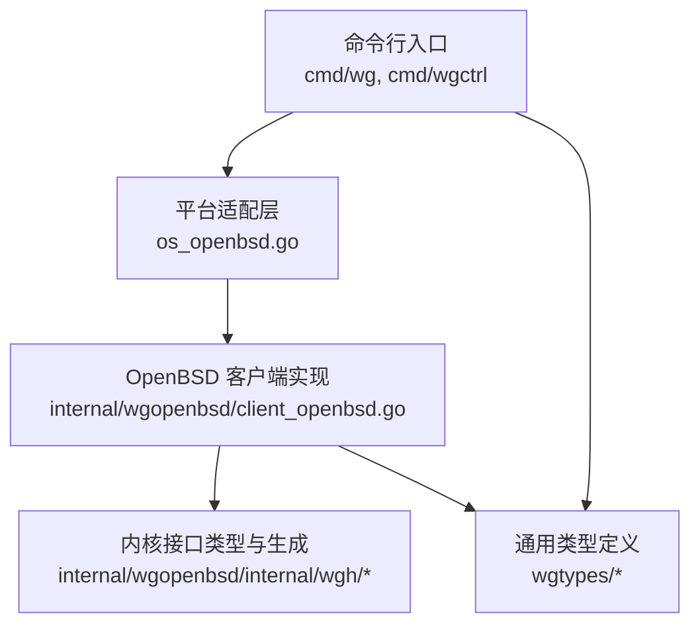
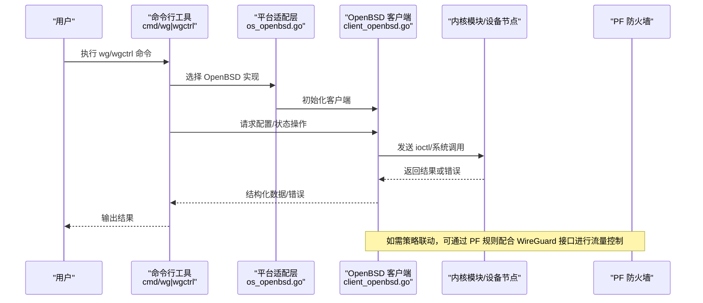
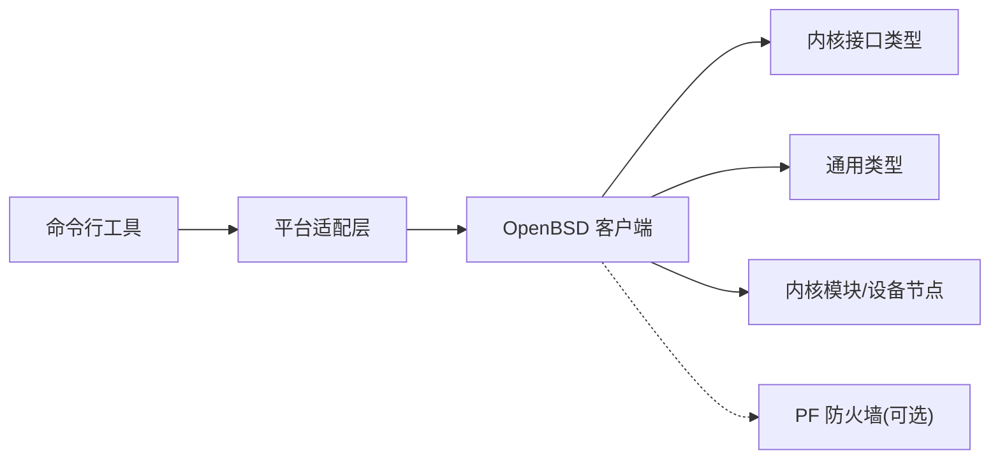

# OpenBSD 平台实现

<cite>
**本文引用的文件**
- [os_openbsd.go](file://os_openbsd.go)
- [client_openbsd.go](file://internal/wgopenbsd/client_openbsd.go)
- [doc.go](file://internal/wgopenbsd/doc.go)
- [defs.go](file://internal/wgopenbsd/internal/wgh/defs.go)
- [defs_openbsd_amd64.go](file://internal/wgopenbsd/internal/wgh/defs_openbsd_amd64.go)
- [generate.sh](file://internal/wgopenbsd/internal/wgh/generate.sh)
- [client_test.go](file://internal/wgopenbsd/client_openbsd_test.go)
- [cmd_wg_main.go](file://cmd/wg/main.go)
- [wgctrl_main.go](file://cmd/wgctrl/main.go)
- [types.go](file://wgtypes/types.go)
- [errors.go](file://wgtypes/errors.go)
- [readme_cn.md](file://readme_cn.md)
</cite>

## 目录
1. [简介](#简介)
2. [项目结构](#项目结构)
3. [核心组件](#核心组件)
4. [架构总览](#架构总览)
5. [详细组件分析](#详细组件分析)
6. [依赖关系分析](#依赖关系分析)
7. [性能考量](#性能考量)
8. [故障排查指南](#故障排查指南)
9. [结论](#结论)
10. [附录](#附录)

## 简介
本文件面向在 OpenBSD 平台上运行与集成 WireGuard 的开发者与运维人员，系统性阐述基于 PF 防火墙与内核模块的接口管理机制、OpenBSD 安全模型与权限控制、内核接口调用路径、配置同步与状态监控实现、版本兼容性处理与安全加固建议、PF 策略配置与网络隔离细节，以及调试、日志与性能监控方法。同时提供从其他 BSD 平台迁移到 OpenBSD 的实践指导。

## 项目结构
仓库采用按平台分层的组织方式：顶层提供平台选择入口，内部子包分别实现各平台的 WireGuard 客户端能力。OpenBSD 相关代码集中在 internal/wgopenbsd 及其内部 wgh 子系统（用于与内核交互的类型定义与生成脚本），并通过 os_openbsd.go 暴露平台适配层。命令行工具 cmd/wg 与 cmd/wgctrl 作为用户态入口，统一调度底层实现。

图表来源
- [os_openbsd.go:1-200](file://os_openbsd.go#L1-L200)
- [client_openbsd.go:1-200](file://internal/wgopenbsd/client_openbsd.go#L1-L200)
- [defs.go:1-200](file://internal/wgopenbsd/internal/wgh/defs.go#L1-L200)
- [types.go:1-200](file://wgtypes/types.go#L1-L200)

章节来源
- [os_openbsd.go:1-200](file://os_openbsd.go#L1-L200)
- [client_openbsd.go:1-200](file://internal/wgopenbsd/client_openbsd.go#L1-L200)
- [cmd_wg_main.go:1-200](file://cmd/wg/main.go#L1-L200)
- [wgctrl_main.go:1-200](file://cmd/wgctrl/main.go#L1-L200)

## 核心组件
- 平台适配层（os_openbsd.go）：负责在 OpenBSD 上选择并初始化 WireGuard 客户端实现，屏蔽平台差异。
- OpenBSD 客户端（client_openbsd.go）：封装对内核模块的 ioctl/系统调用，完成接口创建、配置下发、状态查询等。
- 内核接口类型（internal/wgopenbsd/internal/wgh/*）：通过生成脚本产出与内核 ABI 对齐的结构体与常量，确保跨架构兼容。
- 通用类型（wgtypes/*）：定义跨平台共享的数据结构与错误类型，保证配置与状态的一致性。
- 命令行工具（cmd/wg, cmd/wgctrl）：提供用户友好的命令接口，解析配置并调用底层客户端。

章节来源
- [os_openbsd.go:1-200](file://os_openbsd.go#L1-L200)
- [client_openbsd.go:1-200](file://internal/wgopenbsd/client_openbsd.go#L1-L200)
- [defs.go:1-200](file://internal/wgopenbsd/internal/wgh/defs.go#L1-L200)
- [types.go:1-200](file://wgtypes/types.go#L1-L200)
- [errors.go:1-200](file://wgtypes/errors.go#L1-L200)
- [cmd_wg_main.go:1-200](file://cmd/wg/main.go#L1-L200)
- [wgctrl_main.go:1-200](file://cmd/wgctrl/main.go#L1-L200)

## 架构总览
下图展示了从命令行到内核模块的完整调用链，包括配置下发与状态读取流程。

图表来源
- [cmd_wg_main.go:1-200](file://cmd/wg/main.go#L1-L200)
- [os_openbsd.go:1-200](file://os_openbsd.go#L1-L200)
- [client_openbsd.go:1-200](file://internal/wgopenbsd/client_openbsd.go#L1-L200)

## 详细组件分析

### 平台适配层（os_openbsd.go）
- 职责：在 OpenBSD 上构造并返回 WireGuard 客户端实例，屏蔽平台差异，供上层统一调用。
- 关键点：
  - 根据运行时平台选择具体实现。
  - 初始化必要的资源与上下文。
  - 将错误映射为通用错误类型，便于上层处理。

章节来源
- [os_openbsd.go:1-200](file://os_openbsd.go#L1-L200)

### OpenBSD 客户端（client_openbsd.go）
- 职责：实现与内核模块的交互，包括接口创建、配置写入、状态读取、事件监听等。
- 关键点：
  - 使用内部 wgh 包提供的类型与常量进行 ioctl/系统调用。
  - 将内核返回的状态转换为 wgtypes 定义的通用结构。
  - 处理权限不足、设备不存在、参数非法等错误分支。
  - 支持批量配置与增量更新，减少系统调用次数。

章节来源
- [client_openbsd.go:1-200](file://internal/wgopenbsd/client_openbsd.go#L1-L200)
- [client_test.go:1-200](file://internal/wgopenbsd/client_openbsd_test.go#L1-L200)

### 内核接口类型与生成（internal/wgopenbsd/internal/wgh/*）
- 职责：维护与内核 ABI 对齐的结构体、常量与位掩码，并提供生成脚本以适配不同架构。
- 关键点：
  - defs.go 定义公共接口与数据结构。
  - 架构特定文件（如 defs_openbsd_amd64.go）包含对齐与大小信息。
  - generate.sh 用于从内核头文件或规范生成 Go 绑定，确保跨版本兼容。

章节来源
- [defs.go:1-200](file://internal/wgopenbsd/internal/wgh/defs.go#L1-L200)
- [defs_openbsd_amd64.go:1-200](file://internal/wgopenbsd/internal/wgh/defs_openbsd_amd64.go#L1-L200)
- [generate.sh:1-200](file://internal/wgopenbsd/internal/wgh/generate.sh#L1-L200)

### 通用类型与错误（wgtypes/*）
- 职责：定义跨平台共享的配置、状态与错误类型，确保一致性。
- 关键点：
  - 统一的密钥、端点、路由、统计等数据结构。
  - 标准化的错误分类，便于上层统一处理。

章节来源
- [types.go:1-200](file://wgtypes/types.go#L1-L200)
- [errors.go:1-200](file://wgtypes/errors.go#L1-L200)

### 命令行工具（cmd/wg, cmd/wgctrl）
- 职责：提供用户友好的命令接口，解析配置并调用底层客户端。
- 关键点：
  - 命令路由与参数校验。
  - 将用户输入转换为内部配置对象。
  - 输出格式化与错误提示。

章节来源
- [cmd_wg_main.go:1-200](file://cmd/wg/main.go#L1-L200)
- [wgctrl_main.go:1-200](file://cmd/wgctrl/main.go#L1-L200)

## 依赖关系分析
- 耦合关系：
  - 命令行工具依赖平台适配层，平台适配层依赖 OpenBSD 客户端。
  - OpenBSD 客户端依赖内核接口类型（wgh）与通用类型（wgtypes）。
- 外部依赖：
  - 内核模块/设备节点：提供实际的 WireGuard 功能。
  - PF 防火墙：可选集成，用于策略控制与网络隔离。

图表来源
- [os_openbsd.go:1-200](file://os_openbsd.go#L1-L200)
- [client_openbsd.go:1-200](file://internal/wgopenbsd/client_openbsd.go#L1-L200)
- [defs.go:1-200](file://internal/wgopenbsd/internal/wgh/defs.go#L1-L200)
- [types.go:1-200](file://wgtypes/types.go#L1-L200)

章节来源
- [os_openbsd.go:1-200](file://os_openbsd.go#L1-L200)
- [client_openbsd.go:1-200](file://internal/wgopenbsd/client_openbsd.go#L1-L200)
- [defs.go:1-200](file://internal/wgopenbsd/internal/wgh/defs.go#L1-L200)
- [types.go:1-200](file://wgtypes/types.go#L1-L200)

## 性能考量
- 减少系统调用：批量配置与增量更新可降低 ioctl/系统调用开销。
- 内存与拷贝：避免不必要的结构体复制，尽量复用缓冲区。
- 并发与锁：在高并发场景下合理加锁，避免热点竞争。
- 监控与指标：结合内核与系统工具收集吞吐、丢包、延迟等指标，定位瓶颈。

[本节为通用性能建议，不直接分析具体文件]

## 故障排查指南
- 权限问题：
  - 确认进程具备访问内核设备节点的权限；必要时以特权用户运行或通过最小权限原则配置。
- 设备不可用：
  - 检查内核模块是否加载、设备节点是否存在、名称是否正确。
- 配置错误：
  - 校验密钥格式、端点可达性、路由冲突；参考通用错误类型进行分类处理。
- 日志与调试：
  - 使用系统日志与内核消息定位问题；结合 PF 日志分析策略命中情况。
- 回归测试：
  - 利用单元测试与集成测试覆盖关键路径，确保变更不会引入回归。

章节来源
- [errors.go:1-200](file://wgtypes/errors.go#L1-L200)
- [client_test.go:1-200](file://internal/wgopenbsd/client_openbsd_test.go#L1-L200)

## 结论
本实现通过平台适配层与 OpenBSD 客户端，将用户态命令与内核模块解耦，借助 wgh 生成的类型保证 ABI 兼容，并以 wgtypes 统一数据结构。结合 PF 可实现细粒度策略控制与网络隔离。遵循安全加固与最佳实践，可在 OpenBSD 上稳定高效地运行 WireGuard。

[本节为总结性内容，不直接分析具体文件]

## 附录

### OpenBSD 安全模型与权限控制
- 最小权限原则：仅授予必要权限，限制进程对内核设备节点的访问范围。
- 沙箱与限制：利用 OpenBSD 的安全特性（如 chroot、pledge/unveil）进一步收敛攻击面。
- 审计与日志：开启系统审计与内核日志，记录敏感操作以便追溯。

[本节为概念性说明，不直接分析具体文件]

### PF 防火墙集成与策略配置
- 策略目标：基于 WireGuard 接口进行流量放行、NAT、端口转发与访问控制。
- 实施要点：
  - 明确信任域与隔离域，制定白名单策略。
  - 使用状态表与队列管理提升性能与稳定性。
  - 定期审查规则，避免过度宽松导致安全风险。
- 验证方法：
  - 使用 PF 日志与抓包工具验证策略命中与流量走向。

[本节为概念性说明，不直接分析具体文件]

### 内核接口调用、配置同步与状态监控
- 内核接口：通过 wgh 生成的类型进行 ioctl/系统调用，确保跨架构兼容。
- 配置同步：支持批量下发与增量更新，减少抖动与回滚风险。
- 状态监控：读取统计信息（连接数、字节数、时间戳等），结合系统工具进行可视化。

章节来源
- [defs.go:1-200](file://internal/wgopenbsd/internal/wgh/defs.go#L1-L200)
- [client_openbsd.go:1-200](file://internal/wgopenbsd/client_openbsd.go#L1-L200)
- [types.go:1-200](file://wgtypes/types.go#L1-L200)

### OpenBSD 版本兼容性处理
- 生成脚本：通过 generate.sh 从内核头或规范生成绑定，适配不同架构与版本。
- 条件编译：针对不同版本启用/禁用特性，保持向后兼容。
- 测试矩阵：在多版本环境中执行单元与集成测试，确保稳定性。

章节来源
- [generate.sh:1-200](file://internal/wgopenbsd/internal/wgh/generate.sh#L1-L200)
- [defs_openbsd_amd64.go:1-200](file://internal/wgopenbsd/internal/wgh/defs_openbsd_amd64.go#L1-L200)

### 安全加固建议与最佳实践
- 密钥管理：使用强随机源生成与存储密钥，限制访问权限。
- 网络隔离：通过 PF 严格划分信任域，默认拒绝未授权流量。
- 更新与补丁：及时跟进内核与 PF 的安全更新。
- 审计与演练：定期进行安全审计与应急演练，验证策略有效性。

[本节为通用安全建议，不直接分析具体文件]

### 调试工具、日志分析与性能监控
- 调试工具：结合系统日志、内核消息与抓包工具定位问题。
- 日志分析：关注错误码、超时、重传与丢包指标。
- 性能监控：采集吞吐、延迟、CPU 与内存使用率，识别瓶颈。

[本节为通用运维建议，不直接分析具体文件]

### 从其他 BSD 平台迁移到 OpenBSD 的指导
- 差异点：
  - 内核接口与 ABI 可能不同，需重新生成 wgh 绑定。
  - PF 语法与行为与其他 BSD 存在差异，需调整策略。
- 迁移步骤：
  - 替换平台适配层与客户端实现。
  - 更新生成脚本与架构特定文件。
  - 在 OpenBSD 环境执行全量测试与回归验证。
- 注意事项：
  - 关注权限模型与沙箱机制的差异。
  - 逐步灰度发布，保留回滚方案。

[本节为概念性说明，不直接分析具体文件]

### 参考文档
- 项目中文说明：[readme_cn.md](file://readreadme_cn.md)

章节来源
- [readme_cn.md:1-200](file://readme_cn.md#L1-L200)