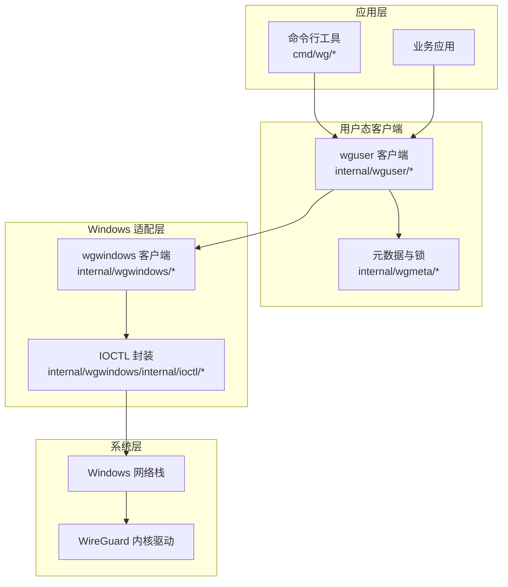
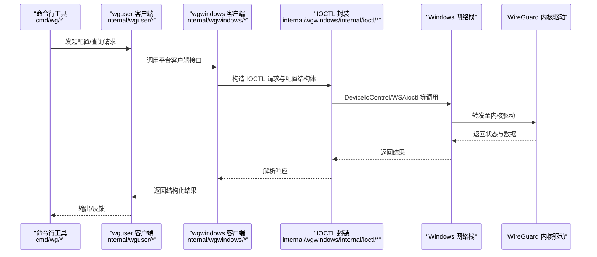
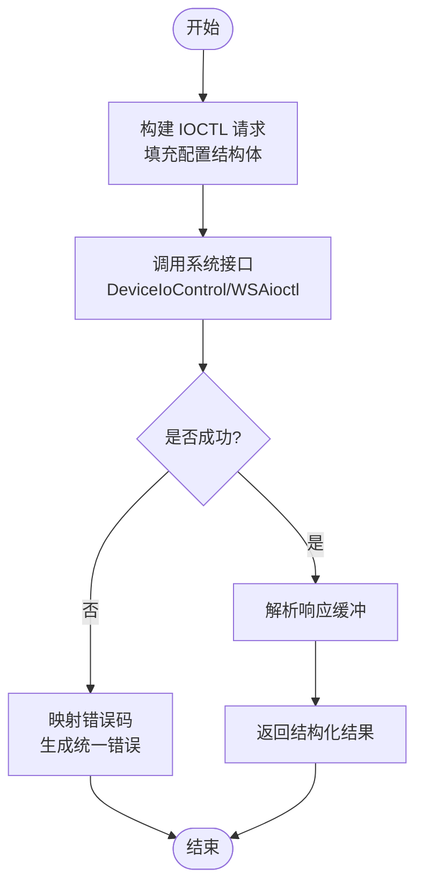
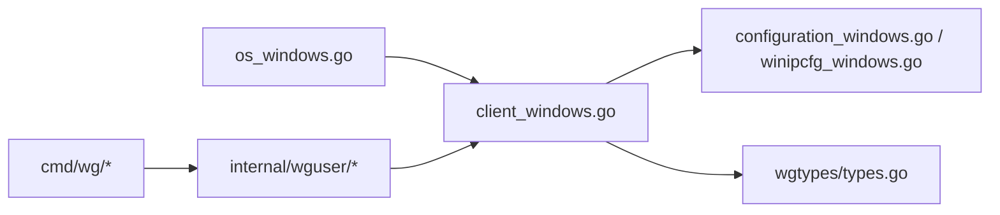

# Windows 平台实现

<cite>
**本文引用的文件**
- [os_windows.go](file://os_windows.go)
- [client_windows.go](file://internal/wgwindows/client_windows.go)
- [configuration_windows.go](file://internal/wgwindows/internal/ioctl/configuration_windows.go)
- [winipcfg_windows.go](file://internal/wgwindows/internal/ioctl/winipcfg_windows.go)
- [conn_windows.go](file://internal/wguser/conn_windows.go)
- [lock_windows.go](file://internal/wgmeta/lock_windows.go)
- [types.go](file://wgtypes/types.go)
- [doc.go](file://wgtypes/doc.go)
- [main.go](file://cmd/wg/main.go)
- [command.go](file://cmd/wg/command.go)
- [config.go](file://cmd/wg/config.go)
- [show.go](file://cmd/wg/show.go)
</cite>

## 目录
1. [简介](#简介)
2. [项目结构](#项目结构)
3. [核心组件](#核心组件)
4. [架构总览](#架构总览)
5. [详细组件分析](#详细组件分析)
6. [依赖关系分析](#依赖关系分析)
7. [性能考量](#性能考量)
8. [故障排查指南](#故障排查指南)
9. [结论](#结论)
10. [附录](#附录)

## 简介
本文件面向在 Windows 平台上使用或集成 WireGuard 控制库的开发者，系统性说明基于 IOCTL 调用的接口管理机制、与 Windows 网络栈的集成方式、配置结构与数据传输协议、Windows 特定服务/驱动交互与权限模型、配置管理（注册表、服务控制、事件日志）、版本兼容性与 UAC 处理、以及部署与故障排查方法。文档以仓库中 Windows 相关实现为依据，聚焦于内部 wgwindows 模块与用户态客户端如何通过系统调用与内核驱动通信，并给出可操作的实践建议。

## 项目结构
仓库采用按平台分层的组织方式：通用类型定义位于 wgtypes，平台无关的用户态客户端逻辑位于 internal/wguser，Windows 平台适配位于 internal/wgwindows，命令行工具位于 cmd/wg。Windows 路径通过构建标签选择具体实现，确保跨平台一致 API。

图表来源
- [os_windows.go:1-200](file://os_windows.go#L1-L200)
- [client_windows.go:1-200](file://internal/wgwindows/client_windows.go#L1-L200)
- [configuration_windows.go:1-200](file://internal/wgwindows/internal/ioctl/configuration_windows.go#L1-L200)
- [winipcfg_windows.go:1-200](file://internal/wgwindows/internal/ioctl/winipcfg_windows.go#L1-L200)
- [conn_windows.go:1-200](file://internal/wguser/conn_windows.go#L1-L200)
- [lock_windows.go:1-200](file://internal/wgmeta/lock_windows.go#L1-L200)

章节来源
- [os_windows.go:1-200](file://os_windows.go#L1-L200)
- [client_windows.go:1-200](file://internal/wgwindows/client_windows.go#L1-L200)
- [configuration_windows.go:1-200](file://internal/wgwindows/internal/ioctl/configuration_windows.go#L1-L200)
- [winipcfg_windows.go:1-200](file://internal/wgwindows/internal/ioctl/winipcfg_windows.go#L1-L200)
- [conn_windows.go:1-200](file://internal/wguser/conn_windows.go#L1-L200)
- [lock_windows.go:1-200](file://internal/wgmeta/lock_windows.go#L1-L200)

## 核心组件
- Windows 平台选择与入口：通过 os_windows.go 将平台特定的客户端实现暴露给上层统一 API。
- Windows 客户端实现：internal/wgwindows/client_windows.go 提供与内核驱动交互的客户端能力，包括设备枚举、配置读写、统计获取等。
- IOCTL 封装：internal/wgwindows/internal/ioctl/configuration_windows.go 与 winipcfg_windows.go 封装了与 Windows 网络栈和驱动之间的 IOCTL 调用、配置结构体编解码及 IP 配置操作。
- 用户态客户端连接：internal/wguser/conn_windows.go 提供 Windows 下与本地守护进程或 IPC 通道相关的连接抽象（若存在）。
- 元数据与并发锁：internal/wgmeta/lock_windows.go 提供 Windows 下的文件级锁实现，用于多进程/多线程安全访问配置存储。
- 通用类型：wgtypes/types.go 与 doc.go 定义了跨平台的 WireGuard 类型与错误语义，供各平台复用。

章节来源
- [os_windows.go:1-200](file://os_windows.go#L1-L200)
- [client_windows.go:1-200](file://internal/wgwindows/client_windows.go#L1-L200)
- [configuration_windows.go:1-200](file://internal/wgwindows/internal/ioctl/configuration_windows.go#L1-L200)
- [winipcfg_windows.go:1-200](file://internal/wgwindows/internal/ioctl/winipcfg_windows.go#L1-L200)
- [conn_windows.go:1-200](file://internal/wguser/conn_windows.go#L1-L200)
- [lock_windows.go:1-200](file://internal/wgmeta/lock_windows.go#L1-L200)
- [types.go:1-200](file://wgtypes/types.go#L1-L200)
- [doc.go:1-200](file://wgtypes/doc.go#L1-L200)

## 架构总览
下图展示了从命令行到内核驱动的完整调用链，重点体现 Windows 平台下 IOCTL 的使用与数据流转。

图表来源
- [client_windows.go:1-200](file://internal/wgwindows/client_windows.go#L1-L200)
- [configuration_windows.go:1-200](file://internal/wgwindows/internal/ioctl/configuration_windows.go#L1-L200)
- [winipcfg_windows.go:1-200](file://internal/wgwindows/internal/ioctl/winipcfg_windows.go#L1-L200)
- [conn_windows.go:1-200](file://internal/wguser/conn_windows.go#L1-L200)

## 详细组件分析

### Windows 客户端与 IOCTL 封装
- 职责划分
  - client_windows.go：对外暴露 Windows 平台能力（如列出设备、读取/写入配置、获取统计），负责将高层请求转换为 IOCTL 参数。
  - configuration_windows.go：定义并编解码配置结构体，组装 IOCTL 缓冲区，处理成功/失败码映射。
  - winipcfg_windows.go：封装与 IP 配置相关的系统调用（例如设置/查询接口的 IPv4/IPv6 地址、网关、DNS 等），配合驱动完成隧道端点绑定。
- 关键流程
  - 配置写入：CLI 传入配置 -> 解析为内部结构 -> 编码为 IOCTL 缓冲区 -> 调用 DeviceIoControl -> 驱动更新内核状态 -> 返回结果。
  - 配置读取：CLI 请求 -> 构造读取 IOCTL -> 驱动返回原始配置缓冲 -> 解码为结构化对象 -> 返回上层。
  - 统计查询：CLI 请求 -> 构造统计 IOCTL -> 驱动返回计数器 -> 解码并格式化输出。
- 错误处理
  - 将系统错误码映射为统一的错误类型，便于上层判断“设备不存在”、“权限不足”、“参数非法”等场景。
- 性能要点
  - 批量配置合并减少 IOCTL 次数。
  - 避免频繁分配/释放大缓冲，必要时复用缓冲区。
  - 对只读统计采用缓存策略降低系统调用开销。

图表来源
- [configuration_windows.go:1-200](file://internal/wgwindows/internal/ioctl/configuration_windows.go#L1-L200)
- [winipcfg_windows.go:1-200](file://internal/wgwindows/internal/ioctl/winipcfg_windows.go#L1-L200)
- [client_windows.go:1-200](file://internal/wgwindows/client_windows.go#L1-L200)

章节来源
- [client_windows.go:1-200](file://internal/wgwindows/client_windows.go#L1-L200)
- [configuration_windows.go:1-200](file://internal/wgwindows/internal/ioctl/configuration_windows.go#L1-L200)
- [winipcfg_windows.go:1-200](file://internal/wgwindows/internal/ioctl/winipcfg_windows.go#L1-L200)

### 用户态连接与元数据锁
- conn_windows.go：提供 Windows 下与本地守护进程或 IPC 的连接抽象（如命名管道、套接字等），用于与后台服务通信。
- lock_windows.go：基于 Windows 文件锁机制实现互斥访问，保证配置文件的并发安全。
- 典型用法
  - 启动时尝试获取独占锁，防止重复实例修改同一配置。
  - 与守护进程建立连接后，通过 IPC 下发配置或查询状态。

章节来源
- [conn_windows.go:1-200](file://internal/wguser/conn_windows.go#L1-L200)
- [lock_windows.go:1-200](file://internal/wgmeta/lock_windows.go#L1-L200)

### 命令行工具与配置管理
- main.go/command.go：命令路由与子命令分发。
- config.go：解析配置文件、校验字段、生成内部表示。
- show.go：展示当前设备状态、统计信息。
- 与 Windows 适配层协作：通过 wguser 与 wgwindows 组合，最终落地到 IOCTL 调用。

章节来源
- [main.go:1-200](file://cmd/wg/main.go#L1-L200)
- [command.go:1-200](file://cmd/wg/command.go#L1-L200)
- [config.go:1-200](file://cmd/wg/config.go#L1-L200)
- [show.go:1-200](file://cmd/wg/show.go#L1-L200)

## 依赖关系分析
- 平台选择：os_windows.go 将平台特定实现注入到统一 API，使上层无需感知差异。
- 组件耦合
  - wgwindows 依赖 ioctl 封装进行底层通信。
  - wguser 提供跨平台客户端抽象，Windows 下可能结合守护进程或直连驱动。
  - wgtypes 被所有平台共享，确保数据结构一致性。
- 外部依赖
  - Windows 网络栈提供的 IOCTL 接口。
  - WireGuard 内核驱动（由系统安装并提供设备节点）。

图表来源
- [os_windows.go:1-200](file://os_windows.go#L1-L200)
- [client_windows.go:1-200](file://internal/wgwindows/client_windows.go#L1-L200)
- [configuration_windows.go:1-200](file://internal/wgwindows/internal/ioctl/configuration_windows.go#L1-L200)
- [winipcfg_windows.go:1-200](file://internal/wgwindows/internal/ioctl/winipcfg_windows.go#L1-L200)
- [types.go:1-200](file://wgtypes/types.go#L1-L200)

章节来源
- [os_windows.go:1-200](file://os_windows.go#L1-L200)
- [client_windows.go:1-200](file://internal/wgwindows/client_windows.go#L1-L200)
- [configuration_windows.go:1-200](file://internal/wgwindows/internal/ioctl/configuration_windows.go#L1-L200)
- [winipcfg_windows.go:1-200](file://internal/wgwindows/internal/ioctl/winipcfg_windows.go#L1-L200)
- [types.go:1-200](file://wgtypes/types.go#L1-L200)

## 性能考量
- 减少 IOCTL 调用次数：合并多次配置变更，尽量在一次请求中提交。
- 缓冲复用：对频繁使用的配置缓冲进行池化，避免频繁分配与拷贝。
- 统计缓存：对只读统计信息做短期缓存，降低系统调用频率。
- 批处理与异步：在高吞吐场景下，考虑异步 IO 与批处理策略。
- 内存对齐与大小限制：遵循驱动要求的结构体对齐与最大缓冲大小，避免额外拷贝。

[本节为通用性能建议，不直接分析具体文件]

## 故障排查指南
- 常见错误与定位
  - 权限不足：确认以管理员身份运行；检查 UAC 提示与进程令牌。
  - 设备不存在：检查驱动是否已安装且设备名正确；查看设备管理器中的适配器状态。
  - 配置无效：核对密钥格式、IP 地址与掩码、路由条目；使用 show 命令验证当前配置。
  - 网络不通：检查防火墙规则、NAT 与路由；确认对端可达与端口开放。
- 诊断步骤
  - 使用命令行工具执行 show 与配置加载，观察返回错误码。
  - 检查 Windows 事件日志与服务状态（若使用守护进程模式）。
  - 抓包分析：使用 Wireshark 过滤 WireGuard 端口，确认握手与数据包流向。
  - 驱动日志：启用驱动调试日志（依据驱动文档）以定位内核侧问题。
- 恢复措施
  - 回滚到已知可用的配置。
  - 重启网络适配器或系统服务。
  - 重新安装驱动并修复系统网络栈。

[本节为通用故障排查建议，不直接分析具体文件]

## 结论
本仓库在 Windows 平台通过 wgwindows 与 ioctl 封装实现了与 WireGuard 内核驱动的可靠通信，借助 wguser 提供跨平台客户端抽象，并通过 cmd/wg 提供一致的命令行体验。理解 IOCTL 调用流程、配置结构体编解码与错误映射，是开发与排错的关键。结合本文的性能建议与故障排查方法，可在生产环境中稳定部署与维护 WireGuard 客户端。

[本节为总结性内容，不直接分析具体文件]

## 附录

### 配置管理与权限模型（Windows 特定）
- 权限模型
  - 需要管理员权限以创建/修改网络适配器与驱动设备。
  - UAC 提权：建议在部署脚本中显式请求提升权限，或在交互式场景中提示用户确认。
- 服务与驱动交互
  - 若使用守护进程模式，需确保服务以适当账户运行，具备必要的网络与系统资源访问权限。
  - 与驱动通信通过 IOCTL 完成，需保证驱动已正确安装且设备可用。
- 配置存储
  - 配置文件通常位于用户或系统目录，注意多用户环境下的隔离与权限。
  - 使用文件锁（lock_windows.go）避免并发写冲突。
- 事件日志
  - 可将关键操作与错误写入 Windows 事件日志，便于集中审计与告警。

[本节为概念性说明，不直接分析具体文件]

### 版本兼容性说明
- Windows 版本支持范围取决于驱动与系统 API 的可用性。
- 不同版本的 IOCTL 行为可能存在差异，应在目标版本上进行回归测试。
- 建议在新版本发布前验证配置加载、统计查询与网络连通性。

[本节为概念性说明，不直接分析具体文件]

### 部署指南（Windows）
- 前置条件
  - 安装 WireGuard 内核驱动并确保设备可见。
  - 准备管理员权限的部署环境。
- 步骤
  - 编译或下载二进制，以管理员身份运行。
  - 导入配置文件并应用。
  - 验证连接：ping 对端、查看统计、抓取数据包。
- 回滚与卸载
  - 保留历史配置以便快速回滚。
  - 如需卸载，停止服务并移除驱动与配置。

[本节为概念性说明，不直接分析具体文件]