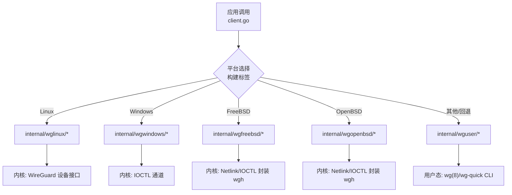
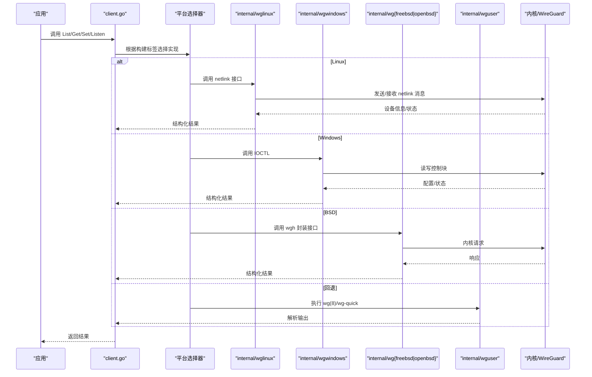
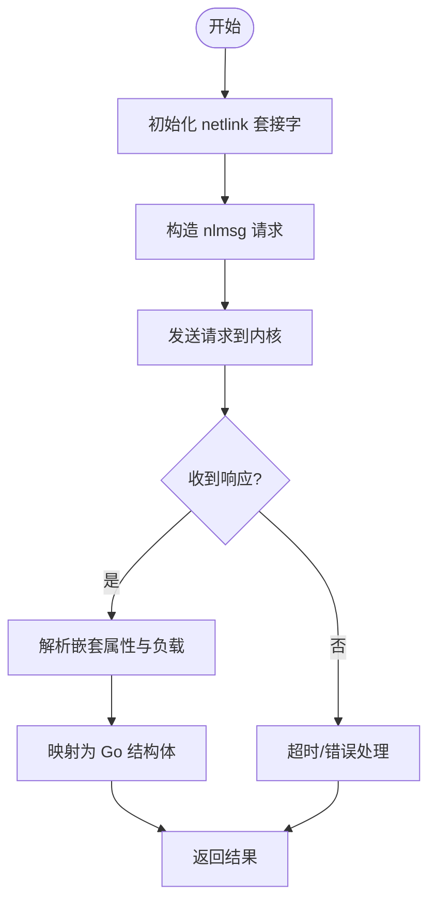
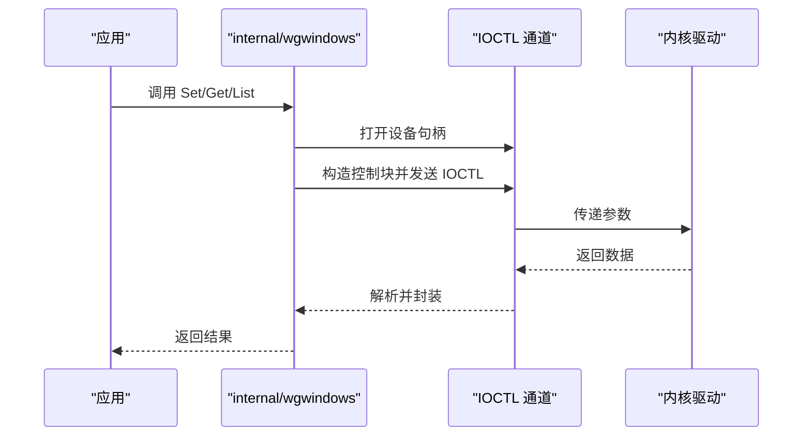
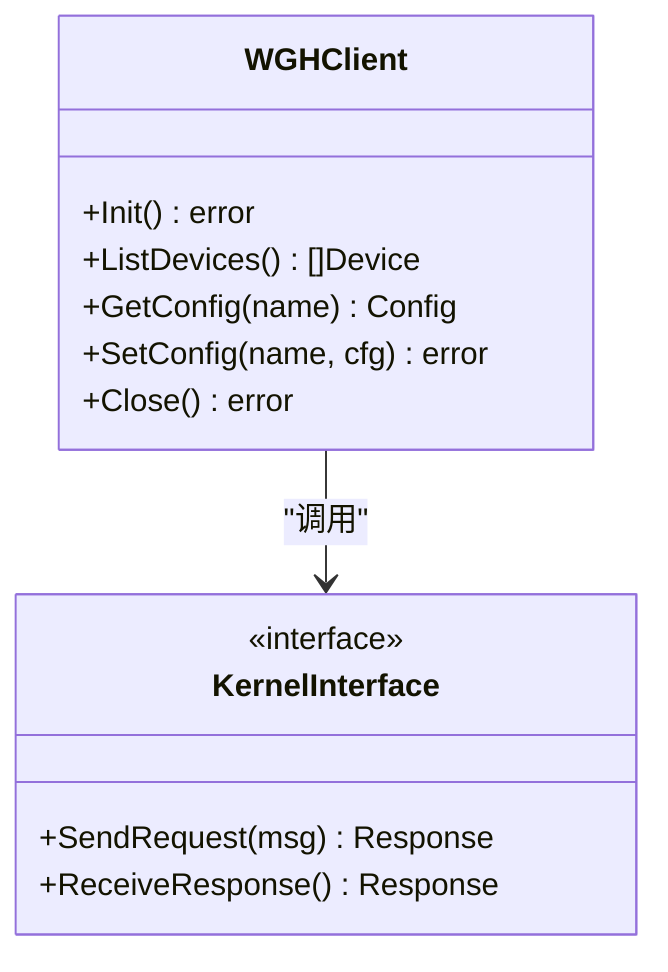
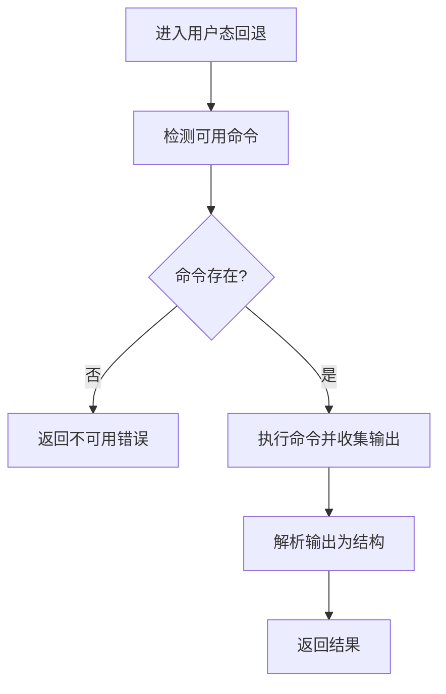
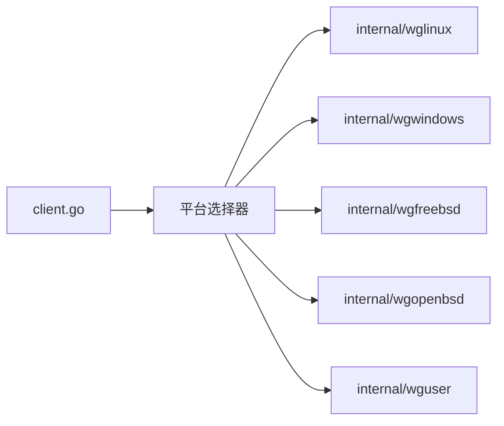

# 平台特定实现

<cite>
**本文引用的文件**
- [os_linux.go](file://os_linux.go)
- [os_windows.go](file://os_windows.go)
- [os_freebsd.go](file://os_freebsd.go)
- [os_openbsd.go](file://os_openbsd.go)
- [os_userspace.go](file://os_userspace.go)
- [client.go](file://client.go)
- [doc.go](file://doc.go)
- [internal/wglinux/client_linux.go](file://internal/wglinux/client_linux.go)
- [internal/wgwindows/client_windows.go](file://internal/wgwindows/client_windows.go)
- [internal/wgfreebsd/client_freebsd.go](file://internal/wgfreebsd/client_freebsd.go)
- [internal/wgopenbsd/client_openbsd.go](file://internal/wgopenbsd/client_openbsd.go)
- [internal/wguser/client.go](file://internal/wguser/client.go)
- [internal/wguser/conn_unix.go](file://internal/wguser/conn_unix.go)
- [internal/wguser/conn_windows.go](file://internal/wguser/conn_windows.go)
- [internal/wgwindows/internal/ioctl/configuration_windows.go](file://internal/wgwindows/internal/ioctl/configuration_windows.go)
- [internal/wgfreebsd/internal/wgh/defs_freebsd_amd64.go](file://internal/wgfreebsd/internal/wgh/defs_freebsd_amd64.go)
- [internal/wgopenbsd/internal/wgh/defs_openbsd_amd64.go](file://internal/wgopenbsd/internal/wgh/defs_openbsd_amd64.go)
</cite>

## 目录
1. [简介](#简介)
2. [项目结构](#项目结构)
3. [核心组件](#核心组件)
4. [架构总览](#架构总览)
5. [详细组件分析](#详细组件分析)
6. [依赖关系分析](#依赖关系分析)
7. [性能考量](#性能考量)
8. [故障排查指南](#故障排查指南)
9. [结论](#结论)
10. [附录](#附录)

## 简介
本文件聚焦于 wgctrl-go 的平台特定实现，系统性说明 Linux、Windows、FreeBSD、OpenBSD 四大平台的差异、限制与特性。重点覆盖：
- Linux 的 netlink 通信机制
- Windows 的 IOCTL 调用路径
- BSD（FreeBSD/OpenBSD）的内核接口使用方式
同时给出各平台的权限要求、系统依赖、兼容性注意事项、配置与调优参数、故障排查建议，以及新增平台支持的实现方法与测试要求。

## 项目结构
仓库采用“按平台拆分”的组织方式：顶层通过构建标签选择具体实现，内部模块分别提供各平台的具体客户端实现，用户态兼容层则提供基于用户空间 wg(8)/wg-quick 的后备方案。

**图表来源**
- [client.go:1-200](file://client.go#L1-L200)
- [os_linux.go:1-200](file://os_linux.go#L1-L200)
- [os_windows.go:1-200](file://os_windows.go#L1-L200)
- [os_freebsd.go:1-200](file://os_freebsd.go#L1-L200)
- [os_openbsd.go:1-200](file://os_openbsd.go#L1-L200)
- [os_userspace.go:1-200](file://os_userspace.go#L1-L200)

**章节来源**
- [client.go:1-200](file://client.go#L1-L200)
- [doc.go:1-200](file://doc.go#L1-L200)
- [os_linux.go:1-200](file://os_linux.go#L1-L200)
- [os_windows.go:1-200](file://os_windows.go#L1-L200)
- [os_freebsd.go:1-200](file://os_freebsd.go#L1-L200)
- [os_openbsd.go:1-200](file://os_openbsd.go#L1-L200)
- [os_userspace.go:1-200](file://os_userspace.go#L1-L200)

## 核心组件
- 平台选择器：根据构建标签在运行时选择对应平台客户端实现。
- 平台客户端：
  - Linux：通过 netlink 与内核 WireGuard 驱动交互，完成查询、配置、监听等。
  - Windows：通过 IOCTL 与内核模式驱动交互，完成配置与状态读取。
  - FreeBSD/OpenBSD：通过 wgh 封装的内核接口进行设备管理。
- 用户态兼容层：当无法直接访问内核时，回退到执行 wg(8)/wg-quick 命令的方式。

**章节来源**
- [client.go:1-200](file://client.go#L1-L200)
- [internal/wglinux/client_linux.go:1-200](file://internal/wglinux/client_linux.go#L1-L200)
- [internal/wgwindows/client_windows.go:1-200](file://internal/wgwindows/client_windows.go#L1-L200)
- [internal/wgfreebsd/client_freebsd.go:1-200](file://internal/wgfreebsd/client_freebsd.go#L1-L200)
- [internal/wgopenbsd/client_openbsd.go:1-200](file://internal/wgopenbsd/client_openbsd.go#L1-L200)
- [internal/wguser/client.go:1-200](file://internal/wguser/client.go#L1-L200)

## 架构总览
下图展示了从应用层到各平台内核接口的调用链路与数据流。

**图表来源**
- [client.go:1-200](file://client.go#L1-L200)
- [internal/wglinux/client_linux.go:1-200](file://internal/wglinux/client_linux.go#L1-L200)
- [internal/wgwindows/client_windows.go:1-200](file://internal/wgwindows/client_windows.go#L1-L200)
- [internal/wgfreebsd/client_freebsd.go:1-200](file://internal/wgfreebsd/client_freebsd.go#L1-L200)
- [internal/wgopenbsd/client_openbsd.go:1-200](file://internal/wgopenbsd/client_openbsd.go#L1-L200)
- [internal/wguser/client.go:1-200](file://internal/wguser/client.go#L1-L200)

## 详细组件分析

### Linux 平台：netlink 通信机制
- 通信方式：通过 netlink 套接字与内核 WireGuard 模块交互，用于枚举设备、获取配置、下发配置及监听事件。
- 关键流程：
  - 初始化 netlink 连接并绑定组播组以接收事件。
  - 构造并发送 nlmsg 请求（如 GET/SET/GETPEER）。
  - 解析内核返回的嵌套属性与二进制负载。
  - 将内核数据结构映射为 Go 类型并返回给上层。
- 错误处理：对 netlink 错误码、无效消息、超时等进行分类处理，向上抛出语义化错误。
- 并发与资源：复用 netlink 套接字，合理设置缓冲区大小；注意关闭与清理。

**图表来源**
- [internal/wglinux/client_linux.go:1-200](file://internal/wglinux/client_linux.go#L1-L200)

**章节来源**
- [internal/wglinux/client_linux.go:1-200](file://internal/wglinux/client_linux.go#L1-L200)

### Windows 平台：IOCTL 调用
- 通信方式：通过 IOCTL 与内核模式驱动交互，完成设备的配置与状态读取。
- 关键流程：
  - 打开设备句柄。
  - 构造控制块并发起 IOCTL 请求。
  - 解析返回的配置或状态数据。
  - 释放句柄与资源。
- 错误处理：区分设备不存在、权限不足、参数非法等错误，转换为统一错误类型。
- 并发与资源：确保句柄生命周期管理，避免泄漏；在高并发场景下考虑锁或池化。

**图表来源**
- [internal/wgwindows/client_windows.go:1-200](file://internal/wgwindows/client_windows.go#L1-L200)
- [internal/wgwindows/internal/ioctl/configuration_windows.go:1-200](file://internal/wgwindows/internal/ioctl/configuration_windows.go#L1-L200)

**章节来源**
- [internal/wgwindows/client_windows.go:1-200](file://internal/wgwindows/client_windows.go#L1-L200)
- [internal/wgwindows/internal/ioctl/configuration_windows.go:1-200](file://internal/wgwindows/internal/ioctl/configuration_windows.go#L1-L200)

### FreeBSD/OpenBSD 平台：内核接口使用
- 通信方式：通过 wgh 封装的内核接口（在不同发行版中可能基于 netlink 或 ioctl）与内核交互。
- 关键流程：
  - 初始化 wgh 上下文。
  - 发送设备操作请求（列举、配置、查询）。
  - 解析内核返回的二进制结构。
  - 释放上下文与资源。
- 错误处理：捕获内核错误码并映射为语义化错误；对版本差异进行兼容处理。
- 并发与资源：注意上下文的生命周期与并发安全。

**图表来源**
- [internal/wgfreebsd/client_freebsd.go:1-200](file://internal/wgfreebsd/client_freebsd.go#L1-L200)
- [internal/wgopenbsd/client_openbsd.go:1-200](file://internal/wgopenbsd/client_openbsd.go#L1-L200)
- [internal/wgfreebsd/internal/wgh/defs_freebsd_amd64.go:1-200](file://internal/wgfreebsd/internal/wgh/defs_freebsd_amd64.go#L1-L200)
- [internal/wgopenbsd/internal/wgh/defs_openbsd_amd64.go:1-200](file://internal/wgopenbsd/internal/wgh/defs_openbsd_amd64.go#L1-L200)

**章节来源**
- [internal/wgfreebsd/client_freebsd.go:1-200](file://internal/wgfreebsd/client_freebsd.go#L1-L200)
- [internal/wgopenbsd/client_openbsd.go:1-200](file://internal/wgopenbsd/client_openbsd.go#L1-L200)
- [internal/wgfreebsd/internal/wgh/defs_freebsd_amd64.go:1-200](file://internal/wgfreebsd/internal/wgh/defs_freebsd_amd64.go#L1-L200)
- [internal/wgopenbsd/internal/wgh/defs_openbsd_amd64.go:1-200](file://internal/wgopenbsd/internal/wgh/defs_openbsd_amd64.go#L1-L200)

### 用户态兼容层：wg(8)/wg-quick 回退
- 触发条件：当无法直接访问内核接口时，自动回退到执行用户态工具。
- 关键流程：
  - 检测可用命令（wg、wg-quick）。
  - 构造命令行参数并执行。
  - 解析标准输出为标准结构。
  - 处理命令失败与超时。
- 适用场景：容器环境、无内核模块但安装 wg 工具的受限环境。

**图表来源**
- [internal/wguser/client.go:1-200](file://internal/wguser/client.go#L1-L200)
- [internal/wguser/conn_unix.go:1-200](file://internal/wguser/conn_unix.go#L1-L200)
- [internal/wguser/conn_windows.go:1-200](file://internal/wguser/conn_windows.go#L1-L200)

**章节来源**
- [internal/wguser/client.go:1-200](file://internal/wguser/client.go#L1-L200)
- [internal/wguser/conn_unix.go:1-200](file://internal/wguser/conn_unix.go#L1-L200)
- [internal/wguser/conn_windows.go:1-200](file://internal/wguser/conn_windows.go#L1-L200)

## 依赖关系分析
- 平台选择器依赖构建标签，将调用路由到对应平台客户端。
- 各平台客户端依赖各自的内核接口或用户态工具。
- 用户态兼容层依赖外部命令的存在性与版本兼容性。

**图表来源**
- [client.go:1-200](file://client.go#L1-L200)
- [os_linux.go:1-200](file://os_linux.go#L1-L200)
- [os_windows.go:1-200](file://os_windows.go#L1-L200)
- [os_freebsd.go:1-200](file://os_freebsd.go#L1-L200)
- [os_openbsd.go:1-200](file://os_openbsd.go#L1-L200)
- [os_userspace.go:1-200](file://os_userspace.go#L1-L200)

**章节来源**
- [client.go:1-200](file://client.go#L1-L200)
- [os_linux.go:1-200](file://os_linux.go#L1-L200)
- [os_windows.go:1-200](file://os_windows.go#L1-L200)
- [os_freebsd.go:1-200](file://os_freebsd.go#L1-L200)
- [os_openbsd.go:1-200](file://os_openbsd.go#L1-L200)
- [os_userspace.go:1-200](file://os_userspace.go#L1-L200)

## 性能考量
- Linux netlink：
  - 合理设置缓冲区与批量请求以减少系统调用次数。
  - 复用 netlink 套接字，避免频繁创建销毁。
  - 监听事件时使用非阻塞 I/O 与超时控制。
- Windows IOCTL：
  - 合并多次配置请求以降低 IOCTL 开销。
  - 避免在热路径中进行大量字符串解析。
  - 合理管理句柄与内存分配。
- BSD wgh：
  - 减少不必要的内核往返，缓存稳定状态。
  - 注意不同版本的 ABI 差异带来的解析成本。
- 用户态回退：
  - 进程启动与 I/O 开销较大，应尽量避免在高频路径中使用。
  - 增加超时与重试策略，防止阻塞。

[本节为通用指导，不直接分析具体文件]

## 故障排查指南
- Linux：
  - 检查内核模块是否加载、netlink 组播是否启用。
  - 验证权限（通常需要 root），查看 dmesg 中的错误信息。
  - 确认 netlink 协议版本与内核支持一致。
- Windows：
  - 检查服务/驱动是否运行，确认管理员权限。
  - 查看事件日志与 IOCTL 错误码。
  - 验证设备句柄是否正确打开与释放。
- FreeBSD/OpenBSD：
  - 检查 wgh 工具与内核接口版本匹配。
  - 确认权限与设备节点访问控制。
  - 关注内核日志与 ABI 变更。
- 用户态回退：
  - 确认 wg/wg-quick 已安装且可执行。
  - 检查 PATH 与命令参数。
  - 捕获并记录子进程退出码与输出。

**章节来源**
- [internal/wglinux/client_linux.go:1-200](file://internal/wglinux/client_linux.go#L1-L200)
- [internal/wgwindows/client_windows.go:1-200](file://internal/wgwindows/client_windows.go#L1-L200)
- [internal/wgfreebsd/client_freebsd.go:1-200](file://internal/wgfreebsd/client_freebsd.go#L1-L200)
- [internal/wgopenbsd/client_openbsd.go:1-200](file://internal/wgopenbsd/client_openbsd.go#L1-L200)
- [internal/wguser/client.go:1-200](file://internal/wguser/client.go#L1-L200)

## 结论
wgctrl-go 通过平台选择器将统一 API 适配到各平台内核接口或用户态工具，实现了跨平台的 WireGuard 设备管理能力。Linux 使用 netlink，Windows 使用 IOCTL，BSD 使用 wgh 封装接口，并在必要时回退到用户态命令。遵循本文的权限、依赖、配置与调优建议，可有效提升稳定性与性能。新增平台支持需遵循接口契约与测试要求，确保行为一致性与可维护性。

## 附录

### 权限要求与系统依赖
- Linux：
  - 权限：root 或具备 CAP_NET_ADMIN。
  - 依赖：内核 WireGuard 模块、netlink 支持。
- Windows：
  - 权限：管理员。
  - 依赖：WireGuard 内核驱动与服务。
- FreeBSD/OpenBSD：
  - 权限：root 或等效权限。
  - 依赖：wgh 工具与内核接口。
- 用户态回退：
  - 依赖：wg/wg-quick 命令可用。

**章节来源**
- [os_linux.go:1-200](file://os_linux.go#L1-L200)
- [os_windows.go:1-200](file://os_windows.go#L1-L200)
- [os_freebsd.go:1-200](file://os_freebsd.go#L1-L200)
- [os_openbsd.go:1-200](file://os_openbsd.go#L1-L200)
- [os_userspace.go:1-200](file://os_userspace.go#L1-L200)

### 平台特定的配置选项与调优参数
- Linux：
  - netlink 缓冲区大小、超时时间、批量请求数量。
  - 事件监听的非阻塞模式与轮询间隔。
- Windows：
  - IOCTL 控制块大小、重试次数、超时策略。
- BSD：
  - wgh 上下文参数、ABI 版本兼容开关。
- 用户态回退：
  - 命令超时、重试策略、输出解析容错。

[本节为通用指导，不直接分析具体文件]

### 兼容性注意事项
- 内核版本差异可能导致 netlink/IOCTL/ABI 变化，需在代码中进行版本探测与兼容分支。
- 用户态工具版本差异影响输出格式，需增强解析鲁棒性。
- 容器环境中可能缺少内核模块或特权，优先回退到用户态兼容层。

[本节为通用指导，不直接分析具体文件]

### 如何实现新的平台支持
- 步骤：
  - 在平台选择器中添加新平台分支，依据构建标签路由。
  - 实现统一的客户端接口（List/Get/Set/Listen）。
  - 对接平台内核接口或用户态工具。
  - 实现错误映射与资源管理。
  - 编写单元测试与集成测试，覆盖正常与异常路径。
- 接口契约：
  - 保持方法签名与返回值一致。
  - 错误类型统一，便于上层处理。
- 测试要求：
  - 模拟内核/驱动响应或真实环境测试。
  - 覆盖权限不足、设备不存在、超时等场景。

[本节为通用指导，不直接分析具体文件]