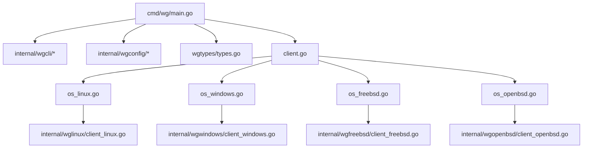
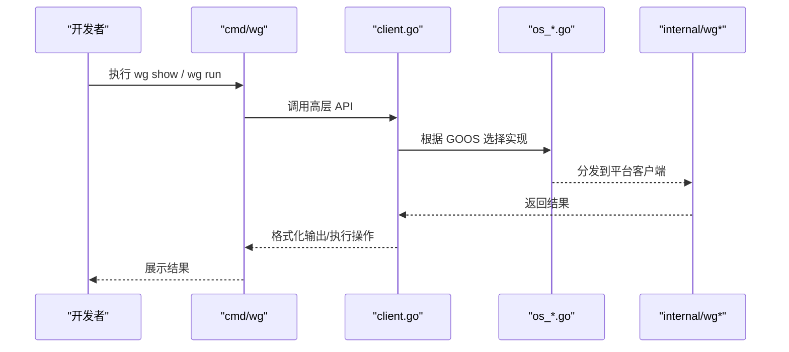
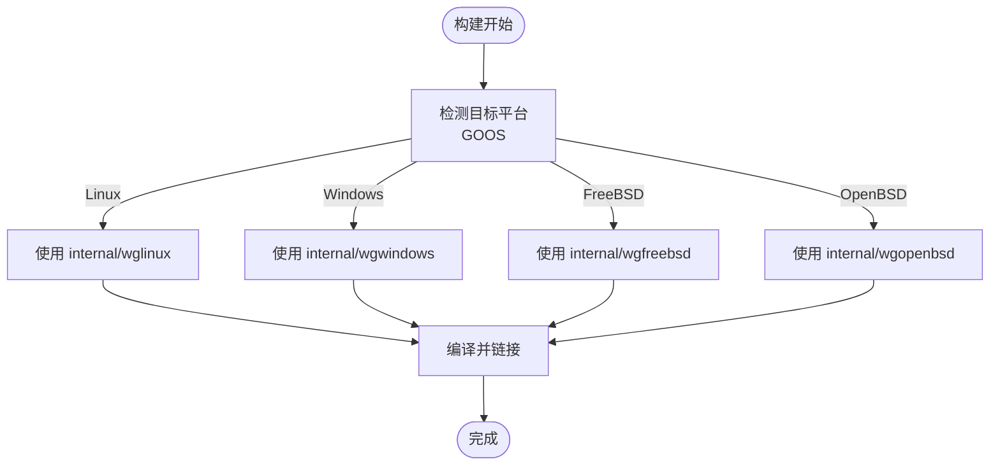
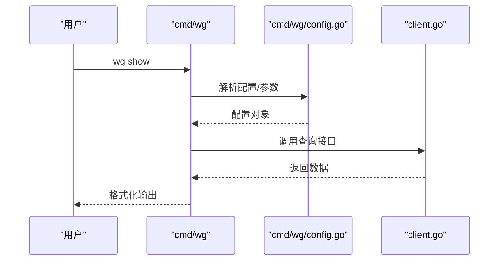
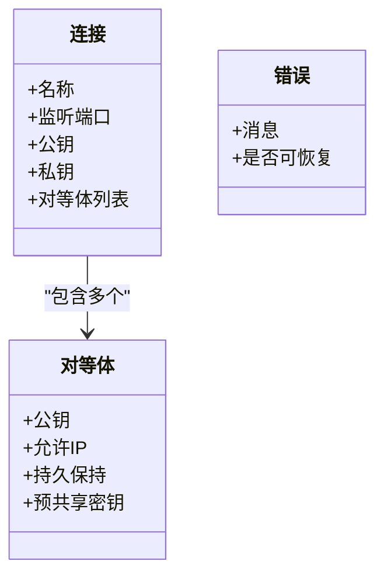
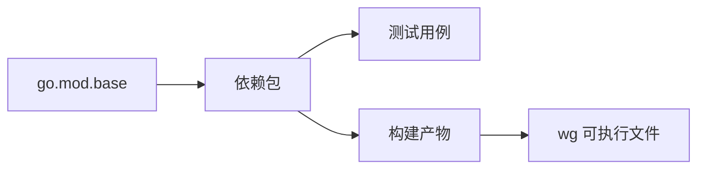

# 开发环境搭建

<cite>
**本文引用的文件**
- [README.md](file://README.md)
- [readme_cn.md](file://readme_cn.md)
- [go.mod.base](file://go.mod.base)
- [os_linux.go](file://os_linux.go)
- [os_windows.go](file://os_windows.go)
- [os_freebsd.go](file://os_freebsd.go)
- [os_openbsd.go](file://os_openbsd.go)
- [os_userspace.go](file://os_userspace.go)
- [cmd/wg/main.go](file://cmd/wg/main.go)
- [cmd/wg/config.go](file://cmd/wg/config.go)
- [internal/wglinux/client_linux.go](file://internal/wglinux/client_linux.go)
- [internal/wgwindows/client_windows.go](file://internal/wgwindows/client_windows.go)
- [internal/wgfreebsd/client_freebsd.go](file://internal/wgfreebsd/client_freebsd.go)
- [internal/wgopenbsd/client_openbsd.go](file://internal/wgopenbsd/client_openbsd.go)
- [wgtypes/types.go](file://wgtypes/types.go)
- [client.go](file://client.go)
- [.github/workflows/linux-test.yml](file://.github/workflows/linux-test.yml)
- [.builds/freebsd.yml](file://.builds/freebsd.yml)
- [.builds/openbsd.yml](file://.builds/openbsd.yml)
</cite>

## 目录
1. [简介](#简介)
2. [项目结构](#项目结构)
3. [核心组件](#核心组件)
4. [架构总览](#架构总览)
5. [详细组件分析](#详细组件分析)
6. [依赖分析](#依赖分析)
7. [性能考虑](#性能考虑)
8. [故障排除指南](#故障排除指南)
9. [结论](#结论)
10. [附录](#附录)

## 简介
本指南面向首次参与该项目的开发者，目标是帮助你从零开始搭建本地开发环境。内容涵盖：
- Go 语言版本要求与安装
- 依赖包获取与模块管理
- 构建与测试命令
- IDE 与调试器配置建议
- 环境变量与平台特定设置
- 常见问题排查与解决方案
- 跨平台开发与注意事项

本项目为 WireGuard 的 Go 实现，提供用户态/内核态客户端能力，并在 Linux、Windows、FreeBSD、OpenBSD 等平台通过条件编译适配不同后端。

## 项目结构
仓库采用“按功能与平台分层”的组织方式：
- cmd：命令行入口（wg 与 wgctrl）
- internal：内部实现，按平台拆分（wglinux、wgwindows、wgfreebsd、wgopenbsd），以及共享逻辑（wgcli、wgconfig、wgmeta、wguser、wgtest）
- wgtypes：类型定义与错误
- 根目录：对外 API（client.go）、平台选择文件（os_*.go）
- .github/.builds：CI 工作流与构建脚本

**图表来源**
- [cmd/wg/main.go:1-200](file://cmd/wg/main.go#L1-L200)
- [client.go:1-200](file://client.go#L1-L200)
- [os_linux.go:1-200](file://os_linux.go#L1-L200)
- [os_windows.go:1-200](file://os_windows.go#L1-L200)
- [os_freebsd.go:1-200](file://os_freebsd.go#L1-L200)
- [os_openbsd.go:1-200](file://os_openbsd.go#L1-L200)

**章节来源**
- [README.md:1-200](file://README.md#L1-L200)
- [readme_cn.md:1-200](file://readme_cn.md#L1-L200)

## 核心组件
- 命令行工具：cmd/wg 提供 show/run 等子命令，负责参数解析、配置加载与调用底层客户端
- 平台客户端：internal/wg{linux,windows,freebsd,openbsd} 分别对接各平台内核或用户态接口
- 公共类型：wgtypes 定义连接、对等体、密钥等数据结构
- 运行时选择：根目录 os_*.go 根据目标平台选择具体实现

**章节来源**
- [cmd/wg/main.go:1-200](file://cmd/wg/main.go#L1-L200)
- [cmd/wg/config.go:1-200](file://cmd/wg/config.go#L1-L200)
- [wgtypes/types.go:1-200](file://wgtypes/types.go#L1-L200)
- [client.go:1-200](file://client.go#L1-L200)

## 架构总览
下图展示了从 CLI 到平台后端的调用路径，以及平台选择机制。

**图表来源**
- [cmd/wg/main.go:1-200](file://cmd/wg/main.go#L1-L200)
- [client.go:1-200](file://client.go#L1-L200)
- [os_linux.go:1-200](file://os_linux.go#L1-L200)
- [os_windows.go:1-200](file://os_windows.go#L1-L200)
- [os_freebsd.go:1-200](file://os_freebsd.go#L1-L200)
- [os_openbsd.go:1-200](file://os_openbsd.go#L1-L200)

## 详细组件分析

### 平台选择与条件编译
- 根目录 os_*.go 文件用于在不同操作系统上选择对应实现
- internal/wg* 下每个平台目录包含该平台的具体客户端实现
- 通过 Go 的条件编译标签（如 linux、windows、freebsd、openbsd）在构建时选择代码

**图表来源**
- [os_linux.go:1-200](file://os_linux.go#L1-L200)
- [os_windows.go:1-200](file://os_windows.go#L1-L200)
- [os_freebsd.go:1-200](file://os_freebsd.go#L1-L200)
- [os_openbsd.go:1-200](file://os_openbsd.go#L1-L200)

**章节来源**
- [os_linux.go:1-200](file://os_linux.go#L1-L200)
- [os_windows.go:1-200](file://os_windows.go#L1-L200)
- [os_freebsd.go:1-200](file://os_freebsd.go#L1-L200)
- [os_openbsd.go:1-200](file://os_openbsd.go#L1-L200)

### 命令行入口与配置
- cmd/wg/main.go 作为 CLI 入口，注册子命令并处理参数
- cmd/wg/config.go 负责配置文件读取与校验
- 支持 show 与 run 等常用子命令，便于本地验证与调试

**图表来源**
- [cmd/wg/main.go:1-200](file://cmd/wg/main.go#L1-L200)
- [cmd/wg/config.go:1-200](file://cmd/wg/config.go#L1-L200)
- [client.go:1-200](file://client.go#L1-L200)

**章节来源**
- [cmd/wg/main.go:1-200](file://cmd/wg/main.go#L1-L200)
- [cmd/wg/config.go:1-200](file://cmd/wg/config.go#L1-L200)

### 类型与错误模型
- wgtypes/types.go 定义了连接、对等体、密钥等核心类型
- 错误类型集中在 errors.go，便于统一处理与上报

**图表来源**
- [wgtypes/types.go:1-200](file://wgtypes/types.go#L1-L200)

**章节来源**
- [wgtypes/types.go:1-200](file://wgtypes/types.go#L1-L200)

## 依赖分析
- 模块清单由 go.mod.base 提供基础依赖信息；实际构建时使用 go mod 进行依赖管理与下载
- 平台相关依赖通过条件编译隔离，避免引入不必要的系统库
- CI 流程中定义了测试与静态分析任务，可作为本地复现参考

**图表来源**
- [go.mod.base:1-200](file://go.mod.base#L1-L200)
- [.github/workflows/linux-test.yml:1-200](file://.github/workflows/linux-test.yml#L1-L200)

**章节来源**
- [go.mod.base:1-200](file://go.mod.base#L1-L200)
- [.github/workflows/linux-test.yml:1-200](file://.github/workflows/linux-test.yml#L1-L200)
- [.builds/freebsd.yml:1-200](file://.builds/freebsd.yml#L1-L200)
- [.builds/openbsd.yml:1-200](file://.builds/openbsd.yml#L1-L200)

## 性能考虑
- 优先使用平台原生后端以获得最佳性能（Linux 内核态、Windows NDIS/IP Helper、BSD netlink/ioctl）
- 减少频繁的配置变更与重连，批量更新配置以降低系统调用开销
- 在大量对等体场景下，注意内存占用与序列化/反序列化的成本

[本节为通用指导，不直接分析具体文件]

## 故障排除指南
- 无法找到平台后端
  - 确认当前 GOOS/GOARCH 与目标平台一致
  - 检查是否安装了必要的系统头文件或驱动（例如 Linux 内核头文件、Windows SDK）
- 权限不足
  - 在类 Unix 系统上使用 sudo 或以管理员身份运行
  - Windows 以管理员身份运行终端
- 网络接口不存在或名称不匹配
  - 使用系统命令列出接口名称，确保配置中的接口名正确
- 构建失败
  - 清理缓存后重试：go clean -cache && go build
  - 检查代理与镜像设置，确保能拉取依赖

[本节为通用指导，不直接分析具体文件]

## 结论
通过遵循本指南，你可以在本地快速搭建开发环境并完成构建、测试与调试。项目采用清晰的平台分层与模块化设计，便于在多平台上扩展与维护。遇到问题时，优先检查平台依赖、权限与网络配置，并结合 CI 流程进行问题定位。

[本节为总结性内容，不直接分析具体文件]

## 附录

### 环境准备与安装
- 安装 Go 工具链
  - 建议使用最新稳定版；若需兼容旧版本，请参考仓库中的版本约束
- 克隆仓库并进入目录
- 初始化模块与下载依赖
  - 使用 go mod tidy 同步依赖
  - 如需离线构建，提前缓存依赖

**章节来源**
- [README.md:1-200](file://README.md#L1-L200)
- [readme_cn.md:1-200](file://readme_cn.md#L1-L200)
- [go.mod.base:1-200](file://go.mod.base#L1-L200)

### 构建与测试
- 构建
  - 默认平台：go build ./...
  - 指定平台：GOOS=linux GOARCH=amd64 go build ./...
- 测试
  - 单元测试：go test ./...
  - 集成测试（需要相应平台环境）：参考 CI 配置
- 交叉编译
  - 使用 GOOS/GOARCH 组合生成多平台二进制

**章节来源**
- [.github/workflows/linux-test.yml:1-200](file://.github/workflows/linux-test.yml#L1-L200)
- [.builds/freebsd.yml:1-200](file://.builds/freebsd.yml#L1-L200)
- [.builds/openbsd.yml:1-200](file://.builds/openbsd.yml#L1-L200)

### IDE 与调试器配置
- VS Code
  - 安装 Go 插件
  - 配置 go.mod 所在目录为工作区根
  - 使用 Delve 调试：launch.json 中设置程序路径为 cmd/wg
- GoLand
  - 导入项目后，将 cmd/wg 设置为运行配置
  - 设置断点并启动调试
- 环境变量
  - 某些平台可能需要设置系统级变量（如代理、证书路径）
  - 调试时可临时设置以复现问题

[本节为通用指导，不直接分析具体文件]

### 平台特定说明
- Linux
  - 需要内核支持与必要头文件
  - 通常以 root 权限运行
- Windows
  - 需要管理员权限
  - 依赖系统网络栈与驱动
- FreeBSD/OpenBSD
  - 需要对应的系统库与权限
  - 可通过 .builds 中的配置了解构建细节

**章节来源**
- [os_linux.go:1-200](file://os_linux.go#L1-L200)
- [os_windows.go:1-200](file://os_windows.go#L1-L200)
- [os_freebsd.go:1-200](file://os_freebsd.go#L1-L200)
- [os_openbsd.go:1-200](file://os_openbsd.go#L1-L200)
- [.builds/freebsd.yml:1-200](file://.builds/freebsd.yml#L1-L200)
- [.builds/openbsd.yml:1-200](file://.builds/openbsd.yml#L1-L200)

### 常见命令速查
- 构建：go build ./...
- 测试：go test ./...
- 清理缓存：go clean -cache
- 交叉编译：GOOS=xxx GOARCH=yyy go build ./...

[本节为通用指导，不直接分析具体文件]