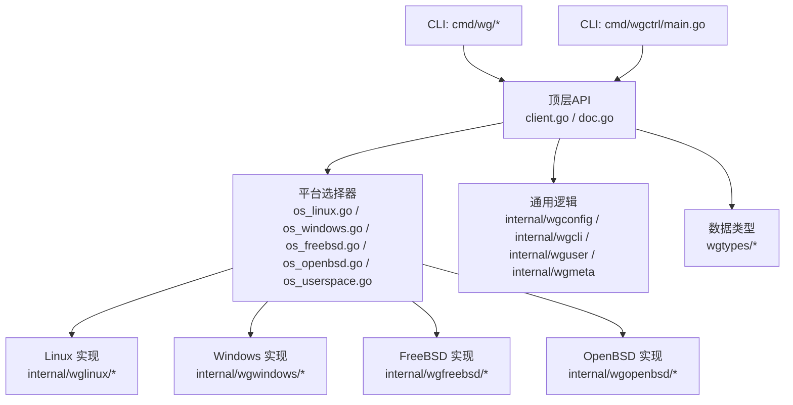
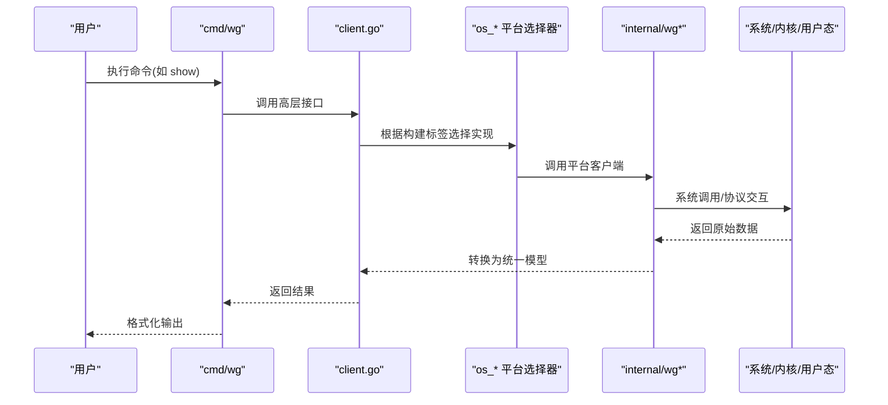
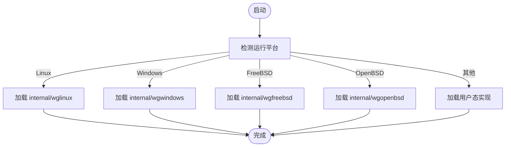
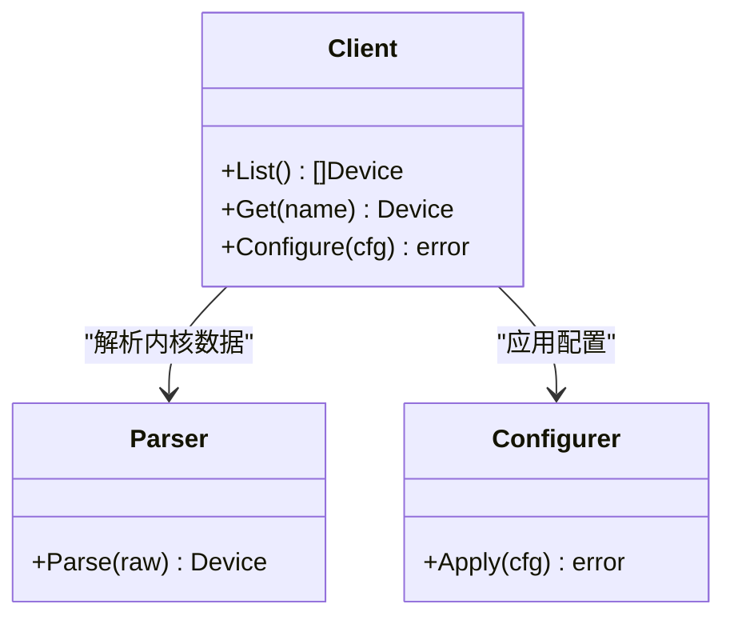
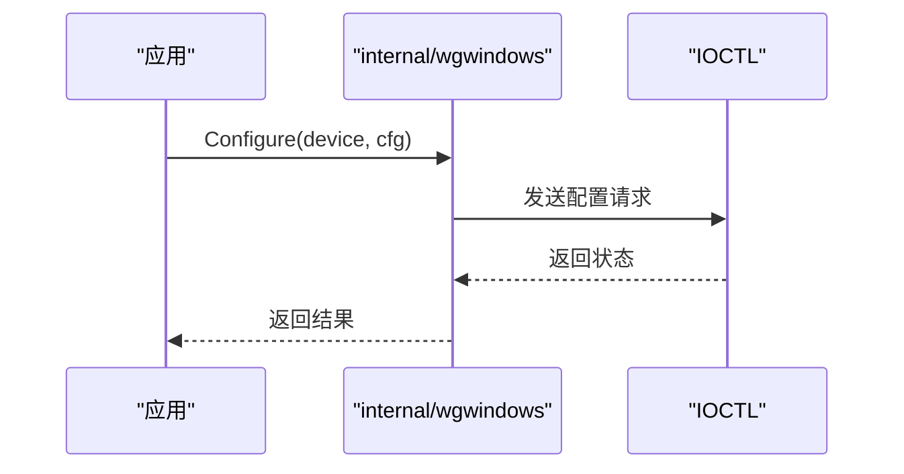
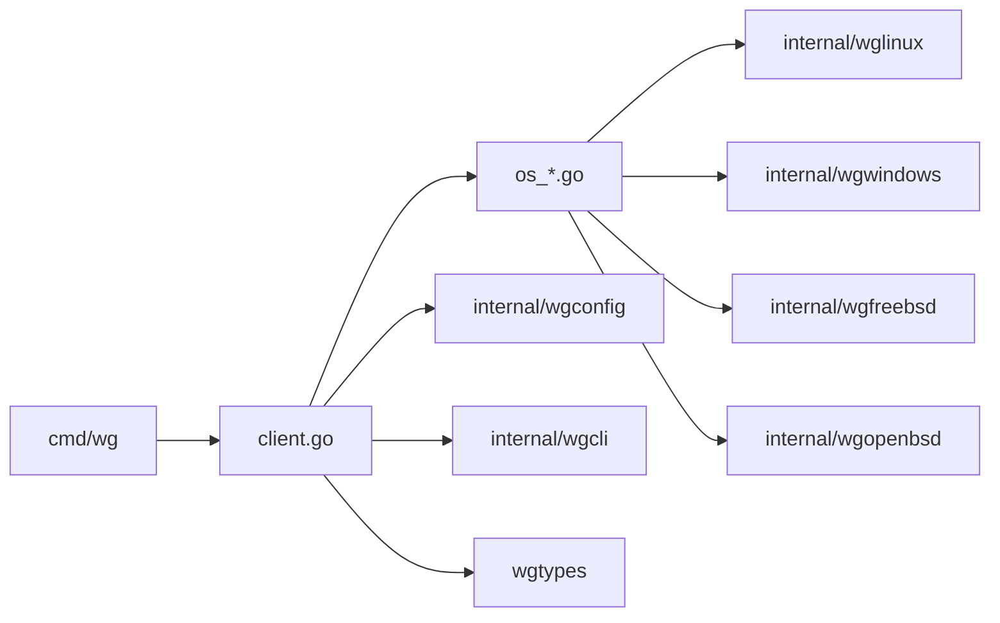

# 开发者指南

<cite>
**本文引用的文件**
- [README.md](file://README.md)
- [readme_cn.md](file://readme_cn.md)
- [CONTRIBUTING.md](file://CONTRIBUTING.md)
- [go.mod.base](file://go.mod.base)
- [go.sum](file://go.sum)
- [client.go](file://client.go)
- [doc.go](file://doc.go)
- [os_linux.go](file://os_linux.go)
- [os_windows.go](file://os_windows.go)
- [os_freebsd.go](file://os_freebsd.go)
- [os_openbsd.go](file://os_openbsd.go)
- [os_userspace.go](file://os_userspace.go)
- [cmd/wg/main.go](file://cmd/wg/main.go)
- [cmd/wg/command.go](file://cmd/wg/command.go)
- [cmd/wg/config.go](file://cmd/wg/config.go)
- [cmd/wg/show.go](file://cmd/wg/show.go)
- [cmd/wgctrl/main.go](file://cmd/wgctrl/main.go)
- [internal/wglinux/client_linux.go](file://internal/wglinux/client_linux.go)
- [internal/wglinux/configure_linux.go](file://internal/wglinux/configure_linux.go)
- [internal/wglinux/parse_linux.go](file://internal/wglinux/parse_linux.go)
- [internal/wgwindows/client_windows.go](file://internal/wgwindows/client_windows.go)
- [internal/wgfreebsd/client_freebsd.go](file://internal/wgfreebsd/client_freebsd.go)
- [internal/wgopenbsd/client_openbsd.go](file://internal/wgopenbsd/client_openbsd.go)
- [internal/wguser/client.go](file://internal/wguser/client.go)
- [internal/wgconfig/parse.go](file://internal/wgconfig/parse.go)
- [internal/wgconfig/encode.go](file://internal/wgconfig/encode.go)
- [internal/wgcli/format.go](file://internal/wgcli/format.go)
- [internal/wgcli/terminal.go](file://internal/wgcli/terminal.go)
- [wgtypes/types.go](file://wgtypes/types.go)
- [wgtypes/errors.go](file://wgtypes/errors.go)
- [.github/workflows/linux-test.yml](file://.github/workflows/linux-test.yml)
- [.github/workflows/linux-integration-test.yml](file://.github/workflows/linux-integration-test.yml)
- [.github/workflows/static-analysis.yml](file://.github/workflows/static-analysis.yml)
- [.builds/freebsd.yml](file://.builds/freebsd.yml)
- [.builds/openbsd.yml](file://.builds/openbsd.yml)
- [.cibuild.sh](file://.cibuild.sh)
</cite>

## 目录
1. [简介](#简介)
2. [项目结构](#项目结构)
3. [核心组件](#核心组件)
4. [架构总览](#架构总览)
5. [详细组件分析](#详细组件分析)
6. [依赖关系分析](#依赖关系分析)
7. [性能与可维护性](#性能与可维护性)
8. [故障排查指南](#故障排查指南)
9. [结论](#结论)
10. [附录](#附录)

## 简介
本指南面向希望参与 wgctrl-go 项目的开发者，覆盖开发环境搭建、构建流程、测试策略、代码组织与设计原则、贡献流程、持续集成与发布、调试技巧与工具推荐，以及如何扩展平台支持、新增功能与修复缺陷。wgctrl-go 提供跨平台的 WireGuard 客户端能力，并在不同操作系统上通过平台特定实现对接内核或用户态接口，同时提供命令行工具以兼容常用操作。

## 项目结构
仓库采用“按平台与职责分层”的组织方式：
- 顶层包暴露统一的 Go API（如 client.go、doc.go），并通过构建标签选择具体平台实现（os_*.go）。
- internal 下按平台划分实现：Linux、Windows、FreeBSD、OpenBSD；以及通用逻辑（wgconfig、wgcli、wguser、wgmeta、wgtest）。
- cmd 提供两个可执行程序：wg（命令行）与 wgctrl（示例/辅助）。
- wgtypes 定义跨平台共享的数据类型与错误。
- .github/workflows 与 .builds 提供 CI/CD 配置。
- go.mod.base 与 go.sum 管理依赖。

图表来源
- [client.go:1-200](file://client.go#L1-L200)
- [os_linux.go:1-200](file://os_linux.go#L1-L200)
- [os_windows.go:1-200](file://os_windows.go#L1-L200)
- [os_freebsd.go:1-200](file://os_freebsd.go#L1-L200)
- [os_openbsd.go:1-200](file://os_openbsd.go#L1-L200)
- [os_userspace.go:1-200](file://os_userspace.go#L1-L200)
- [internal/wglinux/client_linux.go:1-200](file://internal/wglinux/client_linux.go#L1-L200)
- [internal/wgwindows/client_windows.go:1-200](file://internal/wgwindows/client_windows.go#L1-L200)
- [internal/wgfreebsd/client_freebsd.go:1-200](file://internal/wgfreebsd/client_freebsd.go#L1-L200)
- [internal/wgopenbsd/client_openbsd.go:1-200](file://internal/wgopenbsd/client_openbsd.go#L1-L200)
- [internal/wgconfig/parse.go:1-200](file://internal/wgconfig/parse.go#L1-L200)
- [internal/wgcli/format.go:1-200](file://internal/wgcli/format.go#L1-L200)
- [wgtypes/types.go:1-200](file://wgtypes/types.go#L1-L200)
- [cmd/wg/main.go:1-200](file://cmd/wg/main.go#L1-L200)
- [cmd/wgctrl/main.go:1-200](file://cmd/wgctrl/main.go#L1-L200)

章节来源
- [README.md:1-200](file://README.md#L1-L200)
- [readme_cn.md:1-200](file://readme_cn.md#L1-L200)
- [go.mod.base:1-200](file://go.mod.base#L1-L200)
- [go.sum:1-200](file://go.sum#L1-L200)

## 核心组件
- 统一客户端 API：顶层 client.go 暴露创建、查询、配置等能力，内部根据运行平台调用对应实现。
- 平台适配层：os_*.go 负责在编译期选择具体平台实现；各 internal/wg* 包封装系统调用或用户态协议。
- 配置解析与编码：internal/wgconfig 提供配置文件解析与序列化，供 CLI 与上层使用。
- CLI 工具：cmd/wg 提供 show、配置加载等功能；cmd/wgctrl 为辅助入口。
- 数据类型与错误：wgtypes 定义跨平台共享的结构体与错误类型。

章节来源
- [client.go:1-200](file://client.go#L1-L200)
- [doc.go:1-200](file://doc.go#L1-L200)
- [internal/wgconfig/parse.go:1-200](file://internal/wgconfig/parse.go#L1-L200)
- [internal/wgconfig/encode.go:1-200](file://internal/wgconfig/encode.go#L1-L200)
- [cmd/wg/main.go:1-200](file://cmd/wg/main.go#L1-L200)
- [cmd/wgctrl/main.go:1-200](file://cmd/wgctrl/main.go#L1-L200)
- [wgtypes/types.go:1-200](file://wgtypes/types.go#L1-L200)
- [wgtypes/errors.go:1-200](file://wgtypes/errors.go#L1-L200)

## 架构总览
下图展示了从 CLI 到平台实现的调用链与数据流。

图表来源
- [cmd/wg/main.go:1-200](file://cmd/wg/main.go#L1-L200)
- [cmd/wg/command.go:1-200](file://cmd/wg/command.go#L1-L200)
- [client.go:1-200](file://client.go#L1-L200)
- [os_linux.go:1-200](file://os_linux.go#L1-L200)
- [internal/wglinux/client_linux.go:1-200](file://internal/wglinux/client_linux.go#L1-L200)
- [internal/wgwindows/client_windows.go:1-200](file://internal/wgwindows/client_windows.go#L1-L200)
- [internal/wgfreebsd/client_freebsd.go:1-200](file://internal/wgfreebsd/client_freebsd.go#L1-L200)
- [internal/wgopenbsd/client_openbsd.go:1-200](file://internal/wgopenbsd/client_openbsd.go#L1-L200)

## 详细组件分析

### 平台适配层（os_*.go）
- 作用：通过构建标签在不同操作系统上选择对应的客户端实现，屏蔽底层差异。
- 关键点：
  - Linux：对接内核接口，提供设备查询与配置能力。
  - Windows：通过 IOCTL 与系统组件交互。
  - FreeBSD/OpenBSD：通过各自的用户态工具或内核接口。
  - 用户态回退：当无原生支持时，提供基于用户态的实现路径。

图表来源
- [os_linux.go:1-200](file://os_linux.go#L1-L200)
- [os_windows.go:1-200](file://os_windows.go#L1-L200)
- [os_freebsd.go:1-200](file://os_freebsd.go#L1-L200)
- [os_openbsd.go:1-200](file://os_openbsd.go#L1-L200)
- [os_userspace.go:1-200](file://os_userspace.go#L1-L200)

章节来源
- [os_linux.go:1-200](file://os_linux.go#L1-L200)
- [os_windows.go:1-200](file://os_windows.go#L1-L200)
- [os_freebsd.go:1-200](file://os_freebsd.go#L1-L200)
- [os_openbsd.go:1-200](file://os_openbsd.go#L1-L200)
- [os_userspace.go:1-200](file://os_userspace.go#L1-L200)

### Linux 实现（internal/wglinux）
- 职责：提供设备列表获取、配置读取与写入、状态解析等。
- 关键文件：
  - client_linux.go：客户端主入口，封装查询与配置方法。
  - configure_linux.go：配置写入逻辑。
  - parse_linux.go：解析内核返回的原始数据为统一模型。

图表来源
- [internal/wglinux/client_linux.go:1-200](file://internal/wglinux/client_linux.go#L1-L200)
- [internal/wglinux/configure_linux.go:1-200](file://internal/wglinux/configure_linux.go#L1-L200)
- [internal/wglinux/parse_linux.go:1-200](file://internal/wglinux/parse_linux.go#L1-L200)

章节来源
- [internal/wglinux/client_linux.go:1-200](file://internal/wglinux/client_linux.go#L1-L200)
- [internal/wglinux/configure_linux.go:1-200](file://internal/wglinux/configure_linux.go#L1-L200)
- [internal/wglinux/parse_linux.go:1-200](file://internal/wglinux/parse_linux.go#L1-L200)

### Windows 实现（internal/wgwindows）
- 职责：通过 IOCTL 与系统组件通信，完成设备管理与配置。
- 关键文件：
  - client_windows.go：客户端主入口。
  - configuration_windows.go：配置相关 ioctl 封装。

图表来源
- [internal/wgwindows/client_windows.go:1-200](file://internal/wgwindows/client_windows.go#L1-L200)
- [internal/wgwindows/internal/ioctl/configuration_windows.go:1-200](file://internal/wgwindows/internal/ioctl/configuration_windows.go#L1-L200)

章节来源
- [internal/wgwindows/client_windows.go:1-200](file://internal/wgwindows/client_windows.go#L1-L200)
- [internal/wgwindows/internal/ioctl/configuration_windows.go:1-200](file://internal/wgwindows/internal/ioctl/configuration_windows.go#L1-L200)

### FreeBSD/OpenBSD 实现
- 职责：分别对接各自系统的用户态工具或内核接口，提供与 Linux/Windows 一致的 API。
- 关键文件：
  - internal/wgfreebsd/client_freebsd.go
  - internal/wgopenbsd/client_openbsd.go

章节来源
- [internal/wgfreebsd/client_freebsd.go:1-200](file://internal/wgfreebsd/client_freebsd.go#L1-L200)
- [internal/wgopenbsd/client_openbsd.go:1-200](file://internal/wgopenbsd/client_openbsd.go#L1-L200)

### 通用逻辑（wgconfig、wgcli、wguser、wgmeta）
- wgconfig：配置文件解析与编码，确保跨平台一致性。
- wgcli：终端输出格式化与交互逻辑。
- wguser：用户态客户端抽象，用于非特权场景或回退路径。
- wgmeta：元数据存储与锁机制（跨平台）。

章节来源
- [internal/wgconfig/parse.go:1-200](file://internal/wgconfig/parse.go#L1-L200)
- [internal/wgconfig/encode.go:1-200](file://internal/wgconfig/encode.go#L1-L200)
- [internal/wgcli/format.go:1-200](file://internal/wgcli/format.go#L1-L200)
- [internal/wgcli/terminal.go:1-200](file://internal/wgcli/terminal.go#L1-L200)
- [internal/wguser/client.go:1-200](file://internal/wguser/client.go#L1-L200)
- [internal/wgmeta/store.go:1-200](file://internal/wgmeta/store.go#L1-L200)

### CLI 工具（cmd/wg、cmd/wgctrl）
- cmd/wg：提供 show、配置加载等命令，便于日常运维与调试。
- cmd/wgctrl：辅助入口，演示如何调用库。

章节来源
- [cmd/wg/main.go:1-200](file://cmd/wg/main.go#L1-L200)
- [cmd/wg/command.go:1-200](file://cmd/wg/command.go#L1-L200)
- [cmd/wg/config.go:1-200](file://cmd/wg/config.go#L1-L200)
- [cmd/wg/show.go:1-200](file://cmd/wg/show.go#L1-L200)
- [cmd/wgctrl/main.go:1-200](file://cmd/wgctrl/main.go#L1-L200)

### 数据类型与错误（wgtypes）
- 定义跨平台共享的设备、密钥、对等端等数据结构。
- 定义统一错误类型，便于上层处理。

章节来源
- [wgtypes/types.go:1-200](file://wgtypes/types.go#L1-L200)
- [wgtypes/errors.go:1-200](file://wgtypes/errors.go#L1-L200)

## 依赖关系分析
- 顶层 API 依赖平台适配层与通用逻辑。
- 平台实现依赖系统接口或用户态工具。
- CLI 依赖顶层 API 与通用格式化工具。
- 依赖管理由 go.mod.base 与 go.sum 控制。

图表来源
- [client.go:1-200](file://client.go#L1-L200)
- [os_linux.go:1-200](file://os_linux.go#L1-L200)
- [os_windows.go:1-200](file://os_windows.go#L1-L200)
- [os_freebsd.go:1-200](file://os_freebsd.go#L1-L200)
- [os_openbsd.go:1-200](file://os_openbsd.go#L1-L200)
- [internal/wgconfig/parse.go:1-200](file://internal/wgconfig/parse.go#L1-L200)
- [internal/wgcli/format.go:1-200](file://internal/wgcli/format.go#L1-L200)
- [wgtypes/types.go:1-200](file://wgtypes/types.go#L1-L200)
- [cmd/wg/main.go:1-200](file://cmd/wg/main.go#L1-L200)

章节来源
- [go.mod.base:1-200](file://go.mod.base#L1-L200)
- [go.sum:1-200](file://go.sum#L1-L200)

## 性能与可维护性
- 平台选择器应在编译期确定，避免运行时分支开销。
- 解析与编码逻辑应尽量避免重复分配，复用缓冲区。
- 日志与错误信息应包含上下文（如设备名、操作类型），便于定位问题。
- 单元测试与集成测试应覆盖主要路径与边界条件。

[本节为通用指导，不直接分析具体文件]

## 故障排查指南
- 常见问题：
  - 权限不足：在 Linux/Windows 上可能需要管理员/root 权限。
  - 平台不支持：确认当前平台有对应实现；必要时启用用户态回退。
  - 配置错误：检查配置文件语法与必填字段。
- 调试建议：
  - 使用 CLI 工具逐步验证：先 show，再尝试配置。
  - 开启详细日志（若实现支持），观察系统调用与返回值。
  - 在本地模拟失败路径，验证错误处理逻辑。

章节来源
- [wgtypes/errors.go:1-200](file://wgtypes/errors.go#L1-L200)
- [internal/wgcli/format.go:1-200](file://internal/wgcli/format.go#L1-L200)
- [internal/wgconfig/parse.go:1-200](file://internal/wgconfig/parse.go#L1-L200)

## 结论
wgctrl-go 通过清晰的层次化设计与平台适配，提供了稳定、可扩展的 WireGuard 客户端能力。遵循本指南中的开发规范、测试策略与贡献流程，可以高效地添加新功能、修复缺陷并保证质量。

[本节为总结，不直接分析具体文件]

## 附录

### 开发环境搭建
- 安装 Go 工具链（版本参考 go.mod.base）。
- 克隆仓库并进入目录。
- 安装依赖：go mod tidy（基于 go.mod.base/go.sum）。
- 可选：安装静态分析与测试工具（见持续集成部分）。

章节来源
- [go.mod.base:1-200](file://go.mod.base#L1-L200)
- [go.sum:1-200](file://go.sum#L1-L200)

### 构建流程
- 默认构建：go build ./...
- 指定平台：使用 GOOS/GOARCH 交叉编译。
- 生成 CLI：go build -o wg ./cmd/wg && go build -o wgctrl ./cmd/wgctrl

章节来源
- [cmd/wg/main.go:1-200](file://cmd/wg/main.go#L1-L200)
- [cmd/wgctrl/main.go:1-200](file://cmd/wgctrl/main.go#L1-L200)

### 测试策略
- 单元测试：go test ./...
- 集成测试：针对 Linux 等平台运行集成用例。
- 平台矩阵：在 CI 中覆盖多平台构建与测试。

章节来源
- [.github/workflows/linux-test.yml:1-200](file://.github/workflows/linux-test.yml#L1-L200)
- [.github/workflows/linux-integration-test.yml:1-200](file://.github/workflows/linux-integration-test.yml#L1-L200)
- [.builds/freebsd.yml:1-200](file://.builds/freebsd.yml#L1-L200)
- [.builds/openbsd.yml:1-200](file://.builds/openbsd.yml#L1-L200)

### 贡献流程
- 代码规范：遵循 Go 官方风格，保持函数与包职责单一。
- 提交要求：提交信息清晰描述变更目的与影响范围。
- 审查流程：提交 PR 后等待自动化检查与人工审查。

章节来源
- [CONTRIBUTING.md:1-200](file://CONTRIBUTING.md#L1-L200)

### 持续集成与发布
- CI 配置：
  - Linux 测试与集成测试：.github/workflows/*.yml
  - 静态分析：.github/workflows/static-analysis.yml
  - BSD 构建：.builds/freebsd.yml、.builds/openbsd.yml
- 发布流程：遵循仓库发布的约定（版本号、变更日志等）。

章节来源
- [.github/workflows/linux-test.yml:1-200](file://.github/workflows/linux-test.yml#L1-L200)
- [.github/workflows/linux-integration-test.yml:1-200](file://.github/workflows/linux-integration-test.yml#L1-L200)
- [.github/workflows/static-analysis.yml:1-200](file://.github/workflows/static-analysis.yml#L1-L200)
- [.builds/freebsd.yml:1-200](file://.builds/freebsd.yml#L1-L200)
- [.builds/openbsd.yml:1-200](file://.builds/openbsd.yml#L1-L200)
- [.cibuild.sh:1-200](file://.cibuild.sh#L1-L200)

### 调试技巧与开发工具
- 推荐使用 go test -v 与 -race 进行并发安全检测。
- 使用 go tool trace 分析热点路径。
- 在 CLI 中增加详细输出，结合系统日志定位问题。

[本节为通用指导，不直接分析具体文件]

### 如何添加新的平台支持
- 步骤：
  1. 在 internal 下新建平台包（如 internal/wgxplat）。
  2. 实现客户端接口（查询、配置、解析）。
  3. 在顶层 os_xxx.go 中添加构建标签与实现选择。
  4. 补充单元测试与集成测试。
  5. 更新 CI 配置以覆盖新平台。

章节来源
- [os_linux.go:1-200](file://os_linux.go#L1-L200)
- [os_windows.go:1-200](file://os_windows.go#L1-L200)
- [os_freebsd.go:1-200](file://os_freebsd.go#L1-L200)
- [os_openbsd.go:1-200](file://os_openbsd.go#L1-L200)
- [.github/workflows/linux-test.yml:1-200](file://.github/workflows/linux-test.yml#L1-L200)

### 如何扩展功能
- 在顶层 API 中新增方法，并在各平台实现中提供对应逻辑。
- 更新 CLI 以暴露新功能。
- 编写测试用例覆盖新行为。

章节来源
- [client.go:1-200](file://client.go#L1-L200)
- [cmd/wg/main.go:1-200](file://cmd/wg/main.go#L1-L200)

### 如何修复 Bug
- 复现问题：最小化用例，编写失败测试。
- 定位根因：查看平台实现与解析逻辑。
- 修复与回归：提交修复并补充测试，确保不再复发。

章节来源
- [wgtypes/errors.go:1-200](file://wgtypes/errors.go#L1-L200)
- [internal/wgconfig/parse.go:1-200](file://internal/wgconfig/parse.go#L1-L200)

### 代码质量检查、性能分析与安全审计
- 代码质量：
  - 使用 go vet、staticcheck 等工具。
  - 遵循 CONTRIBUTING.md 中的规范。
- 性能分析：
  - 使用 pprof 与 trace 定位瓶颈。
- 安全审计：
  - 关注敏感数据处理与权限控制。
  - 定期扫描依赖漏洞。

章节来源
- [CONTRIBUTING.md:1-200](file://CONTRIBUTING.md#L1-L200)
- [.github/workflows/static-analysis.yml:1-200](file://.github/workflows/static-analysis.yml#L1-L200)