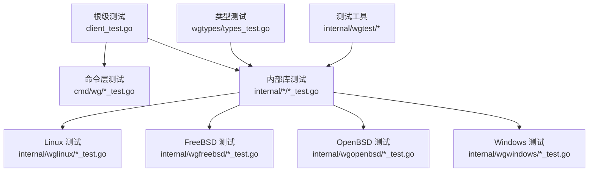
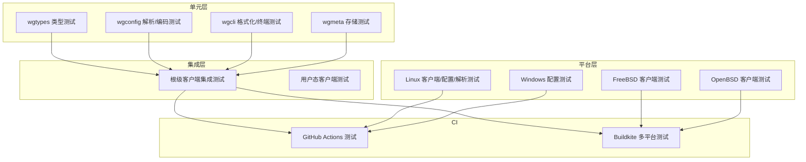
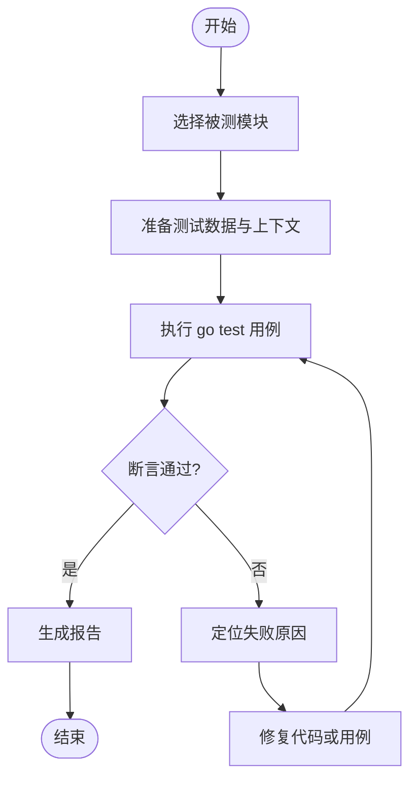
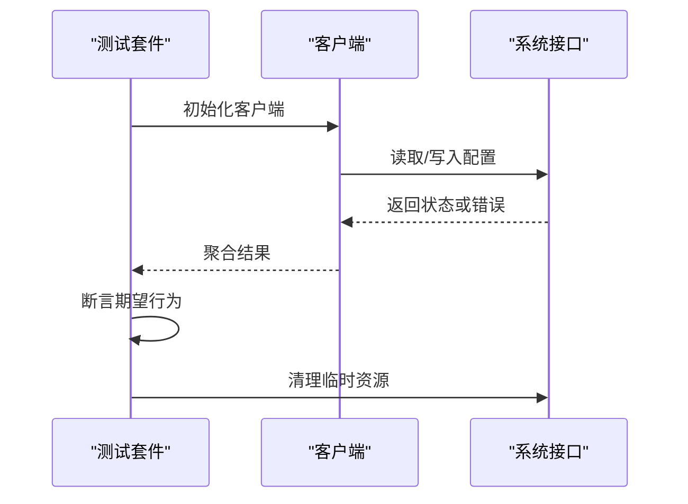
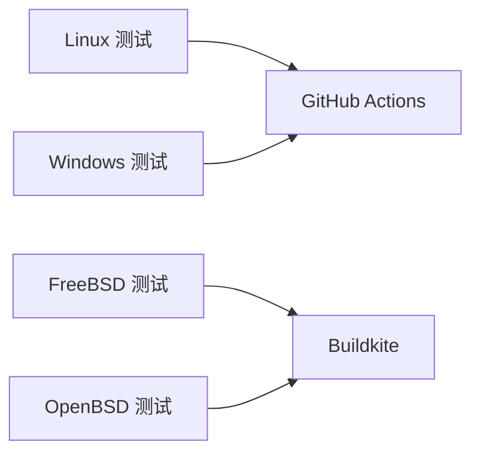
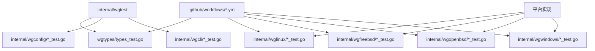

# 测试策略

<cite>
**本文引用的文件**
- [client_integration_test.go](file://client_integration_test.go)
- [client_test.go](file://client_test.go)
- [cmd/wg/command_test.go](file://cmd/wg/command_test.go)
- [cmd/wg/config_test.go](file://cmd/wg/config_test.go)
- [cmd/wg/show_test.go](file://cmd/wg/show_test.go)
- [internal/wgcli/format_test.go](file://internal/wgcli/format_test.go)
- [internal/wgcli/terminal_test.go](file://internal/wgcli/terminal_test.go)
- [internal/wgconfig/encode_test.go](file://internal/wgconfig/encode_test.go)
- [internal/wgconfig/parse_test.go](file://internal/wgconfig/parse_test.go)
- [internal/wgfreebsd/client_freebsd_test.go](file://internal/wgfreebsd/client_freebsd_test.go)
- [internal/wglinux/client_linux_test.go](file://internal/wglinux/client_linux_test.go)
- [internal/wglinux/configure_linux_test.go](file://internal/wglinux/configure_linux_test.go)
- [internal/wglinux/parse_linux_test.go](file://internal/wglinux/parse_linux_test.go)
- [internal/wgmeta/store_test.go](file://internal/wgmeta/store_test.go)
- [internal/wgopenbsd/client_openbsd_test.go](file://internal/wgopenbsd/client_openbsd_test.go)
- [internal/wgtest/doc.go](file://internal/wgtest/doc.go)
- [internal/wgtest/wgtest.go](file://internal/wgtest/wgtest.go)
- [internal/wguser/client_test.go](file://internal/wguser/client_test.go)
- [internal/wguser/configure_test.go](file://internal/wguser/configure_test.go)
- [internal/wguser/conn_unix_test.go](file://internal/wguser/conn_unix_test.go)
- [internal/wguser/conn_windows_test.go](file://internal/wguser/conn_windows_test.go)
- [internal/wguser/parse_test.go](file://internal/wguser/parse_test.go)
- [internal/wgwindows/configuration_windows_test.go](file://internal/wgwindows/configuration_windows_test.go)
- [wgtypes/types_test.go](file://wgtypes/types_test.go)
- [.github/workflows/linux-test.yml](file://.github/workflows/linux-test.yml)
- [.github/workflows/linux-integration-test.yml](file://.github/workflows/linux-integration-test.yml)
- [.builds/freebsd.yml](file://.builds/freebsd.yml)
- [.builds/openbsd.yml](file://.builds/openbsd.yml)
</cite>

## 目录
1. [简介](#简介)
2. [项目结构](#项目结构)
3. [核心组件](#核心组件)
4. [架构总览](#架构总览)
5. [详细组件分析](#详细组件分析)
6. [依赖关系分析](#依赖关系分析)
7. [性能考虑](#性能考虑)
8. [故障排查指南](#故障排查指南)
9. [结论](#结论)
10. [附录](#附录)

## 简介
本测试策略文档面向 wgctrl-go 项目的单元测试、集成测试与端到端（E2E）测试，覆盖以下方面：
- 测试组织与执行方式
- 测试框架使用与约定
- Mock 对象创建与隔离策略
- 测试数据管理
- 跨平台测试策略（Linux、FreeBSD、OpenBSD、Windows）
- CI 中的测试执行流程
- 最佳实践与性能测试指导
- 覆盖率要求与调试技巧

本项目采用 Go 原生 testing 包进行单元测试，并通过构建标签与平台特定实现进行跨平台适配。集成测试位于根目录，用于验证客户端与系统交互的正确性。CI 通过 GitHub Actions 和 Buildkite 在多个平台上执行测试。

## 项目结构
测试代码按功能模块与平台划分，遵循“就近测试”原则：
- 根级测试：client_test.go、client_integration_test.go 提供通用客户端与集成测试入口
- 命令层测试：cmd/wg/*_test.go 覆盖 CLI 命令解析与输出
- 内部库测试：internal/* 下各子模块的 *_test.go 对应各自能力（配置解析、格式输出、用户态客户端等）
- 平台相关测试：internal/wglinux、internal/wgfreebsd、internal/wgopenbsd、internal/wgwindows 下的测试文件
- 类型测试：wgtypes/types_test.go 覆盖核心数据结构
- 测试工具：internal/wgtest 提供共享测试辅助

**图表来源**
- [client_test.go:1-200](file://client_test.go#L1-L200)
- [client_integration_test.go:1-200](file://client_integration_test.go#L1-L200)
- [cmd/wg/command_test.go:1-200](file://cmd/wg/command_test.go#L1-L200)
- [internal/wglinux/client_linux_test.go:1-200](file://internal/wglinux/client_linux_test.go#L1-L200)
- [internal/wgfreebsd/client_freebsd_test.go:1-200](file://internal/wgfreebsd/client_freebsd_test.go#L1-L200)
- [internal/wgopenbsd/client_openbsd_test.go:1-200](file://internal/wgopenbsd/client_openbsd_test.go#L1-L200)
- [internal/wgwindows/configuration_windows_test.go:1-200](file://internal/wgwindows/configuration_windows_test.go#L1-L200)
- [wgtypes/types_test.go:1-200](file://wgtypes/types_test.go#L1-L200)
- [internal/wgtest/wgtest.go:1-200](file://internal/wgtest/wgtest.go#L1-L200)

**章节来源**
- [client_test.go:1-200](file://client_test.go#L1-L200)
- [client_integration_test.go:1-200](file://client_integration_test.go#L1-L200)
- [cmd/wg/command_test.go:1-200](file://cmd/wg/command_test.go#L1-L200)
- [internal/wgcli/format_test.go:1-200](file://internal/wgcli/format_test.go#L1-L200)
- [internal/wgcli/terminal_test.go:1-200](file://internal/wgcli/terminal_test.go#L1-L200)
- [internal/wgconfig/encode_test.go:1-200](file://internal/wgconfig/encode_test.go#L1-L200)
- [internal/wgconfig/parse_test.go:1-200](file://internal/wgconfig/parse_test.go#L1-L200)
- [internal/wgmeta/store_test.go:1-200](file://internal/wgmeta/store_test.go#L1-L200)
- [internal/wguser/client_test.go:1-200](file://internal/wguser/client_test.go#L1-L200)
- [internal/wguser/configure_test.go:1-200](file://internal/wguser/configure_test.go#L1-L200)
- [internal/wguser/conn_unix_test.go:1-200](file://internal/wguser/conn_unix_test.go#L1-L200)
- [internal/wguser/conn_windows_test.go:1-200](file://internal/wguser/conn_windows_test.go#L1-L200)
- [internal/wguser/parse_test.go:1-200](file://internal/wguser/parse_test.go#L1-L200)
- [wgtypes/types_test.go:1-200](file://wgtypes/types_test.go#L1-L200)

## 核心组件
- 单元测试：基于 Go testing，覆盖核心类型、配置解析、CLI 命令与平台客户端逻辑
- 集成测试：根级 client_integration_test.go 驱动真实或模拟的系统交互
- 测试工具：internal/wgtest 提供共享辅助函数与断言封装
- 平台适配：通过构建标签区分 Linux、FreeBSD、OpenBSD、Windows 的测试执行路径

关键职责：
- 保证核心类型与配置的稳定性
- 确保 CLI 行为一致性与可预测性
- 验证不同平台上的客户端行为一致性
- 在 CI 中自动化执行跨平台测试

**章节来源**
- [internal/wgtest/wgtest.go:1-200](file://internal/wgtest/wgtest.go#L1-L200)
- [internal/wgtest/doc.go:1-200](file://internal/wgtest/doc.go#L1-L200)
- [client_integration_test.go:1-200](file://client_integration_test.go#L1-L200)

## 架构总览
测试架构围绕“分层隔离”与“平台适配”展开：
- 单元层：纯函数与无副作用逻辑，快速且稳定
- 集成层：涉及文件系统、网络、系统调用等外部依赖，需要 Mock 或受控环境
- 平台层：针对不同 OS 的行为差异进行专项测试
- CI 层：在多平台环境中自动执行测试并收集结果

**图表来源**
- [.github/workflows/linux-test.yml:1-200](file://.github/workflows/linux-test.yml#L1-L200)
- [.github/workflows/linux-integration-test.yml:1-200](file://.github/workflows/linux-integration-test.yml#L1-L200)
- [.builds/freebsd.yml:1-200](file://.builds/freebsd.yml#L1-L200)
- [.builds/openbsd.yml:1-200](file://.builds/openbsd.yml#L1-L200)

## 详细组件分析

### 单元测试组织与执行
- 测试命名与位置：每个被测试文件旁放置同名 _test.go
- 测试用例设计：表驱动测试为主，覆盖边界条件与错误分支
- 执行方式：go test ./... 在目标目录下运行所有测试
- 典型范围：
  - wgtypes/types_test.go：核心数据结构与序列化
  - internal/wgconfig/parse_test.go、encode_test.go：配置解析与编码
  - internal/wgcli/format_test.go、terminal_test.go：输出格式与终端交互
  - internal/wgmeta/store_test.go：元数据存储与锁机制
  - cmd/wg/*_test.go：CLI 命令解析与展示

**图表来源**
- [wgtypes/types_test.go:1-200](file://wgtypes/types_test.go#L1-L200)
- [internal/wgconfig/parse_test.go:1-200](file://internal/wgconfig/parse_test.go#L1-L200)
- [internal/wgconfig/encode_test.go:1-200](file://internal/wgconfig/encode_test.go#L1-L200)
- [internal/wgcli/format_test.go:1-200](file://internal/wgcli/format_test.go#L1-L200)
- [internal/wgcli/terminal_test.go:1-200](file://internal/wgcli/terminal_test.go#L1-L200)
- [internal/wgmeta/store_test.go:1-200](file://internal/wgmeta/store_test.go#L1-L200)
- [cmd/wg/command_test.go:1-200](file://cmd/wg/command_test.go#L1-L200)

**章节来源**
- [wgtypes/types_test.go:1-200](file://wgtypes/types_test.go#L1-L200)
- [internal/wgconfig/parse_test.go:1-200](file://internal/wgconfig/parse_test.go#L1-L200)
- [internal/wgconfig/encode_test.go:1-200](file://internal/wgconfig/encode_test.go#L1-L200)
- [internal/wgcli/format_test.go:1-200](file://internal/wgcli/format_test.go#L1-L200)
- [internal/wgcli/terminal_test.go:1-200](file://internal/wgcli/terminal_test.go#L1-L200)
- [internal/wgmeta/store_test.go:1-200](file://internal/wgmeta/store_test.go#L1-L200)
- [cmd/wg/command_test.go:1-200](file://cmd/wg/command_test.go#L1-L200)

### 集成测试组织与执行
- 位置：根目录 client_integration_test.go
- 目标：验证客户端与系统交互（如配置下发、状态查询）的正确性
- 执行：通常在具备相应权限与环境的前提下运行，或在 CI 中按需启用
- 注意事项：
  - 需要合适的系统权限与内核支持
  - 可能涉及临时资源清理与回滚
  - 建议在专用环境或容器中执行以避免污染

**图表来源**
- [client_integration_test.go:1-200](file://client_integration_test.go#L1-L200)

**章节来源**
- [client_integration_test.go:1-200](file://client_integration_test.go#L1-L200)

### 端到端（E2E）测试策略
- 目标：模拟真实用户使用场景，覆盖从 CLI 输入到系统响应的完整链路
- 方法：
  - 启动 CLI 进程并注入输入
  - 校验输出与系统状态变化
  - 在受限环境中回放关键用例
- 建议：
  - 将 E2E 与常规单元测试分离，避免阻塞主流水线
  - 使用最小化镜像或容器以加速执行
  - 记录关键日志以便失败时回溯

[本节为概念性说明，不直接分析具体文件]

### 测试框架与约定
- 框架：Go 标准 testing 包
- 命名规范：TestXxx(t *testing.T)、BenchmarkXxx(b *testing.B)
- 表驱动测试：统一维护用例集合，便于扩展与维护
- 并行执行：合理使用 t.Parallel() 提升速度，注意资源竞争

**章节来源**
- [wgtypes/types_test.go:1-200](file://wgtypes/types_test.go#L1-L200)
- [internal/wgconfig/parse_test.go:1-200](file://internal/wgconfig/parse_test.go#L1-L200)
- [internal/wgcli/format_test.go:1-200](file://internal/wgcli/format_test.go#L1-L200)

### Mock 对象与隔离策略
- 原则：尽量通过接口抽象与依赖注入降低耦合
- 策略：
  - 对系统调用与外部服务进行封装，便于替换为测试替身
  - 使用 stub/mock 替代真实 I/O，确保测试确定性
  - 对时间、随机数等不稳定因素进行控制
- 工具：internal/wgtest 提供共享辅助，减少重复造轮子

**章节来源**
- [internal/wgtest/wgtest.go:1-200](file://internal/wgtest/wgtest.go#L1-L200)
- [internal/wgtest/doc.go:1-200](file://internal/wgtest/doc.go#L1-L200)

### 测试数据管理
- 数据来源：内联样例、固定字符串、配置文件片段
- 管理方式：
  - 小数据：直接嵌入测试文件
  - 大数据：使用独立 fixtures 目录并按需加载
- 生命周期：测试前准备、测试后清理，避免残留影响

**章节来源**
- [internal/wgconfig/parse_test.go:1-200](file://internal/wgconfig/parse_test.go#L1-L200)
- [internal/wgconfig/encode_test.go:1-200](file://internal/wgconfig/encode_test.go#L1-L200)
- [internal/wgmeta/store_test.go:1-200](file://internal/wgmeta/store_test.go#L1-L200)

### 跨平台测试策略
- 构建标签：通过 GOOS/GOARCH 与 build tags 区分平台实现
- 测试覆盖：
  - Linux：client_linux_test.go、configure_linux_test.go、parse_linux_test.go
  - FreeBSD：client_freebsd_test.go
  - OpenBSD：client_openbsd_test.go
  - Windows：configuration_windows_test.go
- CI 执行：
  - GitHub Actions：Linux 测试与集成测试
  - Buildkite：FreeBSD 与 OpenBSD 测试

**图表来源**
- [.github/workflows/linux-test.yml:1-200](file://.github/workflows/linux-test.yml#L1-L200)
- [.github/workflows/linux-integration-test.yml:1-200](file://.github/workflows/linux-integration-test.yml#L1-L200)
- [.builds/freebsd.yml:1-200](file://.builds/freebsd.yml#L1-L200)
- [.builds/openbsd.yml:1-200](file://.builds/openbsd.yml#L1-L200)

**章节来源**
- [internal/wglinux/client_linux_test.go:1-200](file://internal/wglinux/client_linux_test.go#L1-L200)
- [internal/wglinux/configure_linux_test.go:1-200](file://internal/wglinux/configure_linux_test.go#L1-L200)
- [internal/wglinux/parse_linux_test.go:1-200](file://internal/wglinux/parse_linux_test.go#L1-L200)
- [internal/wgfreebsd/client_freebsd_test.go:1-200](file://internal/wgfreebsd/client_freebsd_test.go#L1-L200)
- [internal/wgopenbsd/client_openbsd_test.go:1-200](file://internal/wgopenbsd/client_openbsd_test.go#L1-L200)
- [internal/wgwindows/configuration_windows_test.go:1-200](file://internal/wgwindows/configuration_windows_test.go#L1-L200)

### CI 中的测试执行
- GitHub Actions：
  - linux-test.yml：执行 Linux 单元测试
  - linux-integration-test.yml：执行 Linux 集成测试
- Buildkite：
  - freebsd.yml：执行 FreeBSD 测试
  - openbsd.yml：执行 OpenBSD 测试
- 建议：
  - 缓存依赖以提升速度
  - 并行执行任务缩短反馈时间
  - 失败时保留日志与产物便于诊断

**章节来源**
- [.github/workflows/linux-test.yml:1-200](file://.github/workflows/linux-test.yml#L1-L200)
- [.github/workflows/linux-integration-test.yml:1-200](file://.github/workflows/linux-integration-test.yml#L1-L200)
- [.builds/freebsd.yml:1-200](file://.builds/freebsd.yml#L1-L200)
- [.builds/openbsd.yml:1-200](file://.builds/openbsd.yml#L1-L200)

### 最佳实践
- 用例设计：
  - 表驱动测试优先，集中管理输入输出与期望
  - 覆盖正常路径、边界值与错误分支
- 隔离与确定性：
  - 避免全局状态，必要时在测试前后重置
  - 控制时间、随机数与外部依赖
- 可读性与维护：
  - 清晰的测试命名与注释
  - 拆分复杂用例为子用例
- 性能：
  - 合理并行化，避免竞争条件
  - 基准测试识别热点路径

[本节为通用指导，不直接分析具体文件]

### 性能测试指导
- 基准测试：使用 BenchmarkXxx 评估关键路径性能
- 指标：时间、内存分配次数、GC 压力
- 环境：在稳定环境下运行，避免噪声干扰
- 优化：根据基准结果调整算法与数据结构

[本节为通用指导，不直接分析具体文件]

### 覆盖率要求
- 目标：核心模块保持高覆盖率（建议 ≥80%）
- 统计：使用 go test -cover 或 CI 集成覆盖率上报
- 重点：错误处理、边界条件与平台差异路径
- 持续改进：逐步提升覆盖率，避免盲目追求数值

[本节为通用指导，不直接分析具体文件]

### 调试技巧
- 本地调试：
  - 使用 go test -v 输出详细日志
  - 针对单个用例执行：go test -run TestName
- 远程/CI 调试：
  - 保存测试日志与中间产物
  - 复现问题最小化用例
- 常见问题：
  - 权限不足导致集成测试失败
  - 平台差异导致的断言不一致
  - 资源未清理导致后续用例失败

**章节来源**
- [client_integration_test.go:1-200](file://client_integration_test.go#L1-L200)
- [internal/wguser/conn_unix_test.go:1-200](file://internal/wguser/conn_unix_test.go#L1-L200)
- [internal/wguser/conn_windows_test.go:1-200](file://internal/wguser/conn_windows_test.go#L1-L200)

## 依赖关系分析
测试之间的依赖主要体现在：
- 共享测试工具：internal/wgtest 被多处复用
- 平台实现：各平台测试依赖对应的构建标签与系统接口
- CI 配置：工作流文件定义测试执行顺序与条件

**图表来源**
- [internal/wgtest/wgtest.go:1-200](file://internal/wgtest/wgtest.go#L1-L200)
- [.github/workflows/linux-test.yml:1-200](file://.github/workflows/linux-test.yml#L1-L200)
- [.github/workflows/linux-integration-test.yml:1-200](file://.github/workflows/linux-integration-test.yml#L1-L200)

**章节来源**
- [internal/wgtest/wgtest.go:1-200](file://internal/wgtest/wgtest.go#L1-L200)
- [.github/workflows/linux-test.yml:1-200](file://.github/workflows/linux-test.yml#L1-L200)
- [.github/workflows/linux-integration-test.yml:1-200](file://.github/workflows/linux-integration-test.yml#L1-L200)

## 性能考虑
- 测试执行效率：
  - 并行化测试，但避免共享可变状态
  - 减少 I/O 操作，使用内存替身
- 资源占用：
  - 及时释放文件句柄与网络连接
  - 控制并发度防止资源耗尽
- 基准与剖析：
  - 使用 go test -bench 与 pprof 定位瓶颈
  - 关注 GC 与内存分配热点

[本节为通用指导，不直接分析具体文件]

## 故障排查指南
- 常见错误：
  - 权限不足：检查系统权限与内核模块加载
  - 平台差异：确认构建标签与目标平台匹配
  - 资源竞争：避免并行测试中的共享资源冲突
- 诊断步骤：
  - 缩小范围：仅运行失败用例
  - 增加日志：输出关键状态与变量
  - 复现环境：在 CI 中保留日志与产物
- 恢复措施：
  - 清理临时文件与锁
  - 重置系统状态或重启服务

**章节来源**
- [client_integration_test.go:1-200](file://client_integration_test.go#L1-L200)
- [internal/wguser/conn_unix_test.go:1-200](file://internal/wguser/conn_unix_test.go#L1-L200)
- [internal/wguser/conn_windows_test.go:1-200](file://internal/wguser/conn_windows_test.go#L1-L200)

## 结论
本测试策略通过分层隔离、平台适配与 CI 自动化，确保 wgctrl-go 在不同环境与版本下的稳定性与正确性。建议持续完善用例覆盖、优化执行效率，并在团队内推广最佳实践，以维持高质量交付。

[本节为总结性内容，不直接分析具体文件]

## 附录
- 参考文件：
  - 根级测试：client_test.go、client_integration_test.go
  - 命令层测试：cmd/wg/*_test.go
  - 内部库测试：internal/*/*_test.go
  - 平台测试：internal/wg*/*_test.go
  - 类型测试：wgtypes/types_test.go
  - 测试工具：internal/wgtest/*
  - CI 配置：.github/workflows/*.yml、.builds/*.yml

[本节为索引性内容，不直接分析具体文件]