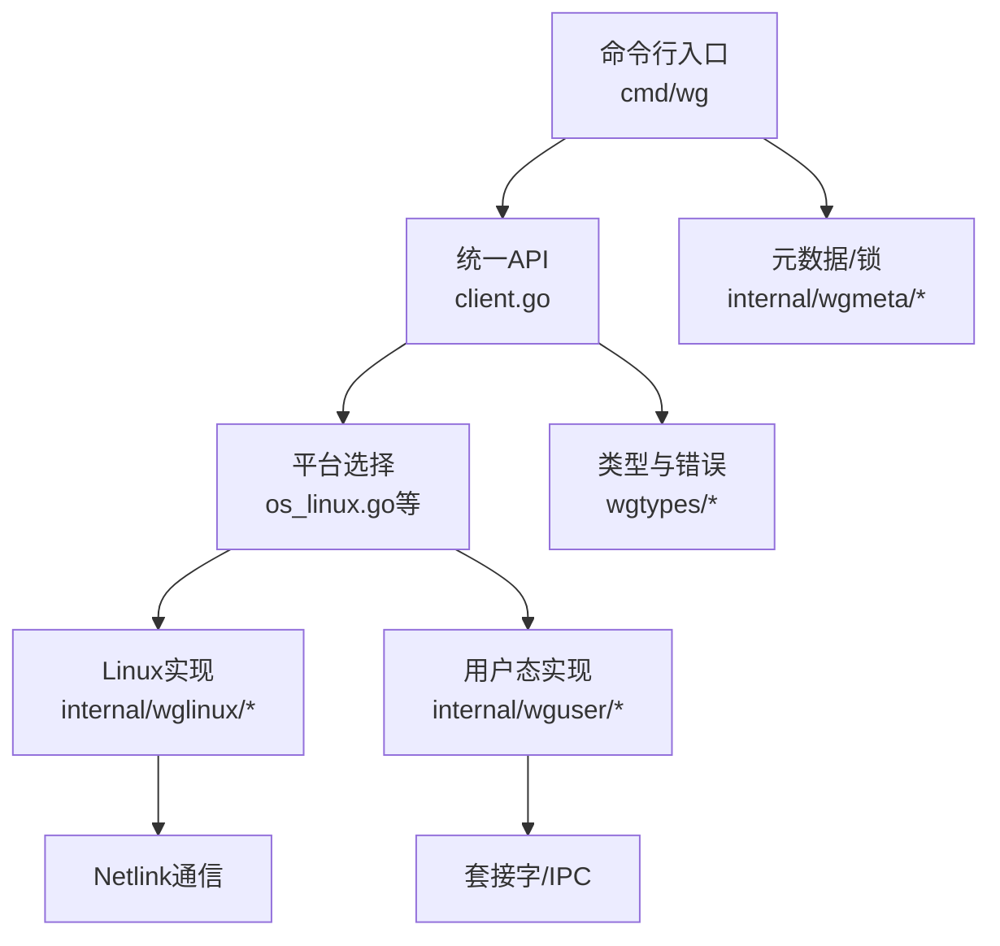
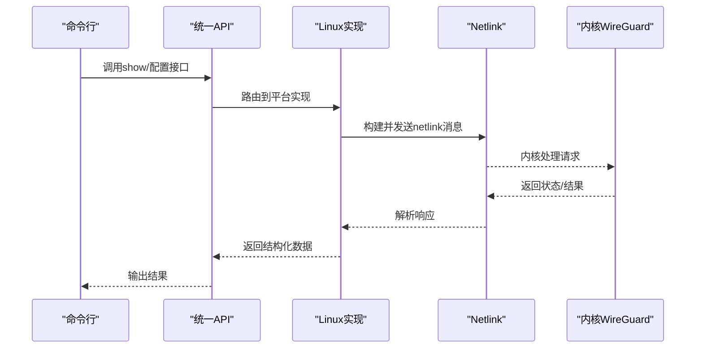
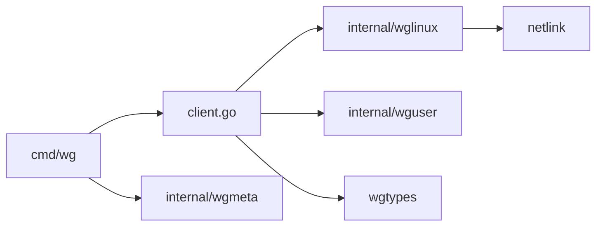
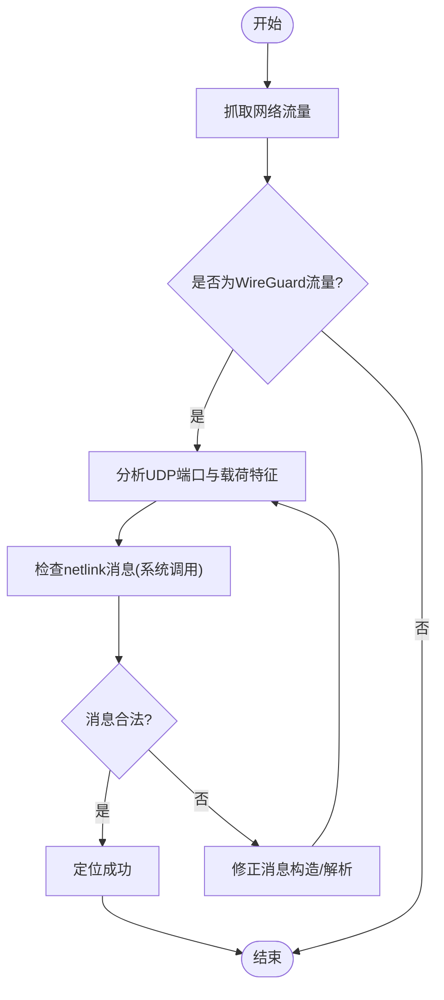

# 调试工具和技巧

<cite>
**本文引用的文件**
- [README.md](file://README.md)
- [readme_cn.md](file://readme_cn.md)
- [client.go](file://client.go)
- [os_linux.go](file://os_linux.go)
- [internal/wglinux/client_linux.go](file://internal/wglinux/client_linux.go)
- [internal/wglinux/configure_linux.go](file://internal/wglinux/configure_linux.go)
- [internal/wglinux/parse_linux.go](file://internal/wglinux/parse_linux.go)
- [internal/wguser/client.go](file://internal/wguser/client.go)
- [internal/wguser/conn_unix.go](file://internal/wguser/conn_unix.go)
- [cmd/wg/main.go](file://cmd/wg/main.go)
- [cmd/wg/command.go](file://cmd/wg/command.go)
- [cmd/wg/show.go](file://cmd/wg/show.go)
- [wgtypes/types.go](file://wgtypes/types.go)
- [wgtypes/errors.go](file://wgtypes/errors.go)
- [internal/wgmeta/store.go](file://internal/wgmeta/store.go)
- [internal/wgtest/wgtest.go](file://internal/wgtest/wgtest.go)
</cite>

## 目录
1. [简介](#简介)
2. [项目结构](#项目结构)
3. [核心组件](#核心组件)
4. [架构总览](#架构总览)
5. [详细组件分析](#详细组件分析)
6. [依赖关系分析](#依赖关系分析)
7. [性能考虑](#性能考虑)
8. [故障排查指南](#故障排查指南)
9. [结论](#结论)
10. [附录](#附录)

## 简介
本指南面向使用 wgctrl-go 进行 WireGuard 配置与状态管理的开发者，聚焦于“如何高效调试”。内容涵盖：
- Go 调试器（断点、变量检查、堆栈跟踪）
- 日志记录策略与调试输出格式
- 网络调试工具（Wireshark 抓包、netlink 通信调试）
- 性能分析与内存泄漏检测
- 常见问题定位步骤与解决方案

本仓库提供跨平台客户端实现，Linux 通过 netlink 与内核交互，其他平台通过系统接口或用户态工具。理解这些路径有助于在调试时快速定位问题域。

## 项目结构
仓库采用按平台与职责分层组织：
- 顶层 client.go 暴露统一 API，内部根据运行平台选择具体实现
- internal/wglinux 为 Linux 专用实现，负责 netlink 通信、配置下发与状态解析
- internal/wguser 为用户态通用逻辑，封装连接与协议细节
- cmd/wg 提供命令行入口，便于端到端验证与调试
- wgtypes 定义类型与错误
- internal/wgmeta 管理本地元数据与锁
- internal/wgtest 提供测试辅助

**图表来源**
- [client.go:1-200](file://client.go#L1-L200)
- [os_linux.go:1-200](file://os_linux.go#L1-L200)
- [internal/wglinux/client_linux.go:1-200](file://internal/wglinux/client_linux.go#L1-L200)
- [internal/wguser/client.go:1-200](file://internal/wguser/client.go#L1-L200)
- [wgtypes/types.go:1-200](file://wgtypes/types.go#L1-L200)
- [internal/wgmeta/store.go:1-200](file://internal/wgmeta/store.go#L1-L200)

**章节来源**
- [README.md:1-200](file://README.md#L1-L200)
- [readme_cn.md:1-200](file://readme_cn.md#L1-L200)
- [client.go:1-200](file://client.go#L1-L200)
- [os_linux.go:1-200](file://os_linux.go#L1-L200)

## 核心组件
- 统一客户端 API：对外暴露配置、查询、同步等方法；内部根据平台路由到具体实现
- Linux 实现：通过 netlink 发送配置与获取状态，包含配置编码、内核消息解析
- 用户态实现：封装连接建立、命令收发与结果解析
- 类型与错误：统一的 WireGuard 数据结构与错误类型，便于跨层传递
- 元数据存储：持久化配置与互斥锁，避免并发冲突
- 命令行工具：提供 show、配置加载等子命令，便于端到端验证

**章节来源**
- [client.go:1-200](file://client.go#L1-L200)
- [internal/wglinux/client_linux.go:1-200](file://internal/wglinux/client_linux.go#L1-L200)
- [internal/wguser/client.go:1-200](file://internal/wguser/client.go#L1-L200)
- [wgtypes/types.go:1-200](file://wgtypes/types.go#L1-L200)
- [internal/wgmeta/store.go:1-200](file://internal/wgmeta/store.go#L1-L200)

## 架构总览
下图展示从命令行到内核的调用链，以及关键调试切入点：

**图表来源**
- [cmd/wg/main.go:1-200](file://cmd/wg/main.go#L1-L200)
- [cmd/wg/command.go:1-200](file://cmd/wg/command.go#L1-L200)
- [cmd/wg/show.go:1-200](file://cmd/wg/show.go#L1-L200)
- [client.go:1-200](file://client.go#L1-L200)
- [internal/wglinux/client_linux.go:1-200](file://internal/wglinux/client_linux.go#L1-L200)

## 详细组件分析

### 命令行与显示流程（cmd/wg）
- 入口 main.go 初始化并分发子命令
- command.go 提供命令框架与参数解析
- show.go 负责展示接口与对等端信息，便于观察当前配置与状态

调试要点：
- 在命令解析处设置断点，确认输入参数是否正确
- 在 show 流程中打印中间结构体，验证数据转换是否准确
- 结合 netstat/ss 与 ip link 命令交叉验证

**章节来源**
- [cmd/wg/main.go:1-200](file://cmd/wg/main.go#L1-L200)
- [cmd/wg/command.go:1-200](file://cmd/wg/command.go#L1-L200)
- [cmd/wg/show.go:1-200](file://cmd/wg/show.go#L1-L200)

### Linux Netlink 客户端（internal/wglinux）
- client_linux.go：封装 netlink 连接、请求构造与响应解析
- configure_linux.go：将高层配置转换为内核可识别的消息
- parse_linux.go：解析内核返回的状态与统计信息

调试要点：
- 在 netlink 发送前打点，记录原始消息长度与关键字段
- 在解析阶段逐字段校验，定位畸形或截断数据
- 使用 strace 或 dmesg 观察内核侧行为

**章节来源**
- [internal/wglinux/client_linux.go:1-200](file://internal/wglinux/client_linux.go#L1-L200)
- [internal/wglinux/configure_linux.go:1-200](file://internal/wglinux/configure_linux.go#L1-L200)
- [internal/wglinux/parse_linux.go:1-200](file://internal/wglinux/parse_linux.go#L1-L200)

### 用户态客户端（internal/wguser）
- client.go：封装连接、命令发送与结果解析
- conn_unix.go：Unix 平台下的连接建立与读写

调试要点：
- 在连接建立处设置断点，检查权限与路径
- 在读写循环中记录字节数与超时情况
- 结合 lsof/strace 观察文件描述符与系统调用

**章节来源**
- [internal/wguser/client.go:1-200](file://internal/wguser/client.go#L1-L200)
- [internal/wguser/conn_unix.go:1-200](file://internal/wguser/conn_unix.go#L1-L200)

### 类型与错误（wgtypes）
- types.go：定义接口、对等端、统计等核心结构
- errors.go：定义错误类型与语义

调试要点：
- 在错误分支处记录上下文（如接口名、对等端ID）
- 使用结构化日志记录错误码与附加信息，便于检索

**章节来源**
- [wgtypes/types.go:1-200](file://wgtypes/types.go#L1-L200)
- [wgtypes/errors.go:1-200](file://wgtypes/errors.go#L1-L200)

### 元数据与锁（internal/wgmeta）
- store.go：持久化存储与互斥锁，保证并发安全

调试要点：
- 在加锁/解锁处打点，排查死锁与竞争条件
- 检查文件权限与路径，避免写入失败

**章节来源**
- [internal/wgmeta/store.go:1-200](file://internal/wgmeta/store.go#L1-L200)

### 测试辅助（internal/wgtest）
- wgtest.go：提供测试环境搭建与清理

调试要点：
- 复用测试夹具快速复现问题
- 在测试中注入异常路径，验证健壮性

**章节来源**
- [internal/wgtest/wgtest.go:1-200](file://internal/wgtest/wgtest.go#L1-L200)

## 依赖关系分析
- 上层 CLI 依赖统一 API
- 统一 API 根据平台选择 Linux 或用户态实现
- Linux 实现依赖 netlink 子系统
- 所有模块共享 wgtypes 类型与错误定义
- 元数据模块提供持久化与并发控制

**图表来源**
- [client.go:1-200](file://client.go#L1-L200)
- [internal/wglinux/client_linux.go:1-200](file://internal/wglinux/client_linux.go#L1-L200)
- [internal/wguser/client.go:1-200](file://internal/wguser/client.go#L1-L200)
- [wgtypes/types.go:1-200](file://wgtypes/types.go#L1-L200)
- [internal/wgmeta/store.go:1-200](file://internal/wgmeta/store.go#L1-L200)

**章节来源**
- [client.go:1-200](file://client.go#L1-L200)
- [internal/wglinux/client_linux.go:1-200](file://internal/wglinux/client_linux.go#L1-L200)
- [internal/wguser/client.go:1-200](file://internal/wguser/client.go#L1-L200)
- [wgtypes/types.go:1-200](file://wgtypes/types.go#L1-L200)
- [internal/wgmeta/store.go:1-200](file://internal/wgmeta/store.go#L1-L200)

## 性能考虑
- 减少不必要的字符串拼接与拷贝，尤其在高频解析路径
- 合理设置 netlink 缓冲区大小，避免频繁扩容
- 使用对象池复用临时结构体，降低 GC 压力
- 在批量操作中使用批处理接口，减少系统调用次数
- 监控 goroutine 数量与阻塞点，避免资源泄露

[本节为通用性能建议，不直接分析具体文件]

## 故障排查指南

### Go 调试器使用（断点、变量、堆栈）
- 使用 delve 在关键函数入口设置断点（例如 netlink 发送前、解析后）
- 在条件断点中过滤特定接口或对等端，缩小范围
- 打印局部变量与全局状态，核对是否符合预期
- 使用堆栈跟踪定位调用链，结合日志上下文定位根因

实践建议：
- 在 Linux 实现的关键方法前后打点，记录消息长度与关键字段
- 在错误分支处记录完整上下文（接口名、错误码、时间戳）

**章节来源**
- [internal/wglinux/client_linux.go:1-200](file://internal/wglinux/client_linux.go#L1-L200)
- [internal/wguser/client.go:1-200](file://internal/wguser/client.go#L1-L200)
- [wgtypes/errors.go:1-200](file://wgtypes/errors.go#L1-L200)

### 日志记录策略与输出格式
- 使用结构化日志（键值对），包含级别、模块、接口名、对等端ID、耗时
- 区分调试与生产日志级别，避免在生产环境输出敏感信息
- 在 netlink 发送/接收处记录摘要（长度、类型、关键字段），便于离线分析
- 统一错误日志格式，便于集中检索与告警

参考位置：
- 错误定义与传播：[wgtypes/errors.go:1-200](file://wgtypes/errors.go#L1-L200)
- 用户态客户端日志点：[internal/wguser/client.go:1-200](file://internal/wguser/client.go#L1-L200)

**章节来源**
- [wgtypes/errors.go:1-200](file://wgtypes/errors.go#L1-L200)
- [internal/wguser/client.go:1-200](file://internal/wguser/client.go#L1-L200)

### 网络调试：Wireshark 抓包与 netlink 通信
- Wireshark：捕获 UDP 流量，过滤 WireGuard 端口，分析加密载荷特征（仅能确认流量存在）
- netlink 调试：使用 strace 跟踪系统调用，或使用专门工具查看 netlink 消息
- 在 Linux 实现中，重点检查 netlink 消息类型、长度与属性是否合法

**图表来源**
- [internal/wglinux/client_linux.go:1-200](file://internal/wglinux/client_linux.go#L1-L200)
- [internal/wglinux/configure_linux.go:1-200](file://internal/wglinux/configure_linux.go#L1-L200)
- [internal/wglinux/parse_linux.go:1-200](file://internal/wglinux/parse_linux.go#L1-L200)

**章节来源**
- [internal/wglinux/client_linux.go:1-200](file://internal/wglinux/client_linux.go#L1-L200)
- [internal/wglinux/configure_linux.go:1-200](file://internal/wglinux/configure_linux.go#L1-L200)
- [internal/wglinux/parse_linux.go:1-200](file://internal/wglinux/parse_linux.go#L1-L200)

### 性能分析与内存泄漏检测
- CPU 分析：pprof 收集 CPU profile，定位热点函数
- 内存分析：pprof 收集 heap profile，检查分配峰值与增长趋势
- 泄漏检测：对比不同时间点 heap profile，识别未释放对象
- 结合 goroutine profile 检查阻塞与死锁

实践建议：
- 在 show 与配置下发路径采集 profile，覆盖典型场景
- 使用 go tool pprof 可视化火焰图，定位瓶颈

[本节为通用性能建议，不直接分析具体文件]

### 常见问题与解决步骤
- 无法读取接口信息
  - 检查权限与 netlink 连接
  - 在 Linux 实现中打印 netlink 消息摘要
  - 使用 strace 验证系统调用是否成功
- 配置下发失败
  - 校验配置结构体字段合法性
  - 在 configure 路径设置断点，逐步验证转换过程
  - 检查内核日志与 dmesg
- 状态解析异常
  - 在 parse 路径打印关键字段
  - 比对内核版本差异导致的字段变化
  - 增加兼容性分支与降级策略

**章节来源**
- [internal/wglinux/configure_linux.go:1-200](file://internal/wglinux/configure_linux.go#L1-L200)
- [internal/wglinux/parse_linux.go:1-200](file://internal/wglinux/parse_linux.go#L1-L200)
- [wgtypes/types.go:1-200](file://wgtypes/types.go#L1-L200)

## 结论
通过结合 Go 调试器、结构化日志、网络抓包与性能分析工具，可以在 wgctrl-go 中快速定位问题。重点在于：
- 在关键路径设置断点与打点，记录最小必要上下文
- 统一日志格式，便于检索与告警
- 针对 Linux 平台，深入 netlink 消息层面进行验证
- 使用 pprof 持续优化性能与内存使用

[本节为总结性内容，不直接分析具体文件]

## 附录
- 快速启动调试：在 show 与配置下发入口设置断点，逐步推进
- 常用命令：strace、dmesg、ip link、ss/netstat
- 参考文件：
  - 统一API与平台选择：[client.go:1-200](file://client.go#L1-L200)、[os_linux.go:1-200](file://os_linux.go#L1-L200)
  - Linux 实现：[internal/wglinux/client_linux.go:1-200](file://internal/wglinux/client_linux.go#L1-L200)、[internal/wglinux/configure_linux.go:1-200](file://internal/wglinux/configure_linux.go#L1-L200)、[internal/wglinux/parse_linux.go:1-200](file://internal/wglinux/parse_linux.go#L1-L200)
  - 用户态实现：[internal/wguser/client.go:1-200](file://internal/wguser/client.go#L1-L200)、[internal/wguser/conn_unix.go:1-200](file://internal/wguser/conn_unix.go#L1-L200)
  - 类型与错误：[wgtypes/types.go:1-200](file://wgtypes/types.go#L1-L200)、[wgtypes/errors.go:1-200](file://wgtypes/errors.go#L1-L200)
  - 元数据与锁：[internal/wgmeta/store.go:1-200](file://internal/wgmeta/store.go#L1-L200)
  - 测试辅助：[internal/wgtest/wgtest.go:1-200](file://internal/wgtest/wgtest.go#L1-L200)