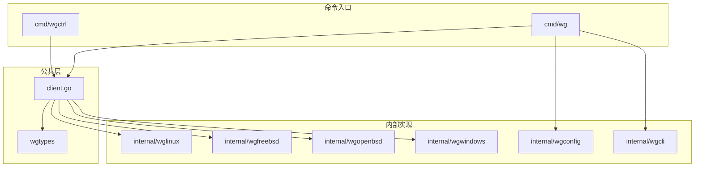
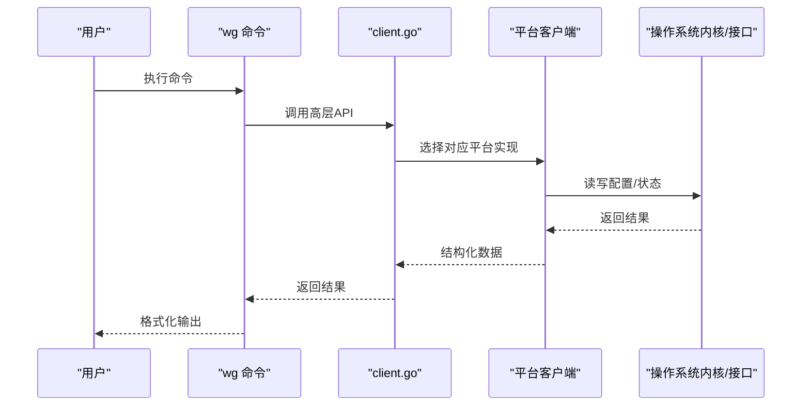
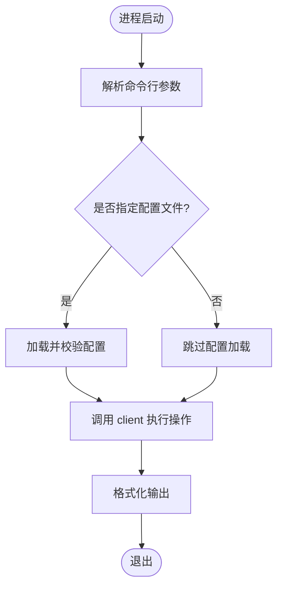
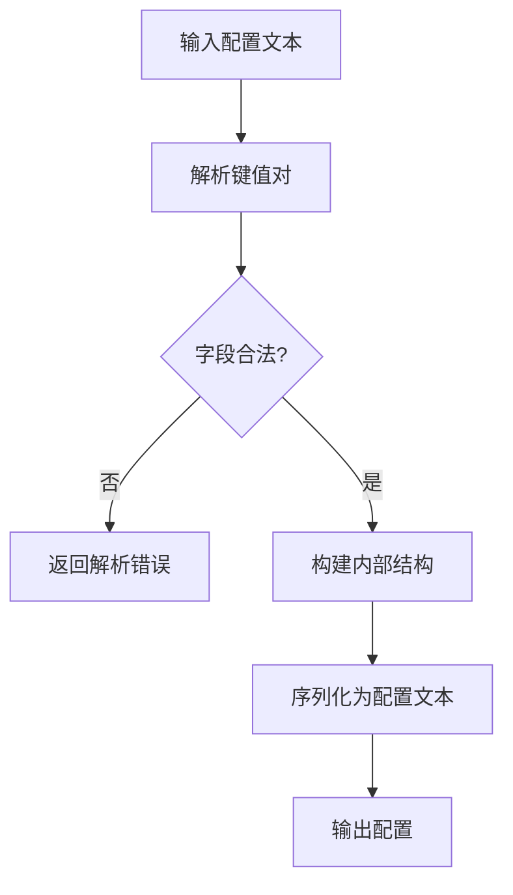
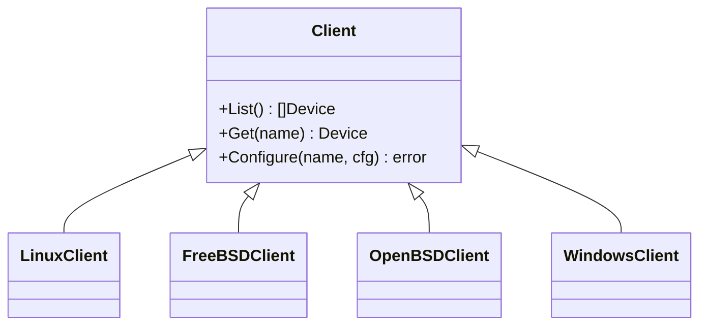
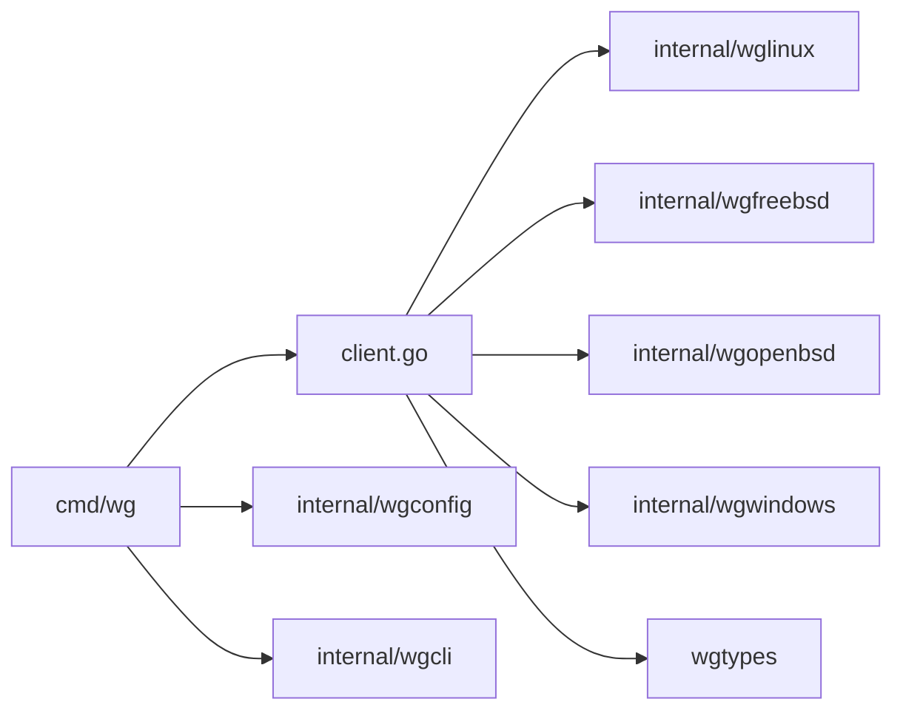

# 贡献指南

<cite>
**本文引用的文件**
- [CONTRIBUTING.md](file://CONTRIBUTING.md)
- [README.md](file://README.md)
- [readme_cn.md](file://readme_cn.md)
- [go.mod.base](file://go.mod.base)
- [.github/workflows/linux-test.yml](file://.github/workflows/linux-test.yml)
- [.github/workflows/linux-integration-test.yml](file://.github/workflows/linux-integration-test.yml)
- [.github/workflows/static-analysis.yml](file://.github/workflows/static-analysis.yml)
- [.builds/freebsd.yml](file://.builds/freebsd.yml)
- [.builds/openbsd.yml](file://.builds/openbsd.yml)
- [cmd/wg/main.go](file://cmd/wg/main.go)
- [cmd/wg/command.go](file://cmd/wg/command.go)
- [cmd/wg/config.go](file://cmd/wg/config.go)
- [cmd/wg/show.go](file://cmd/wg/show.go)
- [cmd/wgctrl/main.go](file://cmd/wgctrl/main.go)
- [internal/wgcli/format.go](file://internal/wgcli/format.go)
- [internal/wgconfig/parse.go](file://internal/wgconfig/parse.go)
- [internal/wgconfig/encode.go](file://internal/wgconfig/encode.go)
- [internal/wglinux/client_linux.go](file://internal/wglinux/client_linux.go)
- [internal/wgfreebsd/client_freebsd.go](file://internal/wgfreebsd/client_freebsd.go)
- [internal/wgopenbsd/client_openbsd.go](file://internal/wgopenbsd/client_openbsd.go)
- [internal/wgwindows/client_windows.go](file://internal/wgwindows/client_windows.go)
- [wgtypes/types.go](file://wgtypes/types.go)
- [client.go](file://client.go)
</cite>

## 目录
1. [简介](#简介)
2. [项目结构](#项目结构)
3. [核心组件](#核心组件)
4. [架构总览](#架构总览)
5. [详细组件分析](#详细组件分析)
6. [依赖关系分析](#依赖关系分析)
7. [性能与可维护性建议](#性能与可维护性建议)
8. [故障排查指南](#故障排查指南)
9. [结论](#结论)
10. [附录](#附录)

## 简介
本贡献指南面向希望为 wgctrl-go 项目做出贡献的开发者，涵盖代码规范、命名约定、编码标准、Git 工作流程（分支策略、提交信息规范、Pull Request 流程）、代码审查流程与质量标准、新功能开发指导（设计文档、测试用例、文档更新），以及 Bug 报告与功能增强请求流程。目标是让贡献者快速上手并保持一致的开发体验。

## 项目结构
仓库采用按平台与职责分层的组织方式：
- cmd：命令行入口（wg 与 wgctrl）
- internal：内部实现（各平台客户端、配置解析与序列化、终端格式化等）
- wgtypes：公共类型定义
- 根级 client.go：对外 API 封装
- .github/workflows：GitHub Actions 自动化（测试、集成测试、静态分析）
- .builds：构建系统配置（FreeBSD/OpenBSD）

图示来源
- [cmd/wg/main.go:1-200](file://cmd/wg/main.go#L1-L200)
- [cmd/wgctrl/main.go:1-200](file://cmd/wgctrl/main.go#L1-L200)
- [internal/wglinux/client_linux.go:1-200](file://internal/wglinux/client_linux.go#L1-L200)
- [internal/wgfreebsd/client_freebsd.go:1-200](file://internal/wgfreebsd/client_freebsd.go#L1-L200)
- [internal/wgopenbsd/client_openbsd.go:1-200](file://internal/wgopenbsd/client_openbsd.go#L1-L200)
- [internal/wgwindows/client_windows.go:1-200](file://internal/wgwindows/client_windows.go#L1-L200)
- [internal/wgconfig/parse.go:1-200](file://internal/wgconfig/parse.go#L1-L200)
- [internal/wgconfig/encode.go:1-200](file://internal/wgconfig/encode.go#L1-L200)
- [internal/wgcli/format.go:1-200](file://internal/wgcli/format.go#L1-L200)
- [wgtypes/types.go:1-200](file://wgtypes/types.go#L1-L200)
- [client.go:1-200](file://client.go#L1-L200)

章节来源
- [README.md:1-200](file://README.md#L1-L200)
- [readme_cn.md:1-200](file://readme_cn.md#L1-L200)

## 核心组件
- 命令行工具
  - wg：提供交互式或脚本化的 WireGuard 管理命令
  - wgctrl：兼容型控制入口
- 平台客户端
  - Linux、FreeBSD、OpenBSD、Windows 各自通过系统接口进行配置与查询
- 配置解析与序列化
  - 负责读取、校验、生成 WireGuard 配置文件
- 终端输出格式化
  - 统一表格化展示设备与对等体信息
- 公共类型
  - 跨平台共享的数据结构与错误定义

章节来源
- [cmd/wg/main.go:1-200](file://cmd/wg/main.go#L1-L200)
- [cmd/wgctrl/main.go:1-200](file://cmd/wgctrl/main.go#L1-L200)
- [internal/wglinux/client_linux.go:1-200](file://internal/wglinux/client_linux.go#L1-L200)
- [internal/wgfreebsd/client_freebsd.go:1-200](file://internal/wgfreebsd/client_freebsd.go#L1-L200)
- [internal/wgopenbsd/client_openbsd.go:1-200](file://internal/wgopenbsd/client_openbsd.go#L1-L200)
- [internal/wgwindows/client_windows.go:1-200](file://internal/wgwindows/client_windows.go#L1-L200)
- [internal/wgconfig/parse.go:1-200](file://internal/wgconfig/parse.go#L1-L200)
- [internal/wgconfig/encode.go:1-200](file://internal/wgconfig/encode.go#L1-L200)
- [internal/wgcli/format.go:1-200](file://internal/wgcli/format.go#L1-L200)
- [wgtypes/types.go:1-200](file://wgtypes/types.go#L1-L200)
- [client.go:1-200](file://client.go#L1-L200)

## 架构总览
下图展示了从命令行到平台客户端的调用链路与数据流向。

图示来源
- [cmd/wg/main.go:1-200](file://cmd/wg/main.go#L1-L200)
- [client.go:1-200](file://client.go#L1-L200)
- [internal/wglinux/client_linux.go:1-200](file://internal/wglinux/client_linux.go#L1-L200)
- [internal/wgfreebsd/client_freebsd.go:1-200](file://internal/wgfreebsd/client_freebsd.go#L1-L200)
- [internal/wgopenbsd/client_openbsd.go:1-200](file://internal/wgopenbsd/client_openbsd.go#L1-L200)
- [internal/wgwindows/client_windows.go:1-200](file://internal/wgwindows/client_windows.go#L1-L200)

## 详细组件分析

### 命令行入口（wg）
- 职责：解析子命令、参数与配置，调用上层 client 完成操作，并将结果以表格形式输出
- 关键流程：启动 -> 解析命令 -> 加载/验证配置 -> 调用 client -> 渲染输出

图示来源
- [cmd/wg/main.go:1-200](file://cmd/wg/main.go#L1-L200)
- [cmd/wg/command.go:1-200](file://cmd/wg/command.go#L1-L200)
- [cmd/wg/config.go:1-200](file://cmd/wg/config.go#L1-L200)
- [cmd/wg/show.go:1-200](file://cmd/wg/show.go#L1-L200)
- [internal/wgcli/format.go:1-200](file://internal/wgcli/format.go#L1-L200)

章节来源
- [cmd/wg/main.go:1-200](file://cmd/wg/main.go#L1-L200)
- [cmd/wg/command.go:1-200](file://cmd/wg/command.go#L1-L200)
- [cmd/wg/config.go:1-200](file://cmd/wg/config.go#L1-L200)
- [cmd/wg/show.go:1-200](file://cmd/wg/show.go#L1-L200)
- [internal/wgcli/format.go:1-200](file://internal/wgcli/format.go#L1-L200)

### 配置解析与序列化（wgconfig）
- 职责：解析 WireGuard 配置文件、生成符合规范的配置文本
- 关键点：字段校验、默认值处理、大小写与格式一致性

图示来源
- [internal/wgconfig/parse.go:1-200](file://internal/wgconfig/parse.go#L1-L200)
- [internal/wgconfig/encode.go:1-200](file://internal/wgconfig/encode.go#L1-L200)

章节来源
- [internal/wgconfig/parse.go:1-200](file://internal/wgconfig/parse.go#L1-L200)
- [internal/wgconfig/encode.go:1-200](file://internal/wgconfig/encode.go#L1-L200)

### 平台客户端（Linux/FreeBSD/OpenBSD/Windows）
- 职责：通过系统接口获取/设置 WireGuard 设备与对等体信息
- 关注点：权限、错误码映射、并发安全、资源释放

图示来源
- [internal/wglinux/client_linux.go:1-200](file://internal/wglinux/client_linux.go#L1-L200)
- [internal/wgfreebsd/client_freebsd.go:1-200](file://internal/wgfreebsd/client_freebsd.go#L1-L200)
- [internal/wgopenbsd/client_openbsd.go:1-200](file://internal/wgopenbsd/client_openbsd.go#L1-L200)
- [internal/wgwindows/client_windows.go:1-200](file://internal/wgwindows/client_windows.go#L1-L200)

章节来源
- [internal/wglinux/client_linux.go:1-200](file://internal/wglinux/client_linux.go#L1-L200)
- [internal/wgfreebsd/client_freebsd.go:1-200](file://internal/wgfreebsd/client_freebsd.go#L1-L200)
- [internal/wgopenbsd/client_openbsd.go:1-200](file://internal/wgopenbsd/client_openbsd.go#L1-L200)
- [internal/wgwindows/client_windows.go:1-200](file://internal/wgwindows/client_windows.go#L1-L200)

### 公共类型（wgtypes）
- 职责：定义设备、对等体、密钥等数据结构与错误类型
- 作用：保证跨平台一致性与可测试性

章节来源
- [wgtypes/types.go:1-200](file://wgtypes/types.go#L1-L200)

## 依赖关系分析
- 外部依赖：Go 标准库与平台相关包；模块版本由 go.mod.base 管理
- 内部依赖：cmd -> client.go -> 平台客户端；cmd -> wgconfig/wgcli
- 测试依赖：单元测试与集成测试分别覆盖解析、序列化、平台客户端与端到端流程

图示来源
- [cmd/wg/main.go:1-200](file://cmd/wg/main.go#L1-L200)
- [client.go:1-200](file://client.go#L1-L200)
- [internal/wgconfig/parse.go:1-200](file://internal/wgconfig/parse.go#L1-L200)
- [internal/wgcli/format.go:1-200](file://internal/wgcli/format.go#L1-L200)
- [internal/wglinux/client_linux.go:1-200](file://internal/wglinux/client_linux.go#L1-L200)
- [internal/wgfreebsd/client_freebsd.go:1-200](file://internal/wgfreebsd/client_freebsd.go#L1-L200)
- [internal/wgopenbsd/client_openbsd.go:1-200](file://internal/wgopenbsd/client_openbsd.go#L1-L200)
- [internal/wgwindows/client_windows.go:1-200](file://internal/wgwindows/client_windows.go#L1-L200)
- [wgtypes/types.go:1-200](file://wgtypes/types.go#L1-L200)

章节来源
- [go.mod.base:1-200](file://go.mod.base#L1-L200)

## 性能与可维护性建议
- 避免在热路径中进行重复的系统调用；缓存必要只读状态
- 合理拆分大函数，提升可读性与可测试性
- 使用上下文取消与超时控制，防止阻塞
- 日志与错误信息应包含上下文（如设备名、操作类型）
- 保持配置解析与序列化的幂等性，便于重试与回滚

[本节为通用建议，不直接引用具体文件]

## 故障排查指南
- 常见问题定位
  - 权限不足：检查运行用户是否具有访问系统接口的权限
  - 配置错误：使用解析器报错信息定位非法字段或格式问题
  - 平台差异：确认目标平台的客户端实现与预期行为一致
- 调试步骤
  - 启用更详细的日志输出（若支持）
  - 使用最小化配置复现问题
  - 在本地运行单元测试与集成测试，逐步缩小范围
- 参考位置
  - 错误定义与上报：见公共类型与平台客户端的错误处理
  - 解析与序列化错误：见配置解析与编码模块

章节来源
- [wgtypes/types.go:1-200](file://wgtypes/types.go#L1-L200)
- [internal/wgconfig/parse.go:1-200](file://internal/wgconfig/parse.go#L1-L200)
- [internal/wgconfig/encode.go:1-200](file://internal/wgconfig/encode.go#L1-L200)
- [internal/wglinux/client_linux.go:1-200](file://internal/wglinux/client_linux.go#L1-L200)
- [internal/wgfreebsd/client_freebsd.go:1-200](file://internal/wgfreebsd/client_freebsd.go#L1-L200)
- [internal/wgopenbsd/client_openbsd.go:1-200](file://internal/wgopenbsd/client_openbsd.go#L1-L200)
- [internal/wgwindows/client_windows.go:1-200](file://internal/wgwindows/client_windows.go#L1-L200)

## 结论
遵循本指南将有助于提高代码质量、降低协作成本并确保跨平台一致性。请在提交前完成本地测试与自查，并在 Pull Request 中清晰描述变更动机与影响范围。

[本节为总结性内容，不直接引用具体文件]

## 附录

### 代码规范与命名约定
- 语言与工具
  - Go 版本：遵循仓库模块定义
  - 格式化：使用 gofmt/goimports
  - 静态检查：遵循工作流中的静态分析规则
- 命名
  - 包名：小写、简短、无下划线
  - 标识符：导出用驼峰大写，内部用小写
  - 文件名：语义化、全小写、下划线分隔
- 注释
  - 导出符号必须提供 godoc 注释
  - 复杂逻辑添加行内注释说明意图
- 错误处理
  - 明确区分可恢复与不可恢复错误
  - 错误信息需包含上下文（如设备名、操作）

章节来源
- [go.mod.base:1-200](file://go.mod.base#L1-L200)
- [.github/workflows/static-analysis.yml:1-200](file://.github/workflows/static-analysis.yml#L1-L200)

### Git 工作流程
- 分支策略
  - main：稳定分支，仅接受合并通过的变更
  - feature/*：新功能开发
  - fix/*：缺陷修复
  - 发布分支：按需创建，用于版本打包与回归测试
- 提交信息规范
  - 首行：动词开头，简洁描述变更
  - 正文：说明动机、影响范围与注意事项
  - 关联：引用 Issue 或 PR 编号
- Pull Request 流程
  - 推送分支后创建 PR，填写变更说明与测试情况
  - 触发 CI 检查（测试、集成测试、静态分析）
  - 至少一名维护者审查通过后合并

章节来源
- [.github/workflows/linux-test.yml:1-200](file://.github/workflows/linux-test.yml#L1-L200)
- [.github/workflows/linux-integration-test.yml:1-200](file://.github/workflows/linux-integration-test.yml#L1-L200)
- [.github/workflows/static-analysis.yml:1-200](file://.github/workflows/static-analysis.yml#L1-L200)

### 代码审查流程与质量标准
- 审查要点
  - 正确性：逻辑正确、边界条件覆盖
  - 可维护性：可读性、模块化、复杂度控制
  - 安全性：权限、输入校验、敏感信息处理
  - 兼容性：跨平台行为一致
- 质量标准
  - 单元测试覆盖率达标
  - 集成测试通过
  - 静态分析无新增告警
  - 文档同步更新

章节来源
- [.github/workflows/linux-test.yml:1-200](file://.github/workflows/linux-test.yml#L1-L200)
- [.github/workflows/linux-integration-test.yml:1-200](file://.github/workflows/linux-integration-test.yml#L1-L200)
- [.github/workflows/static-analysis.yml:1-200](file://.github/workflows/static-analysis.yml#L1-L200)

### 新功能开发指导
- 设计文档
  - 明确需求与约束
  - 给出接口设计与数据模型
  - 评估风险与替代方案
- 测试用例
  - 单元测试：覆盖解析、序列化、核心逻辑
  - 集成测试：覆盖端到端流程与平台差异
- 文档更新
  - 更新 README 与中文说明
  - 补充 godoc 注释与命令行帮助

章节来源
- [README.md:1-200](file://README.md#L1-L200)
- [readme_cn.md:1-200](file://readme_cn.md#L1-L200)
- [internal/wgconfig/parse.go:1-200](file://internal/wgconfig/parse.go#L1-L200)
- [internal/wgconfig/encode.go:1-200](file://internal/wgconfig/encode.go#L1-L200)
- [internal/wgcli/format.go:1-200](file://internal/wgcli/format.go#L1-L200)

### 如何报告 Bug 与请求功能增强
- 报告 Bug
  - 提供环境信息（操作系统、版本）
  - 复现步骤与期望行为
  - 日志与错误信息
- 功能增强
  - 说明使用场景与收益
  - 给出接口或行为建议
  - 评估兼容性与影响范围

章节来源
- [CONTRIBUTING.md:1-200](file://CONTRIBUTING.md#L1-L200)