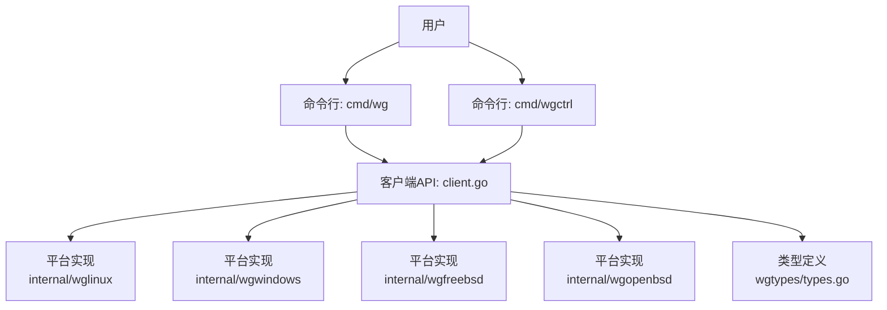
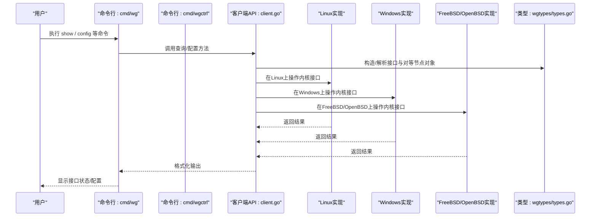
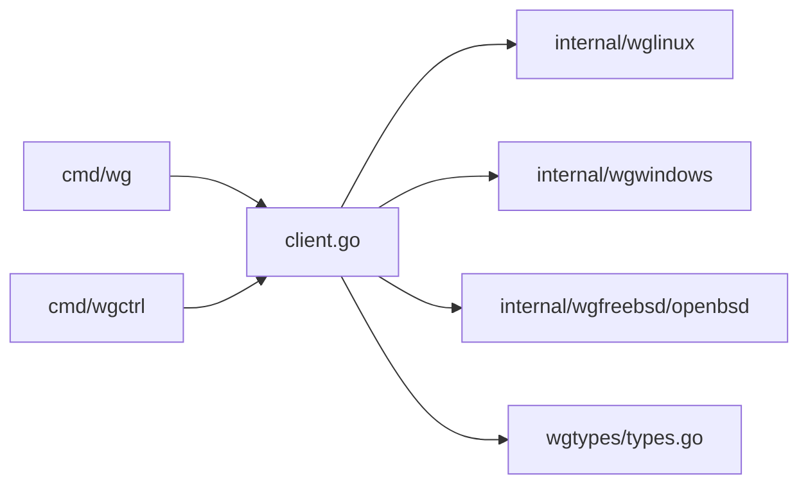

# 快速开始

<cite>
**本文引用的文件**
- [README.md](file://README.md)
- [readme_cn.md](file://readme_cn.md)
- [cmd/wg/main.go](file://cmd/wg/main.go)
- [cmd/wg/command.go](file://cmd/wg/command.go)
- [cmd/wg/config.go](file://cmd/wg/config.go)
- [cmd/wg/show.go](file://cmd/wg/show.go)
- [cmd/wgctrl/main.go](file://cmd/wgctrl/main.go)
- [client.go](file://client.go)
- [wgtypes/types.go](file://wgtypes/types.go)
- [internal/wglinux/client_linux.go](file://internal/wglinux/client_linux.go)
- [internal/wgwindows/client_windows.go](file://internal/wgwindows/client_windows.go)
- [internal/wgfreebsd/client_freebsd.go](file://internal/wgfreebsd/client_freebsd.go)
- [internal/wgopenbsd/client_openbsd.go](file://internal/wgopenbsd/client_openbsd.go)
</cite>

## 目录
1. [简介](#简介)
2. [项目结构](#项目结构)
3. [核心组件](#核心组件)
4. [架构总览](#架构总览)
5. [详细组件分析](#详细组件分析)
6. [依赖关系分析](#依赖关系分析)
7. [性能注意事项](#性能注意事项)
8. [故障排除指南](#故障排除指南)
9. [结论](#结论)
10. [附录](#附录)

## 简介
本快速开始指南帮助你从零开始安装并使用 wgctrl-go，完成第一个 WireGuard 连接。你将学会：
- 通过 go get 安装与使用预编译二进制
- 使用命令行工具查看接口状态、创建新接口、配置对等节点
- 理解接口、对等节点、公钥等基本概念
- 验证连接并排查常见问题

## 项目结构
wgctrl-go 提供用户态的 WireGuard 管理库与命令行工具，支持 Linux、Windows、FreeBSD、OpenBSD。仓库包含：
- 顶层客户端 API（跨平台）
- 各平台的内部实现（Linux/Windows/FreeBSD/OpenBSD）
- 命令行工具 cmd/wg（兼容常见用法）与 cmd/wgctrl（更贴近库能力）
- 类型定义 wgtypes/types.go

图表来源
- [cmd/wg/main.go:1-200](file://cmd/wg/main.go#L1-L200)
- [cmd/wgctrl/main.go:1-200](file://cmd/wgctrl/main.go#L1-L200)
- [client.go:1-200](file://client.go#L1-L200)
- [internal/wglinux/client_linux.go:1-200](file://internal/wglinux/client_linux.go#L1-L200)
- [internal/wgwindows/client_windows.go:1-200](file://internal/wgwindows/client_windows.go#L1-L200)
- [internal/wgfreebsd/client_freebsd.go:1-200](file://internal/wgfreebsd/client_freebsd.go#L1-L200)
- [internal/wgopenbsd/client_openbsd.go:1-200](file://internal/wgopenbsd/client_openbsd.go#L1-L200)
- [wgtypes/types.go:1-200](file://wgtypes/types.go#L1-L200)

章节来源
- [README.md:1-200](file://README.md#L1-L200)
- [readme_cn.md:1-200](file://readme_cn.md#L1-L200)

## 核心组件
- 命令行工具
  - cmd/wg：提供 show、config 等常用子命令，便于快速查看与管理接口
  - cmd/wgctrl：更贴近底层能力的控制入口
- 客户端 API
  - client.go：统一的客户端接口，封装不同平台的差异
- 平台实现
  - internal/wglinux、internal/wgwindows、internal/wgfreebsd、internal/wgopenbsd：分别对接内核或系统提供的 WireGuard 能力
- 类型定义
  - wgtypes/types.go：定义接口、对等节点、密钥等数据结构

章节来源
- [cmd/wg/main.go:1-200](file://cmd/wg/main.go#L1-L200)
- [cmd/wg/command.go:1-200](file://cmd/wg/command.go#L1-L200)
- [cmd/wg/config.go:1-200](file://cmd/wg/config.go#L1-L200)
- [cmd/wg/show.go:1-200](file://cmd/wg/show.go#L1-L200)
- [cmd/wgctrl/main.go:1-200](file://cmd/wgctrl/main.go#L1-L200)
- [client.go:1-200](file://client.go#L1-L200)
- [wgtypes/types.go:1-200](file://wgtypes/types.go#L1-L200)

## 架构总览
下图展示了从命令行到平台实现的调用链，以及数据类型的统一抽象。

图表来源
- [cmd/wg/main.go:1-200](file://cmd/wg/main.go#L1-L200)
- [cmd/wgctrl/main.go:1-200](file://cmd/wgctrl/main.go#L1-L200)
- [client.go:1-200](file://client.go#L1-L200)
- [internal/wglinux/client_linux.go:1-200](file://internal/wglinux/client_linux.go#L1-L200)
- [internal/wgwindows/client_windows.go:1-200](file://internal/wgwindows/client_windows.go#L1-L200)
- [internal/wgfreebsd/client_freebsd.go:1-200](file://internal/wgfreebsd/client_freebsd.go#L1-L200)
- [internal/wgopenbsd/client_openbsd.go:1-200](file://internal/wgopenbsd/client_openbsd.go#L1-L200)
- [wgtypes/types.go:1-200](file://wgtypes/types.go#L1-L200)

## 详细组件分析

### 安装与获取二进制
- 通过 Go 模块安装
  - 使用 go get 获取并安装命令行工具，例如安装 cmd/wg 与 cmd/wgctrl
  - 安装后，可在 PATH 中直接调用 wg 与 wgctrl
- 使用预编译二进制
  - 若仓库提供发布包，可下载对应平台的二进制文件并解压到 PATH 目录
  - 验证安装是否成功：运行 wg --version 或 wg version（以实际帮助信息为准）

提示
- 确保已安装 Go 环境且版本满足要求
- Windows 用户注意权限与路径设置；Linux/Unix 用户注意可执行权限

章节来源
- [cmd/wg/main.go:1-200](file://cmd/wg/main.go#L1-L200)
- [cmd/wgctrl/main.go:1-200](file://cmd/wgctrl/main.go#L1-L200)
- [README.md:1-200](file://README.md#L1-L200)
- [readme_cn.md:1-200](file://readme_cn.md#L1-L200)

### 基本概念速览
- 接口（Interface）：WireGuard 的逻辑网络端点，拥有私钥、监听端口、地址等
- 对等节点（Peer）：与当前接口建立隧道的远端实体，拥有公钥、允许 IP、Endpoint 等
- 公钥/私钥：用于身份认证与加密通信的密钥对；通常先产生私钥再导出公钥

章节来源
- [wgtypes/types.go:1-200](file://wgtypes/types.go#L1-L200)

### 查看接口状态
- 使用 wg show 列出所有接口及其对等节点、统计信息等
- 典型输出包含：接口名、私钥、监听端口、对等节点公钥、允许的 IP、发送/接收字节数等

示例流程
- 打开终端
- 执行 wg show
- 观察输出中的接口与对等节点信息

章节来源
- [cmd/wg/show.go:1-200](file://cmd/wg/show.go#L1-L200)
- [cmd/wg/command.go:1-200](file://cmd/wg/command.go#L1-L200)

### 创建新接口并配置对等节点
- 使用 wg 或 wgctrl 创建接口、设置私钥与监听端口
- 添加对等节点：指定公钥、允许的 IP、Endpoint（远端可达地址）
- 启用接口并验证连通性

典型步骤
- 生成私钥并导出公钥
- 创建接口并绑定监听端口
- 为接口添加对等节点（公钥、AllowedIPs、Endpoint）
- 保存配置并启动接口
- 使用 ping 或 curl 测试连通性

章节来源
- [cmd/wg/config.go:1-200](file://cmd/wg/config.go#L1-L200)
- [cmd/wg/command.go:1-200](file://cmd/wg/command.go#L1-L200)
- [client.go:1-200](file://client.go#L1-L200)
- [wgtypes/types.go:1-200](file://wgtypes/types.go#L1-L200)

### 配置示例与预期输出
- 配置文件示例
  - 参考仓库中的示例配置文件位置与格式说明
- 预期输出
  - wg show 应显示接口名称、监听端口、对等节点公钥、允许的 IP、流量统计等
  - 新增对等节点后，应能看到新的 Peer 条目及实时计数变化

章节来源
- [cmd/wg/config.go:1-200](file://cmd/wg/config.go#L1-L200)
- [cmd/wg/show.go:1-200](file://cmd/wg/show.go#L1-L200)

### 平台差异与权限
- Linux：通常需要 root 权限操作内核接口
- Windows：需要管理员权限
- FreeBSD/OpenBSD：遵循各自系统的 WireGuard 驱动/模块要求

章节来源
- [internal/wglinux/client_linux.go:1-200](file://internal/wglinux/client_linux.go#L1-L200)
- [internal/wgwindows/client_windows.go:1-200](file://internal/wgwindows/client_windows.go#L1-L200)
- [internal/wgfreebsd/client_freebsd.go:1-200](file://internal/wgfreebsd/client_freebsd.go#L1-L200)
- [internal/wgopenbsd/client_openbsd.go:1-200](file://internal/wgopenbsd/client_openbsd.go#L1-L200)

## 依赖关系分析
- 命令行层（cmd/wg、cmd/wgctrl）依赖客户端 API
- 客户端 API（client.go）根据运行平台选择具体实现
- 平台实现负责与系统内核或驱动交互
- 类型定义（wgtypes/types.go）被各层共享

图表来源
- [cmd/wg/main.go:1-200](file://cmd/wg/main.go#L1-L200)
- [cmd/wgctrl/main.go:1-200](file://cmd/wgctrl/main.go#L1-L200)
- [client.go:1-200](file://client.go#L1-L200)
- [internal/wglinux/client_linux.go:1-200](file://internal/wglinux/client_linux.go#L1-L200)
- [internal/wgwindows/client_windows.go:1-200](file://internal/wgwindows/client_windows.go#L1-L200)
- [internal/wgfreebsd/client_freebsd.go:1-200](file://internal/wgfreebsd/client_freebsd.go#L1-L200)
- [internal/wgopenbsd/client_openbsd.go:1-200](file://internal/wgopenbsd/client_openbsd.go#L1-L200)
- [wgtypes/types.go:1-200](file://wgtypes/types.go#L1-L200)

章节来源
- [client.go:1-200](file://client.go#L1-L200)
- [wgtypes/types.go:1-200](file://wgtypes/types.go#L1-L200)

## 性能注意事项
- 频繁查询接口状态会产生系统调用开销，建议批量处理或降低轮询频率
- 大量对等节点会增加内存与 CPU 占用，合理规划 AllowedIPs 与路由表
- 在高吞吐场景下，关注内核队列与 MTU 设置，必要时调整缓冲区大小

[本节为通用指导，不直接分析具体文件]

## 故障排除指南
- 无法列出接口或报错权限不足
  - 确认以管理员/root 权限运行
  - 检查系统是否加载了 WireGuard 内核模块/驱动
- 无法连接对等节点
  - 检查 Endpoint 是否可达（防火墙/NAT/端口映射）
  - 核对双方公钥与 AllowedIPs 配置是否一致
- 配置未生效
  - 重新应用配置并重启接口
  - 使用 wg show 验证最新状态
- 日志与调试
  - 开启系统日志或内核消息，定位错误原因
  - 逐步缩小问题范围（仅一个对等节点、最小化 AllowedIPs）

章节来源
- [cmd/wg/show.go:1-200](file://cmd/wg/show.go#L1-L200)
- [cmd/wg/config.go:1-200](file://cmd/wg/config.go#L1-L200)
- [client.go:1-200](file://client.go#L1-L200)

## 结论
通过以上步骤，你应能完成 wgctrl-go 的安装、基本使用与第一个 WireGuard 连接的搭建。建议在生产环境中结合安全策略与监控手段，持续验证连接质量与资源占用。

[本节为总结，不直接分析具体文件]

## 附录

### 常用命令速查
- 查看接口与对等节点：wg show
- 查看特定接口：wg show <接口名>
- 导入/导出配置：wg 相关子命令（依据帮助信息）
- 使用 wgctrl 进行更细粒度的控制

章节来源
- [cmd/wg/command.go:1-200](file://cmd/wg/command.go#L1-L200)
- [cmd/wgctrl/main.go:1-200](file://cmd/wgctrl/main.go#L1-L200)

### 概念对照表
- 接口：本地 WireGuard 端点，含私钥、监听端口、地址
- 对等节点：远端实体，含公钥、AllowedIPs、Endpoint
- 公钥/私钥：用于身份认证与加密通信

章节来源
- [wgtypes/types.go:1-200](file://wgtypes/types.go#L1-L200)