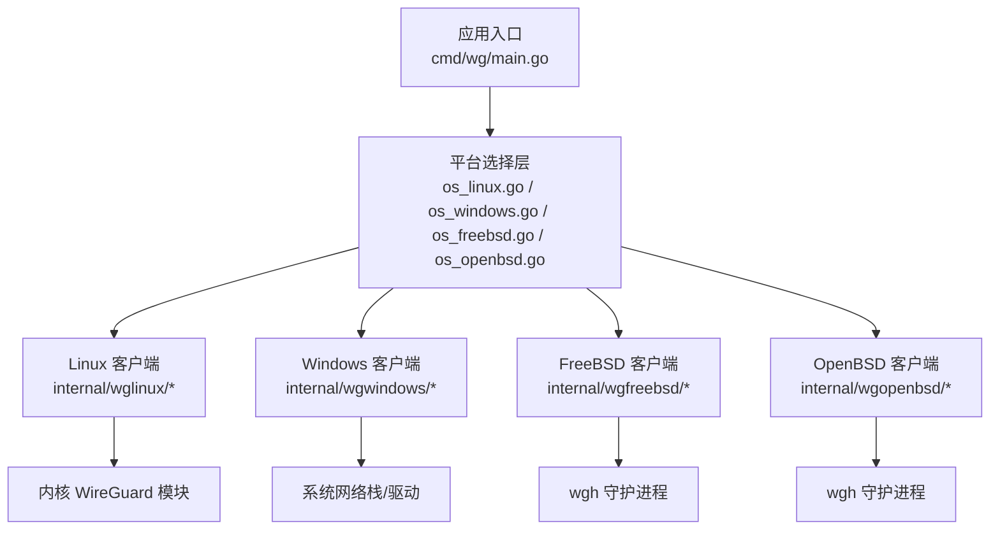
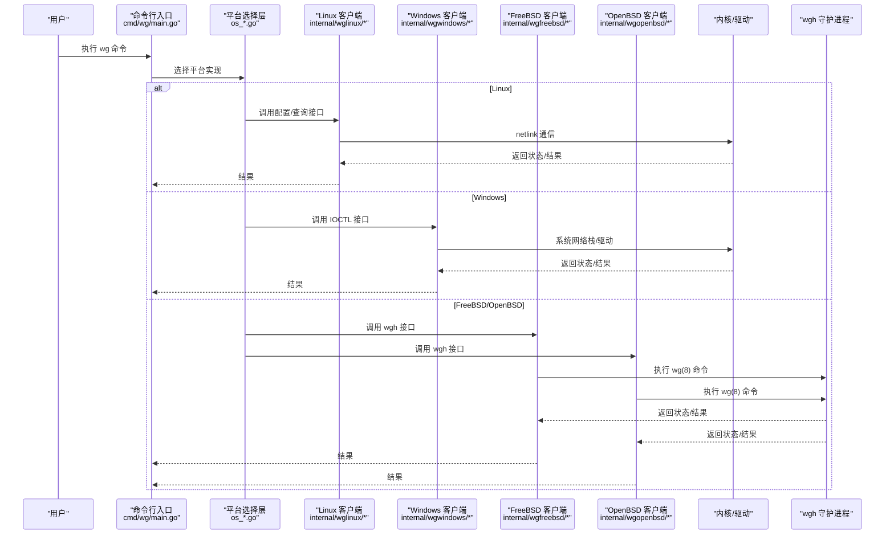
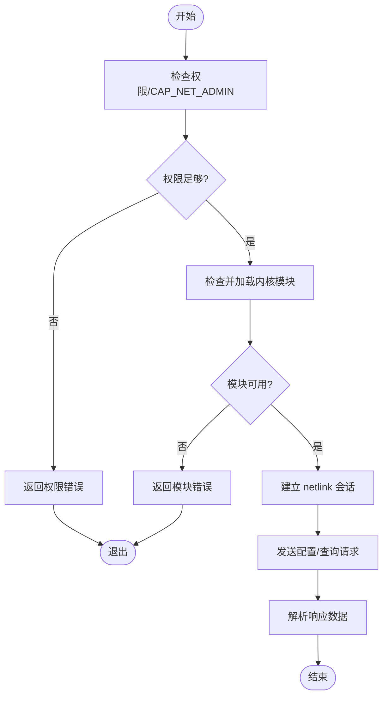
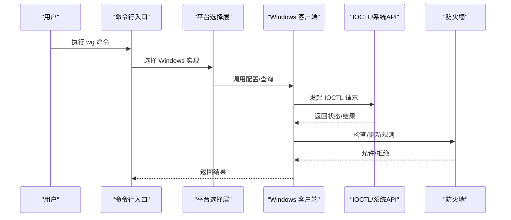
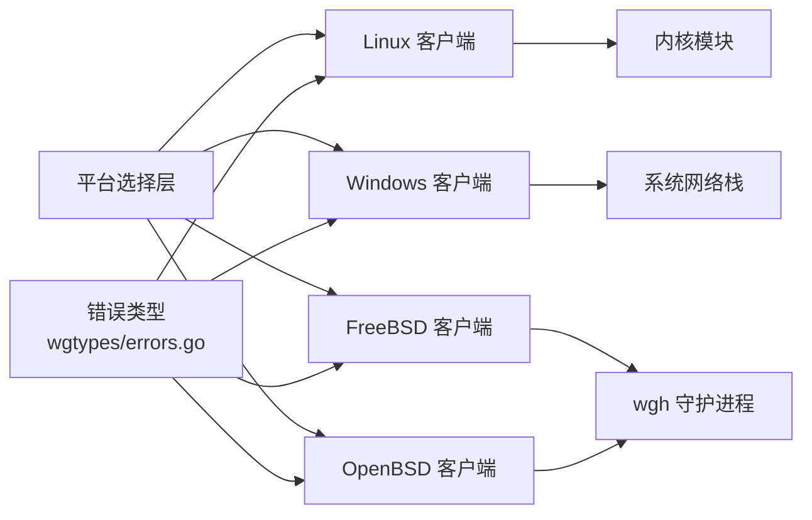

# 平台特定问题

<cite>
**本文引用的文件**
- [os_linux.go](file://os_linux.go)
- [os_windows.go](file://os_windows.go)
- [os_freebsd.go](file://os_freebsd.go)
- [os_openbsd.go](file://os_openbsd.go)
- [os_userspace.go](file://os_userspace.go)
- [internal/wglinux/client_linux.go](file://internal/wglinux/client_linux.go)
- [internal/wglinux/configure_linux.go](file://internal/wglinux/configure_linux.go)
- [internal/wglinux/parse_linux.go](file://internal/wglinux/parse_linux.go)
- [internal/wgwindows/client_windows.go](file://internal/wgwindows/client_windows.go)
- [internal/wgwindows/internal/ioctl/configuration_windows.go](file://internal/wgwindows/internal/ioctl/configuration_windows.go)
- [internal/wgfreebsd/client_freebsd.go](file://internal/wgfreebsd/client_freebsd.go)
- [internal/wgopenbsd/client_openbsd.go](file://internal/wgopenbsd/client_openbsd.go)
- [cmd/wg/main.go](file://cmd/wg/main.go)
- [cmd/wg/run_linux.bat](file://cmd/wg/run_linux.bat)
- [.github/workflows/linux-integration-test.yml](file://.github/workflows/linux-integration-test.yml)
- [.builds/freebsd.yml](file://.builds/freebsd.yml)
- [.builds/openbsd.yml](file://.builds/openbsd.yml)
- [client_integration_test.go](file://client_integration_test.go)
- [wgtypes/errors.go](file://wgtypes/errors.go)
</cite>

## 目录
1. [简介](#简介)
2. [项目结构](#项目结构)
3. [核心组件](#核心组件)
4. [架构总览](#架构总览)
5. [详细组件分析](#详细组件分析)
6. [依赖关系分析](#依赖关系分析)
7. [性能考虑](#性能考虑)
8. [故障排查指南](#故障排查指南)
9. [结论](#结论)
10. [附录](#附录)

## 简介
本指南聚焦于 wgctrl-go 在 Linux、Windows、FreeBSD、OpenBSD 等平台上的特定问题与解决方案，覆盖权限配置、防火墙设置、内核模块加载、平台差异与兼容性、调试工具与命令使用、性能调优与安全配置建议，以及跨平台迁移时的常见问题与处理方法。文档以代码仓库中的平台实现为依据，提供可操作的排障步骤和最佳实践。

## 项目结构
本项目按平台划分客户端实现：
- Linux：通过 netlink 与内核 WireGuard 模块交互
- Windows：通过 IOCTL 与系统网络栈交互
- FreeBSD/OpenBSD：通过 wgh（wg(8)）用户态守护进程进行配置管理
- 通用类型与错误定义位于 wgtypes 包
- 顶层 os_*.go 文件用于选择具体平台的实现

图表来源
- [cmd/wg/main.go:1-200](file://cmd/wg/main.go#L1-L200)
- [os_linux.go:1-200](file://os_linux.go#L1-L200)
- [os_windows.go:1-200](file://os_windows.go#L1-L200)
- [os_freebsd.go:1-200](file://os_freebsd.go#L1-L200)
- [os_openbsd.go:1-200](file://os_openbsd.go#L1-L200)

章节来源
- [cmd/wg/main.go:1-200](file://cmd/wg/main.go#L1-L200)
- [os_linux.go:1-200](file://os_linux.go#L1-L200)
- [os_windows.go:1-200](file://os_windows.go#L1-L200)
- [os_freebsd.go:1-200](file://os_freebsd.go#L1-L200)
- [os_openbsd.go:1-200](file://os_openbsd.go#L1-L200)

## 核心组件
- 平台选择层：根据构建标签或运行环境选择对应平台客户端实现
- Linux 客户端：负责与内核 WireGuard 模块的 netlink 通信、接口配置与状态解析
- Windows 客户端：通过 IOCTL 调用系统 API 完成配置与查询
- FreeBSD/OpenBSD 客户端：通过 wgh 守护进程执行 wg(8) 命令进行配置
- 错误与类型：统一错误类型与数据结构，便于跨平台一致处理

章节来源
- [internal/wglinux/client_linux.go:1-200](file://internal/wglinux/client_linux.go#L1-L200)
- [internal/wgwindows/client_windows.go:1-200](file://internal/wgwindows/client_windows.go#L1-L200)
- [internal/wgfreebsd/client_freebsd.go:1-200](file://internal/wgfreebsd/client_freebsd.go#L1-L200)
- [internal/wgopenbsd/client_openbsd.go:1-200](file://internal/wgopenbsd/client_openbsd.go#L1-L200)
- [wgtypes/errors.go:1-200](file://wgtypes/errors.go#L1-L200)

## 架构总览
下图展示了从命令行到各平台后端的关键调用路径，突出平台差异与集成点。

图表来源
- [cmd/wg/main.go:1-200](file://cmd/wg/main.go#L1-L200)
- [os_linux.go:1-200](file://os_linux.go#L1-L200)
- [os_windows.go:1-200](file://os_windows.go#L1-L200)
- [os_freebsd.go:1-200](file://os_freebsd.go#L1-L200)
- [os_openbsd.go:1-200](file://os_openbsd.go#L1-L200)
- [internal/wglinux/client_linux.go:1-200](file://internal/wglinux/client_linux.go#L1-L200)
- [internal/wgwindows/client_windows.go:1-200](file://internal/wgwindows/client_windows.go#L1-L200)
- [internal/wgfreebsd/client_freebsd.go:1-200](file://internal/wgfreebsd/client_freebsd.go#L1-L200)
- [internal/wgopenbsd/client_openbsd.go:1-200](file://internal/wgopenbsd/client_openbsd.go#L1-L200)

## 详细组件分析

### Linux 平台
- 关键能力
  - 通过 netlink 与内核 WireGuard 模块通信，完成接口创建、配置、状态读取
  - 支持配置编码/解码与状态解析
- 典型问题
  - 权限不足：需要 root 或具备 CAP_NET_ADMIN 等能力
  - 内核模块未加载：需确保 wireguard 模块已加载且版本兼容
  - 防火墙规则：iptables/nftables 可能阻断流量
  - 命名空间隔离：容器或 systemd-nspawn 中需正确传递 netlink 套接字
- 调试与命令
  - 查看内核日志：dmesg
  - 检查模块：lsmod | grep wireguard；modprobe wireguard
  - 查看接口：ip link show；wg show
  - 跟踪 netlink：strace -e netlink,sendmsg,recvmsg -p <pid>
  - 防火墙：iptables-save；nft list ruleset
- 性能与安全建议
  - 调整内核参数如 net.core.rmem_max/net.core.wmem_max
  - 启用连接追踪优化：net.netfilter.nf_conntrack_*
  - 限制最小权限：仅授予必要能力，避免全局 root

章节来源
- [internal/wglinux/client_linux.go:1-200](file://internal/wglinux/client_linux.go#L1-L200)
- [internal/wglinux/configure_linux.go:1-200](file://internal/wglinux/configure_linux.go#L1-L200)
- [internal/wglinux/parse_linux.go:1-200](file://internal/wglinux/parse_linux.go#L1-L200)
- [os_linux.go:1-200](file://os_linux.go#L1-L200)

#### Linux 配置流程（流程图）

图表来源
- [internal/wglinux/client_linux.go:1-200](file://internal/wglinux/client_linux.go#L1-L200)
- [internal/wglinux/configure_linux.go:1-200](file://internal/wglinux/configure_linux.go#L1-L200)
- [internal/wglinux/parse_linux.go:1-200](file://internal/wglinux/parse_linux.go#L1-L200)

### Windows 平台
- 关键能力
  - 通过 IOCTL 与系统网络栈/驱动交互，完成配置与查询
- 典型问题
  - 管理员权限：需要以管理员身份运行
  - 驱动/服务状态：确认相关驱动或服务处于运行状态
  - 防火墙：Windows Defender 防火墙或第三方防火墙拦截
  - 网络适配器枚举：名称或 GUID 变更导致配置失败
- 调试与命令
  - 事件查看器：查看系统与应用日志
  - 网络诊断：Get-NetAdapter；Test-NetConnection
  - 防火墙：Get-NetFirewallRule；Set-NetFirewallRule
  - 进程跟踪：Process Monitor；Wireshark
- 性能与安全建议
  - 关闭不必要的协议绑定以减少开销
  - 使用最小权限原则运行，避免长期管理员会话
  - 定期更新系统与驱动

章节来源
- [internal/wgwindows/client_windows.go:1-200](file://internal/wgwindows/client_windows.go#L1-L200)
- [internal/wgwindows/internal/ioctl/configuration_windows.go:1-200](file://internal/wgwindows/internal/ioctl/configuration_windows.go#L1-L200)
- [os_windows.go:1-200](file://os_windows.go#L1-L200)

#### Windows 配置序列图

图表来源
- [cmd/wg/main.go:1-200](file://cmd/wg/main.go#L1-L200)
- [internal/wgwindows/client_windows.go:1-200](file://internal/wgwindows/client_windows.go#L1-L200)
- [internal/wgwindows/internal/ioctl/configuration_windows.go:1-200](file://internal/wgwindows/internal/ioctl/configuration_windows.go#L1-L200)

### FreeBSD 平台
- 关键能力
  - 通过 wgh 守护进程执行 wg(8) 命令进行配置与管理
- 典型问题
  - wgh 服务未启动：需确保服务运行并可访问其控制接口
  - 权限：可能需要 root 或相应组权限
  - 防火墙：pf 规则可能阻止流量
  - 内核模块：wireguard 模块需加载
- 调试与命令
  - 服务状态：service wgh status；rcctl check wgh
  - 查看接口：ifconfig；wg show
  - 防火墙：pfctl -sr；pfctl -vns
  - 内核模块：kldstat | grep wireguard；kldload wireguard
- 性能与安全建议
  - 调整 pf 规则与队列大小
  - 限制 wgh 访问权限，使用最小权限账户

章节来源
- [internal/wgfreebsd/client_freebsd.go:1-200](file://internal/wgfreebsd/client_freebsd.go#L1-L200)
- [os_freebsd.go:1-200](file://os_freebsd.go#L1-L200)
- [.builds/freebsd.yml:1-200](file://.builds/freebsd.yml#L1-L200)

### OpenBSD 平台
- 关键能力
  - 通过 wgh 守护进程执行 wg(8) 命令进行配置与管理
- 典型问题
  - wgh 服务：需确保服务运行
  - 权限：root 或授权用户
  - 防火墙：pf 规则严格，需放行相关端口与协议
  - 内核模块：wireguard 模块需加载
- 调试与命令
  - 服务状态：rcctl check wgh；rcctl start wgh
  - 查看接口：ifconfig；wg show
  - 防火墙：pfctl -sr；pfctl -vns
  - 内核模块：kldstat | grep wireguard；kldload wireguard
- 性能与安全建议
  - 使用 pf 的队列与限流策略
  - 遵循最小权限原则，限制 wgh 访问

章节来源
- [internal/wgopenbsd/client_openbsd.go:1-200](file://internal/wgopenbsd/client_openbsd.go#L1-L200)
- [os_openbsd.go:1-200](file://os_openbsd.go#L1-L200)
- [.builds/openbsd.yml:1-200](file://.builds/openbsd.yml#L1-L200)

### 用户态回退与兼容性
- 当无法直接访问内核或驱动时，可通过用户态方式（如 wgh）进行配置管理
- 不同平台对用户态守护进程的依赖程度不同，需在部署时明确服务生命周期与权限模型

章节来源
- [os_userspace.go:1-200](file://os_userspace.go#L1-L200)

## 依赖关系分析
- 平台选择层依赖具体平台客户端实现
- Linux 客户端依赖内核模块与 netlink 子系统
- Windows 客户端依赖系统 IOCTL 与网络栈
- FreeBSD/OpenBSD 客户端依赖 wgh 守护进程与 wg(8) 命令
- 错误类型统一由 wgtypes 提供，便于跨平台一致处理

图表来源
- [os_linux.go:1-200](file://os_linux.go#L1-L200)
- [os_windows.go:1-200](file://os_windows.go#L1-L200)
- [os_freebsd.go:1-200](file://os_freebsd.go#L1-L200)
- [os_openbsd.go:1-200](file://os_openbsd.go#L1-L200)
- [wgtypes/errors.go:1-200](file://wgtypes/errors.go#L1-L200)

章节来源
- [os_linux.go:1-200](file://os_linux.go#L1-L200)
- [os_windows.go:1-200](file://os_windows.go#L1-L200)
- [os_freebsd.go:1-200](file://os_freebsd.go#L1-L200)
- [os_openbsd.go:1-200](file://os_openbsd.go#L1-L200)
- [wgtypes/errors.go:1-200](file://wgtypes/errors.go#L1-L200)

## 性能考虑
- Linux
  - 调整内核缓冲与连接追踪参数，提升吞吐与并发
  - 使用多队列网卡与中断亲和性优化
  - 合理设置 MTU 与分片策略
- Windows
  - 减少协议绑定与无关服务，降低上下文切换
  - 使用硬件卸载功能（如 TCP Offload）
  - 监控 CPU 与内存占用，必要时调整线程池
- FreeBSD/OpenBSD
  - 优化 pf 规则与队列，避免瓶颈
  - 调整内核参数如 net.inet.tcp.* 与 net.pf.*
  - 使用 SMP 与中断亲和性优化

[本节为通用指导，不直接分析具体文件]

## 故障排查指南
- 通用步骤
  - 确认权限：Linux 需 root/CAP_NET_ADMIN；Windows 需管理员；FreeBSD/OpenBSD 需 root 或授权
  - 检查服务/模块：Linux 模块加载；Windows 驱动状态；FreeBSD/OpenBSD wgh 服务状态
  - 验证防火墙：各平台防火墙规则是否放行 UDP 端口与协议
  - 查看日志：Linux dmesg；Windows 事件查看器；FreeBSD/OpenBSD /var/log
  - 复现与回归：使用集成测试脚本验证基本功能
- 平台特定命令参考
  - Linux：ip link、wg show、iptables-save、nft list ruleset、strace
  - Windows：Get-NetAdapter、Test-NetConnection、Get-NetFirewallRule、Process Monitor
  - FreeBSD/OpenBSD：ifconfig、wg show、pfctl -sr、kldstat、rcctl
- 常见错误定位
  - 权限错误：检查用户组与能力分配
  - 模块/驱动错误：重新加载或更新版本
  - 防火墙拒绝：添加允许规则并验证连通性
  - 守护进程不可用：启动 wgh 并检查其日志

章节来源
- [client_integration_test.go:1-200](file://client_integration_test.go#L1-L200)
- [wgtypes/errors.go:1-200](file://wgtypes/errors.go#L1-L200)
- [.github/workflows/linux-integration-test.yml:1-200](file://.github/workflows/linux-integration-test.yml#L1-L200)
- [.builds/freebsd.yml:1-200](file://.builds/freebsd.yml#L1-L200)
- [.builds/openbsd.yml:1-200](file://.builds/openbsd.yml#L1-L200)

## 结论
wgctrl-go 在不同平台上采用差异化实现以适配各自内核与生态。排障时应优先确认权限、服务/模块状态与防火墙规则，再结合平台专用工具进行深入分析。遵循最小权限与性能调优建议，可显著提升稳定性与效率。迁移时需关注平台差异与依赖变化，逐步验证关键路径。

## 附录
- 快速检查清单
  - 权限：root/管理员/授权用户
  - 服务/模块：wireguard 模块或 wgh 服务状态
  - 防火墙：UDP 端口与协议放行
  - 日志：系统与应用日志
  - 连通性：基础 ping/udp 测试
- 参考工作流与构建脚本
  - Linux 集成测试工作流
  - FreeBSD/OpenBSD 构建脚本

章节来源
- [.github/workflows/linux-integration-test.yml:1-200](file://.github/workflows/linux-integration-test.yml#L1-L200)
- [.builds/freebsd.yml:1-200](file://.builds/freebsd.yml#L1-L200)
- [.builds/openbsd.yml:1-200](file://.builds/openbsd.yml#L1-L200)