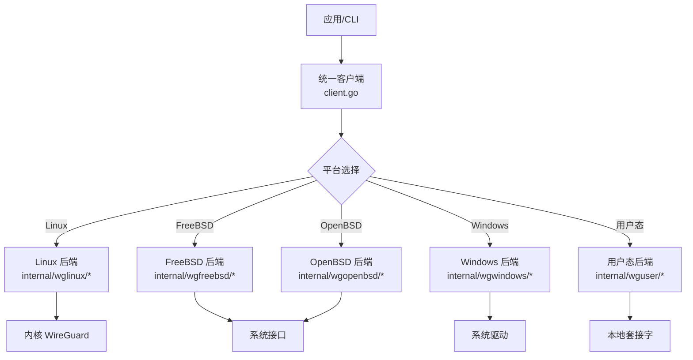
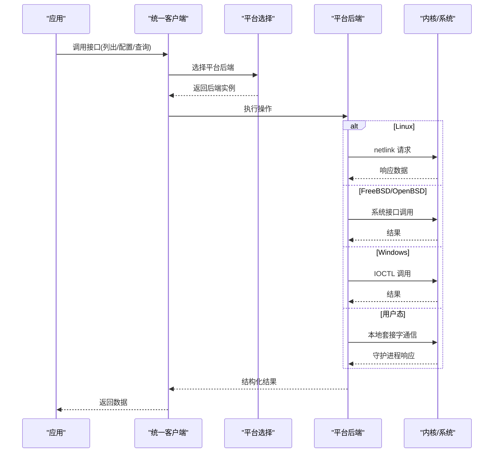
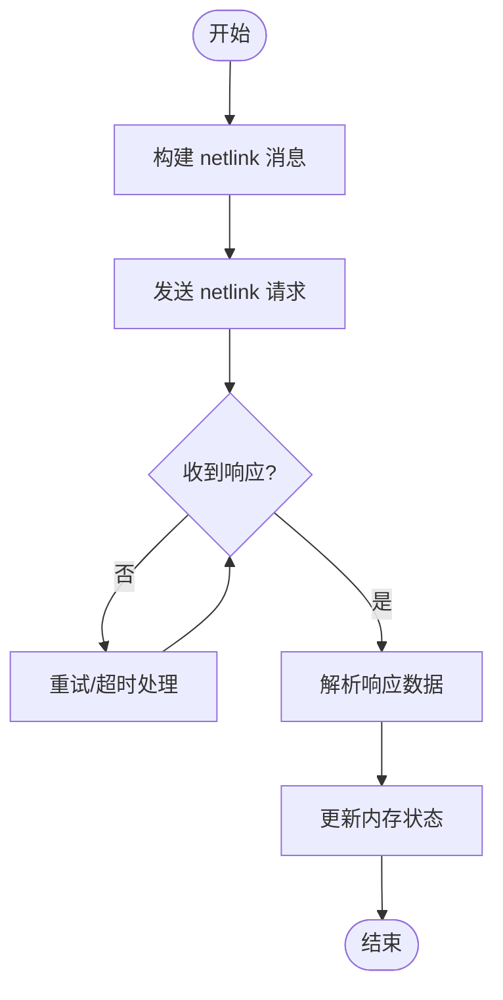
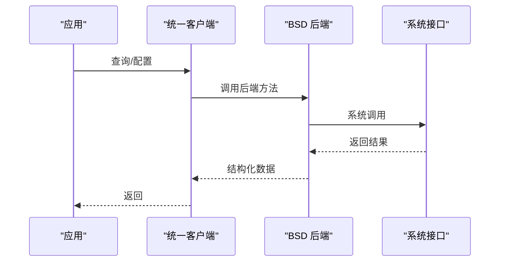
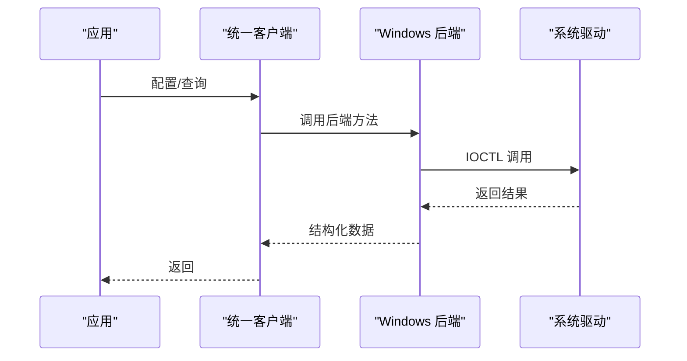
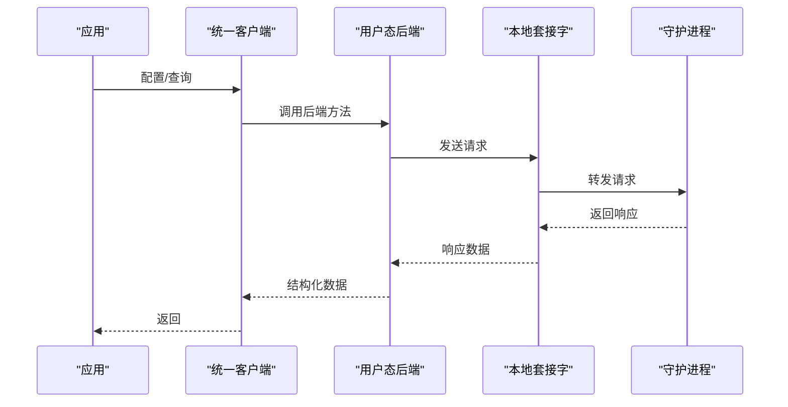
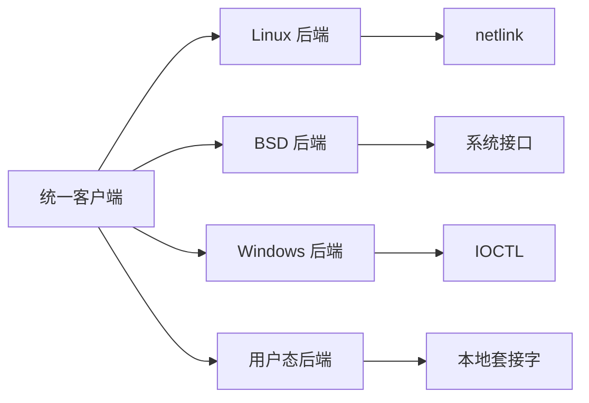

# 性能优化

<cite>
**本文引用的文件**
- [client.go](file://client.go)
- [os_linux.go](file://os_linux.go)
- [os_freebsd.go](file://os_freebsd.go)
- [os_openbsd.go](file://os_openbsd.go)
- [os_windows.go](file://os_windows.go)
- [os_userspace.go](file://os_userspace.go)
- [internal/wglinux/client_linux.go](file://internal/wglinux/client_linux.go)
- [internal/wglinux/configure_linux.go](file://internal/wglinux/configure_linux.go)
- [internal/wglinux/parse_linux.go](file://internal/wglinux/parse_linux.go)
- [internal/wgfreebsd/client_freebsd.go](file://internal/wgfreebsd/client_freebsd.go)
- [internal/wgopenbsd/client_openbsd.go](file://internal/wgopenbsd/client_openbsd.go)
- [internal/wgwindows/client_windows.go](file://internal/wgwindows/client_windows.go)
- [internal/wguser/client.go](file://internal/wguser/client.go)
- [internal/wguser/conn_unix.go](file://internal/wguser/conn_unix.go)
- [internal/wguser/conn_windows.go](file://internal/wguser/conn_windows.go)
- [wgtypes/types.go](file://wgtypes/types.go)
- [cmd/wg/main.go](file://cmd/wg/main.go)
- [cmd/wg/command.go](file://cmd/wg/command.go)
- [cmd/wg/show.go](file://cmd/wg/show.go)
</cite>

## 目录
1. [简介](#简介)
2. [项目结构](#项目结构)
3. [核心组件](#核心组件)
4. [架构总览](#架构总览)
5. [详细组件分析](#详细组件分析)
6. [依赖关系分析](#依赖关系分析)
7. [性能考虑](#性能考虑)
8. [故障排查指南](#故障排查指南)
9. [结论](#结论)
10. [附录](#附录)

## 简介
本指南面向使用 wgctrl-go 的开发者与运维人员，聚焦于网络接口管理场景下的性能优化。内容覆盖常见瓶颈（网络连接延迟、内存占用过高、CPU 占用过高等）、跨平台特性差异、配置参数调优、监控与分析方法、基准测试实践、资源泄漏识别与修复，以及大规模部署时的优化策略。文档基于仓库中的客户端实现与各平台后端进行系统性梳理，帮助读者在真实场景中定位问题并落地改进措施。

## 项目结构
wgctrl-go 采用“统一 API + 多平台后端”的分层设计：
- 顶层 client.go 暴露统一的客户端接口，负责平台选择与调用分发。
- os_*.go 根据构建标签选择具体平台后端（Linux、FreeBSD、OpenBSD、Windows、用户态）。
- internal/* 下按平台或用途组织实现：
  - Linux：通过 netlink 与内核 WireGuard 模块交互，包含配置、解析等逻辑。
  - FreeBSD/OpenBSD：通过系统特定接口访问 wgh/WireGuard。
  - Windows：通过 IOCTL 与系统驱动交互。
  - 用户态：通过本地套接字与用户态守护进程通信。
- cmd/wg：命令行工具，封装 show/config 等操作，便于演示与集成。
- wgtypes：类型定义与错误模型，贯穿各层。

**图表来源**
- [client.go:1-200](file://client.go#L1-L200)
- [os_linux.go:1-200](file://os_linux.go#L1-L200)
- [os_freebsd.go:1-200](file://os_freebsd.go#L1-L200)
- [os_openbsd.go:1-200](file://os_openbsd.go#L1-L200)
- [os_windows.go:1-200](file://os_windows.go#L1-L200)
- [os_userspace.go:1-200](file://os_userspace.go#L1-L200)
- [internal/wglinux/client_linux.go:1-200](file://internal/wglinux/client_linux.go#L1-L200)
- [internal/wguser/client.go:1-200](file://internal/wguser/client.go#L1-L200)

**章节来源**
- [client.go:1-200](file://client.go#L1-L200)
- [os_linux.go:1-200](file://os_linux.go#L1-L200)
- [os_freebsd.go:1-200](file://os_freebsd.go#L1-L200)
- [os_openbsd.go:1-200](file://os_openbsd.go#L1-L200)
- [os_windows.go:1-200](file://os_windows.go#L1-L200)
- [os_userspace.go:1-200](file://os_userspace.go#L1-L200)

## 核心组件
- 统一客户端（client.go）：对外提供创建、查询、配置等接口；内部根据构建标签选择平台后端。
- 平台后端：
  - Linux：netlink 请求/响应、批量配置、增量更新、状态解析。
  - FreeBSD/OpenBSD：系统特定调用，封装设备枚举与配置。
  - Windows：IOCTL 配置与状态读取。
  - 用户态：通过 Unix/Windows 套接字与守护进程通信。
- 类型与错误（wgtypes/types.go）：设备、对等体、监听端口等数据结构与错误类型。
- CLI（cmd/wg/*）：命令入口、参数解析、输出格式化。

关键职责与性能关注点：
- 减少系统调用次数：合并配置、批量操作。
- 控制内存分配：复用缓冲区、避免不必要的拷贝。
- 降低网络/IPC 延迟：连接复用、超时与重试策略。
- 合理并发：限制并发度，避免资源争用。

**章节来源**
- [client.go:1-200](file://client.go#L1-L200)
- [wgtypes/types.go:1-200](file://wgtypes/types.go#L1-L200)
- [cmd/wg/main.go:1-200](file://cmd/wg/main.go#L1-L200)
- [cmd/wg/command.go:1-200](file://cmd/wg/command.go#L1-L200)
- [cmd/wg/show.go:1-200](file://cmd/wg/show.go#L1-L200)

## 架构总览
下图展示从应用到内核/系统的调用路径，突出不同平台的 IPC/系统调用方式及潜在性能热点。

**图表来源**
- [client.go:1-200](file://client.go#L1-L200)
- [os_linux.go:1-200](file://os_linux.go#L1-L200)
- [internal/wglinux/client_linux.go:1-200](file://internal/wglinux/client_linux.go#L1-L200)
- [internal/wguser/client.go:1-200](file://internal/wguser/client.go#L1-L200)

## 详细组件分析

### Linux 后端（netlink 与内核交互）
- 功能要点：设备枚举、配置下发、状态解析。
- 性能关注：
  - 批量配置：将多个变更合并为单次 netlink 消息，减少系统调用开销。
  - 增量更新：仅发送变更字段，避免全量重写。
  - 解析优化：复用缓冲、避免重复分配。
- 典型流程：

**图表来源**
- [internal/wglinux/client_linux.go:1-200](file://internal/wglinux/client_linux.go#L1-L200)
- [internal/wglinux/configure_linux.go:1-200](file://internal/wglinux/configure_linux.go#L1-L200)
- [internal/wglinux/parse_linux.go:1-200](file://internal/wglinux/parse_linux.go#L1-L200)

**章节来源**
- [internal/wglinux/client_linux.go:1-200](file://internal/wglinux/client_linux.go#L1-L200)
- [internal/wglinux/configure_linux.go:1-200](file://internal/wglinux/configure_linux.go#L1-L200)
- [internal/wglinux/parse_linux.go:1-200](file://internal/wglinux/parse_linux.go#L1-L200)

### FreeBSD/OpenBSD 后端（系统特定接口）
- 功能要点：设备列表获取、配置写入、状态读取。
- 性能关注：
  - 最小化系统调用次数，合并多次操作。
  - 合理设置超时与重试，避免阻塞。
- 典型流程：

**图表来源**
- [internal/wgfreebsd/client_freebsd.go:1-200](file://internal/wgfreebsd/client_freebsd.go#L1-L200)
- [internal/wgopenbsd/client_openbsd.go:1-200](file://internal/wgopenbsd/client_openbsd.go#L1-L200)

**章节来源**
- [internal/wgfreebsd/client_freebsd.go:1-200](file://internal/wgfreebsd/client_freebsd.go#L1-L200)
- [internal/wgopenbsd/client_openbsd.go:1-200](file://internal/wgopenbsd/client_openbsd.go#L1-L200)

### Windows 后端（IOCTL 与驱动）
- 功能要点：设备配置、状态读取。
- 性能关注：
  - 控制 IOCTL 调用频率，合并配置。
  - 合理设置超时，避免长时间阻塞。
- 典型流程：

**图表来源**
- [internal/wgwindows/client_windows.go:1-200](file://internal/wgwindows/client_windows.go#L1-L200)

**章节来源**
- [internal/wgwindows/client_windows.go:1-200](file://internal/wgwindows/client_windows.go#L1-L200)

### 用户态后端（本地套接字）
- 功能要点：通过 Unix/Windows 套接字与守护进程通信。
- 性能关注：
  - 连接复用：避免频繁建立/关闭连接。
  - 批处理：合并多条指令，减少往返。
  - 超时与重试：防止阻塞与死锁。
- 典型流程：

**图表来源**
- [internal/wguser/client.go:1-200](file://internal/wguser/client.go#L1-L200)
- [internal/wguser/conn_unix.go:1-200](file://internal/wguser/conn_unix.go#L1-L200)
- [internal/wguser/conn_windows.go:1-200](file://internal/wguser/conn_windows.go#L1-L200)

**章节来源**
- [internal/wguser/client.go:1-200](file://internal/wguser/client.go#L1-L200)
- [internal/wguser/conn_unix.go:1-200](file://internal/wguser/conn_unix.go#L1-L200)
- [internal/wguser/conn_windows.go:1-200](file://internal/wguser/conn_windows.go#L1-L200)

### CLI 工具（cmd/wg）
- 功能要点：命令入口、参数解析、输出格式化。
- 性能关注：
  - 快速失败：参数校验前置，减少无效调用。
  - 输出节流：大结果集分页或过滤显示。
  - 并发控制：限制并行任务数，避免资源耗尽。

**章节来源**
- [cmd/wg/main.go:1-200](file://cmd/wg/main.go#L1-L200)
- [cmd/wg/command.go:1-200](file://cmd/wg/command.go#L1-L200)
- [cmd/wg/show.go:1-200](file://cmd/wg/show.go#L1-L200)

## 依赖关系分析
- 耦合关系：
  - 统一客户端与平台后端解耦，通过平台选择器切换实现。
  - 平台后端依赖各自系统接口（netlink、IOCTL、系统调用、本地套接字）。
- 外部依赖：
  - Linux：netlink 子系统。
  - Windows：驱动 IOCTL。
  - 用户态：本地套接字与守护进程协议。
- 循环依赖：未发现明显循环依赖；分层清晰。

**图表来源**
- [client.go:1-200](file://client.go#L1-L200)
- [os_linux.go:1-200](file://os_linux.go#L1-L200)
- [os_freebsd.go:1-200](file://os_freebsd.go#L1-L200)
- [os_openbsd.go:1-200](file://os_openbsd.go#L1-L200)
- [os_windows.go:1-200](file://os_windows.go#L1-L200)
- [os_userspace.go:1-200](file://os_userspace.go#L1-L200)

**章节来源**
- [client.go:1-200](file://client.go#L1-L200)
- [os_linux.go:1-200](file://os_linux.go#L1-L200)
- [os_freebsd.go:1-200](file://os_freebsd.go#L1-L200)
- [os_openbsd.go:1-200](file://os_openbsd.go#L1-L200)
- [os_windows.go:1-200](file://os_windows.go#L1-L200)
- [os_userspace.go:1-200](file://os_userspace.go#L1-L200)

## 性能考虑
- 网络连接/IPC 延迟
  - 连接复用：用户态后端应复用本地套接字连接，避免频繁握手。
  - 批处理：合并多条配置/查询请求，减少往返次数。
  - 超时与重试：设置合理的超时时间，避免长尾延迟；对瞬时失败进行有限重试。
- 内存使用过高
  - 缓冲复用：在解析与序列化过程中复用缓冲区，减少分配。
  - 流式处理：对大结果集采用流式读取与分页输出，避免一次性加载。
  - 对象池：对频繁创建销毁的对象使用对象池。
- CPU 占用过高
  - 算法优化：避免 O(n^2) 的遍历与比较；使用合适的数据结构。
  - 并发控制：限制 goroutine/线程数量，避免上下文切换开销。
  - 计算卸载：将密集计算移至后台任务，避免阻塞主流程。
- 平台特性与优化建议
  - Linux：优先使用 netlink 批量消息；利用内核侧增量更新能力。
  - FreeBSD/OpenBSD：合并系统调用；注意权限与超时。
  - Windows：控制 IOCTL 频率；避免同步阻塞。
  - 用户态：守护进程端也应支持批处理与连接池。
- 配置参数调优与最佳实践
  - 超时：根据网络环境调整读写超时，平衡响应性与鲁棒性。
  - 重试：指数退避与最大重试次数，避免雪崩。
  - 并发：根据系统资源限制并发度，避免资源竞争。
  - 日志：在生产环境降低日志级别，减少 I/O 开销。
- 基准测试方法与结果解读
  - 指标：延迟分布（P50/P95/P99）、吞吐、内存峰值、CPU 利用率。
  - 方法：使用标准库 benchmark 或压测工具；模拟真实负载。
  - 解读：对比基线，定位回归；结合火焰图与堆栈分析热点。
- 资源泄漏识别与解决
  - 现象：内存持续增长、句柄未释放、连接堆积。
  - 工具：pprof、trace、系统级监控（如 perf、strace、Process Explorer）。
  - 修复：确保关闭连接、释放缓冲、取消超时任务；添加单元测试覆盖。
- 大规模部署考虑
  - 水平扩展：多实例分担负载；共享配置中心。
  - 弹性伸缩：根据负载动态扩缩容。
  - 可观测性：集中日志、指标采集、告警规则。
  - 灰度发布：逐步放量，观察性能指标。

[本节为通用指导，不直接分析具体文件]

## 故障排查指南
- 常见问题
  - 高延迟：检查网络质量、IPC 队列长度、超时配置。
  - 高内存：检查是否存在未释放的连接或缓冲；使用 pprof 分析堆。
  - 高 CPU：定位热点函数；减少不必要计算。
- 诊断步骤
  - 启用详细日志与指标；收集快照。
  - 使用性能分析工具定位瓶颈。
  - 复现问题并验证修复效果。
- 平台特定提示
  - Linux：使用 strace/perf 跟踪系统调用与热点。
  - Windows：使用 Process Explorer/Performance Monitor 观察句柄与 CPU。
  - 用户态：检查守护进程健康状态与连接池大小。

**章节来源**
- [internal/wguser/client.go:1-200](file://internal/wguser/client.go#L1-L200)
- [internal/wglinux/client_linux.go:1-200](file://internal/wglinux/client_linux.go#L1-L200)
- [internal/wgwindows/client_windows.go:1-200](file://internal/wgwindows/client_windows.go#L1-L200)

## 结论
wgctrl-go 通过统一客户端与多平台后端实现了跨平台 WireGuard 管理能力。性能优化的关键在于减少系统调用与 IPC 往返、控制内存分配与并发度、合理设置超时与重试，并结合平台特性进行针对性调优。借助完善的监控、基准测试与故障排查流程，可在生产环境中稳定高效地运行。

## 附录
- 术语
  - netlink：Linux 内核与用户态通信机制。
  - IOCTL：I/O 控制，用于与设备驱动交互。
  - 本地套接字：进程间通信通道。
- 参考
  - 平台文档与内核手册。
  - 性能分析工具官方文档。

[本节为概念性内容，不直接分析具体文件]