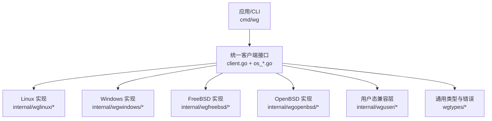
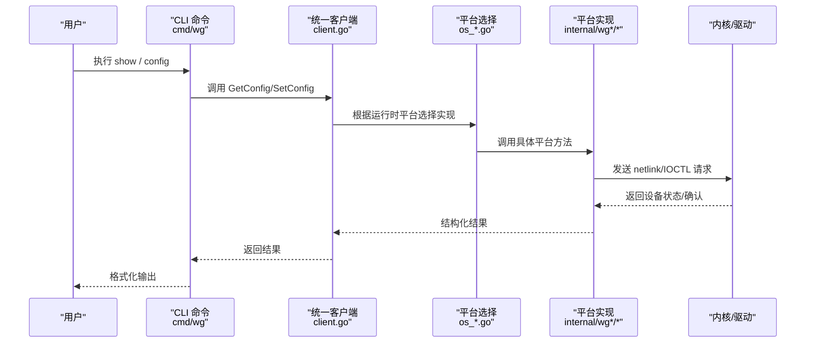
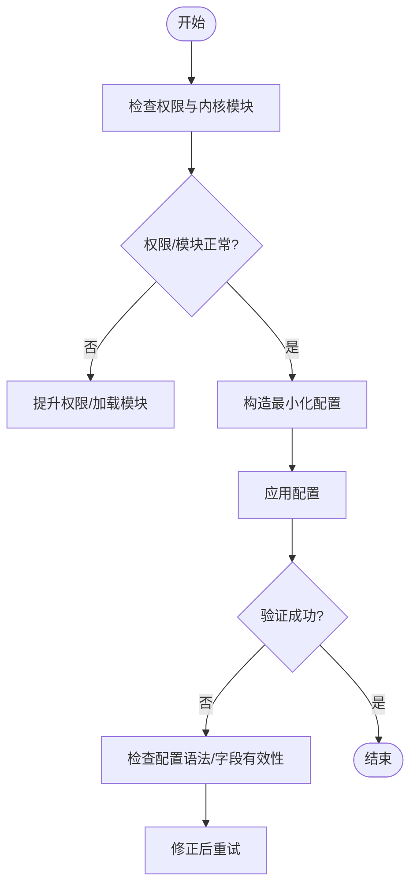
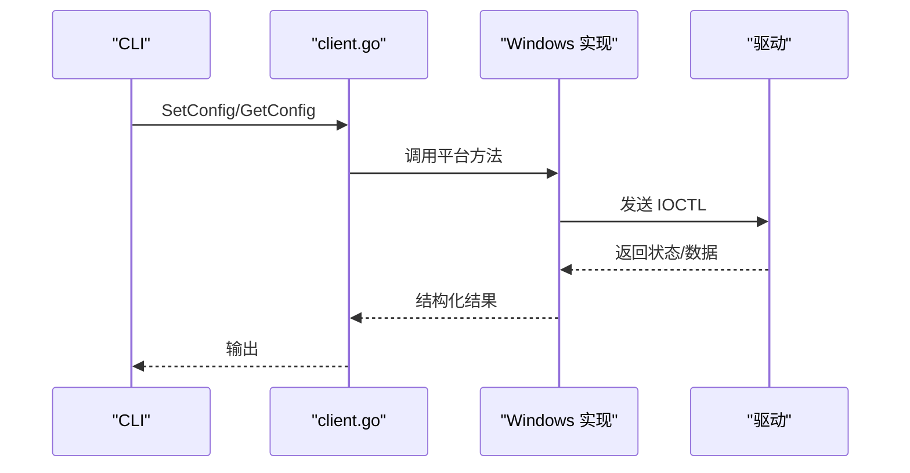
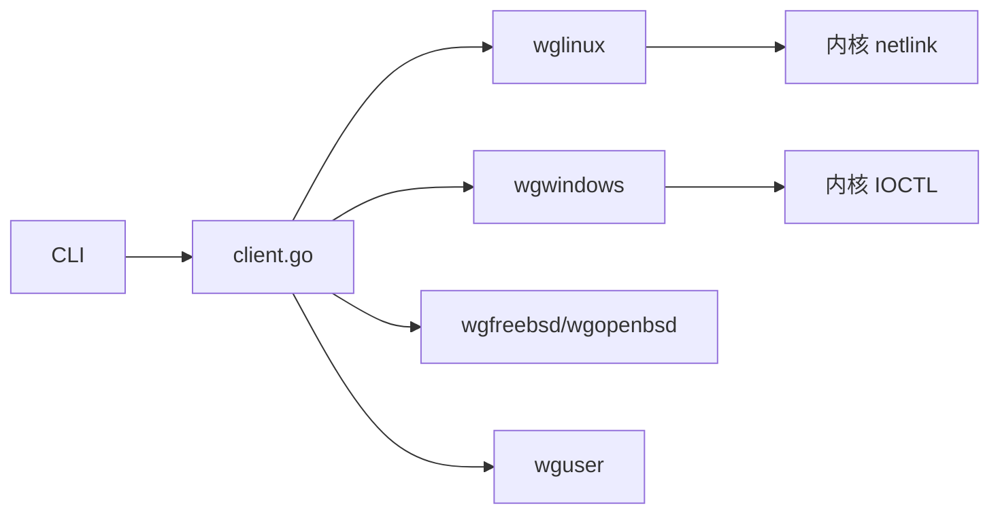
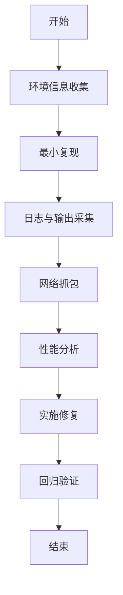

# 故障排除

<cite>
**本文引用的文件**
- [README.md](file://README.md)
- [readme_cn.md](file://readme_cn.md)
- [doc.go](file://doc.go)
- [client.go](file://client.go)
- [os_linux.go](file://os_linux.go)
- [os_windows.go](file://os_windows.go)
- [os_freebsd.go](file://os_freebsd.go)
- [os_openbsd.go](file://os_openbsd.go)
- [os_userspace.go](file://os_userspace.go)
- [wgtypes/errors.go](file://wgtypes/errors.go)
- [wgtypes/types.go](file://wgtypes/types.go)
- [internal/wglinux/client_linux.go](file://internal/wglinux/client_linux.go)
- [internal/wglinux/configure_linux.go](file://internal/wglinux/configure_linux.go)
- [internal/wglinux/parse_linux.go](file://internal/wglinux/parse_linux.go)
- [internal/wgwindows/client_windows.go](file://internal/wgwindows/client_windows.go)
- [internal/wgwindows/internal/ioctl/configuration_windows.go](file://internal/wgwindows/internal/ioctl/configuration_windows.go)
- [internal/wgfreebsd/client_freebsd.go](file://internal/wgfreebsd/client_freebsd.go)
- [internal/wgopenbsd/client_openbsd.go](file://internal/wgopenbsd/client_openbsd.go)
- [cmd/wg/main.go](file://cmd/wg/main.go)
- [cmd/wg/command.go](file://cmd/wg/command.go)
- [cmd/wg/config.go](file://cmd/wg/config.go)
- [cmd/wg/show.go](file://cmd/wg/show.go)
- [internal/wguser/client.go](file://internal/wguser/client.go)
- [internal/wguser/configure.go](file://internal/wguser/configure.go)
- [internal/wguser/conn_unix.go](file://internal/wguser/client.go)
- [internal/wguser/conn_windows.go](file://internal/wguser/conn_windows.go)
- [internal/wgmeta/store.go](file://internal/wgmeta/store.go)
- [internal/wgmeta/path.go](file://internal/wgmeta/path.go)
- [.github/workflows/linux-test.yml](file://.github/workflows/linux-test.yml)
- [.builds/freebsd.yml](file://.builds/freebsd.yml)
- [.builds/openbsd.yml](file://.builds/openbsd.yml)
</cite>

## 目录
1. [简介](#简介)
2. [项目结构](#项目结构)
3. [核心组件](#核心组件)
4. [架构总览](#架构总览)
5. [详细组件分析](#详细组件分析)
6. [依赖关系分析](#依赖关系分析)
7. [性能注意事项](#性能注意事项)
8. [故障排除指南](#故障排除指南)
9. [结论](#结论)
10. [附录](#附录)

## 简介
本指南面向使用 wgctrl-go 的用户与维护者，提供系统化的问题诊断与排错方法。内容涵盖常见错误类型、错误码定位、日志与网络抓包、跨平台差异、性能瓶颈识别与优化、调试工具与技巧、问题报告最佳实践，以及社区支持渠道。目标是帮助你在 Linux、Windows、FreeBSD、OpenBSD 等平台上快速定位并解决 WireGuard 配置与状态查询问题。

## 项目结构
仓库采用按平台与功能分层组织：
- 顶层提供统一客户端接口与平台选择（os_*.go）
- wgtypes 定义通用类型与错误
- internal 下按平台实现具体客户端（wglinux、wgwindows、wgfreebsd、wgopenbsd），以及用户态兼容层（wguser）
- cmd/wg 提供命令行工具入口与子命令
- .github/.builds 包含 CI 与构建脚本

图表来源
- [client.go:1-200](file://client.go#L1-L200)
- [os_linux.go:1-200](file://os_linux.go#L1-L200)
- [os_windows.go:1-200](file://os_windows.go#L1-L200)
- [os_freebsd.go:1-200](file://os_freebsd.go#L1-L200)
- [os_openbsd.go:1-200](file://os_openbsd.go#L1-L200)
- [os_userspace.go:1-200](file://os_userspace.go#L1-L200)
- [wgtypes/types.go:1-200](file://wgtypes/types.go#L1-L200)
- [wgtypes/errors.go:1-200](file://wgtypes/errors.go#L1-L200)

章节来源
- [README.md:1-200](file://README.md#L1-L200)
- [readme_cn.md:1-200](file://readme_cn.md#L1-L200)
- [doc.go:1-200](file://doc.go#L1-L200)

## 核心组件
- 统一客户端接口：对外暴露获取/设置 WireGuard 设备配置的 API，内部根据运行平台选择对应实现。
- 平台实现：
  - Linux：通过 netlink 与内核模块交互进行配置与解析。
  - Windows：通过 IOCTL 与内核驱动交互。
  - FreeBSD/OpenBSD：通过系统特定机制访问 WireGuard 设备。
  - 用户态兼容层：在缺少内核支持时提供有限能力或回退路径。
- 通用类型与错误：统一的设备/对端数据结构与错误类型，便于上层一致处理。
- CLI 工具：提供 show、config 等命令，封装调用流程与输出格式化。

章节来源
- [client.go:1-200](file://client.go#L1-L200)
- [wgtypes/types.go:1-200](file://wgtypes/types.go#L1-L200)
- [wgtypes/errors.go:1-200](file://wgtypes/errors.go#L1-L200)
- [cmd/wg/main.go:1-200](file://cmd/wg/main.go#L1-L200)
- [cmd/wg/command.go:1-200](file://cmd/wg/command.go#L1-L200)
- [cmd/wg/config.go:1-200](file://cmd/wg/config.go#L1-L200)
- [cmd/wg/show.go:1-200](file://cmd/wg/show.go#L1-L200)

## 架构总览
下图展示从 CLI 到平台实现的调用链与数据流。

图表来源
- [cmd/wg/main.go:1-200](file://cmd/wg/main.go#L1-L200)
- [cmd/wg/show.go:1-200](file://cmd/wg/show.go#L1-L200)
- [cmd/wg/config.go:1-200](file://cmd/wg/config.go#L1-L200)
- [client.go:1-200](file://client.go#L1-L200)
- [os_linux.go:1-200](file://os_linux.go#L1-L200)
- [os_windows.go:1-200](file://os_windows.go#L1-L200)
- [internal/wglinux/client_linux.go:1-200](file://internal/wglinux/client_linux.go#L1-L200)
- [internal/wgwindows/client_windows.go:1-200](file://internal/wgwindows/client_windows.go#L1-L200)

## 详细组件分析

### Linux 平台
- 关键职责
  - 读取/写入 WireGuard 设备配置
  - 解析内核返回的设备与对端信息
- 常见问题
  - 权限不足导致无法访问设备或 netlink 套接字
  - 内核版本过旧或不支持相关 netlink 属性
  - 配置语法错误导致解析失败
- 建议排查
  - 检查当前用户是否具备操作 WireGuard 设备的权限
  - 确认内核模块已加载且版本满足要求
  - 使用最小化配置文件复现问题，逐步缩小范围
  - 抓取 netlink 流量辅助定位（见“网络抓包”）

图表来源
- [internal/wglinux/client_linux.go:1-200](file://internal/wglinux/client_linux.go#L1-L200)
- [internal/wglinux/configure_linux.go:1-200](file://internal/wglinux/configure_linux.go#L1-L200)
- [internal/wglinux/parse_linux.go:1-200](file://internal/wglinux/parse_linux.go#L1-L200)

章节来源
- [internal/wglinux/client_linux.go:1-200](file://internal/wglinux/client_linux.go#L1-L200)
- [internal/wglinux/configure_linux.go:1-200](file://internal/wglinux/configure_linux.go#L1-L200)
- [internal/wglinux/parse_linux.go:1-200](file://internal/wglinux/parse_linux.go#L1-L200)
- [os_linux.go:1-200](file://os_linux.go#L1-L200)

### Windows 平台
- 关键职责
  - 通过 IOCTL 与内核驱动交互，完成配置与状态查询
- 常见问题
  - 管理员权限缺失
  - 驱动未安装或版本不匹配
  - IOCTL 参数非法或返回值异常
- 建议排查
  - 以管理员身份运行
  - 确认 WireGuard 驱动已正确安装
  - 使用最小配置隔离问题，必要时重启服务

图表来源
- [internal/wgwindows/client_windows.go:1-200](file://internal/wgwindows/client_windows.go#L1-L200)
- [internal/wgwindows/internal/ioctl/configuration_windows.go:1-200](file://internal/wgwindows/internal/ioctl/configuration_windows.go#L1-L200)
- [os_windows.go:1-200](file://os_windows.go#L1-L200)

章节来源
- [internal/wgwindows/client_windows.go:1-200](file://internal/wgwindows/client_windows.go#L1-L200)
- [internal/wgwindows/internal/ioctl/configuration_windows.go:1-200](file://internal/wgwindows/internal/ioctl/configuration_windows.go#L1-L200)
- [os_windows.go:1-200](file://os_windows.go#L1-L200)

### FreeBSD/OpenBSD 平台
- 关键职责
  - 通过系统特定接口访问 WireGuard 设备
- 常见问题
  - 权限与设备节点访问限制
  - 系统版本差异导致的接口行为不同
- 建议排查
  - 确认设备节点存在且可访问
  - 参考系统文档与内核版本兼容性

章节来源
- [internal/wgfreebsd/client_freebsd.go:1-200](file://internal/wgfreebsd/client_freebsd.go#L1-L200)
- [internal/wgopenbsd/client_openbsd.go:1-200](file://internal/wgopenbsd/client_openbsd.go#L1-L200)
- [os_freebsd.go:1-200](file://os_freebsd.go#L1-L200)
- [os_openbsd.go:1-200](file://os_openbsd.go#L1-L200)

### 用户态兼容层
- 关键职责
  - 在缺乏内核支持时提供有限能力或回退路径
- 常见问题
  - 能力受限（仅读或部分写）
  - 行为与内核模式不一致
- 建议排查
  - 明确当前运行模式（内核/用户态）
  - 针对受限能力调整期望行为

章节来源
- [internal/wguser/client.go:1-200](file://internal/wguser/client.go#L1-L200)
- [internal/wguser/configure.go:1-200](file://internal/wguser/configure.go#L1-L200)
- [internal/wguser/conn_unix.go:1-200](file://internal/wguser/conn_unix.go#L1-L200)
- [internal/wguser/conn_windows.go:1-200](file://internal/wguser/conn_windows.go#L1-L200)
- [os_userspace.go:1-200](file://os_userspace.go#L1-L200)

### CLI 工具
- 关键职责
  - 提供 show、config 等命令，封装调用与输出
- 常见问题
  - 参数校验失败
  - 输出格式不符合预期
- 建议排查
  - 使用最小参数集复现
  - 检查命令帮助与示例

章节来源
- [cmd/wg/main.go:1-200](file://cmd/wg/main.go#L1-L200)
- [cmd/wg/command.go:1-200](file://cmd/wg/command.go#L1-L200)
- [cmd/wg/config.go:1-200](file://cmd/wg/config.go#L1-L200)
- [cmd/wg/show.go:1-200](file://cmd/wg/show.go#L1-L200)

## 依赖关系分析
- 耦合点
  - 统一客户端与平台实现之间的接口契约
  - 平台实现与内核/驱动之间的协议（netlink/IOCTL）
- 外部依赖
  - 操作系统内核模块/驱动
  - 系统工具（如网络抓包工具）
- 潜在循环依赖
  - 代码分层清晰，未见明显循环依赖

图表来源
- [client.go:1-200](file://client.go#L1-L200)
- [internal/wglinux/client_linux.go:1-200](file://internal/wglinux/client_linux.go#L1-L200)
- [internal/wgwindows/client_windows.go:1-200](file://internal/wgwindows/client_windows.go#L1-L200)
- [internal/wgfreebsd/client_freebsd.go:1-200](file://internal/wgfreebsd/client_freebsd.go#L1-L200)
- [internal/wgopenbsd/client_openbsd.go:1-200](file://internal/wgopenbsd/client_openbsd.go#L1-L200)
- [internal/wguser/client.go:1-200](file://internal/wguser/client.go#L1-L200)

章节来源
- [client.go:1-200](file://client.go#L1-L200)
- [os_linux.go:1-200](file://os_linux.go#L1-L200)
- [os_windows.go:1-200](file://os_windows.go#L1-L200)
- [os_freebsd.go:1-200](file://os_freebsd.go#L1-L200)
- [os_openbsd.go:1-200](file://os_openbsd.go#L1-L200)
- [os_userspace.go:1-200](file://os_userspace.go#L1-L200)

## 性能注意事项
- 高频配置变更
  - 避免在短时间内频繁调用配置接口，批量合并变更
- 大配置解析
  - 减少不必要的字段，按需启用对端与路由
- I/O 阻塞
  - 注意内核/驱动响应延迟，合理设置超时与重试策略
- 资源占用
  - 监控进程内存与句柄数，避免泄漏
- 平台差异
  - Linux netlink 消息大小与批处理
  - Windows IOCTL 调用开销

[本节为通用指导，无需特定文件引用]

## 故障排除指南

### 常见错误类型与定位
- 权限错误
  - 现象：无法访问设备或 netlink/IOCTL 失败
  - 定位：检查运行用户权限与内核模块/驱动状态
  - 解决：提升权限或以管理员运行；确保模块/驱动已加载
- 配置解析错误
  - 现象：配置提交失败或显示异常
  - 定位：检查配置语法与字段有效性
  - 解决：使用最小化配置逐步添加字段，定位问题项
- 平台不支持/能力受限
  - 现象：部分功能不可用或行为异常
  - 定位：确认运行模式（内核/用户态）与平台支持
  - 解决：升级内核/驱动或切换到支持的平台
- 网络连通性问题
  - 现象：隧道建立但无流量
  - 定位：检查路由、NAT、防火墙规则
  - 解决：调整路由与防火墙策略，验证端到端连通性

章节来源
- [wgtypes/errors.go:1-200](file://wgtypes/errors.go#L1-L200)
- [wgtypes/types.go:1-200](file://wgtypes/types.go#L1-L200)
- [internal/wglinux/client_linux.go:1-200](file://internal/wglinux/client_linux.go#L1-L200)
- [internal/wgwindows/client_windows.go:1-200](file://internal/wgwindows/client_windows.go#L1-L200)
- [internal/wguser/client.go:1-200](file://internal/wguser/client.go#L1-L200)

### 系统化诊断流程
- 步骤一：环境确认
  - 记录操作系统版本、内核/驱动版本、wgctrl-go 版本
  - 确认运行模式（内核/用户态）
- 步骤二：最小复现
  - 使用最小配置复现问题，逐步增加复杂度
- 步骤三：日志与输出
  - 收集 CLI 输出与系统日志（如 dmesg、journalctl、事件查看器）
- 步骤四：网络抓包
  - 在隧道两端抓包，确认握手与数据包流向
- 步骤五：性能分析
  - 观察 CPU/内存/IO 指标，定位瓶颈
- 步骤六：回归验证
  - 修复后回归测试，确保问题不再出现

[本节为通用流程，无需特定文件引用]

### 日志分析与网络抓包
- Linux
  - 系统日志：journalctl、dmesg
  - 抓包：tcpdump 或 wireshark，关注 WireGuard 端口与协议
- Windows
  - 事件查看器、系统日志
  - 抓包：Wireshark，过滤 WireGuard 端口
- FreeBSD/OpenBSD
  - 系统日志与内核消息
  - 抓包：tcpdump

[本节为通用指导，无需特定文件引用]

### 性能分析与优化
- 识别瓶颈
  - 高 CPU：频繁配置更新或大量对端
  - 高内存：配置过大或解析开销
  - 高 IO：频繁读写设备或日志
- 优化建议
  - 批量配置变更
  - 精简配置与路由
  - 合理设置超时与重试
  - 避免热点路径上的阻塞调用

[本节为通用指导，无需特定文件引用]

### 平台特有问题与解决
- Linux
  - 权限与 netlink 错误：检查权限与内核模块
  - 内核版本差异：升级内核或使用兼容版本
- Windows
  - 驱动问题：重装或升级驱动
  - 管理员权限：始终以管理员运行
- FreeBSD/OpenBSD
  - 设备节点与权限：检查设备节点与访问控制
  - 系统版本差异：参考发行版文档

章节来源
- [os_linux.go:1-200](file://os_linux.go#L1-L200)
- [os_windows.go:1-200](file://os_windows.go#L1-L200)
- [os_freebsd.go:1-200](file://os_freebsd.go#L1-L200)
- [os_openbsd.go:1-200](file://os_openbsd.go#L1-L200)
- [internal/wglinux/client_linux.go:1-200](file://internal/wglinux/client_linux.go#L1-L200)
- [internal/wgwindows/client_windows.go:1-200](file://internal/wgwindows/client_windows.go#L1-L200)
- [internal/wgfreebsd/client_freebsd.go:1-200](file://internal/wgfreebsd/client_freebsd.go#L1-L200)
- [internal/wgopenbsd/client_openbsd.go:1-200](file://internal/wgopenbsd/client_openbsd.go#L1-L200)

### 调试工具与技巧
- 工具
  - 日志：journalctl、dmesg、事件查看器
  - 抓包：tcpdump、Wireshark
  - 性能：系统自带性能计数器或第三方工具
- 技巧
  - 开启详细日志（若可用）
  - 使用最小配置隔离问题
  - 分阶段验证（先连通性，再业务流量）

[本节为通用指导，无需特定文件引用]

### 问题报告最佳实践
- 必要信息
  - 操作系统与版本、内核/驱动版本
  - wgctrl-go 版本与构建信息
  - 完整复现步骤与最小配置
  - 相关日志与抓包文件
  - 期望行为与实际行为
- 提交渠道
  - 仓库 Issues（附上述信息）
  - 社区论坛与讨论区

[本节为通用指导，无需特定文件引用]

### 社区支持与获取帮助
- 仓库文档与说明
  - README 与中文说明
- 构建与测试
  - CI 工作流与构建脚本可作为参考
- 联系方式
  - 通过 Issues 提交问题与反馈

章节来源
- [README.md:1-200](file://README.md#L1-L200)
- [readme_cn.md:1-200](file://readme_cn.md#L1-L200)
- [.github/workflows/linux-test.yml:1-200](file://.github/workflows/linux-test.yml#L1-L200)
- [.builds/freebsd.yml:1-200](file://.builds/freebsd.yml#L1-L200)
- [.builds/openbsd.yml:1-200](file://.builds/openbsd.yml#L1-L200)

## 结论
通过分层架构与平台抽象，wgctrl-go 在不同操作系统上提供了统一的 WireGuard 管理能力。故障排除应遵循系统化流程：环境确认、最小复现、日志与抓包、性能分析、平台差异处理与回归验证。结合本指南的常见错误与解决方案，可显著提升定位与修复效率。

## 附录
- 术语
  - netlink：Linux 内核与用户空间通信机制
  - IOCTL：I/O 控制调用，用于用户态与内核驱动交互
- 参考
  - 各平台实现与 CLI 源码路径见上文引用

[本节为补充信息，无需特定文件引用]