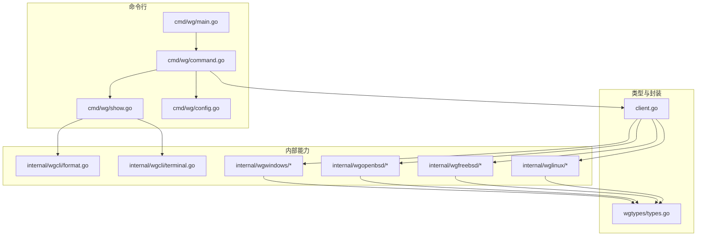
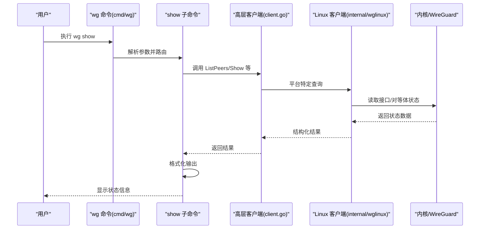
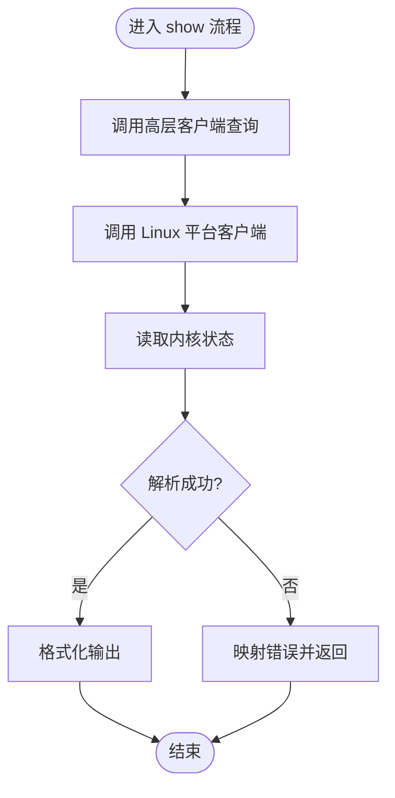
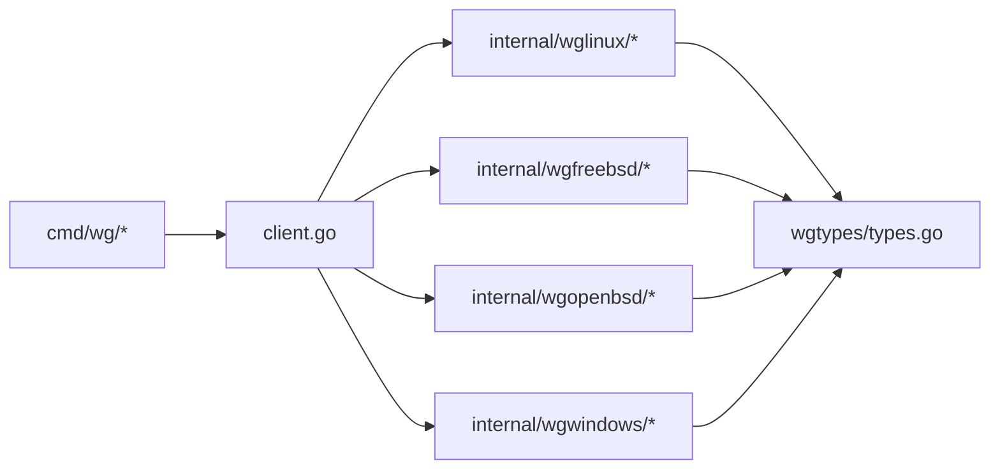
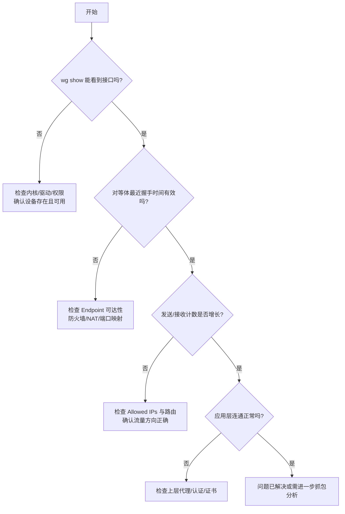

# 诊断流程

<cite>
**本文引用的文件**
- [README.md](file://README.md)
- [readme_cn.md](file://readme_cn.md)
- [cmd/wg/main.go](file://cmd/wg/main.go)
- [cmd/wg/command.go](file://cmd/wg/command.go)
- [cmd/wg/show.go](file://cmd/wg/show.go)
- [cmd/wg/config.go](file://cmd/wg/config.go)
- [internal/wgcli/format.go](file://internal/wgcli/format.go)
- [internal/wgcli/terminal.go](file://internal/wgcli/terminal.go)
- [internal/wglinux/client_linux.go](file://internal/wglinux/client_linux.go)
- [internal/wglinux/parse_linux.go](file://internal/wglinux/parse_linux.go)
- [internal/wglinux/configure_linux.go](file://internal/wglinux/configure_linux.go)
- [internal/wgfreebsd/client_freebsd.go](file://internal/wgfreebsd/client_freebsd.go)
- [internal/wgopenbsd/client_openbsd.go](file://internal/wgopenbsd/client_openbsd.go)
- [internal/wgwindows/client_windows.go](file://internal/wgwindows/client_windows.go)
- [wgtypes/types.go](file://wgtypes/types.go)
- [client.go](file://client.go)
</cite>

## 目录
1. [简介](#简介)
2. [项目结构](#项目结构)
3. [核心组件](#核心组件)
4. [架构总览](#架构总览)
5. [详细组件分析](#详细组件分析)
6. [依赖关系分析](#依赖关系分析)
7. [性能考量](#性能考量)
8. [故障排查指南](#故障排查指南)
9. [结论](#结论)
10. [附录](#附录)

## 简介
本指南面向使用 wg 命令行工具与 wgctrl-go 库进行 WireGuard 接口管理的用户与维护者，提供从问题发现到解决的系统化诊断流程。内容涵盖：
- 症状识别与信息收集
- 基于 wg 命令的状态检查与故障定位
- 日志分析与网络抓包、连接测试技巧
- 常见问题快速诊断路径与决策树
- 如何收集和提交有效的故障报告

本指南同时结合仓库中的 CLI（cmd/wg）与各平台客户端实现（Linux/FreeBSD/OpenBSD/Windows），帮助读者理解不同平台下的行为差异与排障要点。

## 项目结构
仓库采用分层组织：
- cmd/wg：wg 命令行入口与子命令（show、config 等）
- internal/*：按平台或职责划分的内部模块（如 Linux/FreeBSD/OpenBSD/Windows 客户端、格式化工具、终端交互等）
- wgtypes：类型定义与错误类型
- client.go：高层客户端封装，聚合各平台能力

图表来源
- [cmd/wg/main.go:1-200](file://cmd/wg/main.go#L1-L200)
- [cmd/wg/command.go:1-200](file://cmd/wg/command.go#L1-L200)
- [cmd/wg/show.go:1-200](file://cmd/wg/show.go#L1-L200)
- [cmd/wg/config.go:1-200](file://cmd/wg/config.go#L1-L200)
- [internal/wgcli/format.go:1-200](file://internal/wgcli/format.go#L1-L200)
- [internal/wgcli/terminal.go:1-200](file://internal/wgcli/terminal.go#L1-L200)
- [internal/wglinux/client_linux.go:1-200](file://internal/wglinux/client_linux.go#L1-L200)
- [internal/wglinux/parse_linux.go:1-200](file://internal/wglinux/parse_linux.go#L1-L200)
- [internal/wglinux/configure_linux.go:1-200](file://internal/wglinux/configure_linux.go#L1-L200)
- [internal/wgfreebsd/client_freebsd.go:1-200](file://internal/wgfreebsd/client_freebsd.go#L1-L200)
- [internal/wgopenbsd/client_openbsd.go:1-200](file://internal/wgopenbsd/client_openbsd.go#L1-L200)
- [internal/wgwindows/client_windows.go:1-200](file://internal/wgwindows/client_windows.go#L1-L200)
- [wgtypes/types.go:1-200](file://wgtypes/types.go#L1-L200)
- [client.go:1-200](file://client.go#L1-L200)

章节来源
- [README.md:1-200](file://README.md#L1-L200)
- [readme_cn.md:1-200](file://readme_cn.md#L1-L200)

## 核心组件
- wg 命令行入口与路由：负责解析参数、选择子命令并执行
- show 子命令：查询接口与对等体状态，格式化输出
- config 子命令：读取/导出配置
- 平台客户端：通过系统调用或内核接口获取/设置 WireGuard 状态
- 类型与错误：统一的数据结构与错误语义
- 高层客户端封装：屏蔽平台差异，提供一致 API

章节来源
- [cmd/wg/main.go:1-200](file://cmd/wg/main.go#L1-L200)
- [cmd/wg/command.go:1-200](file://cmd/wg/command.go#L1-L200)
- [cmd/wg/show.go:1-200](file://cmd/wg/show.go#L1-L200)
- [cmd/wg/config.go:1-200](file://cmd/wg/config.go#L1-L200)
- [internal/wglinux/client_linux.go:1-200](file://internal/wglinux/client_linux.go#L1-L200)
- [internal/wgfreebsd/client_freebsd.go:1-200](file://internal/wgfreebsd/client_freebsd.go#L1-L200)
- [internal/wgopenbsd/client_openbsd.go:1-200](file://internal/wgopenbsd/client_openbsd.go#L1-L200)
- [internal/wgwindows/client_windows.go:1-200](file://internal/wgwindows/client_windows.go#L1-L200)
- [wgtypes/types.go:1-200](file://wgtypes/types.go#L1-L200)
- [client.go:1-200](file://client.go#L1-L200)

## 架构总览
下图展示了 wg 命令在 Linux 上的典型调用链：CLI 层解析参数后调用 show 子命令，再通过高层客户端访问 Linux 平台客户端，最终读取内核状态并格式化输出。

图表来源
- [cmd/wg/main.go:1-200](file://cmd/wg/main.go#L1-L200)
- [cmd/wg/show.go:1-200](file://cmd/wg/show.go#L1-L200)
- [client.go:1-200](file://client.go#L1-L200)
- [internal/wglinux/client_linux.go:1-200](file://internal/wglinux/client_linux.go#L1-L200)

## 详细组件分析

### wg 命令与 show 子命令
- 作用：提供统一的 CLI 入口，支持 show、config 等子命令；show 用于查看接口和对等体状态，便于快速定位连接、密钥、传输统计等问题。
- 关键点：参数解析、命令路由、输出格式化、跨平台兼容。

章节来源
- [cmd/wg/main.go:1-200](file://cmd/wg/main.go#L1-L200)
- [cmd/wg/command.go:1-200](file://cmd/wg/command.go#L1-L200)
- [cmd/wg/show.go:1-200](file://cmd/wg/show.go#L1-L200)
- [internal/wgcli/format.go:1-200](file://internal/wgcli/format.go#L1-L200)
- [internal/wgcli/terminal.go:1-200](file://internal/wgcli/terminal.go#L1-L200)

### 平台客户端（以 Linux 为例）
- 作用：通过系统调用或内核接口读取/设置 WireGuard 接口与对等体信息。
- 关键点：解析内核返回的原始数据为结构化对象；处理权限与设备节点；错误映射到统一错误类型。

图表来源
- [internal/wglinux/client_linux.go:1-200](file://internal/wglinux/client_linux.go#L1-L200)
- [internal/wglinux/parse_linux.go:1-200](file://internal/wglinux/parse_linux.go#L1-L200)
- [wgtypes/types.go:1-200](file://wgtypes/types.go#L1-L200)

章节来源
- [internal/wglinux/client_linux.go:1-200](file://internal/wglinux/client_linux.go#L1-L200)
- [internal/wglinux/parse_linux.go:1-200](file://internal/wglinux/parse_linux.go#L1-L200)
- [internal/wglinux/configure_linux.go:1-200](file://internal/wglinux/configure_linux.go#L1-L200)
- [wgtypes/types.go:1-200](file://wgtypes/types.go#L1-L200)

### 其他平台客户端
- FreeBSD/OpenBSD/Windows 客户端遵循相同抽象：读取/设置接口与对等体信息，屏蔽平台差异。
- 排障时需注意各平台特有的权限模型、设备路径、内核版本差异。

章节来源
- [internal/wgfreebsd/client_freebsd.go:1-200](file://internal/wgfreebsd/client_freebsd.go#L1-L200)
- [internal/wgopenbsd/client_openbsd.go:1-200](file://internal/wgopenbsd/client_openbsd.go#L1-L200)
- [internal/wgwindows/client_windows.go:1-200](file://internal/wgwindows/client_windows.go#L1-L200)

## 依赖关系分析
- CLI 依赖 show/config 子命令逻辑
- 子命令依赖高层客户端封装
- 高层客户端依赖具体平台实现
- 所有平台实现依赖统一类型与错误定义

图表来源
- [cmd/wg/command.go:1-200](file://cmd/wg/command.go#L1-L200)
- [client.go:1-200](file://client.go#L1-L200)
- [internal/wglinux/client_linux.go:1-200](file://internal/wglinux/client_linux.go#L1-L200)
- [internal/wgfreebsd/client_freebsd.go:1-200](file://internal/wgfreebsd/client_freebsd.go#L1-L200)
- [internal/wgopenbsd/client_openbsd.go:1-200](file://internal/wgopenbsd/client_openbsd.go#L1-L200)
- [internal/wgwindows/client_windows.go:1-200](file://internal/wgwindows/client_windows.go#L1-L200)
- [wgtypes/types.go:1-200](file://wgtypes/types.go#L1-L200)

章节来源
- [client.go:1-200](file://client.go#L1-L200)
- [wgtypes/types.go:1-200](file://wgtypes/types.go#L1-L200)

## 性能考量
- 频繁查询内核状态可能带来开销，建议在批量操作或监控场景下合并请求。
- 大输出格式化时应避免不必要的字符串拼接，优先使用流式或缓冲输出。
- 平台客户端解析内核数据时注意内存分配与零拷贝优化。

[本节为通用指导，不直接分析具体文件]

## 故障排查指南

### 一、问题发现与症状识别
- 常见症状
  - 无法建立或维持隧道连接
  - 对等体不可达或频繁断开
  - 流量不通或延迟异常
  - 配置变更后未生效
- 初步判断
  - 确认本地接口是否启用、IP/路由是否正确
  - 确认对端可达性（公网/NAT/防火墙）
  - 确认密钥与标识符是否匹配

### 二、信息收集清单
- 系统与环境
  - 操作系统与内核版本
  - wg 命令版本与构建信息
  - 是否有容器/虚拟化环境
- 接口与对等体状态
  - 使用 wg show 查看接口、对等体、统计信息
  - 记录监听端口、公钥、允许 IP、最近握手时间、发送/接收字节数
- 配置与变更历史
  - 使用 wg showconf 或相关命令导出当前配置
  - 记录最近的配置变更与触发方式
- 日志与审计
  - 系统日志（如 dmesg/journalctl）中关于 WireGuard 的条目
  - 应用侧日志（如有）
- 网络连通性
  - 基础连通性测试（ping/traceroute）
  - 抓包分析（tcpdump/wireshark）

章节来源
- [cmd/wg/show.go:1-200](file://cmd/wg/show.go#L1-L200)
- [cmd/wg/config.go:1-200](file://cmd/wg/config.go#L1-L200)

### 三、问题分析与定位
- 使用 wg show 逐项核对
  - 接口状态：是否启用、监听端口、私钥是否存在
  - 对等体：公钥、Endpoint、Allowed IPs、持久 Keepalive、最后握手时间
  - 统计：发送/接收计数是否增长，是否存在只收不发或反之
- 平台差异
  - Linux：关注内核模块/驱动版本、netfilter/iptables 规则、sysctl 参数
  - FreeBSD/OpenBSD：关注内核选项与设备节点权限
  - Windows：关注 TUN/TAP 适配器、服务状态、防火墙策略
- 常见根因
  - 密钥不匹配或标识符错误
  - Endpoint 不可达或 NAT 映射失败
  - Allowed IPs 配置不当导致路由回环
  - 防火墙/NAT 阻断 UDP 端口
  - 多网卡/路由冲突

章节来源
- [internal/wglinux/client_linux.go:1-200](file://internal/wglinux/client_linux.go#L1-L200)
- [internal/wgfreebsd/client_freebsd.go:1-200](file://internal/wgfreebsd/client_freebsd.go#L1-L200)
- [internal/wgopenbsd/client_openbsd.go:1-200](file://internal/wgopenbsd/client_openbsd.go#L1-L200)
- [internal/wgwindows/client_windows.go:1-200](file://internal/wgwindows/client_windows.go#L1-L200)

### 四、解决方案验证
- 最小化验证
  - 临时关闭防火墙或放行必要端口，验证连通性
  - 使用同一网段两台机器直连，排除中间网络设备影响
- 逐步恢复
  - 先恢复基本连通，再逐步添加复杂路由与策略
- 回归测试
  - 重放关键步骤（配置加载、握手、数据传输）
  - 观察统计与日志是否恢复正常

[本节为通用指导，不直接分析具体文件]

### 五、wg 命令状态检查与故障定位
- 常用检查项
  - 列出所有接口与对等体：wg show
  - 查看指定接口详情：wg show <interface>
  - 导出配置：wg showconf <interface>
- 关键指标
  - 最近握手时间：接近当前时间表示活跃
  - 发送/接收字节：持续增长表示有流量
  - Endpoint：确保可达且未被拦截
  - Allowed IPs：确保覆盖期望的子网且不冲突

章节来源
- [cmd/wg/show.go:1-200](file://cmd/wg/show.go#L1-L200)
- [cmd/wg/config.go:1-200](file://cmd/wg/config.go#L1-L200)

### 六、日志分析方法与工具
- 系统日志
  - Linux：journalctl -k 或 dmesg 过滤 WireGuard 相关条目
  - FreeBSD/OpenBSD：/var/log/messages 或 dmesg
  - Windows：事件查看器中与网络/驱动相关的条目
- 应用日志
  - 若通过程序调用 wgctrl-go，开启调试日志级别，捕获初始化、配置、错误堆栈
- 抓包分析
  - 使用 tcpdump 抓取 WireGuard 端口（默认 UDP 51820）
  - 使用 wireshark 解码 WireGuard 协议，检查握手与数据包

[本节为通用指导，不直接分析具体文件]

### 七、网络抓包与连接测试技巧
- 抓包建议
  - 在两端同时抓包，对比握手阶段与数据传输阶段
  - 关注 UDP 端口、源/目的地址、TTL、ICMP 错误
- 连接测试
  - ping/traceroute 验证基础连通性
  - 使用 nc/ncat 测试 UDP 端口可达性
  - 使用 curl/wget 测试应用层连通性（如 HTTP 代理）

[本节为通用指导，不直接分析具体文件]

### 八、常见问题快速诊断路径与决策树

[本图为概念性流程图，不绑定具体源码]

### 九、如何收集和提交有效的故障报告
- 必备信息
  - 操作系统与内核版本
  - wg 命令版本与构建信息
  - wg show 完整输出（含接口与对等体）
  - wg showconf 导出的配置（脱敏敏感信息）
  - 系统日志片段（包含时间戳）
  - 抓包文件（pcapng）与简要说明
- 复现步骤
  - 清晰描述操作步骤与预期结果
  - 提供最小可复现场景
- 提交渠道
  - 仓库 Issue 模板（如有）
  - 邮件列表或社区论坛

[本节为通用指导，不直接分析具体文件]

## 结论
通过标准化的问题发现、信息收集、分析与验证流程，结合 wg 命令与平台客户端的能力，可以快速定位 WireGuard 相关问题。建议在团队内沉淀常见问题的决策树与检查清单，提高排障效率与一致性。

[本节为总结性内容，不直接分析具体文件]

## 附录
- 参考文档
  - README 与中文说明：了解项目背景与用法
  - 各平台客户端实现：理解平台差异与限制
- 实用命令速查
  - wg show / wg showconf
  - 系统日志：journalctl/dmesg
  - 抓包：tcpdump/wireshark

章节来源
- [README.md:1-200](file://README.md#L1-L200)
- [readme_cn.md:1-200](file://readme_cn.md#L1-L200)