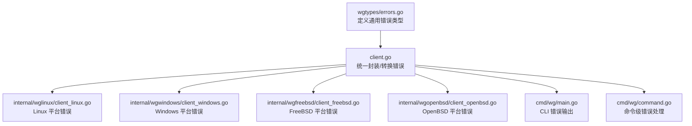
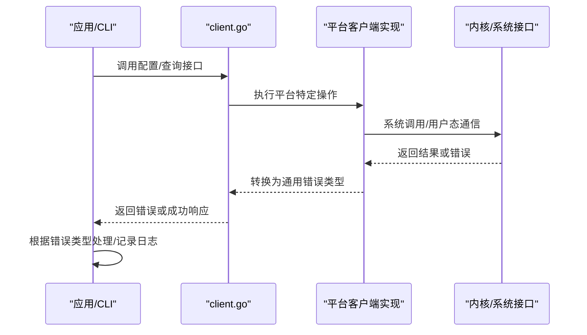
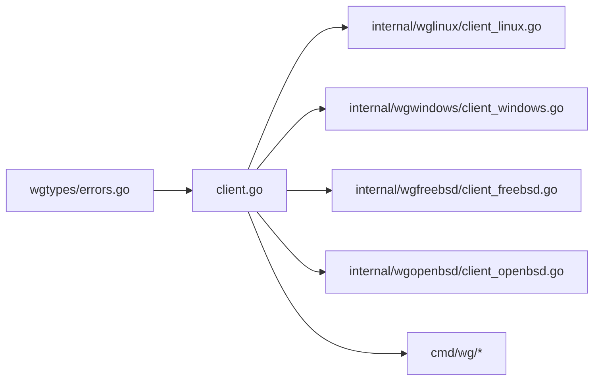

# 错误参考

<cite>
**本文引用的文件**
- [wgtypes/errors.go](file://wgtypes/errors.go)
- [client.go](file://client.go)
- [os_linux.go](file://os_linux.go)
- [os_windows.go](file://os_windows.go)
- [os_freebsd.go](file://os_freebsd.go)
- [os_openbsd.go](file://os_openbsd.go)
- [internal/wglinux/client_linux.go](file://internal/wglinux/client_linux.go)
- [internal/wgwindows/client_windows.go](file://internal/wgwindows/client_windows.go)
- [internal/wgfreebsd/client_freebsd.go](file://internal/wgfreebsd/client_freebsd.go)
- [internal/wgopenbsd/client_openbsd.go](file://internal/wgopenbsd/client_openbsd.go)
- [cmd/wg/main.go](file://cmd/wg/main.go)
- [cmd/wg/command.go](file://cmd/wg/command.go)
</cite>

## 目录
1. [简介](#简介)
2. [项目结构（与错误相关）](#项目结构与错误相关)
3. [核心组件（错误类型与来源）](#核心组件错误类型与来源)
4. [架构总览（错误传播路径）](#架构总览错误传播路径)
5. [详细组件分析](#详细组件分析)
6. [依赖关系分析](#依赖关系分析)
7. [性能考虑](#性能考虑)
8. [故障排查指南](#故障排查指南)
9. [结论](#结论)
10. [附录：错误码与含义、平台差异、日志格式与最佳实践](#附录错误码与含义平台差异日志格式与最佳实践)

## 简介
本错误参考文档面向使用 wgctrl-go 的开发者，系统化梳理项目中定义和使用的错误类型、错误码及其语义，覆盖网络错误、配置错误、权限错误等常见类别。文档同时说明不同平台（Linux、Windows、FreeBSD、OpenBSD）特有的错误类型与处理方式，提供错误处理编程示例与最佳实践，并给出错误日志的格式与解读方法，帮助快速定位与解决问题。

## 项目结构（与错误相关）
wgctrl-go 将错误定义集中在 wgtypes/errors.go，并在各平台客户端实现中通过系统调用或用户态通信产生具体错误；上层 client.go 统一封装并对外暴露；命令行工具 cmd/wg 负责打印友好的错误信息。

图表来源
- [wgtypes/errors.go](file://wgtypes/errors.go)
- [client.go](file://client.go)
- [internal/wglinux/client_linux.go](file://internal/wglinux/client_linux.go)
- [internal/wgwindows/client_windows.go](file://internal/wgwindows/client_windows.go)
- [internal/wgfreebsd/client_freebsd.go](file://internal/wgfreebsd/client_freebsd.go)
- [internal/wgopenbsd/client_openbsd.go](file://internal/wgopenbsd/client_openbsd.go)
- [cmd/wg/main.go](file://cmd/wg/main.go)
- [cmd/wg/command.go](file://cmd/wg/command.go)

章节来源
- [wgtypes/errors.go](file://wgtypes/errors.go)
- [client.go](file://client.go)
- [cmd/wg/main.go](file://cmd/wg/main.go)
- [cmd/wg/command.go](file://cmd/wg/command.go)

## 核心组件（错误类型与来源）
- 通用错误类型定义位于 wgtypes/errors.go，用于跨平台一致的错误表达。
- 平台客户端实现（Linux/Windows/FreeBSD/OpenBSD）在内部进行系统调用或用户态通信时产生具体错误，并转换为通用错误类型。
- 上层 client.go 对底层错误进行统一包装、分类与提示，便于调用方按语义处理。
- CLI 层（cmd/wg）负责将错误以可读方式输出到终端。

章节来源
- [wgtypes/errors.go](file://wgtypes/errors.go)
- [client.go](file://client.go)
- [internal/wglinux/client_linux.go](file://internal/wglinux/client_linux.go)
- [internal/wgwindows/client_windows.go](file://internal/wgwindows/client_windows.go)
- [internal/wgfreebsd/client_freebsd.go](file://internal/wgfreebsd/client_freebsd.go)
- [internal/wgopenbsd/client_openbsd.go](file://internal/wgopenbsd/client_openbsd.go)
- [cmd/wg/main.go](file://cmd/wg/main.go)
- [cmd/wg/command.go](file://cmd/wg/command.go)

## 架构总览（错误传播路径）
错误从底层平台实现向上层传播，最终由 CLI 或应用层消费。典型流程如下：

图表来源
- [client.go](file://client.go)
- [internal/wglinux/client_linux.go](file://internal/wglinux/client_linux.go)
- [internal/wgwindows/client_windows.go](file://internal/wgwindows/client_windows.go)
- [internal/wgfreebsd/client_freebsd.go](file://internal/wgfreebsd/client_freebsd.go)
- [internal/wgopenbsd/client_openbsd.go](file://internal/wgopenbsd/client_openbsd.go)

## 详细组件分析

### 通用错误类型（wgtypes/errors.go）
- 作用：集中定义跨平台通用的错误类型与错误码，确保上层与应用层获得一致的语义。
- 常见类别：
  - 网络错误：连接失败、超时、协议不匹配等。
  - 配置错误：参数非法、字段缺失、值越界等。
  - 权限错误：无管理员权限、无法访问设备节点等。
  - 平台错误：特定平台的系统调用失败。
- 建议：调用方优先依据错误类型分支处理，而非字符串匹配。

章节来源
- [wgtypes/errors.go](file://wgtypes/errors.go)

### Linux 平台错误（internal/wglinux/client_linux.go）
- 触发点：通过 netlink 或设备接口进行配置/查询时可能失败。
- 常见错误：
  - 权限不足：需要 root 权限访问内核模块或设备节点。
  - 配置错误：传入的配置项不符合 WireGuard 要求。
  - 网络错误：与内核通信失败。
- 处理建议：
  - 检查运行权限与能力（如 CAP_NET_ADMIN）。
  - 校验配置后再下发。
  - 捕获并记录底层错误以便诊断。

章节来源
- [internal/wglinux/client_linux.go](file://internal/wglinux/client_linux.go)

### Windows 平台错误（internal/wgwindows/client_windows.go）
- 触发点：通过 Windows API 或用户态服务交互。
- 常见错误：
  - 权限错误：需要管理员权限。
  - 配置错误：参数无效或不兼容当前驱动版本。
  - 网络错误：与服务/驱动通信失败。
- 处理建议：
  - 提升进程权限或使用提权机制。
  - 验证配置兼容性。
  - 重试与退避策略应对瞬时通信失败。

章节来源
- [internal/wgwindows/client_windows.go](file://internal/wgwindows/client_windows.go)

### FreeBSD 平台错误（internal/wgfreebsd/client_freebsd.go）
- 触发点：通过用户态工具或内核接口进行配置。
- 常见错误：
  - 权限错误：需 root 权限。
  - 配置错误：参数非法。
  - 网络错误：与内核/工具链通信失败。
- 处理建议：同 Linux/Windows，强调权限与配置校验。

章节来源
- [internal/wgfreebsd/client_freebsd.go](file://internal/wgfreebsd/client_freebsd.go)

### OpenBSD 平台错误（internal/wgopenbsd/client_openbsd.go）
- 触发点：通过内核接口或用户态工具。
- 常见错误：
  - 权限错误：需 root 权限。
  - 配置错误：参数非法。
  - 网络错误：通信失败。
- 处理建议：同上。

章节来源
- [internal/wgopenbsd/client_openbsd.go](file://internal/wgopenbsd/client_openbsd.go)

### 上层封装与 CLI 输出（client.go, cmd/wg）
- client.go：统一将平台错误转换为通用错误类型，并提供清晰的错误语义。
- cmd/wg/main.go 与 command.go：负责将错误以人类可读的方式输出，包含错误类型、原因与建议步骤。

章节来源
- [client.go](file://client.go)
- [cmd/wg/main.go](file://cmd/wg/main.go)
- [cmd/wg/command.go](file://cmd/wg/command.go)

## 依赖关系分析
- 错误类型定义与平台实现的耦合度低：通过 client.go 解耦，便于扩展新平台。
- 平台客户端依赖各自系统的接口，但对外暴露统一的错误语义。
- CLI 仅依赖上层 client.go 的错误类型，避免直接感知平台细节。

图表来源
- [wgtypes/errors.go](file://wgtypes/errors.go)
- [client.go](file://client.go)
- [internal/wglinux/client_linux.go](file://internal/wglinux/client_linux.go)
- [internal/wgwindows/client_windows.go](file://internal/wgwindows/client_windows.go)
- [internal/wgfreebsd/client_freebsd.go](file://internal/wgfreebsd/client_freebsd.go)
- [internal/wgopenbsd/client_openbsd.go](file://internal/wgopenbsd/client_openbsd.go)
- [cmd/wg/main.go](file://cmd/wg/main.go)
- [cmd/wg/command.go](file://cmd/wg/command.go)

## 性能考虑
- 错误路径通常不涉及大量计算，但频繁的系统调用失败会引发性能问题。
- 建议：
  - 在调用前做参数校验，减少无效请求。
  - 对瞬时错误采用指数退避重试。
  - 批量操作时合并错误统计，降低日志开销。

## 故障排查指南
- 权限问题：
  - 现象：配置/查询失败，提示无权限。
  - 解决：以管理员/root 运行，或授予必要能力（如 CAP_NET_ADMIN）。
- 配置错误：
  - 现象：参数非法或字段缺失。
  - 解决：对照文档校验配置项，逐项排除。
- 网络/通信错误：
  - 现象：与内核或服务通信失败。
  - 解决：检查服务状态、端口、驱动版本，必要时重启服务或升级驱动。
- 平台特有错误：
  - 现象：仅在特定平台出现。
  - 解决：查阅对应平台的限制与要求，调整部署环境。

章节来源
- [client.go](file://client.go)
- [cmd/wg/main.go](file://cmd/wg/main.go)
- [cmd/wg/command.go](file://cmd/wg/command.go)

## 结论
wgctrl-go 通过集中化的错误类型定义与平台无关的上层封装，提供了清晰、一致的错误语义。调用方应基于错误类型进行分支处理，结合平台特性与权限模型进行排障。CLI 层提供友好的错误输出，便于快速定位问题。遵循本文的最佳实践可显著提升稳定性与可维护性。

## 附录：错误码与含义、平台差异、日志格式与最佳实践

### 错误码与含义（按类别）
- 网络错误
  - 连接失败：无法建立与内核/服务的连接。
  - 超时：请求超过最大等待时间。
  - 协议不匹配：与目标端协议不一致。
- 配置错误
  - 参数非法：字段类型或取值范围不正确。
  - 字段缺失：必需字段未提供。
  - 值越界：数值超出允许范围。
- 权限错误
  - 无管理员权限：进程缺少必要权限。
  - 无法访问设备：设备节点不可用或被占用。
- 平台错误
  - 系统调用失败：底层系统接口返回错误。
  - 驱动/内核版本不兼容：功能不可用或行为异常。

说明：以上为语义化分类，具体错误码与枚举值请参考 wgtypes/errors.go 中的定义。

章节来源
- [wgtypes/errors.go](file://wgtypes/errors.go)

### 平台差异与处理方式
- Linux
  - 常见：权限不足、netlink 通信失败。
  - 处理：确保 root/CAP_NET_ADMIN，校验配置，重试通信。
- Windows
  - 常见：管理员权限、驱动/服务通信失败。
  - 处理：提权运行，检查服务状态，升级驱动。
- FreeBSD/OpenBSD
  - 常见：root 权限、内核/工具链通信失败。
  - 处理：提权运行，校验配置，必要时重启服务。

章节来源
- [internal/wglinux/client_linux.go](file://internal/wglinux/client_linux.go)
- [internal/wgwindows/client_windows.go](file://internal/wgwindows/client_windows.go)
- [internal/wgfreebsd/client_freebsd.go](file://internal/wgfreebsd/client_freebsd.go)
- [internal/wgopenbsd/client_openbsd.go](file://internal/wgopenbsd/client_openbsd.go)

### 错误日志格式与解读
- 推荐格式：
  - 时间戳 + 级别 + 模块 + 错误类型 + 消息 + 上下文（如接口名、参数摘要）。
- 示例字段：
  - timestamp: "2024-01-01T12:00:00Z"
  - level: "ERROR"
  - module: "wgctrl"
  - error_type: "PermissionError"
  - message: "无法访问设备节点"
  - context: {"interface": "wg0", "action": "configure"}
- 解读方法：
  - 先按 error_type 分类，再结合 context 定位具体操作与对象。
  - 对网络错误关注重试次数与超时设置。
  - 对权限错误确认运行环境与能力。

章节来源
- [cmd/wg/main.go](file://cmd/wg/main.go)
- [cmd/wg/command.go](file://cmd/wg/command.go)

### 错误处理编程示例与最佳实践
- 示例思路（伪代码）：
  - 调用配置接口，捕获错误。
  - 若为权限错误，提示以管理员运行并退出。
  - 若为配置错误，打印具体字段问题并退出。
  - 若为网络错误，记录日志并重试若干次。
  - 其他错误，记录完整堆栈并上报。
- 最佳实践：
  - 使用错误类型分支，避免字符串匹配。
  - 对瞬时错误采用指数退避重试。
  - 记录最小必要上下文，保护隐私。
  - 在 CLI 层提供友好提示与修复建议。

章节来源
- [client.go](file://client.go)
- [cmd/wg/main.go](file://cmd/wg/main.go)
- [cmd/wg/command.go](file://cmd/wg/command.go)