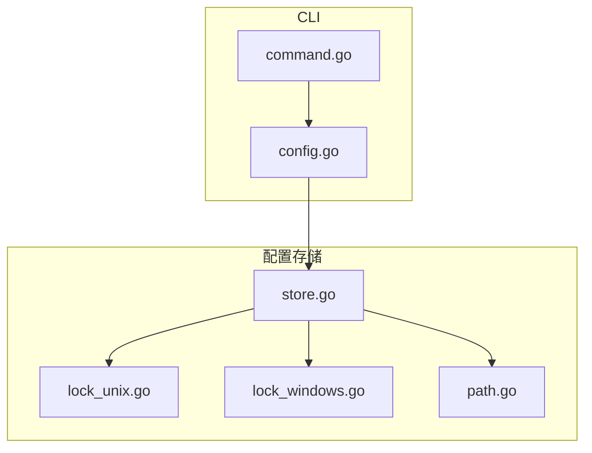
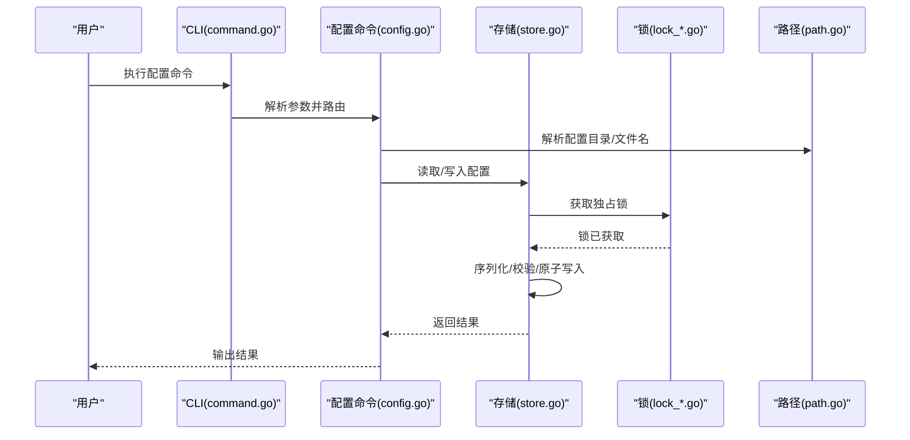
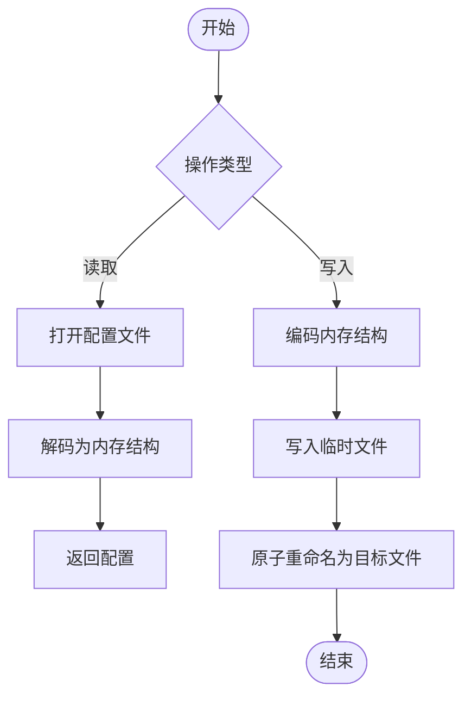
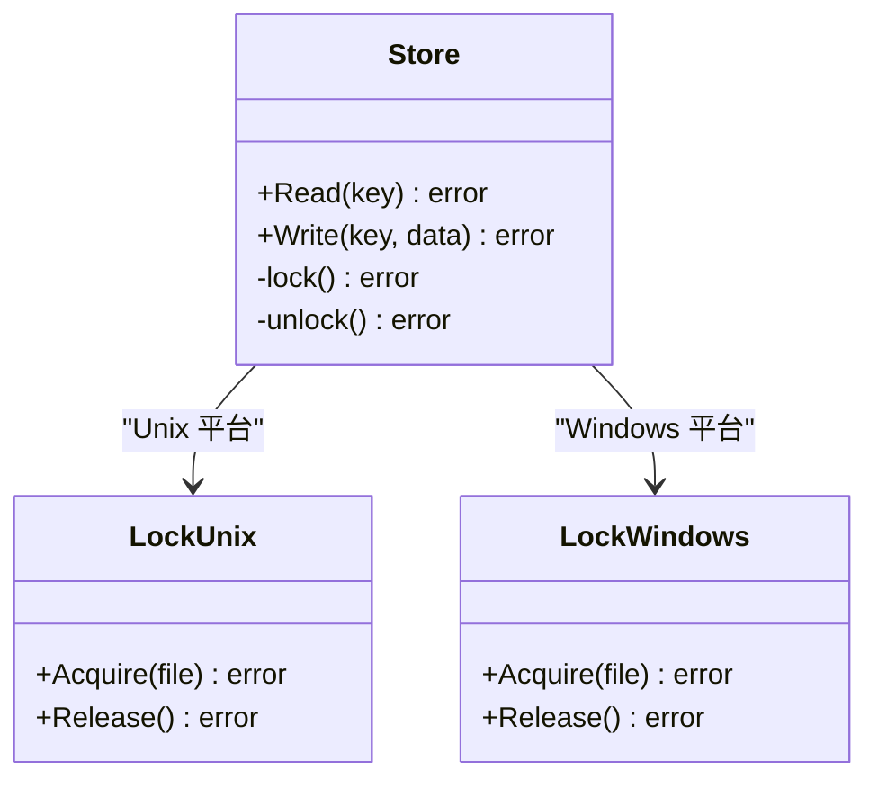
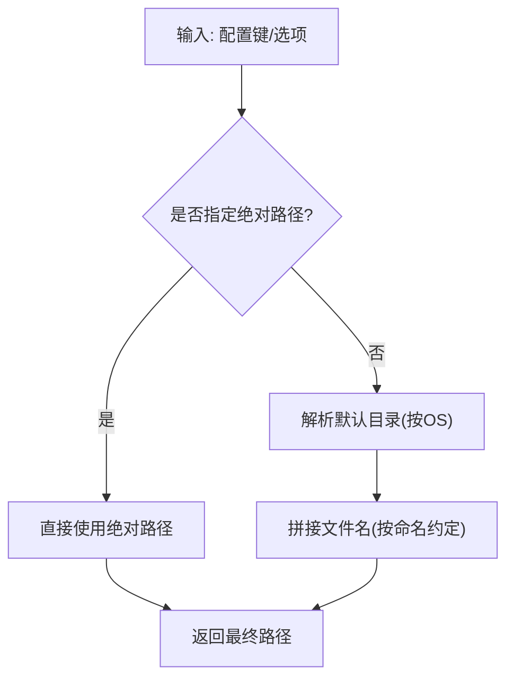
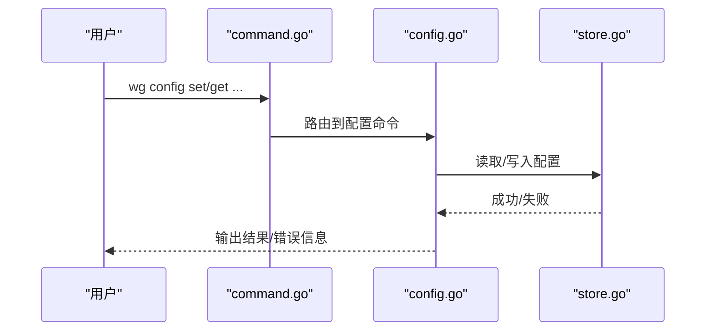
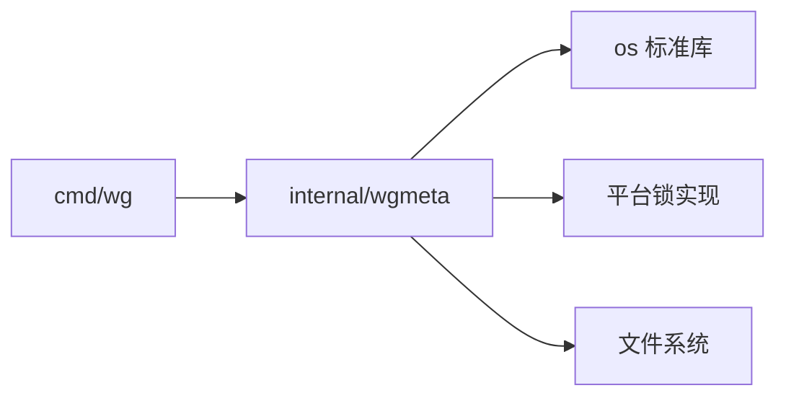

# 配置存储

<cite>
**本文引用的文件**
- [internal/wgmeta/store.go](file://internal/wgmeta/store.go)
- [internal/wgmeta/lock_unix.go](file://internal/wgmeta/lock_unix.go)
- [internal/wgmeta/lock_windows.go](file://internal/wgmeta/lock_windows.go)
- [internal/wgmeta/path.go](file://internal/wgmeta/path.go)
- [internal/wgmeta/store_test.go](file://internal/wgmeta/store_test.go)
- [cmd/wg/config.go](file://cmd/wg/config.go)
- [cmd/wg/command.go](file://cmd/wg/command.go)
</cite>

## 目录
1. [简介](#简介)
2. [项目结构](#项目结构)
3. [核心组件](#核心组件)
4. [架构总览](#架构总览)
5. [详细组件分析](#详细组件分析)
6. [依赖关系分析](#依赖关系分析)
7. [性能考虑](#性能考虑)
8. [故障排查指南](#故障排查指南)
9. [结论](#结论)
10. [附录](#附录)

## 简介
本章节面向“配置存储”机制，围绕配置文件的存储位置、命名约定与目录结构；跨平台路径处理与权限管理；并发访问的锁定机制；备份、恢复与版本控制策略；加密存储与敏感信息保护；存储接口使用示例与自定义后端实现；以及故障恢复与数据一致性保证进行系统化说明。该机制由 internal/wgmeta 提供，并在 cmd/wg 中作为 CLI 的配置入口被调用。

## 项目结构
- 配置存储核心位于 internal/wgmeta：
  - store.go：定义配置存储接口与默认实现（读写、序列化、事务性写入等）。
  - lock_unix.go / lock_windows.go：跨平台文件锁实现，避免并发冲突。
  - path.go：跨平台路径解析与默认存储目录定位。
- CLI 入口位于 cmd/wg：
  - command.go：命令编排与参数解析。
  - config.go：配置相关命令的实现，调用 wgmeta 的存储接口。

图表来源
- [cmd/wg/command.go](file://cmd/wg/command.go)
- [cmd/wg/config.go](file://cmd/wg/config.go)
- [internal/wgmeta/store.go](file://internal/wgmeta/store.go)
- [internal/wgmeta/lock_unix.go](file://internal/wgmeta/lock_unix.go)
- [internal/wgmeta/lock_windows.go](file://internal/wgmeta/lock_windows.go)
- [internal/wgmeta/path.go](file://internal/wgmeta/path.go)

章节来源
- [internal/wgmeta/store.go](file://internal/wgmeta/store.go)
- [internal/wgmeta/lock_unix.go](file://internal/wgmeta/lock_unix.go)
- [internal/wgmeta/lock_windows.go](file://internal/wgmeta/lock_windows.go)
- [internal/wgmeta/path.go](file://internal/wgmeta/path.go)
- [cmd/wg/command.go](file://cmd/wg/command.go)
- [cmd/wg/config.go](file://cmd/wg/config.go)

## 核心组件
- 存储接口与默认实现（store.go）
  - 提供配置的读取、写入、序列化/反序列化、原子替换（先写临时文件再重命名）等能力。
  - 通过抽象接口屏蔽底层文件系统差异，便于扩展或替换存储后端。
- 跨平台文件锁（lock_unix.go, lock_windows.go）
  - 基于平台特定系统调用实现独占锁，确保同一时刻仅一个进程能修改配置。
  - 自动释放锁，异常路径下也能正确关闭句柄。
- 路径与目录（path.go）
  - 根据操作系统选择默认配置目录与文件名，处理相对/绝对路径、用户目录、隐藏目录等。
  - 提供统一的配置项键名到文件名的映射规则。

章节来源
- [internal/wgmeta/store.go](file://internal/wgmeta/store.go)
- [internal/wgmeta/lock_unix.go](file://internal/wgmeta/lock_unix.go)
- [internal/wgmeta/lock_windows.go](file://internal/wgmeta/lock_windows.go)
- [internal/wgmeta/path.go](file://internal/wgmeta/path.go)

## 架构总览
下图展示从 CLI 到存储层的调用链路与关键交互点。

图表来源
- [cmd/wg/command.go](file://cmd/wg/command.go)
- [cmd/wg/config.go](file://cmd/wg/config.go)
- [internal/wgmeta/store.go](file://internal/wgmeta/store.go)
- [internal/wgmeta/lock_unix.go](file://internal/wgmeta/lock_unix.go)
- [internal/wgmeta/lock_windows.go](file://internal/wgmeta/lock_windows.go)
- [internal/wgmeta/path.go](file://internal/wgmeta/path.go)

## 详细组件分析

### 存储接口与默认实现（store.go）
- 职责
  - 定义统一配置存取接口，支持按“配置项键”读写。
  - 负责序列化/反序列化、校验、错误包装与日志记录。
  - 采用“先写临时文件再原子重命名”的策略，避免部分写入导致的损坏。
- 关键流程
  - 读：打开文件 -> 解码为内存结构 -> 返回。
  - 写：编码内存结构 -> 写入临时文件 -> 原子重命名为目标文件 -> 释放锁。
  - 事务性：在单次写入过程中加锁，确保并发安全。
- 复杂度
  - 时间复杂度：O(N)，N 为配置大小（序列化/反序列化线性）。
  - 空间复杂度：O(N)，用于缓冲与中间对象。
- 优化建议
  - 对超大配置可考虑分块写入或增量更新（需保持原子性）。
  - 缓存最近一次成功读取的配置以减少重复 IO（注意失效策略）。

图表来源
- [internal/wgmeta/store.go](file://internal/wgmeta/store.go)

章节来源
- [internal/wgmeta/store.go](file://internal/wgmeta/store.go)

### 跨平台文件锁（lock_unix.go, lock_windows.go）
- 职责
  - 提供跨平台的独占锁，防止多进程同时修改配置导致竞争条件。
  - 封装平台差异，上层无需关心具体实现。
- 行为特性
  - 获取失败时立即返回错误，避免阻塞。
  - 退出作用域或异常路径自动释放锁。
  - 在 Windows 上处理共享模式限制，必要时重试或提示。
- 与存储集成
  - 写入前获取锁，写入完成后释放；读取通常不加锁或采用共享锁（依实现而定）。

图表来源
- [internal/wgmeta/store.go](file://internal/wgmeta/store.go)
- [internal/wgmeta/lock_unix.go](file://internal/wgmeta/lock_unix.go)
- [internal/wgmeta/lock_windows.go](file://internal/wgmeta/lock_windows.go)

章节来源
- [internal/wgmeta/lock_unix.go](file://internal/wgmeta/lock_unix.go)
- [internal/wgmeta/lock_windows.go](file://internal/wgmeta/lock_windows.go)
- [internal/wgmeta/store.go](file://internal/wgmeta/store.go)

### 路径与目录（path.go）
- 职责
  - 根据操作系统确定默认配置目录（如用户主目录、应用数据目录等）。
  - 将配置项键映射为文件名，遵循一致的命名约定。
  - 处理相对路径、绝对路径与规范化路径。
- 命名约定
  - 文件名通常小写、短横线分隔或下划线分隔（以实现为准），避免特殊字符。
  - 不同配置项通过不同文件名区分，便于独立管理与备份。
- 权限与安全
  - 创建目录时使用最小权限掩码，避免过度开放。
  - 在 Unix-like 系统上，建议仅当前用户可读写。

图表来源
- [internal/wgmeta/path.go](file://internal/wgmeta/path.go)

章节来源
- [internal/wgmeta/path.go](file://internal/wgmeta/path.go)

### CLI 集成（command.go, config.go）
- command.go
  - 负责命令注册、参数解析与子命令路由。
  - 将用户输入转换为内部配置请求。
- config.go
  - 实现配置查看、设置、删除等操作。
  - 调用 wgmeta 的存储接口完成持久化。
  - 对错误进行友好提示与退出码设置。

图表来源
- [cmd/wg/command.go](file://cmd/wg/command.go)
- [cmd/wg/config.go](file://cmd/wg/config.go)
- [internal/wgmeta/store.go](file://internal/wgmeta/store.go)

章节来源
- [cmd/wg/command.go](file://cmd/wg/command.go)
- [cmd/wg/config.go](file://cmd/wg/config.go)

## 依赖关系分析
- 模块耦合
  - CLI 层依赖 wgmeta 提供的存储抽象，降低对具体实现的耦合。
  - 存储层依赖路径与锁模块，屏蔽平台差异。
- 外部依赖
  - 标准库文件系统、序列化库（如 JSON/YAML/TOML，视实现而定）。
  - 平台特定的锁 API（flock/locking on Windows）。
- 潜在循环依赖
  - 当前分层清晰，未发现循环依赖。

图表来源
- [cmd/wg/command.go](file://cmd/wg/command.go)
- [cmd/wg/config.go](file://cmd/wg/config.go)
- [internal/wgmeta/store.go](file://internal/wgmeta/store.go)
- [internal/wgmeta/lock_unix.go](file://internal/wgmeta/lock_unix.go)
- [internal/wgmeta/lock_windows.go](file://internal/wgmeta/lock_windows.go)
- [internal/wgmeta/path.go](file://internal/wgmeta/path.go)

章节来源
- [internal/wgmeta/store.go](file://internal/wgmeta/store.go)
- [cmd/wg/config.go](file://cmd/wg/config.go)

## 性能考虑
- I/O 成本
  - 配置通常较小，顺序读写开销可忽略；但频繁写入会放大磁盘压力。
- 原子写入
  - 临时文件+重命名虽增加一次 IO，但显著提升可靠性。
- 锁粒度
  - 细粒度锁（按文件）减少不必要的互斥；避免全局锁。
- 缓存
  - 可在进程内缓存最近读取的配置，配合失效策略降低重复 IO。
- 批处理
  - 批量更新时可合并为一次原子写入，减少锁持有时间。

[本节为通用性能建议，不直接分析具体文件]

## 故障排查指南
- 常见问题
  - 权限不足：检查配置目录与文件权限，确保当前用户有读写权限。
  - 锁冲突：确认无其他进程占用锁；在 Windows 上检查共享模式。
  - 写入失败：检查磁盘空间、文件系统只读、路径不存在等。
  - 数据不一致：确认是否发生中断写入；依赖原子重命名恢复。
- 诊断步骤
  - 查看错误信息，定位是路径、锁还是序列化阶段失败。
  - 验证临时文件是否存在且未残留。
  - 在 Unix 上使用 lsof/fuser 检查锁占用；在 Windows 使用资源监视器。
- 恢复策略
  - 若存在备份，回滚至最近一致快照。
  - 若无备份，尝试从临时文件或日志中重建。

章节来源
- [internal/wgmeta/store.go](file://internal/wgmeta/store.go)
- [internal/wgmeta/lock_unix.go](file://internal/wgmeta/lock_unix.go)
- [internal/wgmeta/lock_windows.go](file://internal/wgmeta/lock_windows.go)

## 结论
wgmeta 提供了跨平台、线程/进程安全的配置存储能力，通过原子写入与文件锁保障一致性与并发安全；path.go 统一了路径与命名约定；CLI 层将其无缝集成到配置命令中。建议在业务侧结合备份与版本控制策略，进一步提升可维护性与可恢复性。

[本节为总结，不直接分析具体文件]

## 附录

### 存储接口使用示例（概念性）
- 读取配置
  - 调用读取接口，传入配置键，获得内存结构。
- 写入配置
  - 构造内存结构，调用写入接口；内部会序列化、加锁、原子写入。
- 错误处理
  - 捕获并处理路径、锁、序列化等错误，给出明确提示。

章节来源
- [internal/wgmeta/store.go](file://internal/wgmeta/store.go)
- [cmd/wg/config.go](file://cmd/wg/config.go)

### 自定义存储后端实现指南
- 步骤
  - 实现存储接口（读/写/序列化/校验）。
  - 复用现有锁与路径模块，确保并发与路径一致性。
  - 在初始化时注入自定义后端。
- 注意事项
  - 保持原子写入语义。
  - 兼容现有配置键与文件格式。
  - 完善错误类型与日志。

章节来源
- [internal/wgmeta/store.go](file://internal/wgmeta/store.go)
- [internal/wgmeta/lock_unix.go](file://internal/wgmeta/lock_unix.go)
- [internal/wgmeta/lock_windows.go](file://internal/wgmeta/lock_windows.go)
- [internal/wgmeta/path.go](file://internal/wgmeta/path.go)

### 备份、恢复与版本控制策略（建议）
- 备份
  - 每次写入成功后，复制当前配置为带时间戳的副本。
  - 保留固定数量的历史版本，定期清理旧备份。
- 恢复
  - 提供命令从备份恢复配置，并校验完整性。
- 版本控制
  - 可将配置纳入版本控制系统（如 Git），配合钩子在写入后提交变更。
  - 对敏感字段进行脱敏后再入库。

[本节为通用策略建议，不直接分析具体文件]

### 加密存储与敏感信息保护（建议）
- 方案
  - 对敏感字段进行对称加密（如 AES-GCM），密钥由环境变量或密钥管理服务提供。
  - 非敏感字段明文存储，减少解密开销。
- 密钥管理
  - 使用操作系统密钥环或云 KMS 管理密钥，避免硬编码。
- 兼容性
  - 升级时需支持旧格式迁移与新格式写入。

[本节为通用安全建议，不直接分析具体文件]

### 数据一致性与故障恢复（实现要点）
- 原子写入
  - 先写临时文件，再原子重命名，确保要么完整写入，要么原样保留。
- 锁机制
  - 写入前获取独占锁，异常路径释放锁，避免死锁。
- 幂等性
  - 多次写入相同内容应产生一致结果。
- 校验
  - 写入后可进行校验和校验，失败则丢弃临时文件并报错。

章节来源
- [internal/wgmeta/store.go](file://internal/wgmeta/store.go)
- [internal/wgmeta/lock_unix.go](file://internal/wgmeta/lock_unix.go)
- [internal/wgmeta/lock_windows.go](file://internal/wgmeta/lock_windows.go)