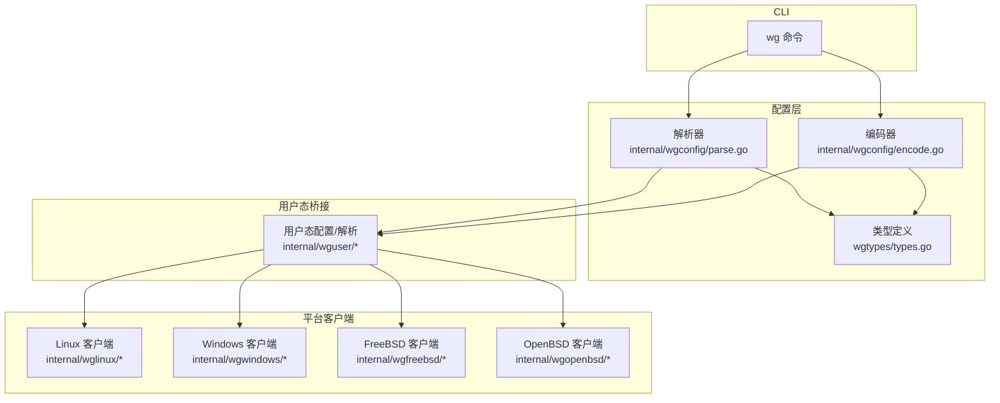
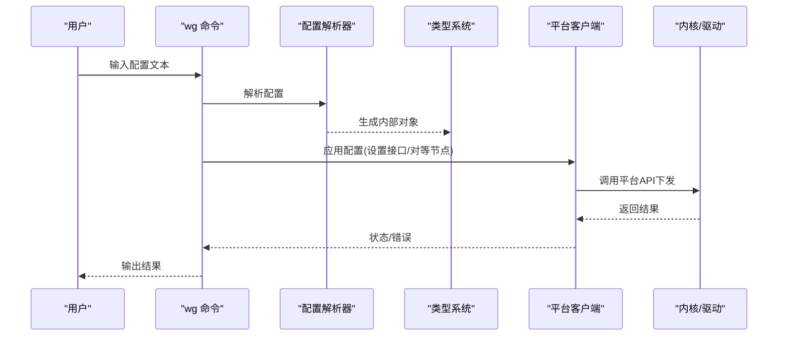
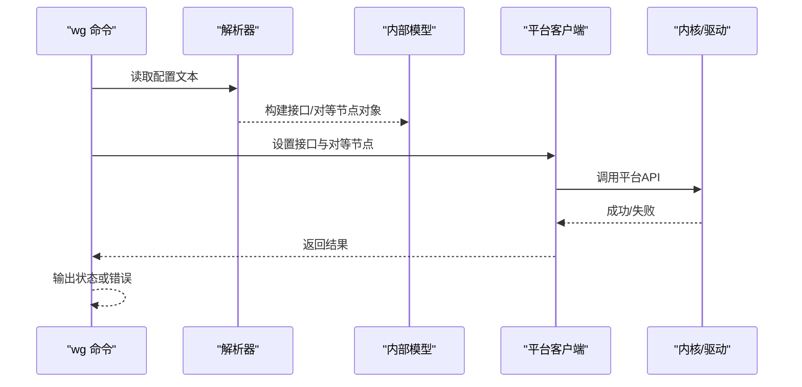
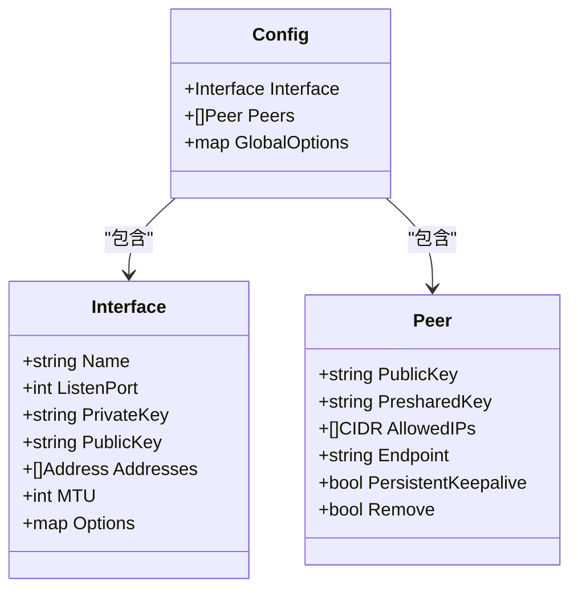
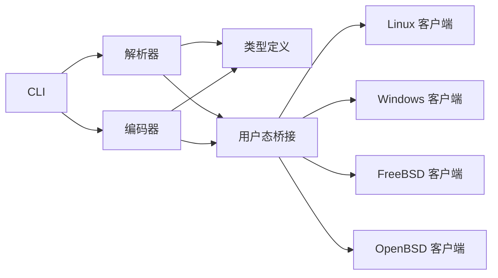

# 配置文件格式

<cite>
**本文引用的文件**
- [cmd/wg/config.go](file://cmd/wg/config.go)
- [cmd/wg/command.go](file://cmd/wg/command.go)
- [internal/wgconfig/parse.go](file://internal/wgconfig/parse.go)
- [internal/wgconfig/encode.go](file://internal/wgconfig/encode.go)
- [wgtypes/types.go](file://wgtypes/types.go)
- [wgtypes/errors.go](file://wgtypes/errors.go)
- [internal/wguser/parse.go](file://internal/wguser/parse.go)
- [internal/wguser/configure.go](file://internal/wguser/configure.go)
- [internal/wglinux/configure_linux.go](file://internal/wglinux/configure_linux.go)
- [internal/wgwindows/configuration_windows.go](file://internal/wgwindows/internal/ioctl/configuration_windows.go)
- [internal/wgfreebsd/client_freebsd.go](file://internal/wgfreebsd/client_freebsd.go)
- [internal/wgopenbsd/client_openbsd.go](file://internal/wgopenbsd/client_openbsd.go)
- [client.go](file://client.go)
</cite>

## 目录
1. [简介](#简介)
2. [项目结构](#项目结构)
3. [核心组件](#核心组件)
4. [架构总览](#架构总览)
5. [详细组件分析](#详细组件分析)
6. [依赖关系分析](#依赖关系分析)
7. [性能考虑](#性能考虑)
8. [故障排查指南](#故障排查指南)
9. [结论](#结论)
10. [附录](#附录)

## 简介
本文件面向使用 wgctrl-go 的开发者与运维人员，系统化说明 WireGuard 配置文件的语法、语义与约束。内容覆盖接口配置段、对等节点配置段与全局选项的字段含义、数据类型、默认值与取值范围；阐述配置项之间的依赖与约束；提供多场景示例（基本接口、多对等节点、路由、预共享密钥）；并总结配置验证规则、错误处理机制、最佳实践与安全建议。

## 项目结构
仓库围绕“配置解析/编码”“类型定义”“平台客户端”三大层次组织：
- 配置解析与编码：internal/wgconfig 负责将文本配置解析为内部模型，以及将模型编码回文本。
- 类型定义：wgtypes 定义统一的接口、对等节点、协议参数等数据结构与错误类型。
- 平台客户端：internal/wg{linux,windows,freebsd,openbsd} 将内部模型转换为平台内核或用户态驱动所需的调用。
- CLI：cmd/wg 提供命令行工具，支持 show、up/down 等操作，复用上述能力。

图表来源
- [internal/wgconfig/parse.go](file://internal/wgconfig/parse.go)
- [internal/wgconfig/encode.go](file://internal/wgconfig/encode.go)
- [wgtypes/types.go](file://wgtypes/types.go)
- [internal/wguser/parse.go](file://internal/wguser/parse.go)
- [internal/wglinux/configure_linux.go](file://internal/wglinux/configure_linux.go)
- [internal/wgwindows/configuration_windows.go](file://internal/wgwindows/internal/ioctl/configuration_windows.go)
- [internal/wgfreebsd/client_freebsd.go](file://internal/wgfreebsd/client_freebsd.go)
- [internal/wgopenbsd/client_openbsd.go](file://internal/wgopenbsd/client_openbsd.go)

章节来源
- [cmd/wg/command.go:1-200](file://cmd/wg/command.go#L1-L200)
- [internal/wgconfig/parse.go:1-300](file://internal/wgconfig/parse.go#L1-L300)
- [internal/wgconfig/encode.go:1-300](file://internal/wgconfig/encode.go#L1-L300)
- [wgtypes/types.go:1-300](file://wgtypes/types.go#L1-L300)

## 核心组件
- 配置解析器：读取文本配置，识别段落与键值对，校验字段名与值域，构建内部配置对象。
- 配置编码器：将内部配置对象序列化为标准文本格式，便于持久化与展示。
- 类型系统：统一表示接口、对等节点、监听端口、地址、路由、密钥等。
- 平台适配：将通用配置映射到各平台的内核/用户态 API，完成实际生效。

章节来源
- [internal/wgconfig/parse.go:1-300](file://internal/wgconfig/parse.go#L1-L300)
- [internal/wgconfig/encode.go:1-300](file://internal/wgconfig/encode.go#L1-L300)
- [wgtypes/types.go:1-300](file://wgtypes/types.go#L1-L300)

## 架构总览
下图展示了从 CLI 到内核/用户态驱动的完整链路，包括配置解析、类型转换与平台下发。

图表来源
- [cmd/wg/command.go:1-200](file://cmd/wg/command.go#L1-L200)
- [internal/wgconfig/parse.go:1-300](file://internal/wgconfig/parse.go#L1-L300)
- [wgtypes/types.go:1-300](file://wgtypes/types.go#L1-L300)
- [internal/wglinux/configure_linux.go:1-300](file://internal/wglinux/configure_linux.go#L1-L300)
- [internal/wgwindows/configuration_windows.go:1-300](file://internal/wgwindows/internal/ioctl/configuration_windows.go#L1-L300)
- [internal/wgfreebsd/client_freebsd.go:1-300](file://internal/wgfreebsd/client_freebsd.go#L1-L300)
- [internal/wgopenbsd/client_openbsd.go:1-300](file://internal/wgopenbsd/client_openbsd.go#L1-L300)

## 详细组件分析

### 配置语法与段落
- 段落划分：配置文件由若干段落组成，常见段落包括接口段、对等节点段，以及可选的全局选项段。
- 键值对：每个段落内包含若干键值对，键名为小写字母与下划线组合，值为对应数据类型（字符串、整数、布尔、IP/CIDR、十六进制等）。
- 注释：支持以特定字符开头的行作为注释，解析器会忽略。

章节来源
- [internal/wgconfig/parse.go:1-300](file://internal/wgconfig/parse.go#L1-L300)

### 接口配置段
接口段描述本地 WireGuard 接口的基本属性，典型字段包括：
- 监听端口：整数类型，表示 UDP 监听端口。有效范围通常为 1-65535。
- 私钥：Base64 编码的 32 字节私钥。若未提供，则可能自动生成或拒绝应用。
- 公钥：只读或用于标识，通常由私钥派生。
- 地址：一个或多个 IPv4/IPv6 地址（CIDR），用于本机寻址。
- MTU：整数，接口最大传输单元。
- 其他扩展字段：如 fwmark、table 等，取决于平台支持。

约束与依赖：
- 私钥存在时，公钥可由实现推导；若显式提供公钥，需与私钥匹配。
- 地址列表至少包含一项，否则接口无法参与路由。
- 端口需在可用范围内且未被占用。

章节来源
- [wgtypes/types.go:1-300](file://wgtypes/types.go#L1-L300)
- [internal/wgconfig/parse.go:1-300](file://internal/wgconfig/parse.go#L1-L300)

### 对等节点配置段
对等节点段描述远端设备及其连接参数，典型字段包括：
- 公钥：Base64 编码的 32 字节公钥，唯一标识对端。
- 预共享密钥（可选）：Base64 编码的 32 字节密钥，增强安全性。
- 允许 IP：一个或多个 CIDR，表示该对端可被访问的地址范围。
- 端点：远端可达地址（主机:端口），用于主动发起连接。
- 保留端口：是否保持 NAT 穿透的心跳发送。
- 持久连接：是否保持长连接。
- 传输时间戳：是否启用时间戳统计。
- 删除标志：在增量更新中用于移除对等节点。

约束与依赖：
- 公钥必填；若启用预共享密钥，需与对端一致。
- 允许 IP 为空时，默认行为可能限制为仅允许隧道内通信。
- 端点为空时，仅被动接收来自已知端点的流量。

章节来源
- [wgtypes/types.go:1-300](file://wgtypes/types.go#L1-L300)
- [internal/wgconfig/parse.go:1-300](file://internal/wgconfig/parse.go#L1-L300)

### 全局选项
全局选项影响整个配置或会话的行为，例如：
- 日志级别：控制调试与错误信息输出。
- 表号：指定路由表编号（平台相关）。
- 标记：套接字标记，用于策略路由。
- 其他平台相关开关。

约束与依赖：
- 某些全局选项仅在特定平台生效。
- 与接口/对等节点的字段组合使用时需注意优先级与冲突。

章节来源
- [internal/wgconfig/parse.go:1-300](file://internal/wgconfig/parse.go#L1-L300)
- [wgtypes/types.go:1-300](file://wgtypes/types.go#L1-L300)

### 配置验证与错误处理
- 字段校验：类型检查、取值范围、长度限制（如密钥长度）、格式校验（IP/CIDR、Base64）。
- 语义校验：私钥与公钥匹配性、对等节点重复性、地址与路由一致性。
- 错误分类：语法错误、语义错误、平台不支持、资源不可用等。
- 错误传播：解析阶段即报错并中止应用；平台下发失败时返回具体错误码。

章节来源
- [wgtypes/errors.go:1-200](file://wgtypes/errors.go#L1-L200)
- [internal/wgconfig/parse.go:1-300](file://internal/wgconfig/parse.go#L1-L300)

### 配置应用流程（序列图）

图表来源
- [cmd/wg/command.go:1-200](file://cmd/wg/command.go#L1-L200)
- [internal/wgconfig/parse.go:1-300](file://internal/wgconfig/parse.go#L1-L300)
- [internal/wglinux/configure_linux.go:1-300](file://internal/wglinux/configure_linux.go#L1-L300)
- [internal/wgwindows/configuration_windows.go:1-300](file://internal/wgwindows/internal/ioctl/configuration_windows.go#L1-L300)
- [internal/wgfreebsd/client_freebsd.go:1-300](file://internal/wgfreebsd/client_freebsd.go#L1-L300)
- [internal/wgopenbsd/client_openbsd.go:1-300](file://internal/wgopenbsd/client_openbsd.go#L1-L300)

### 配置示例（场景化）
以下为不同场景的配置要点与字段组合说明（不直接粘贴代码，路径指向实现与测试用例）：
- 基本接口配置：仅需监听端口、私钥、地址。适用于单机或最小化部署。
- 多个对等节点：为每个对端添加独立段落，分别填写公钥、允许 IP、端点等。
- 路由设置：通过接口地址与对端允许 IP 的组合，结合系统路由表，实现子网互通。
- 预共享密钥：在对等节点段中添加预共享密钥字段，提升抗量子与重放攻击能力。

章节来源
- [internal/wgconfig/parse.go:1-300](file://internal/wgconfig/parse.go#L1-L300)
- [internal/wgconfig/encode.go:1-300](file://internal/wgconfig/encode.go#L1-L300)
- [wgtypes/types.go:1-300](file://wgtypes/types.go#L1-L300)

### 类图（内部模型）

图表来源
- [wgtypes/types.go:1-300](file://wgtypes/types.go#L1-L300)
- [internal/wgconfig/parse.go:1-300](file://internal/wgconfig/parse.go#L1-L300)

## 依赖关系分析
- 解析器依赖类型定义，确保字段与值的合法性。
- 编码器依赖类型定义，保证输出格式稳定。
- 平台客户端依赖用户态桥接或直接调用内核 API，将通用配置映射到平台差异。
- CLI 依赖解析器与平台客户端，提供端到端能力。

图表来源
- [internal/wgconfig/parse.go:1-300](file://internal/wgconfig/parse.go#L1-L300)
- [internal/wgconfig/encode.go:1-300](file://internal/wgconfig/encode.go#L1-L300)
- [wgtypes/types.go:1-300](file://wgtypes/types.go#L1-L300)
- [internal/wguser/parse.go:1-300](file://internal/wguser/parse.go#L1-L300)
- [internal/wglinux/configure_linux.go:1-300](file://internal/wglinux/configure_linux.go#L1-L300)
- [internal/wgwindows/configuration_windows.go:1-300](file://internal/wgwindows/internal/ioctl/configuration_windows.go#L1-L300)
- [internal/wgfreebsd/client_freebsd.go:1-300](file://internal/wgfreebsd/client_freebsd.go#L1-L300)
- [internal/wgopenbsd/client_openbsd.go:1-300](file://internal/wgopenbsd/client_openbsd.go#L1-L300)

章节来源
- [client.go:1-200](file://client.go#L1-L200)
- [internal/wgconfig/parse.go:1-300](file://internal/wgconfig/parse.go#L1-L300)
- [internal/wgconfig/encode.go:1-300](file://internal/wgconfig/encode.go#L1-L300)
- [wgtypes/types.go:1-300](file://wgtypes/types.go#L1-L300)

## 性能考虑
- 配置解析复杂度：线性于配置行数，字段校验与格式解析开销较小。
- 对等节点数量：过多对等节点会增加密钥协商与状态维护成本，建议按需拆分。
- 地址与路由规模：大量 CIDR 条目会影响路由查找效率，应合理聚合。
- 平台差异：部分平台对并发配置或批量更新有性能上限，建议分批应用。

[本节为通用指导，不直接分析具体文件]

## 故障排查指南
- 语法错误：检查段落名称、键名拼写、值格式（如 Base64、IP/CIDR）。
- 语义错误：确认私钥与公钥匹配、对等节点公钥唯一、端口可用。
- 平台错误：查看平台客户端返回的错误码，定位内核/驱动层面的问题。
- 日志与调试：适当提高日志级别，捕获解析与应用阶段的详细信息。

章节来源
- [wgtypes/errors.go:1-200](file://wgtypes/errors.go#L1-L200)
- [internal/wgconfig/parse.go:1-300](file://internal/wgconfig/parse.go#L1-L300)
- [internal/wglinux/configure_linux.go:1-300](file://internal/wglinux/configure_linux.go#L1-L300)
- [internal/wgwindows/configuration_windows.go:1-300](file://internal/wgwindows/internal/ioctl/configuration_windows.go#L1-L300)
- [internal/wgfreebsd/client_freebsd.go:1-300](file://internal/wgfreebsd/client_freebsd.go#L1-L300)
- [internal/wgopenbsd/client_openbsd.go:1-300](file://internal/wgopenbsd/client_openbsd.go#L1-L300)

## 结论
wgctrl-go 提供了完整的 WireGuard 配置解析、编码与平台下发能力。通过统一的类型系统与严格的校验机制，确保配置的正确性与可移植性。遵循本文档的字段规范、约束条件与最佳实践，可在多平台上稳定部署与维护 WireGuard 网络。

[本节为总结，不直接分析具体文件]

## 附录

### 配置项参考（按段落）
- 接口段
  - 监听端口：整数，1-65535
  - 私钥：Base64 32 字节
  - 公钥：Base64 32 字节（可由私钥推导）
  - 地址：IPv4/IPv6 CIDR 列表
  - MTU：正整数
  - 其他：fwmark、table 等（平台相关）
- 对等节点段
  - 公钥：Base64 32 字节（必填）
  - 预共享密钥：Base64 32 字节（可选）
  - 允许 IP：CIDR 列表
  - 端点：主机:端口（可选）
  - 持久连接/保留端口/时间戳：布尔
  - 删除标志：布尔（增量更新）
- 全局选项
  - 日志级别、表号、标记等（平台相关）

章节来源
- [wgtypes/types.go:1-300](file://wgtypes/types.go#L1-L300)
- [internal/wgconfig/parse.go:1-300](file://internal/wgconfig/parse.go#L1-L300)

### 安全建议
- 使用强随机私钥与公钥，避免硬编码。
- 启用预共享密钥以增强安全性。
- 最小化允许 IP 范围，遵循最小权限原则。
- 定期轮换密钥，审计对等节点变更。
- 限制日志级别与敏感信息输出。

[本节为通用建议，不直接分析具体文件]