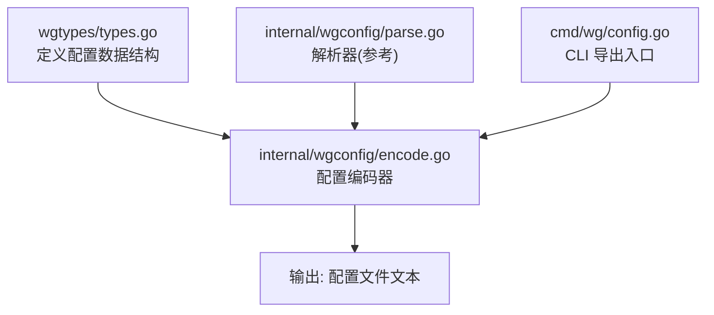
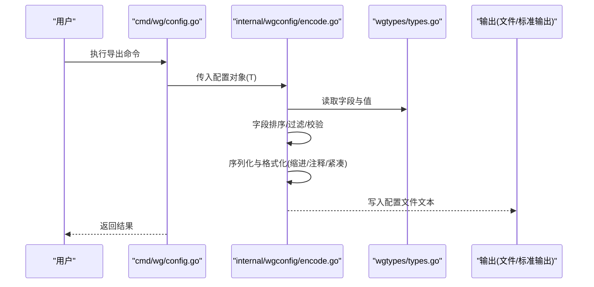
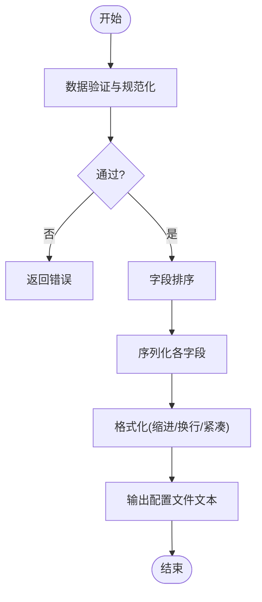
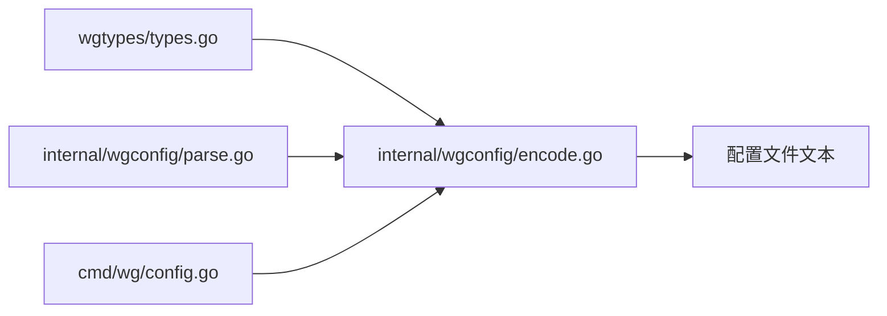

# 配置编码器

<cite>
**本文引用的文件**
- [internal/wgconfig/encode.go](file://internal/wgconfig/encode.go)
- [internal/wgconfig/encode_test.go](file://internal/wgconfig/encode_test.go)
- [internal/wgconfig/parse.go](file://internal/wgconfig/parse.go)
- [wgtypes/types.go](file://wgtypes/types.go)
- [cmd/wg/config.go](file://cmd/wg/config.go)
</cite>

## 目录
1. [简介](#简介)
2. [项目结构](#项目结构)
3. [核心组件](#核心组件)
4. [架构总览](#架构总览)
5. [详细组件分析](#详细组件分析)
6. [依赖关系分析](#依赖关系分析)
7. [性能考量](#性能考量)
8. [故障排查指南](#故障排查指南)
9. [结论](#结论)
10. [附录](#附录)

## 简介
本技术文档聚焦于“配置编码器”，即把内存中的 WireGuard 配置对象序列化为配置文件文本的过程。内容涵盖：
- 数据序列化与格式化策略
- 输出优化（人类可读 vs 机器优化）
- 编码器的配置选项（缩进、注释保留、字段排序等）
- 数据验证与规范化处理
- 使用示例与扩展方法

该编码器位于 internal/wgconfig 包，配合 wgtypes 的数据模型进行工作，并在 cmd/wg 中作为 CLI 的导出能力暴露给用户。

## 项目结构
与配置编码器直接相关的代码组织如下：
- internal/wgconfig/encode.go：实现配置对象的序列化与格式化
- internal/wgconfig/encode_test.go：覆盖编码流程的行为测试
- internal/wgconfig/parse.go：提供解析逻辑，便于理解输入/输出格式的一致性
- wgtypes/types.go：定义配置对象的数据结构（如接口、键值、对等体等）
- cmd/wg/config.go：CLI 层调用编码器以生成配置文件

图表来源
- [internal/wgconfig/encode.go](file://internal/wgconfig/encode.go)
- [internal/wgconfig/parse.go](file://internal/wgconfig/parse.go)
- [wgtypes/types.go](file://wgtypes/types.go)
- [cmd/wg/config.go](file://cmd/wg/config.go)

章节来源
- [internal/wgconfig/encode.go](file://internal/wgconfig/encode.go)
- [internal/wgconfig/parse.go](file://internal/wgconfig/parse.go)
- [wgtypes/types.go](file://wgtypes/types.go)
- [cmd/wg/config.go](file://cmd/wg/config.go)

## 核心组件
- 配置对象模型（wgtypes）：包含接口、监听端口、私钥、对等体列表等字段，是编码器的输入源。
- 编码器（internal/wgconfig/encode.go）：将配置对象转换为配置文件文本，负责：
  - 字段选择与排序
  - 值序列化（如十六进制、Base64、整数等）
  - 缩进与换行控制
  - 可选注释保留
  - 输出优化（人类可读或紧凑）
- 解析器（internal/wgconfig/parse.go）：用于理解并兼容配置文件格式，确保编码输出可被正确解析。
- CLI 集成（cmd/wg/config.go）：提供用户命令以触发编码并输出到文件或标准输出。

章节来源
- [wgtypes/types.go](file://wgtypes/types.go)
- [internal/wgconfig/encode.go](file://internal/wgconfig/encode.go)
- [internal/wgconfig/parse.go](file://internal/wgconfig/parse.go)
- [cmd/wg/config.go](file://cmd/wg/config.go)

## 架构总览
配置编码的整体流程从 CLI 发起，经编码器完成序列化与格式化，最终输出为配置文件文本。

图表来源
- [cmd/wg/config.go](file://cmd/wg/config.go)
- [internal/wgconfig/encode.go](file://internal/wgconfig/encode.go)
- [wgtypes/types.go](file://wgtypes/types.go)

## 详细组件分析

### 编码器（internal/wgconfig/encode.go）
- 职责
  - 将 wgtypes 的配置对象序列化为配置文件文本
  - 支持多种输出风格（人类可读、机器优化）
  - 控制缩进、换行、字段顺序、是否保留注释
- 关键行为
  - 字段排序：保证输出稳定、可比较（例如按字母序或固定优先级）
  - 值序列化：不同字段类型采用合适的表示法（如十六进制、Base64、十进制）
  - 格式化：根据配置选项决定缩进、空行、紧凑模式
  - 注释保留：在允许的情况下保留原始注释信息
  - 数据验证与规范化：在编码前对数据进行合法性检查与标准化（如去除多余空白、统一大小写、默认值填充）
- 错误处理
  - 遇到非法字段或缺失必填项时返回错误
  - 对不可序列化值进行明确报错，便于定位问题

图表来源
- [internal/wgconfig/encode.go](file://internal/wgconfig/encode.go)

章节来源
- [internal/wgconfig/encode.go](file://internal/wgconfig/encode.go)
- [internal/wgconfig/encode_test.go](file://internal/wgconfig/encode_test.go)

### 数据模型（wgtypes/types.go）
- 角色
  - 定义配置对象的结构，包括接口、监听端口、私钥、对等体列表等
  - 为编码器提供稳定的输入契约
- 关键点
  - 字段类型与约束清晰，便于编码器进行序列化与校验
  - 对二进制数据（如密钥）提供合适的编码方式（如 Base64/十六进制）

章节来源
- [wgtypes/types.go](file://wgtypes/types.go)

### CLI 集成（cmd/wg/config.go）
- 角色
  - 提供命令行接口，接收用户参数并调用编码器
  - 将编码器输出的配置文件文本写入文件或标准输出
- 关键点
  - 支持指定输出目标（文件路径或 stdout）
  - 可能暴露编码选项（如紧凑模式、缩进风格）

章节来源
- [cmd/wg/config.go](file://cmd/wg/config.go)

### 解析器参考（internal/wgconfig/parse.go）
- 角色
  - 解析配置文件文本为配置对象
  - 与编码器形成对称关系，确保输出可被正确解析
- 价值
  - 帮助理解配置文件格式规范，指导编码器输出一致性

章节来源
- [internal/wgconfig/parse.go](file://internal/wgconfig/parse.go)

## 依赖关系分析
编码器依赖 wgtypes 的数据模型，并通过 CLI 暴露给终端用户；同时与解析器保持格式一致，以确保双向转换的正确性。

图表来源
- [wgtypes/types.go](file://wgtypes/types.go)
- [internal/wgconfig/encode.go](file://internal/wgconfig/encode.go)
- [internal/wgconfig/parse.go](file://internal/wgconfig/parse.go)
- [cmd/wg/config.go](file://cmd/wg/config.go)

章节来源
- [wgtypes/types.go](file://wgtypes/types.go)
- [internal/wgconfig/encode.go](file://internal/wgconfig/encode.go)
- [internal/wgconfig/parse.go](file://internal/wgconfig/parse.go)
- [cmd/wg/config.go](file://cmd/wg/config.go)

## 性能考量
- 字段排序与去重：避免重复字段与不稳定顺序，提升输出可比较性与缓存命中
- 紧凑模式：在机器消费场景下减少体积，提高传输效率
- 流式输出：对于大型配置，尽量采用增量写入以减少内存占用
- 序列化优化：选择合适的编码方式（如十六进制 vs Base64）平衡可读性与体积

[本节为通用性能建议，不直接分析具体文件]

## 故障排查指南
- 常见错误
  - 缺失必填字段：编码器会在验证阶段报错，需补全必要配置
  - 非法值：如端口范围越界、密钥格式不正确，需修正后重试
  - 注释冲突：当启用注释保留但存在冲突时，编码器应给出明确提示
- 调试建议
  - 先使用人类可读模式输出，确认字段与值是否正确
  - 再切换到紧凑模式，检查体积与兼容性
  - 结合解析器进行回读测试，确保输出可被正确解析

章节来源
- [internal/wgconfig/encode_test.go](file://internal/wgconfig/encode_test.go)

## 结论
配置编码器通过将内存中的配置对象序列化为配置文件文本，实现了从结构化数据到持久化格式的可靠转换。其设计兼顾了人类可读性与机器优化需求，并通过严格的验证与规范化确保输出质量。借助 CLI 集成，用户可以便捷地导出配置，并根据场景选择合适的输出风格。

[本节为总结性内容，不直接分析具体文件]

## 附录

### 配置选项说明（基于编码器能力）
- 缩进格式：支持空格或制表符，控制层级缩进以提升可读性
- 注释保留：可选择保留原始注释或在清理模式下移除
- 字段排序：支持按字母序或固定优先级排序，保证输出稳定性
- 输出风格：
  - 人类可读：更友好的排版，适合人工编辑
  - 机器优化：紧凑模式，减少体积，适合自动化处理

[本节为概念性说明，不直接分析具体文件]

### 使用示例（步骤指引）
- 准备配置对象：从系统或 API 获取当前 WireGuard 配置
- 调用编码器：传入配置对象与所需选项（缩进、注释、排序、紧凑模式）
- 输出结果：将生成的配置文件文本写入文件或标准输出
- 验证输出：使用解析器回读，确保格式正确且可被系统识别

[本节为概念性示例，不直接分析具体文件]

### 自定义扩展方法
- 自定义字段序列化：针对特定字段实现自定义编码规则
- 插件式格式化：插入自定义格式化器以适配特殊需求
- 钩子机制：在编码前后执行额外逻辑（如审计、日志记录）

[本节为概念性扩展建议，不直接分析具体文件]