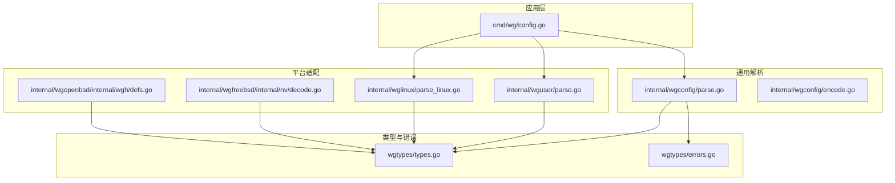
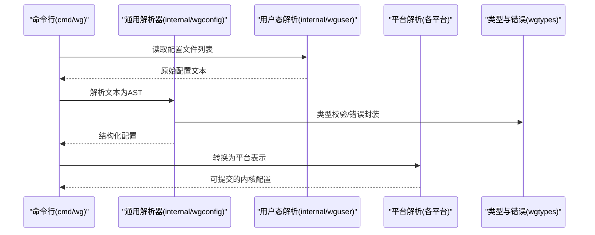
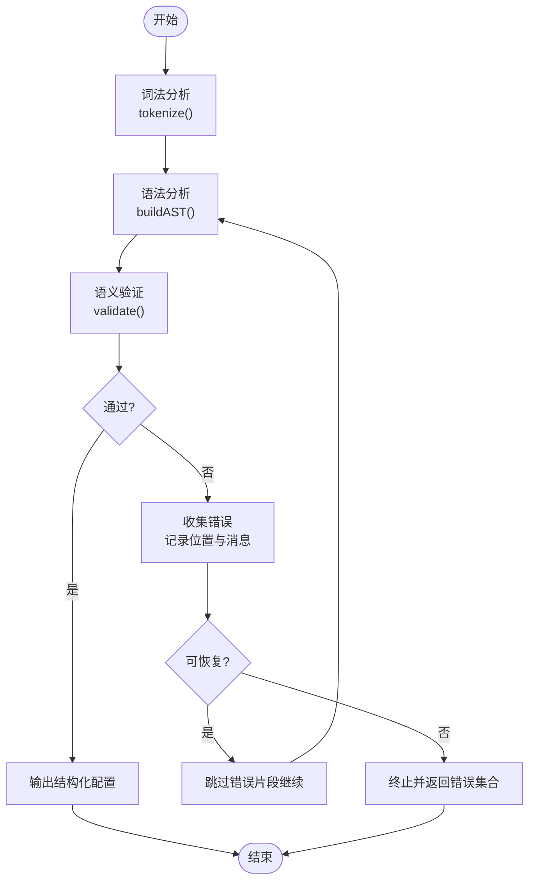
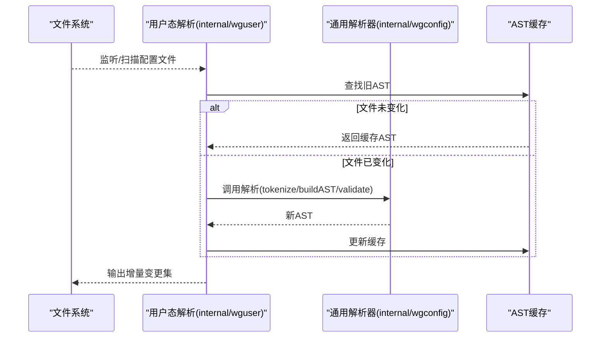
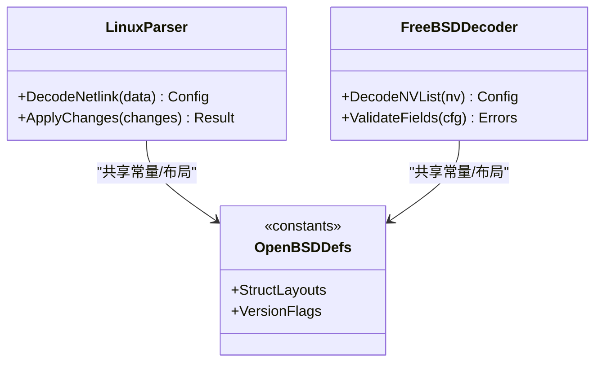
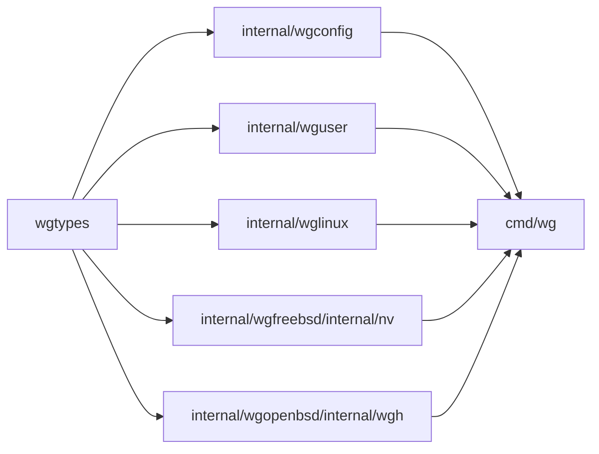

# 配置解析器

<cite>
**本文引用的文件**
- [internal/wgconfig/parse.go](file://internal/wgconfig/parse.go)
- [internal/wgconfig/encode.go](file://internal/wgconfig/encode.go)
- [cmd/wg/config.go](file://cmd/wg/config.go)
- [wgtypes/types.go](file://wgtypes/types.go)
- [wgtypes/errors.go](file://wgtypes/errors.go)
- [internal/wguser/parse.go](file://internal/wguser/parse.go)
- [internal/wglinux/parse_linux.go](file://internal/wglinux/parse_linux.go)
- [internal/wgfreebsd/internal/nv/decode.go](file://internal/wgfreebsd/internal/nv/decode.go)
- [internal/wgopenbsd/internal/wgh/defs.go](file://internal/wgopenbsd/internal/wgh/defs.go)
</cite>

## 目录
1. [简介](#简介)
2. [项目结构](#项目结构)
3. [核心组件](#核心组件)
4. [架构总览](#架构总览)
5. [详细组件分析](#详细组件分析)
6. [依赖关系分析](#依赖关系分析)
7. [性能考虑](#性能考虑)
8. [故障排查指南](#故障排查指南)
9. [结论](#结论)
10. [附录](#附录)

## 简介
本技术文档聚焦于 wgctrl-go 中的“配置解析器”，系统性说明其词法分析、语法分析与语义验证三阶段流程，解释如何支持多版本配置格式与向后兼容策略，并详述错误检测、恢复与报告机制。同时覆盖增量解析与差异计算原理、使用示例与集成指南，以及性能优化与调试方法。读者无需深入 Go 语言细节即可理解整体设计与实现要点。

## 项目结构
仓库围绕 WireGuard 配置的读取、解析、编码与平台适配组织代码：
- internal/wgconfig：通用配置解析与编码（文本格式）
- cmd/wg：命令行入口与配置加载编排
- wgtypes：类型定义与错误类型
- internal/wguser：用户态配置解析（如 /etc/wireguard/*.conf）
- internal/wglinux、internal/wgfreebsd、internal/wgopenbsd：各平台内核/用户态接口适配与数据解码

图表来源
- [cmd/wg/config.go:1-200](file://cmd/wg/config.go#L1-L200)
- [internal/wgconfig/parse.go:1-300](file://internal/wgconfig/parse.go#L1-L300)
- [internal/wguser/parse.go:1-200](file://internal/wguser/parse.go#L1-L200)
- [internal/wglinux/parse_linux.go:1-200](file://internal/wglinux/parse_linux.go#L1-L200)
- [internal/wgfreebsd/internal/nv/decode.go:1-200](file://internal/wgfreebsd/internal/nv/decode.go#L1-L200)
- [internal/wgopenbsd/internal/wgh/defs.go:1-200](file://internal/wgopenbsd/internal/wgh/defs.go#L1-L200)
- [wgtypes/types.go:1-200](file://wgtypes/types.go#L1-L200)
- [wgtypes/errors.go:1-200](file://wgtypes/errors.go#L1-L200)

章节来源
- [cmd/wg/config.go:1-200](file://cmd/wg/config.go#L1-L200)
- [internal/wgconfig/parse.go:1-300](file://internal/wgconfig/parse.go#L1-L300)
- [internal/wguser/parse.go:1-200](file://internal/wguser/parse.go#L1-L200)
- [internal/wglinux/parse_linux.go:1-200](file://internal/wglinux/parse_linux.go#L1-L200)
- [internal/wgfreebsd/internal/nv/decode.go:1-200](file://internal/wgfreebsd/internal/nv/decode.go#L1-L200)
- [internal/wgopenbsd/internal/wgh/defs.go:1-200](file://internal/wgopenbsd/internal/wgh/defs.go#L1-L200)
- [wgtypes/types.go:1-200](file://wgtypes/types.go#L1-L200)
- [wgtypes/errors.go:1-200](file://wgtypes/errors.go#L1-L200)

## 核心组件
- 通用配置解析器（internal/wgconfig/parse.go）：负责将文本配置转换为内部结构体，包含词法扫描、语法解析与语义校验。
- 用户态配置解析（internal/wguser/parse.go）：面向 /etc/wireguard/*.conf 的读取与解析，提供增量变更能力。
- 平台解析器（internal/wglinux/parse_linux.go、internal/wgfreebsd/internal/nv/decode.go、internal/wgopenbsd/internal/wgh/defs.go）：从内核或平台特定数据结构中解码为统一模型。
- 类型与错误（wgtypes/types.go、wgtypes/errors.go）：统一的配置项类型、接口与错误分类。
- 命令层（cmd/wg/config.go）：协调不同来源的配置加载、合并与提交。

章节来源
- [internal/wgconfig/parse.go:1-300](file://internal/wgconfig/parse.go#L1-L300)
- [internal/wguser/parse.go:1-200](file://internal/wguser/parse.go#L1-L200)
- [internal/wglinux/parse_linux.go:1-200](file://internal/wglinux/parse_linux.go#L1-L200)
- [internal/wgfreebsd/internal/nv/decode.go:1-200](file://internal/wgfreebsd/internal/nv/decode.go#L1-L200)
- [internal/wgopenbsd/internal/wgh/defs.go:1-200](file://internal/wgopenbsd/internal/wgh/defs.go#L1-L200)
- [wgtypes/types.go:1-200](file://wgtypes/types.go#L1-L200)
- [wgtypes/errors.go:1-200](file://wgtypes/errors.go#L1-L200)
- [cmd/wg/config.go:1-200](file://cmd/wg/config.go#L1-L200)

## 架构总览
配置解析采用“分阶段流水线”设计：
- 词法分析：将输入文本切分为 token 流（键、值、分隔符、注释等），忽略空白与注释行。
- 语法分析：基于 token 构建抽象语法树（AST），识别段落（如接口、对等体）与键值对。
- 语义验证：检查必填字段、取值范围、格式合法性、跨字段一致性等。
- 平台适配：将通用 AST 映射到平台特定的内核/用户态表示。
- 增量与差异：对比新旧配置，生成最小变更集，减少内核交互开销。

图表来源
- [cmd/wg/config.go:1-200](file://cmd/wg/config.go#L1-L200)
- [internal/wgconfig/parse.go:1-300](file://internal/wgconfig/parse.go#L1-L300)
- [internal/wguser/parse.go:1-200](file://internal/wguser/parse.go#L1-L200)
- [internal/wglinux/parse_linux.go:1-200](file://internal/wglinux/parse_linux.go#L1-L200)
- [internal/wgfreebsd/internal/nv/decode.go:1-200](file://internal/wgfreebsd/internal/nv/decode.go#L1-L200)
- [internal/wgopenbsd/internal/wgh/defs.go:1-200](file://internal/wgopenbsd/internal/wgh/defs.go#L1-L200)
- [wgtypes/types.go:1-200](file://wgtypes/types.go#L1-L200)
- [wgtypes/errors.go:1-200](file://wgtypes/errors.go#L1-L200)

## 详细组件分析

### 通用配置解析器（internal/wgconfig/parse.go）
- 词法分析
  - 逐字符扫描，跳过空白与注释行，提取键、值、段头标记。
  - 处理转义与引号包裹的值，保证键名大小写敏感性与唯一性。
- 语法分析
  - 将 token 序列化为 AST：段落节点（接口、对等体）与键值节点。
  - 支持可选键、重复键（按语义聚合）、默认值注入。
- 语义验证
  - 校验必填键、取值范围（如端口、IP、密钥长度）、格式（Base64、十六进制、CIDR）。
  - 跨字段一致性检查（如私钥与公钥匹配、路由与子网一致）。
- 错误处理
  - 定位错误位置（行号、列号），返回结构化错误对象，便于上层展示与恢复。
  - 支持部分错误收集，在单次解析中汇总多个问题。

图表来源
- [internal/wgconfig/parse.go:1-300](file://internal/wgconfig/parse.go#L1-L300)
- [wgtypes/errors.go:1-200](file://wgtypes/errors.go#L1-L200)

章节来源
- [internal/wgconfig/parse.go:1-300](file://internal/wgconfig/parse.go#L1-L300)
- [wgtypes/errors.go:1-200](file://wgtypes/errors.go#L1-L200)

### 用户态配置解析（internal/wguser/parse.go）
- 读取 /etc/wireguard/*.conf，按文件名与顺序组织配置。
- 支持增量解析：仅重新解析发生变化的文件，缓存未变化文件的 AST。
- 合并策略：同名接口覆盖，对等体列表追加或去重（依据键值）。
- 与通用解析器协作：复用词法/语法/语义逻辑，确保一致性。

图表来源
- [internal/wguser/parse.go:1-200](file://internal/wguser/parse.go#L1-L200)
- [internal/wgconfig/parse.go:1-300](file://internal/wgconfig/parse.go#L1-L300)

章节来源
- [internal/wguser/parse.go:1-200](file://internal/wguser/parse.go#L1-L200)
- [internal/wgconfig/parse.go:1-300](file://internal/wgconfig/parse.go#L1-L300)

### 平台解析器（Linux/FreeBSD/OpenBSD）
- Linux（internal/wglinux/parse_linux.go）
  - 从 netlink 或 ioctl 获取当前内核配置，解码为统一模型。
  - 处理内核版本差异导致的字段增减，提供兼容层。
- FreeBSD（internal/wgfreebsd/internal/nv/decode.go）
  - 解码 nvlist 结构，映射到通用配置项。
  - 处理字节序与对齐，确保跨架构正确性。
- OpenBSD（internal/wgopenbsd/internal/wgh/defs.go）
  - 定义内核接口常量与结构布局，供解码使用。
  - 维护版本宏与兼容性分支。

图表来源
- [internal/wglinux/parse_linux.go:1-200](file://internal/wglinux/parse_linux.go#L1-L200)
- [internal/wgfreebsd/internal/nv/decode.go:1-200](file://internal/wgfreebsd/internal/nv/decode.go#L1-L200)
- [internal/wgopenbsd/internal/wgh/defs.go:1-200](file://internal/wgopenbsd/internal/wgh/defs.go#L1-L200)

章节来源
- [internal/wglinux/parse_linux.go:1-200](file://internal/wglinux/parse_linux.go#L1-L200)
- [internal/wgfreebsd/internal/nv/decode.go:1-200](file://internal/wgfreebsd/internal/nv/decode.go#L1-L200)
- [internal/wgopenbsd/internal/wgh/defs.go:1-200](file://internal/wgopenbsd/internal/wgh/defs.go#L1-L200)

### 类型与错误（wgtypes/types.go, wgtypes/errors.go）
- 类型定义
  - 统一接口：接口、对等体、路由、DNS、密钥等。
  - 序列化/反序列化契约，确保跨模块一致。
- 错误分类
  - 词法错误、语法错误、语义错误、平台错误。
  - 携带位置信息（行/列）、上下文（键名、段落名）与修复建议。

章节来源
- [wgtypes/types.go:1-200](file://wgtypes/types.go#L1-L200)
- [wgtypes/errors.go:1-200](file://wgtypes/errors.go#L1-L200)

### 命令层集成（cmd/wg/config.go）
- 协调多来源配置：用户态文件、内核当前状态、命令行参数。
- 合并与冲突解决：优先级规则（命令行 > 文件 > 内核）。
- 提交前预览：生成差异报告，允许回滚。
- 错误上报：汇总解析错误，提示用户修正。

章节来源
- [cmd/wg/config.go:1-200](file://cmd/wg/config.go#L1-L200)

## 依赖关系分析
- 低耦合高内聚：通用解析器独立于平台；平台解析器仅关注数据转换。
- 类型集中：所有配置项通过 wgtypes 统一表达，避免重复定义。
- 错误传播：错误对象自下而上携带上下文，便于 UI/CLI 展示。
- 增量依赖：用户态解析依赖 AST 缓存与文件监控，降低重复解析成本。

图表来源
- [wgtypes/types.go:1-200](file://wgtypes/types.go#L1-L200)
- [internal/wgconfig/parse.go:1-300](file://internal/wgconfig/parse.go#L1-L300)
- [internal/wguser/parse.go:1-200](file://internal/wguser/parse.go#L1-L200)
- [internal/wglinux/parse_linux.go:1-200](file://internal/wglinux/parse_linux.go#L1-L200)
- [internal/wgfreebsd/internal/nv/decode.go:1-200](file://internal/wgfreebsd/internal/nv/decode.go#L1-L200)
- [internal/wgopenbsd/internal/wgh/defs.go:1-200](file://internal/wgopenbsd/internal/wgh/defs.go#L1-L200)
- [cmd/wg/config.go:1-200](file://cmd/wg/config.go#L1-L200)

章节来源
- [wgtypes/types.go:1-200](file://wgtypes/types.go#L1-L200)
- [internal/wgconfig/parse.go:1-300](file://internal/wgconfig/parse.go#L1-L300)
- [internal/wguser/parse.go:1-200](file://internal/wguser/parse.go#L1-L200)
- [internal/wglinux/parse_linux.go:1-200](file://internal/wglinux/parse_linux.go#L1-L200)
- [internal/wgfreebsd/internal/nv/decode.go:1-200](file://internal/wgfreebsd/internal/nv/decode.go#L1-L200)
- [internal/wgopenbsd/internal/wgh/defs.go:1-200](file://internal/wgopenbsd/internal/wgh/defs.go#L1-L200)
- [cmd/wg/config.go:1-200](file://cmd/wg/config.go#L1-L200)

## 性能考虑
- 词法/语法解析
  - 使用流式扫描与一次性分配缓冲，减少内存分配。
  - 对大文件启用分块解析与惰性求值。
- 增量解析
  - 基于文件哈希或时间戳的变更检测，避免全量重析。
  - AST 缓存与引用计数，及时释放无用对象。
- 平台解码
  - 批量读取内核状态，减少系统调用次数。
  - 预编译常量表，加速字段映射。
- 错误处理
  - 延迟错误构造，仅在需要时生成详细错误对象。
  - 并行校验可独立字段，缩短总体耗时。

[本节为通用指导，不直接分析具体文件]

## 故障排查指南
- 常见错误类型
  - 词法错误：非法字符、未闭合引号、缺失分隔符。
  - 语法错误：段落嵌套错误、未知键名、重复键冲突。
  - 语义错误：取值越界、格式不符、跨字段不一致。
  - 平台错误：内核版本不支持、权限不足、IO 失败。
- 定位与恢复
  - 利用错误对象中的行/列信息与上下文键名快速定位。
  - 对于可恢复错误（如可选键缺失），自动注入默认值并继续。
  - 对于不可恢复错误，中止提交并提示用户修正。
- 调试技巧
  - 开启详细日志，输出 token 流与 AST 结构。
  - 使用最小化配置复现问题，逐步添加字段隔离错误。
  - 对比新旧配置差异，聚焦变更点。

章节来源
- [wgtypes/errors.go:1-200](file://wgtypes/errors.go#L1-L200)
- [internal/wgconfig/parse.go:1-300](file://internal/wgconfig/parse.go#L1-L300)
- [cmd/wg/config.go:1-200](file://cmd/wg/config.go#L1-L200)

## 结论
本解析器以分阶段流水线为核心，结合类型系统与错误模型，实现了稳定、可扩展且高性能的配置解析。通过增量解析与平台适配，兼顾了易用性与效率。建议在集成时充分利用错误上下文与增量能力，以获得更好的用户体验与系统稳定性。

[本节为总结，不直接分析具体文件]

## 附录

### 使用示例与集成指南
- 基本用法
  - 读取用户态配置文件，调用通用解析器得到结构化配置。
  - 将结构化配置转换为平台表示并提交至内核。
- 增量更新
  - 监听配置文件变更，仅解析变化文件，生成最小变更集。
  - 提交前预览差异，支持回滚。
- 错误处理
  - 捕获并展示结构化错误，引导用户修正。
  - 对可恢复错误采用默认值注入，提升鲁棒性。

章节来源
- [cmd/wg/config.go:1-200](file://cmd/wg/config.go#L1-L200)
- [internal/wguser/parse.go:1-200](file://internal/wguser/parse.go#L1-L200)
- [internal/wgconfig/parse.go:1-300](file://internal/wgconfig/parse.go#L1-L300)

### 增量解析与差异计算原理
- 变更检测
  - 基于文件哈希或元数据判断是否变化。
  - 维护 AST 缓存，命中则跳过解析。
- 差异计算
  - 对比新旧 AST，生成增删改操作序列。
  - 合并策略：对等体列表去重、路由聚合、键覆盖。
- 提交优化
  - 仅提交必要变更，减少内核交互。
  - 事务性提交，失败回滚。

章节来源
- [internal/wguser/parse.go:1-200](file://internal/wguser/parse.go#L1-L200)
- [internal/wgconfig/parse.go:1-300](file://internal/wgconfig/parse.go#L1-L300)

### 多版本配置格式与向后兼容
- 版本探测
  - 根据关键字段存在与否推断配置版本。
  - 提供版本迁移函数，将旧格式转换为新模型。
- 兼容策略
  - 优先使用新字段，回退到旧字段。
  - 对废弃字段给出警告但不中断解析。
- 测试覆盖
  - 针对各版本配置编写用例，确保迁移正确性。

章节来源
- [internal/wgconfig/parse.go:1-300](file://internal/wgconfig/parse.go#L1-L300)
- [wgtypes/types.go:1-200](file://wgtypes/types.go#L1-L200)