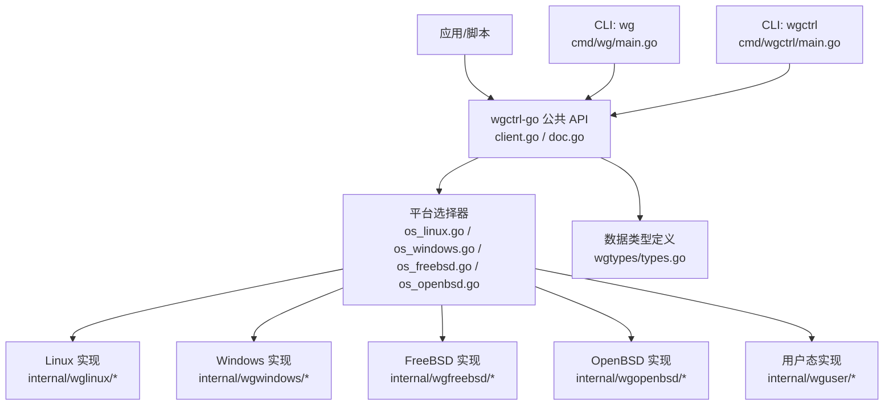
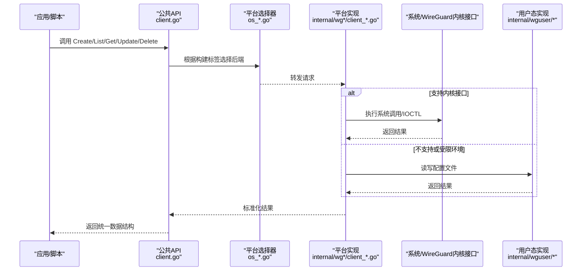
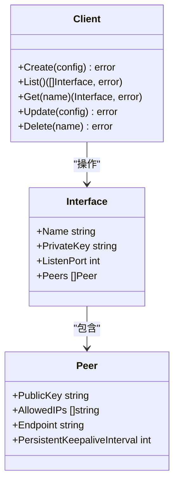
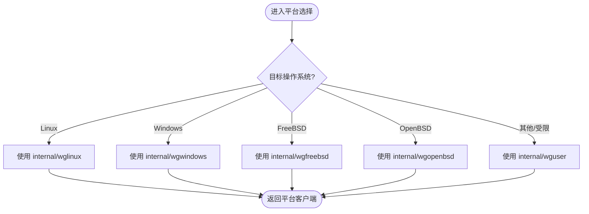
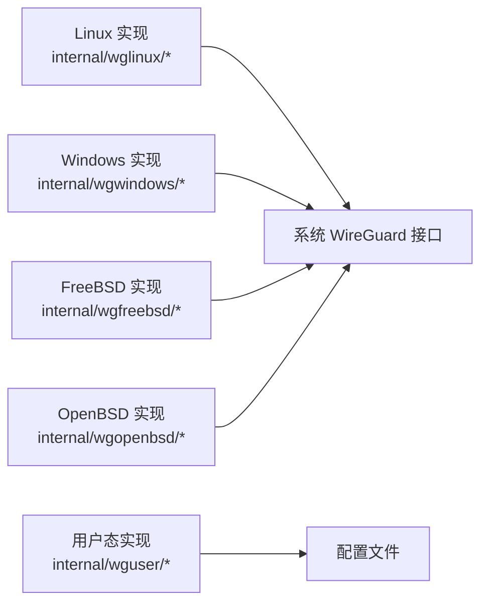
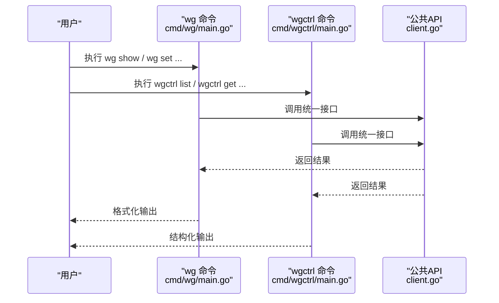
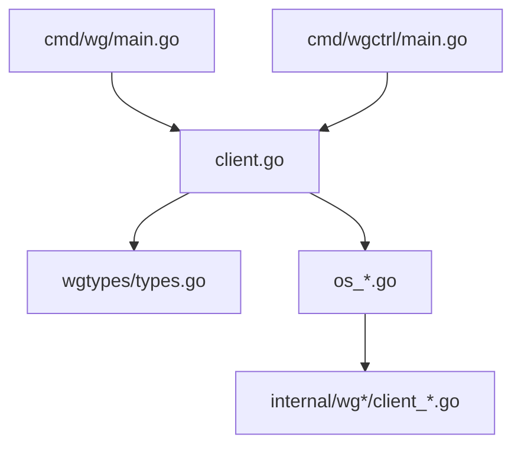

# 项目概述

<cite>
**本文引用的文件**
- [README.md](file://README.md)
- [doc.go](file://doc.go)
- [client.go](file://client.go)
- [os_linux.go](file://os_linux.go)
- [os_windows.go](file://os_windows.go)
- [os_freebsd.go](file://os_freebsd.go)
- [os_openbsd.go](file://os_openbsd.go)
- [os_userspace.go](file://os_userspace.go)
- [wgtypes/types.go](file://wgtypes/types.go)
- [internal/wglinux/client_linux.go](file://internal/wglinux/client_linux.go)
- [internal/wgwindows/client_windows.go](file://internal/wgwindows/client_windows.go)
- [internal/wgfreebsd/client_freebsd.go](file://internal/wgfreebsd/client_freebsd.go)
- [internal/wgopenbsd/client_openbsd.go](file://internal/wgopenbsd/client_openbsd.go)
- [cmd/wg/main.go](file://cmd/wg/main.go)
- [cmd/wgctrl/main.go](file://cmd/wgctrl/main.go)
- [internal/wguser/client.go](file://internal/wguser/client.go)
- [go.mod.base](file://go.mod.base)
</cite>

## 目录
1. [简介](#简介)
2. [项目结构](#项目结构)
3. [核心组件](#核心组件)
4. [架构总览](#架构总览)
5. [详细组件分析](#详细组件分析)
6. [依赖关系分析](#依赖关系分析)
7. [性能考量](#性能考量)
8. [故障排查指南](#故障排查指南)
9. [结论](#结论)
10. [附录](#附录)

## 简介
wgctrl-go 是一个用于管理 WireGuard 网络接口的 Go 库与命令行工具集合。其核心目标是：
- 提供统一的 API，屏蔽 Linux、Windows、FreeBSD、OpenBSD 等平台的差异，实现对 WireGuard 接口的创建、配置、查询与删除等操作。
- 在用户态（userspace）场景下，通过读取/写入配置文件的方式模拟接口管理，便于在无内核模块或受限环境中使用。
- 提供与上游 wg(8) 命令兼容的命令行体验，方便运维人员快速上手。

本项目与上游 WireGuard 项目的关系体现在：
- 数据模型与配置语义遵循上游规范，确保跨平台一致性。
- 在支持的平台（Linux、Windows、FreeBSD、OpenBSD）上直接调用系统提供的 WireGuard 控制通道；在不支持的平台或容器环境中回退到用户态实现。

面向初学者：你可以把它理解为“WireGuard 的统一遥控器”，无论你的设备运行什么操作系统，都可以通过同一组 API 或命令来管理隧道。
面向有经验的开发者：它采用平台抽象 + 具体实现的策略，将内核/系统调用细节封装在内部包中，对外暴露稳定、可测试的接口。

**章节来源**
- [README.md:1-200](file://README.md#L1-L200)
- [doc.go:1-120](file://doc.go#L1-L120)

## 项目结构
仓库采用“按功能分层 + 按平台拆分”的组织方式：
- 顶层对外暴露统一客户端与类型定义，隐藏平台差异。
- internal 下按平台划分实现：wglinux、wgwindows、wgfreebsd、wgopenbsd，以及通用的用户态实现 wguser。
- wgtypes 定义跨平台共享的数据结构（如接口、对等体、密钥等）。
- cmd 提供两个命令行入口：wg（与上游 wg 命令风格一致）和 wgctrl（更偏向编程式控制的 CLI）。

**图表来源**
- [client.go:1-120](file://client.go#L1-L120)
- [os_linux.go:1-80](file://os_linux.go#L1-L80)
- [os_windows.go:1-80](file://os_windows.go#L1-L80)
- [os_freebsd.go:1-80](file://os_freebsd.go#L1-L80)
- [os_openbsd.go:1-80](file://os_openbsd.go#L1-L80)
- [os_userspace.go:1-80](file://os_userspace.go#L1-L80)
- [wgtypes/types.go:1-120](file://wgtypes/types.go#L1-L120)
- [cmd/wg/main.go:1-120](file://cmd/wg/main.go#L1-L120)
- [cmd/wgctrl/main.go:1-120](file://cmd/wgctrl/main.go#L1-L120)

**章节来源**
- [client.go:1-120](file://client.go#L1-L120)
- [doc.go:1-120](file://doc.go#L1-L120)
- [wgtypes/types.go:1-120](file://wgtypes/types.go#L1-L120)
- [cmd/wg/main.go:1-120](file://cmd/wg/main.go#L1-L120)
- [cmd/wgctrl/main.go:1-120](file://cmd/wgctrl/main.go#L1-L120)

## 核心组件
- 公共客户端 API：对外暴露创建、列出、获取、更新、删除 WireGuard 接口的能力，并返回统一的数据模型。
- 平台适配层：根据编译目标自动选择对应 OS 的具体实现，保证一致的调用体验。
- 数据类型定义：集中维护接口、对等体、监听地址、公钥/私钥等数据结构，确保序列化/反序列化的一致性。
- 用户态实现：当无法访问内核接口时，通过读写配置文件完成“类内核”行为，便于测试与无根环境使用。
- 命令行工具：
  - wg：与上游 wg 命令风格一致，便于迁移与日常运维。
  - wgctrl：提供更细粒度的控制选项，适合自动化脚本与集成测试。

典型使用场景示例（概念性描述）：
- 在 Linux 服务器上创建一个名为 wg0 的接口，设置监听端口、生成并保存密钥对，添加一个对等体并指定允许的 IP 段。
- 在 Windows 工作站上列出当前所有 WireGuard 接口，查看每个接口的状态与对等体信息。
- 在 FreeBSD/OpenBSD 节点上批量更新多个接口的配置，保持集群拓扑一致。
- 在容器或 CI 环境中，使用用户态实现验证配置是否正确，无需加载内核模块。

**章节来源**
- [client.go:1-200](file://client.go#L1-L200)
- [wgtypes/types.go:1-200](file://wgtypes/types.go#L1-L200)
- [internal/wguser/client.go:1-120](file://internal/wguser/client.go#L1-L120)
- [cmd/wg/main.go:1-120](file://cmd/wg/main.go#L1-L120)
- [cmd/wgctrl/main.go:1-120](file://cmd/wgctrl/main.go#L1-L120)

## 架构总览
wgctrl-go 的架构以“统一 API + 平台后端”为核心，结合“用户态回退”增强可移植性与可测试性。

**图表来源**
- [client.go:1-200](file://client.go#L1-L200)
- [os_linux.go:1-120](file://os_linux.go#L1-L120)
- [os_windows.go:1-120](file://os_windows.go#L1-L120)
- [os_freebsd.go:1-120](file://os_freebsd.go#L1-L120)
- [os_openbsd.go:1-120](file://os_openbsd.go#L1-L120)
- [os_userspace.go:1-120](file://os_userspace.go#L1-L120)
- [internal/wglinux/client_linux.go:1-120](file://internal/wglinux/client_linux.go#L1-L120)
- [internal/wgwindows/client_windows.go:1-120](file://internal/wgwindows/client_windows.go#L1-L120)
- [internal/wgfreebsd/client_freebsd.go:1-120](file://internal/wgfreebsd/client_freebsd.go#L1-L120)
- [internal/wgopenbsd/client_openbsd.go:1-120](file://internal/wgopenbsd/client_openbsd.go#L1-L120)
- [internal/wguser/client.go:1-120](file://internal/wguser/client.go#L1-L120)

## 详细组件分析

### 公共客户端与类型
- 公共客户端负责接收高层调用，并将请求路由到对应平台实现。错误处理与返回值均进行规范化，使上层代码无需关心底层差异。
- 类型定义集中在 wgtypes，包含接口、对等体、监听地址、密钥等字段，确保在不同平台间保持一致的语义与序列化格式。

**图表来源**
- [client.go:1-200](file://client.go#L1-L200)
- [wgtypes/types.go:1-200](file://wgtypes/types.go#L1-L200)

**章节来源**
- [client.go:1-200](file://client.go#L1-L200)
- [wgtypes/types.go:1-200](file://wgtypes/types.go#L1-L200)

### 平台适配层
- 通过构建标签与运行时检测，自动选择 Linux、Windows、FreeBSD、OpenBSD 的具体实现。
- 若目标平台未启用内核支持或权限不足，则回退到用户态实现，保证基本功能可用。

**图表来源**
- [os_linux.go:1-120](file://os_linux.go#L1-L120)
- [os_windows.go:1-120](file://os_windows.go#L1-L120)
- [os_freebsd.go:1-120](file://os_freebsd.go#L1-L120)
- [os_openbsd.go:1-120](file://os_openbsd.go#L1-L120)
- [os_userspace.go:1-120](file://os_userspace.go#L1-L120)

**章节来源**
- [os_linux.go:1-120](file://os_linux.go#L1-L120)
- [os_windows.go:1-120](file://os_windows.go#L1-L120)
- [os_freebsd.go:1-120](file://os_freebsd.go#L1-L120)
- [os_openbsd.go:1-120](file://os_openbsd.go#L1-L120)
- [os_userspace.go:1-120](file://os_userspace.go#L1-L120)

### 各平台实现要点
- Linux：通过系统提供的 WireGuard 控制通道进行配置与查询，具备高性能与低开销。
- Windows：通过系统 IOCTL 与配置接口管理 WireGuard 适配器。
- FreeBSD/OpenBSD：通过系统特定的 NV/IOCTL 机制与内核模块交互。
- 用户态：基于配置文件解析与编码，模拟接口生命周期与配置变更，适用于测试与受限环境。

**图表来源**
- [internal/wglinux/client_linux.go:1-120](file://internal/wglinux/client_linux.go#L1-L120)
- [internal/wgwindows/client_windows.go:1-120](file://internal/wgwindows/client_windows.go#L1-L120)
- [internal/wgfreebsd/client_freebsd.go:1-120](file://internal/wgfreebsd/client_freebsd.go#L1-L120)
- [internal/wgopenbsd/client_openbsd.go:1-120](file://internal/wgopenbsd/client_openbsd.go#L1-L120)
- [internal/wguser/client.go:1-120](file://internal/wguser/client.go#L1-L120)

**章节来源**
- [internal/wglinux/client_linux.go:1-120](file://internal/wglinux/client_linux.go#L1-L120)
- [internal/wgwindows/client_windows.go:1-120](file://internal/wgwindows/client_windows.go#L1-L120)
- [internal/wgfreebsd/client_freebsd.go:1-120](file://internal/wgfreebsd/client_freebsd.go#L1-L120)
- [internal/wgopenbsd/client_openbsd.go:1-120](file://internal/wgopenbsd/client_openbsd.go#L1-L120)
- [internal/wguser/client.go:1-120](file://internal/wguser/client.go#L1-L120)

### 命令行工具
- wg：与上游 wg(8) 命令风格一致，便于从传统运维流程平滑迁移。
- wgctrl：提供更丰富的控制选项，适合自动化与集成测试。

**图表来源**
- [cmd/wg/main.go:1-120](file://cmd/wg/main.go#L1-L120)
- [cmd/wgctrl/main.go:1-120](file://cmd/wgctrl/main.go#L1-L120)
- [client.go:1-200](file://client.go#L1-L200)

**章节来源**
- [cmd/wg/main.go:1-120](file://cmd/wg/main.go#L1-L120)
- [cmd/wgctrl/main.go:1-120](file://cmd/wgctrl/main.go#L1-L120)
- [client.go:1-200](file://client.go#L1-L200)

## 依赖关系分析
- 外部依赖：主要依赖 Go 标准库与目标平台的系统调用/IOCTL 能力。
- 内部依赖：
  - 公共 API 依赖平台适配层与类型定义。
  - 平台实现依赖各自系统的 WireGuard 控制通道或用户态文件。
  - 命令行工具依赖公共 API 进行实际工作。

**图表来源**
- [client.go:1-200](file://client.go#L1-L200)
- [wgtypes/types.go:1-200](file://wgtypes/types.go#L1-L200)
- [os_linux.go:1-120](file://os_linux.go#L1-L120)
- [os_windows.go:1-120](file://os_windows.go#L1-L120)
- [os_freebsd.go:1-120](file://os_freebsd.go#L1-L120)
- [os_openbsd.go:1-120](file://os_openbsd.go#L1-L120)
- [internal/wglinux/client_linux.go:1-120](file://internal/wglinux/client_linux.go#L1-L120)
- [internal/wgwindows/client_windows.go:1-120](file://internal/wgwindows/client_windows.go#L1-L120)
- [internal/wgfreebsd/client_freebsd.go:1-120](file://internal/wgfreebsd/client_freebsd.go#L1-L120)
- [internal/wgopenbsd/client_openbsd.go:1-120](file://internal/wgopenbsd/client_openbsd.go#L1-L120)
- [cmd/wg/main.go:1-120](file://cmd/wg/main.go#L1-L120)
- [cmd/wgctrl/main.go:1-120](file://cmd/wgctrl/main.go#L1-L120)

**章节来源**
- [client.go:1-200](file://client.go#L1-L200)
- [wgtypes/types.go:1-200](file://wgtypes/types.go#L1-L200)
- [cmd/wg/main.go:1-120](file://cmd/wg/main.go#L1-L120)
- [cmd/wgctrl/main.go:1-120](file://cmd/wgctrl/main.go#L1-L120)

## 性能考量
- 内核路径优先：在支持的平台（Linux、Windows、FreeBSD、OpenBSD）上，直接调用系统接口，避免额外进程与序列化开销。
- 用户态回退：在受限环境或测试场景中，通过配置文件读写模拟行为，牺牲部分性能换取可移植性与可测试性。
- 并发安全：客户端方法应设计为线程安全，避免竞态条件；平台实现需考虑锁与资源清理。
- 内存与序列化：尽量减少大对象拷贝，合理复用缓冲区；对配置数据进行高效编解码。

[本节为通用指导，不直接分析具体文件]

## 故障排查指南
常见问题与定位思路：
- 权限不足：在 Linux/FreeBSD/OpenBSD 上需要 root 权限访问内核接口；在 Windows 上需要管理员权限。
- 内核模块未加载：确认系统已安装并加载 WireGuard 内核模块；必要时回退到用户态实现进行测试。
- 配置错误：检查对等体公钥、允许 IP 段、监听端口等字段是否符合规范；使用 wg 命令校验配置。
- 平台差异：不同平台对某些字段的支持可能略有差异，建议先在小范围验证再推广。

**章节来源**
- [internal/wguser/client.go:1-120](file://internal/wguser/client.go#L1-L120)
- [cmd/wg/main.go:1-120](file://cmd/wg/main.go#L1-L120)
- [cmd/wgctrl/main.go:1-120](file://cmd/wgctrl/main.go#L1-L120)

## 结论
wgctrl-go 通过统一的 API 与平台抽象，实现了跨平台的 WireGuard 接口管理能力。它在支持的平台上使用高性能的内核路径，在受限环境中提供用户态回退，兼顾了性能与可移植性。配合与上游 wg 命令兼容的 CLI，既适合日常运维，也便于集成到自动化流程中。对于开发者而言，清晰的层次结构与稳定的类型定义，使得扩展与维护成本较低。

[本节为总结性内容，不直接分析具体文件]

## 附录
- 支持的操作系统：Linux、Windows、FreeBSD、OpenBSD。
- 与上游关系：数据模型与配置语义遵循上游规范；在可用平台上直接对接系统 WireGuard 接口。
- 版本要求：Go 版本要求请参考 go.mod.base 中的声明。

**章节来源**
- [go.mod.base:1-200](file://go.mod.base#L1-L200)