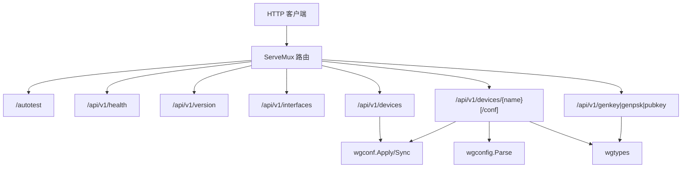
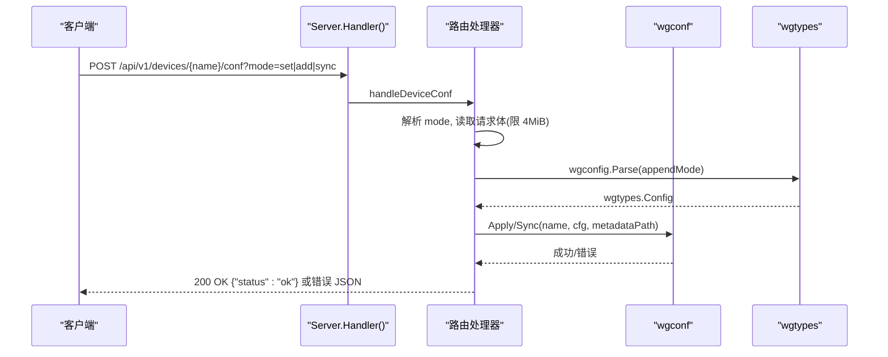
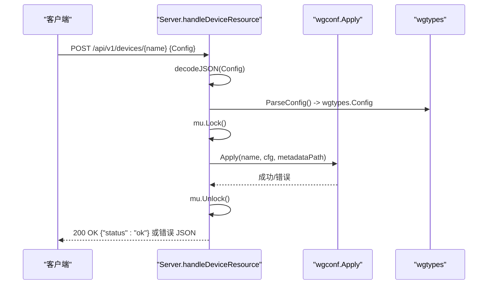
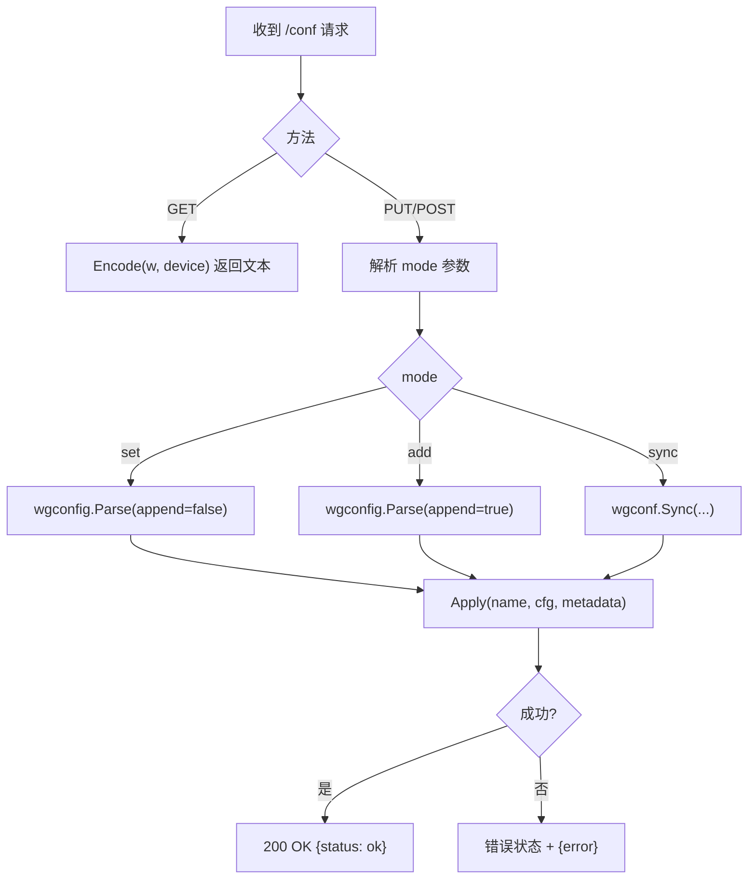
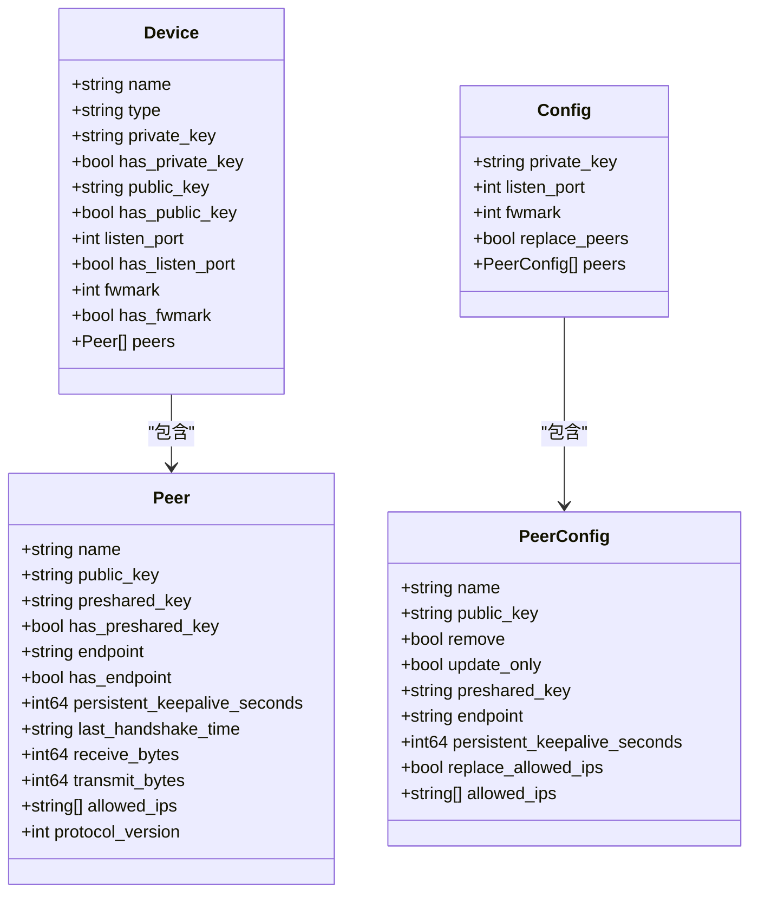
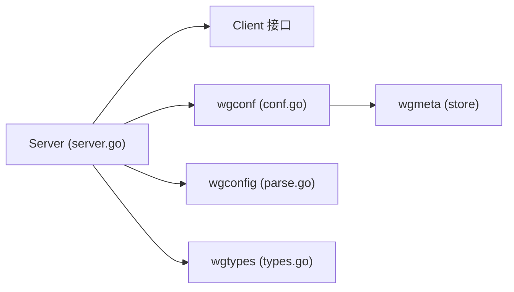

# REST API 服务器

<cite>
**本文引用的文件**
- [internal/wgapi/server.go](file://internal/wgapi/server.go)
- [internal/wgapi/json.go](file://internal/wgapi/json.go)
- [internal/wgapi/doc.go](file://internal/wgapi/doc.go)
- [internal/wgconf/conf.go](file://internal/wgconf/conf.go)
- [internal/wgconfig/parse.go](file://internal/wgconfig/parse.go)
- [wgtypes/types.go](file://wgtypes/types.go)
- [internal/wgapi/server_test.go](file://internal/wgapi/server_test.go)
- [docs/superpowers/specs/2026-08-23-rest-api-documentation-design.md](file://docs/superpowers/specs/2026-08-23-rest-api-documentation-design.md)
</cite>

## 目录
1. [简介](#简介)
2. [项目结构](#项目结构)
3. [核心组件](#核心组件)
4. [架构总览](#架构总览)
5. [详细组件分析](#详细组件分析)
6. [依赖关系分析](#依赖关系分析)
7. [性能与限制](#性能与限制)
8. [故障排查指南](#故障排查指南)
9. [结论](#结论)
10. [附录：端点参考](#附录端点参考)

## 简介
本仓库提供跨平台的 WireGuard 设备控制能力，并通过 REST API 暴露设备查询、配置应用与密钥生成等能力，覆盖 wg(8) 全部子命令对应的操作。REST 服务层位于 internal/wgapi，负责 HTTP 路由、请求解析、错误处理、日志记录以及与底层设备控制的交互。

## 项目结构
- internal/wgapi：REST API 服务实现（路由、处理器、JSON 编解码、中间件）
- internal/wgconf：将 wgtypes.Config 应用到设备并持久化对等节点名称元数据
- internal/wgconfig：wg(8) 配置文件文本的解析器与编码器
- wgtypes：WireGuard 核心类型定义（Device、Peer、Config、Key 等）
- internal/wgapi/server_test.go：REST 服务的单元测试，覆盖健康检查、版本、设备列表、配置应用、密钥生成等场景
- docs/superpowers/specs/2026-08-23-rest-api-documentation-design.md：REST API 文档设计说明（以代码行为为依据）



图表来源
- [internal/wgapi/server.go:126-137](file://internal/wgapi/server.go#L126-L137)
- [internal/wgconf/conf.go:16-77](file://internal/wgconf/conf.go#L16-L77)
- [internal/wgconfig/parse.go:20-161](file://internal/wgconfig/parse.go#L20-L161)
- [wgtypes/types.go:44-249](file://wgtypes/types.go#L44-L249)

章节来源
- [internal/wgapi/doc.go:1-4](file://internal/wgapi/doc.go#L1-L4)
- [internal/wgapi/server.go:126-137](file://internal/wgapi/server.go#L126-L137)

## 核心组件
- Server：REST API 服务器主体，封装 Client 接口、元数据存储路径、可选行为（隐藏密钥、版本信息），并提供 Handler() 返回 http.Handler。
- Client 接口：抽象底层设备控制能力，包括列出设备、获取单个设备、应用配置。
- JSON 模型：Device、Peer、Config、PeerConfig 用于 REST 请求与响应的结构化数据。
- 配置应用：wgconf.Apply/Sync 将配置应用到设备，并持久化对等节点名称；wgconfig.Parse 解析 wg(8) 配置文本。
- 中间件：with_logging 统一记录请求入参与响应摘要，便于排障。

章节来源
- [internal/wgapi/server.go:23-43](file://internal/wgapi/server.go#L23-L43)
- [internal/wgapi/json.go:13-134](file://internal/wgapi/json.go#L13-L134)
- [internal/wgconf/conf.go:16-77](file://internal/wgconf/conf.go#L16-L77)
- [internal/wgconfig/parse.go:20-161](file://internal/wgconfig/parse.go#L20-L161)

## 架构总览
REST 服务通过标准库 ServeMux 注册多个端点，所有请求经 with_logging 中间件记录入出日志。设备相关读写操作使用互斥锁串行化，避免并发写冲突。配置更新支持三种模式：set（替换）、add（追加）、sync（同步，补充删除目标配置中不存在的 peer）。



图表来源
- [internal/wgapi/server.go:371-421](file://internal/wgapi/server.go#L371-L421)
- [internal/wgconf/conf.go:16-77](file://internal/wgconf/conf.go#L16-L77)
- [internal/wgconfig/parse.go:20-161](file://internal/wgconfig/parse.go#L20-L161)

## 详细组件分析

### REST 服务器与路由
- 路由注册：集中式注册健康检查、版本、接口列表、设备资源、配置文本接口、密钥工具接口。
- 中间件：with_logging 捕获请求方法、URL、远程地址、内容长度、请求体摘要；响应时记录状态码、字节数、耗时、响应体摘要。
- 安全与校验：请求体上限 4 MiB；未知路径返回 404；不支持的方法返回 405 并设置 Allow 头。

```mermaid
flowchart TD
Start(["请求进入"]) --> Log["with_logging 记录入参"]
Log --> Route{"匹配路由"}
Route --> |/devices/{name}/conf| Conf["handleDeviceConf"]
Route --> |/devices/{name}| Dev["handleDeviceResource"]
Route --> |/interfaces| Ifc["handleInterfaces"]
Route --> |/devices| Dv["handleDevices"]
Route --> |/version| Ver["handleVersion"]
Route --> |/health| Hl["handleHealth"]
Route --> |/genkey| Gk["handleGenKey"]
Route --> |/genpsk| Gp["handleGenPsk"]
Route --> |/pubkey| Pk["handlePubkey"]
Conf --> End(["返回响应"])
Dev --> End
Ifc --> End
Dv --> End
Ver --> End
Hl --> End
Gk --> End
Gp --> End
Pk --> End
```

图表来源
- [internal/wgapi/server.go:126-137](file://internal/wgapi/server.go#L126-L137)
- [internal/wgapi/server.go:175-197](file://internal/wgapi/server.go#L175-L197)
- [internal/wgapi/server.go:487-505](file://internal/wgapi/server.go#L487-L505)

章节来源
- [internal/wgapi/server.go:126-137](file://internal/wgapi/server.go#L126-L137)
- [internal/wgapi/server.go:175-197](file://internal/wgapi/server.go#L175-L197)
- [internal/wgapi/server.go:487-505](file://internal/wgapi/server.go#L487-L505)

### 设备资源处理器
- GET /api/v1/devices/{name}：返回设备 JSON，可选择隐藏私钥与预共享密钥。
- POST /api/v1/devices/{name}：接收结构化 JSON 配置（等价于 wg set），内部调用 wgconf.Apply。
- 并发控制：写操作加互斥锁，确保串行化。



图表来源
- [internal/wgapi/server.go:336-369](file://internal/wgapi/server.go#L336-L369)
- [internal/wgconf/conf.go:16-65](file://internal/wgconf/conf.go#L16-L65)
- [internal/wgapi/json.go:136-156](file://internal/wgapi/json.go#L136-L156)

章节来源
- [internal/wgapi/server.go:336-369](file://internal/wgapi/server.go#L336-L369)

### 配置文本接口（/conf）
- GET /api/v1/devices/{name}/conf：返回 wg(8) 格式的配置文本。
- PUT /api/v1/devices/{name}/conf?mode=set：默认 set 模式，替换对等节点。
- POST /api/v1/devices/{name}/conf?mode=add：默认 add 模式，追加对等节点。
- PUT/POST ?mode=sync：同步模式，补充删除目标配置中不存在的 peer。



图表来源
- [internal/wgapi/server.go:371-421](file://internal/wgapi/server.go#L371-L421)
- [internal/wgconfig/parse.go:20-161](file://internal/wgconfig/parse.go#L20-L161)
- [internal/wgconf/conf.go:67-77](file://internal/wgconf/conf.go#L67-L77)

章节来源
- [internal/wgapi/server.go:371-421](file://internal/wgapi/server.go#L371-L421)
- [internal/wgconfig/parse.go:20-161](file://internal/wgconfig/parse.go#L20-L161)

### 密钥工具接口
- POST /api/v1/genkey：生成私钥。
- POST /api/v1/genpsk：生成预共享密钥。
- POST /api/v1/pubkey：输入私钥，返回公钥。

章节来源
- [internal/wgapi/server.go:437-469](file://internal/wgapi/server.go#L437-L469)
- [wgtypes/types.go:90-165](file://wgtypes/types.go#L90-L165)

### JSON 数据模型
- Device/Peer：描述设备与对等节点的当前状态，时间以秒为单位，密钥为 base64 字符串。
- Config/PeerConfig：用于 POST /devices/{name} 的结构化配置，指针字段缺省表示不修改，显式零值表示清除。



图表来源
- [internal/wgapi/json.go:13-134](file://internal/wgapi/json.go#L13-L134)

章节来源
- [internal/wgapi/json.go:13-134](file://internal/wgapi/json.go#L13-L134)

## 依赖关系分析
- Server 依赖 Client 接口进行设备操作，解耦具体平台实现。
- 配置应用依赖 wgconf 完成实际写入与元数据持久化。
- 配置文本解析依赖 wgconfig，严格校验字段与范围。
- JSON 编解码依赖 wgtypes 类型，保证一致性。



图表来源
- [internal/wgapi/server.go:23-43](file://internal/wgapi/server.go#L23-L43)
- [internal/wgconf/conf.go:16-77](file://internal/wgconf/conf.go#L16-L77)
- [internal/wgconfig/parse.go:20-161](file://internal/wgconfig/parse.go#L20-L161)
- [wgtypes/types.go:44-249](file://wgtypes/types.go#L44-L249)

章节来源
- [internal/wgapi/server.go:23-43](file://internal/wgapi/server.go#L23-L43)
- [internal/wgconf/conf.go:16-77](file://internal/wgconf/conf.go#L16-L77)

## 性能与限制
- 请求体大小限制：JSON 与配置文本均限制为 4 MiB，防止过大请求影响服务稳定性。
- 配置文本单行最大缓冲：解析器使用 1 MiB 的单行缓冲区，避免超长行导致内存问题。
- 并发写保护：设备写操作通过互斥锁串行化，避免并发配置导致的竞态。
- 已知限制（基于设计与测试）：
  - 默认监听地址与端口可通过外部启动参数控制（见设计文档）。
  - 当前无认证与 TLS。
  - -hide-keys 仅影响设备 JSON 响应，不能阻止配置文本接口返回密钥。
  - JSON 中缺省字段表示不修改；当前实现无法区分缺省与显式 null。
  - 结构化 JSON 配置不支持 AllowedIPs 的逐项增加和删除操作。
  - 结构化 JSON 的端口、fwmark 和 keepalive 范围校验弱于配置文本入口。
  - 部分处理器当前未严格校验 HTTP 方法。
  - sync 模式当前只补充删除目标配置中不存在的 peer。

章节来源
- [internal/wgapi/server.go:399-400](file://internal/wgapi/server.go#L399-L400)
- [internal/wgconfig/parse.go:32-33](file://internal/wgconfig/parse.go#L32-L33)
- [internal/wgapi/server.go:406-417](file://internal/wgapi/server.go#L406-L417)
- [docs/superpowers/specs/2026-08-23-rest-api-documentation-design.md:59-72](file://docs/superpowers/specs/2026-08-23-rest-api-documentation-design.md#L59-L72)

## 故障排查指南
- 常见错误与状态码：
  - 400 Bad Request：请求体解析失败、无效 mode、无效字段。
  - 404 Not Found：设备不存在或未知路径。
  - 405 Method Not Allowed：不支持的 HTTP 方法，响应头包含 Allow。
  - 500 Internal Server Error：后端设备访问失败或内部错误。
- 日志定位：
  - with_logging 会记录请求方法与 URL、远程地址、内容长度、请求体摘要；响应时记录状态码、字节数、耗时、响应体摘要。
  - 错误路径统一通过 writeError 输出错误消息。
- 验证建议：
  - 使用 /autotest 探活确认服务可用。
  - 使用 /api/v1/health 检查服务健康。
  - 使用 /api/v1/version 核对版本与构建信息。
  - 使用 /api/v1/interfaces 与 /api/v1/devices 验证设备列表与详情。
  - 使用 /api/v1/genkey、/api/v1/genpsk、/api/v1/pubkey 验证密钥工具。

章节来源
- [internal/wgapi/server.go:175-197](file://internal/wgapi/server.go#L175-L197)
- [internal/wgapi/server.go:480-505](file://internal/wgapi/server.go#L480-L505)
- [internal/wgapi/server_test.go:70-136](file://internal/wgapi/server_test.go#L70-L136)

## 结论
该 REST API 服务器提供了稳定、可观测的 WireGuard 设备管理能力，覆盖设备查询、配置应用与密钥生成等常用操作。通过严格的请求体限制、统一的日志中间件与清晰的错误处理，便于在生产环境中集成与排障。对于需要更高安全性的部署，可在网关层叠加认证与 TLS。

## 附录：端点参考
- GET /autotest：自动化测试探活，返回纯文本“OK”。
- GET /api/v1/health：健康检查，返回 JSON {"status":"ok"}。
- GET /api/v1/version：返回版本、构建时间与平台信息。
- GET /api/v1/interfaces：返回设备名列表。
- GET /api/v1/devices：返回设备详情列表（可隐藏密钥）。
- GET /api/v1/devices/{name}：返回指定设备详情（可隐藏密钥）。
- POST /api/v1/devices/{name}：应用结构化 JSON 配置（等价 wg set）。
- GET /api/v1/devices/{name}/conf：返回 wg(8) 配置文本。
- PUT /api/v1/devices/{name}/conf?mode=set：替换对等节点。
- POST /api/v1/devices/{name}/conf?mode=add：追加对等节点。
- PUT/POST /api/v1/devices/{name}/conf?mode=sync：同步对等节点。
- POST /api/v1/genkey：生成私钥。
- POST /api/v1/genpsk：生成预共享密钥。
- POST /api/v1/pubkey：由私钥计算公钥。

章节来源
- [internal/wgapi/server.go:126-137](file://internal/wgapi/server.go#L126-L137)
- [internal/wgapi/server.go:262-282](file://internal/wgapi/server.go#L262-L282)
- [internal/wgapi/server.go:284-311](file://internal/wgapi/server.go#L284-L311)
- [internal/wgapi/server.go:336-421](file://internal/wgapi/server.go#L336-L421)
- [internal/wgapi/server.go:437-469](file://internal/wgapi/server.go#L437-L469)