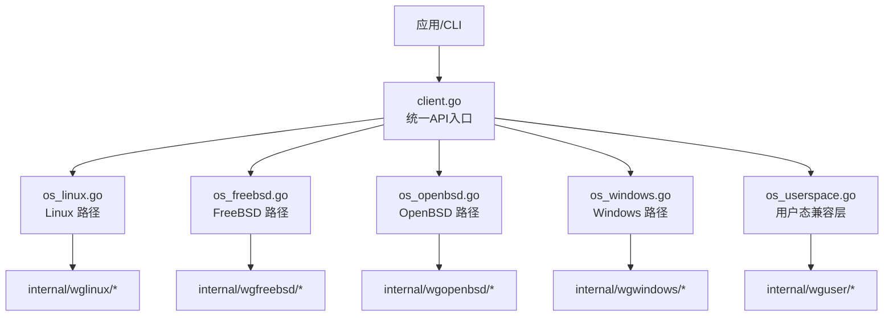
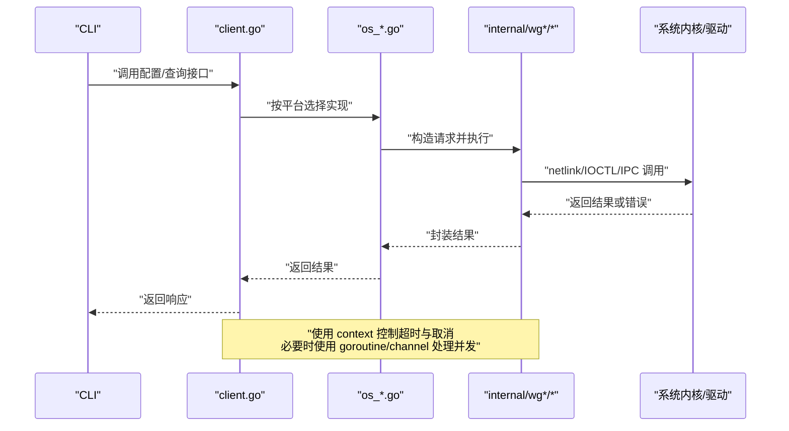
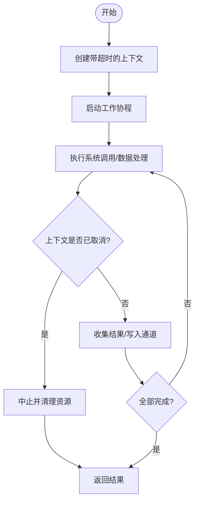
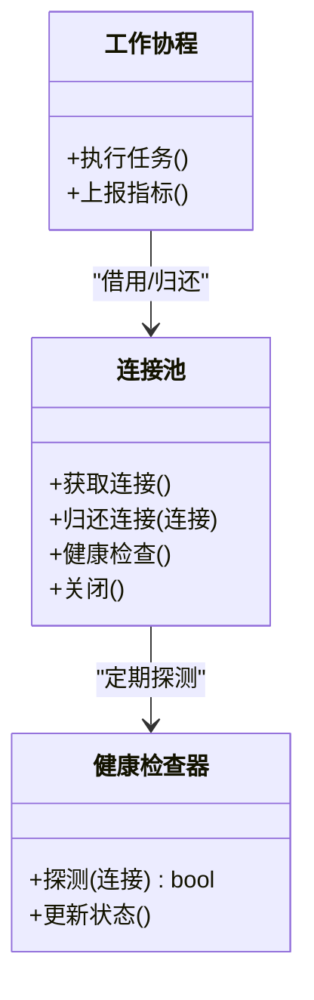
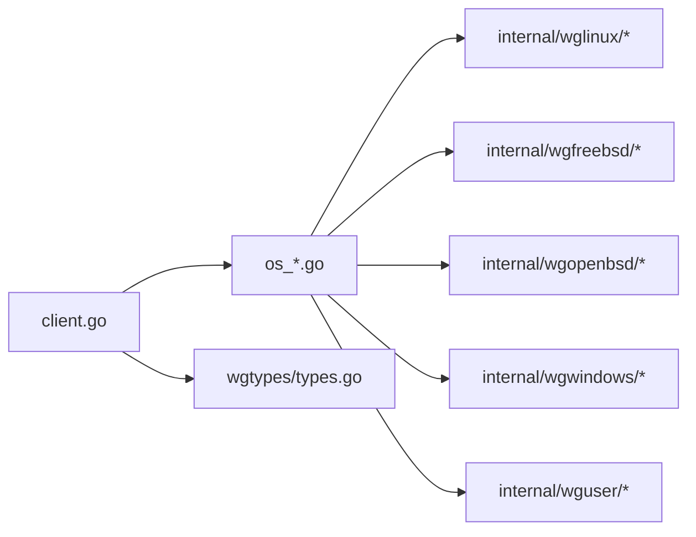

# 性能优化

<cite>
**本文引用的文件**
- [client.go](file://client.go)
- [os_linux.go](file://os_linux.go)
- [os_freebsd.go](file://os_freebsd.go)
- [os_openbsd.go](file://os_openbsd.go)
- [os_windows.go](file://os_windows.go)
- [os_userspace.go](file://os_userspace.go)
- [internal/wglinux/client_linux.go](file://internal/wglinux/client_linux.go)
- [internal/wglinux/configure_linux.go](file://internal/wglinux/configure_linux.go)
- [internal/wglinux/parse_linux.go](file://internal/wglinux/parse_linux.go)
- [internal/wgfreebsd/client_freebsd.go](file://internal/wgfreebsd/client_freebsd.go)
- [internal/wgopenbsd/client_openbsd.go](file://internal/wgopenbsd/client_openbsd.go)
- [internal/wgwindows/client_windows.go](file://internal/wgwindows/client_windows.go)
- [internal/wguser/client.go](file://internal/wguser/client.go)
- [internal/wguser/conn_unix.go](file://internal/wguser/conn_unix.go)
- [internal/wguser/conn_windows.go](file://internal/wguser/conn_windows.go)
- [internal/wgmeta/store.go](file://internal/wgmeta/store.go)
- [cmd/wg/main.go](file://cmd/wg/main.go)
- [cmd/wg/command.go](file://cmd/wg/command.go)
- [wgtypes/types.go](file://wgtypes/types.go)
</cite>

## 目录
1. [简介](#简介)
2. [项目结构](#项目结构)
3. [核心组件](#核心组件)
4. [架构总览](#架构总览)
5. [详细组件分析](#详细组件分析)
6. [依赖关系分析](#依赖关系分析)
7. [性能考量](#性能考量)
8. [故障排查指南](#故障排查指南)
9. [结论](#结论)
10. [附录](#附录)

## 简介
本文件聚焦于 wgctrl-go 的性能优化，围绕以下主题展开：
- 异步操作设计模式：goroutine 管理、channel 通信、context 取消机制
- 连接池与复用：连接生命周期、负载均衡与健康检查
- 内存使用优化：对象池、GC 调优、内存泄漏防护
- 并发最佳实践：goroutine 数量控制、死锁预防、性能监控
- 网络 I/O 优化：缓冲区管理、带宽限制配置
- 基准测试、瓶颈分析与调优工具使用方法

本项目为跨平台 WireGuard 客户端库，通过平台特定的实现（Linux、FreeBSD、OpenBSD、Windows）与用户态兼容层进行系统调用或 IPC，提供统一的配置与查询接口。性能优化的关键在于减少系统调用开销、避免不必要的分配、合理并发与资源复用，以及利用上下文取消保障可中断的长耗时操作。

## 项目结构
仓库采用“平台抽象 + 具体实现”的分层组织方式：
- 顶层 client.go 暴露统一 API，按运行平台选择具体实现
- internal/* 下包含各平台的具体实现与用户态兼容层
- cmd/* 提供命令行入口与子命令
- wgtypes/* 定义通用类型与错误

图表来源
- [client.go:1-200](file://client.go#L1-L200)
- [os_linux.go:1-200](file://os_linux.go#L1-L200)
- [os_freebsd.go:1-200](file://os_freebsd.go#L1-L200)
- [os_openbsd.go:1-200](file://os_openbsd.go#L1-L200)
- [os_windows.go:1-200](file://os_windows.go#L1-L200)
- [os_userspace.go:1-200](file://os_userspace.go#L1-L200)

章节来源
- [client.go:1-200](file://client.go#L1-L200)
- [os_linux.go:1-200](file://os_linux.go#L1-L200)
- [os_freebsd.go:1-200](file://os_freebsd.go#L1-L200)
- [os_openbsd.go:1-200](file://os_openbsd.go#L1-L200)
- [os_windows.go:1-200](file://os_windows.go#L1-L200)
- [os_userspace.go:1-200](file://os_userspace.go#L1-L200)

## 核心组件
- 统一客户端接口：对外暴露配置、查询等能力，内部根据平台路由到具体实现
- 平台客户端：
  - Linux：通过 netlink 与内核交互，负责配置解析与下发
  - FreeBSD/OpenBSD：通过系统特定接口访问 WireGuard 状态
  - Windows：通过 IOCTL 与系统驱动交互
- 用户态兼容层：在无法直接访问内核时，通过用户态进程/套接字进行通信
- 元数据与存储：用于持久化配置与锁管理
- 类型与错误：统一的类型定义与错误语义

章节来源
- [client.go:1-200](file://client.go#L1-L200)
- [internal/wglinux/client_linux.go:1-200](file://internal/wglinux/client_linux.go#L1-L200)
- [internal/wgfreebsd/client_freebsd.go:1-200](file://internal/wgfreebsd/client_freebsd.go#L1-L200)
- [internal/wgopenbsd/client_openbsd.go:1-200](file://internal/wgopenbsd/client_openbsd.go#L1-L200)
- [internal/wgwindows/client_windows.go:1-200](file://internal/wgwindows/client_windows.go#L1-L200)
- [internal/wguser/client.go:1-200](file://internal/wguser/client.go#L1-L200)
- [internal/wgmeta/store.go:1-200](file://internal/wgmeta/store.go#L1-L200)
- [wgtypes/types.go:1-200](file://wgtypes/types.go#L1-L200)

## 架构总览
下图展示从 CLI 到平台实现的调用链，强调异步与取消机制在关键路径上的作用。

图表来源
- [client.go:1-200](file://client.go#L1-L200)
- [os_linux.go:1-200](file://os_linux.go#L1-L200)
- [internal/wglinux/client_linux.go:1-200](file://internal/wglinux/client_linux.go#L1-L200)

## 详细组件分析

### 异步操作与并发模型
- goroutine 管理
  - 将耗时的系统调用或批量任务放入 goroutine 中执行，避免阻塞主流程
  - 使用 worker pool 限制并发度，防止资源耗尽
  - 通过 WaitGroup 或 channel 收集结果，确保有序与完整性
- channel 通信
  - 使用 buffered channel 降低阻塞概率
  - 用 select 结合 context.Done 实现优雅退出
  - 对多路结果聚合时使用 fan-in/fan-out 模式
- context 取消
  - 所有外部可调用的函数应接受 context.Context 参数
  - 在循环、I/O 等待、系统调用前检测 ctx.Err()
  - 设置合理的超时，避免长期占用资源

图表来源
- [client.go:1-200](file://client.go#L1-L200)
- [internal/wglinux/client_linux.go:1-200](file://internal/wglinux/client_linux.go#L1-L200)

章节来源
- [client.go:1-200](file://client.go#L1-L200)
- [internal/wglinux/client_linux.go:1-200](file://internal/wglinux/client_linux.go#L1-L200)

### 连接池与复用
- 连接复用
  - 针对需要多次系统调用或 IPC 的场景，复用底层句柄/连接，减少建立/销毁成本
  - 使用 sync.Pool 缓存临时对象（如请求结构体、缓冲），降低 GC 压力
- 负载均衡
  - 在多实例或多设备场景下，基于轮询或最少活跃数策略分发请求
  - 对健康检查失败的节点进行隔离与重试
- 健康检查
  - 定期探测后端可用性（心跳/探针），失败则标记不可用
  - 自动恢复：当探测成功时重新纳入可用集合

图表来源
- [internal/wguser/client.go:1-200](file://internal/wguser/client.go#L1-L200)
- [internal/wguser/conn_unix.go:1-200](file://internal/wguser/conn_unix.go#L1-L200)
- [internal/wguser/conn_windows.go:1-200](file://internal/wguser/conn_windows.go#L1-L200)

章节来源
- [internal/wguser/client.go:1-200](file://internal/wguser/client.go#L1-L200)
- [internal/wguser/conn_unix.go:1-200](file://internal/wguser/conn_unix.go#L1-L200)
- [internal/wguser/conn_windows.go:1-200](file://internal/wguser/conn_windows.go#L1-L200)

### 内存使用优化
- 对象池
  - 使用 sync.Pool 复用频繁创建销毁的对象（如请求、响应、缓冲）
  - 注意对象生命周期与并发安全，避免共享可变状态
- GC 调优
  - 减少短生命周期对象的分配，降低 GC 频率
  - 合理设置缓冲大小，避免过大导致峰值内存升高
- 内存泄漏防护
  - 及时释放系统句柄、关闭连接、停止定时器
  - 使用 defer 确保资源释放路径一致
  - 避免闭包持有大对象引用导致无法回收

章节来源
- [internal/wgmeta/store.go:1-200](file://internal/wgmeta/store.go#L1-L200)
- [internal/wguser/client.go:1-200](file://internal/wguser/client.go#L1-L200)

### 并发最佳实践
- goroutine 数量控制
  - 使用信号量或 worker pool 限制并发度，避免过多 goroutine 导致调度开销
  - 根据 CPU 核数与 I/O 特性调整并发上限
- 死锁预防
  - 固定加锁顺序，避免环形等待
  - 尽量使用 channel 替代互斥锁进行协调
  - 对长时间持有的锁进行拆分，缩短临界区
- 性能监控
  - 记录关键路径耗时、错误率、队列长度
  - 暴露指标以便接入监控系统

章节来源
- [client.go:1-200](file://client.go#L1-L200)
- [internal/wglinux/client_linux.go:1-200](file://internal/wglinux/client_linux.go#L1-L200)

### 网络 I/O 优化
- 缓冲区管理
  - 使用预分配缓冲，避免频繁分配
  - 合理设置读写缓冲大小，平衡内存与吞吐
- 带宽限制
  - 在应用层实现令牌桶或漏桶限流，避免拥塞
  - 结合系统级限速策略，达到端到端控制
- 零拷贝与批处理
  - 尽可能合并小请求，减少系统调用次数
  - 使用批量接口一次性获取多个设备信息

章节来源
- [internal/wglinux/parse_linux.go:1-200](file://internal/wglinux/parse_linux.go#L1-L200)
- [internal/wglinux/configure_linux.go:1-200](file://internal/wglinux/configure_linux.go#L1-L200)

### 基准测试、瓶颈分析与调优工具
- 基准测试
  - 使用 go test -bench 对关键路径进行压测
  - 对比不同并发度、缓冲大小下的性能差异
- 瓶颈分析
  - 使用 pprof 采集 CPU/内存/阻塞热点
  - 分析 trace 定位慢调用与锁竞争
- 调优工具
  - 使用 go tool trace 观察 goroutine 调度与 I/O 等待
  - 结合系统工具（如 strace、perf）分析内核交互

章节来源
- [cmd/wg/main.go:1-200](file://cmd/wg/main.go#L1-L200)
- [cmd/wg/command.go:1-200](file://cmd/wg/command.go#L1-L200)

## 依赖关系分析
- 模块耦合
  - client.go 作为门面，依赖 os_*.go 进行平台选择
  - 平台实现依赖 internal/wg* 与 internal/wguser 进行具体交互
  - 类型与错误集中在 wgtypes，便于统一处理
- 外部依赖
  - 系统内核/驱动：Linux netlink、Windows IOCTL、BSD 系统接口
  - 用户态进程：通过套接字或管道进行 IPC

图表来源
- [client.go:1-200](file://client.go#L1-L200)
- [os_linux.go:1-200](file://os_linux.go#L1-L200)
- [internal/wglinux/client_linux.go:1-200](file://internal/wglinux/client_linux.go#L1-L200)
- [internal/wguser/client.go:1-200](file://internal/wguser/client.go#L1-L200)
- [wgtypes/types.go:1-200](file://wgtypes/types.go#L1-L200)

章节来源
- [client.go:1-200](file://client.go#L1-L200)
- [os_linux.go:1-200](file://os_linux.go#L1-L200)
- [internal/wglinux/client_linux.go:1-200](file://internal/wglinux/client_linux.go#L1-L200)
- [internal/wguser/client.go:1-200](file://internal/wguser/client.go#L1-L200)
- [wgtypes/types.go:1-200](file://wgtypes/types.go#L1-L200)

## 性能考量
- 异步与取消
  - 所有长耗时操作必须支持 context 取消，避免僵尸任务
  - 使用超时保护，防止异常阻塞
- 连接复用与池化
  - 对高频系统调用或 IPC 进行连接复用，减少握手与初始化开销
  - 健康检查与故障转移提升整体可用性
- 内存优化
  - 使用对象池与缓冲池降低分配压力
  - 避免不必要的大对象与闭包捕获
- 并发控制
  - 限制并发度，避免资源争用
  - 使用结构化并发模式，确保资源正确释放
- I/O 优化
  - 批处理与合并请求，减少系统调用
  - 合理缓冲与限流，避免拥塞

[本节为通用指导，不直接分析具体文件]

## 故障排查指南
- 常见问题
  - 超时与取消未生效：检查是否在关键路径上监听 ctx.Done
  - 内存增长：确认是否有未释放的连接或句柄，是否存在闭包泄漏
  - 高延迟：分析是否因并发度过高导致调度抖动，或 I/O 阻塞
- 诊断步骤
  - 启用 pprof 与 trace，定位热点与阻塞点
  - 增加日志与指标，追踪关键路径耗时与错误
  - 逐步缩小范围，验证假设

章节来源
- [internal/wguser/client.go:1-200](file://internal/wguser/client.go#L1-L200)
- [internal/wglinux/client_linux.go:1-200](file://internal/wglinux/client_linux.go#L1-L200)

## 结论
通过对异步模型、连接池、内存优化、并发控制与 I/O 调优的系统性改进，可以显著提升 wgctrl-go 在高负载场景下的稳定性与性能。建议在生产环境中持续监控关键指标，结合基准测试与性能分析工具，持续迭代优化。

[本节为总结，不直接分析具体文件]

## 附录
- 推荐实践清单
  - 所有外部调用接受 context，并设置合理超时
  - 使用 worker pool 限制并发，避免资源耗尽
  - 复用连接与对象，减少分配与系统调用
  - 定期健康检查，快速隔离故障节点
  - 使用 pprof/trace 持续监控与分析
- 参考文件
  - 统一 API 与平台选择：[client.go](file://client.go)
  - 平台实现：[internal/wglinux/client_linux.go](file://internal/wglinux/client_linux.go)、[internal/wgfreebsd/client_freebsd.go](file://internal/wgfreebsd/client_freebsd.go)、[internal/wgopenbsd/client_openbsd.go](file://internal/wgopenbsd/client_openbsd.go)、[internal/wgwindows/client_windows.go](file://internal/wgwindows/client_windows.go)
  - 用户态兼容层：[internal/wguser/client.go](file://internal/wguser/client.go)、[internal/wguser/conn_unix.go](file://internal/wguser/conn_unix.go)、[internal/wguser/conn_windows.go](file://internal/wguser/conn_windows.go)
  - 类型与错误：[wgtypes/types.go](file://wgtypes/types.go)

[本节为附录，不直接分析具体文件]