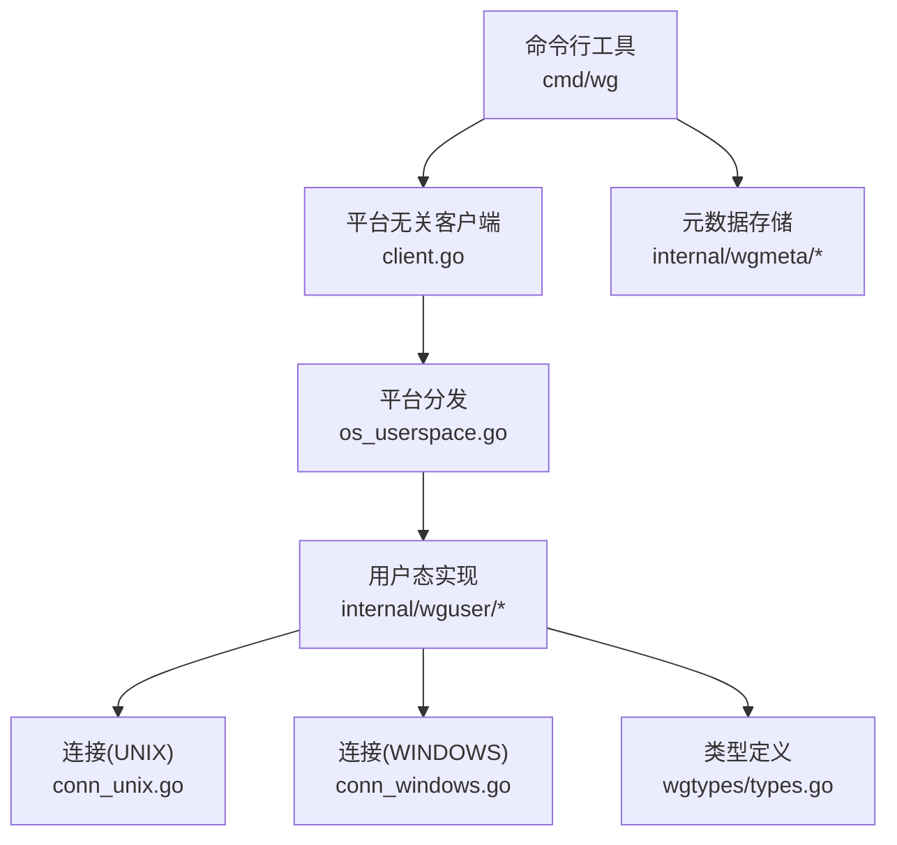
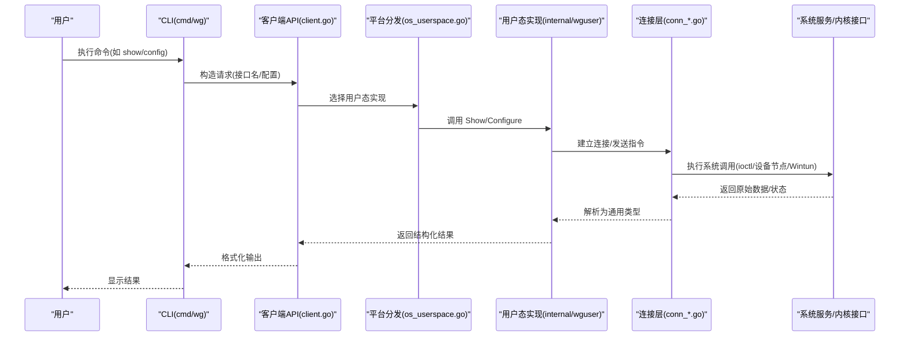
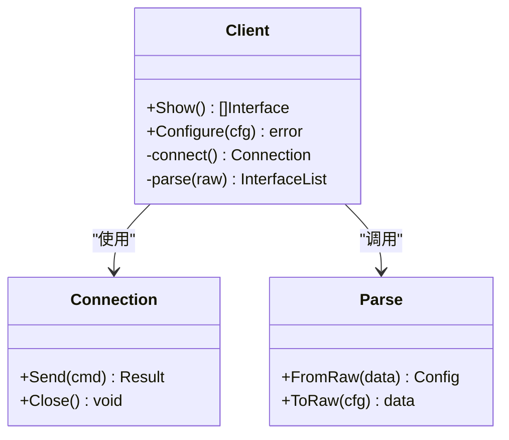
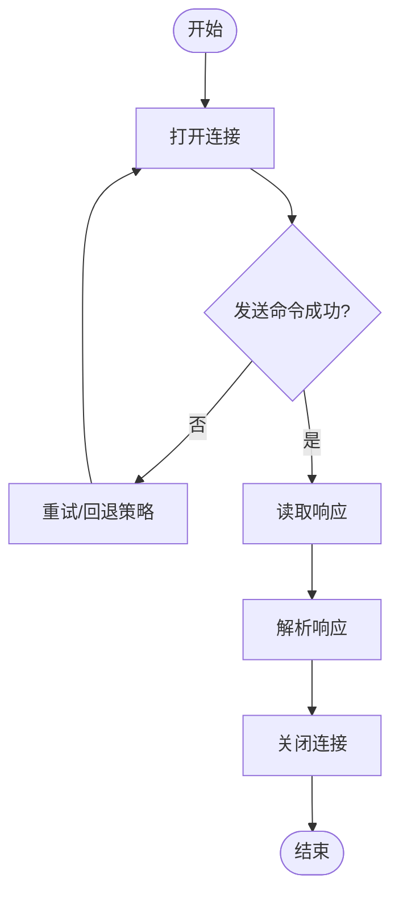
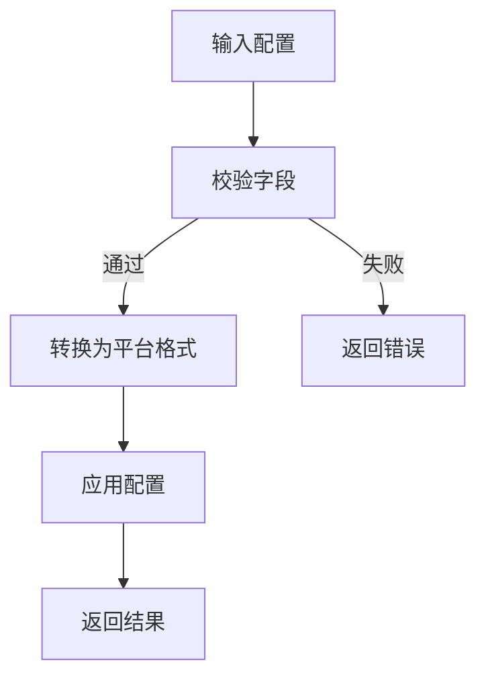
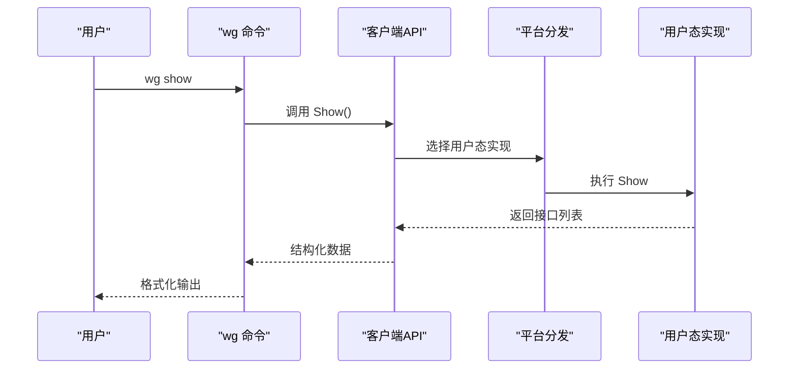
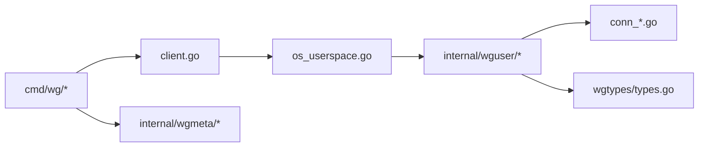

# 用户态模式

<cite>
**本文引用的文件**
- [os_userspace.go](file://os_userspace.go)
- [internal/wguser/client.go](file://internal/wguser/client.go)
- [internal/wguser/configure.go](file://internal/wguser/configure.go)
- [internal/wguser/parse.go](file://internal/wguser/parse.go)
- [internal/wguser/conn_unix.go](file://internal/wguser/conn_unix.go)
- [internal/wguser/conn_windows.go](file://internal/wguser/conn_windows.go)
- [cmd/wg/main.go](file://cmd/wg/main.go)
- [cmd/wg/command.go](file://cmd/wg/command.go)
- [cmd/wg/config.go](file://cmd/wg/config.go)
- [cmd/wg/show.go](file://cmd/wg/show.go)
- [wgtypes/types.go](file://wgtypes/types.go)
- [internal/wgmeta/store.go](file://internal/wgmeta/store.go)
- [internal/wgmeta/path.go](file://internal/wgmeta/path.go)
- [client.go](file://client.go)
</cite>

## 目录
1. [简介](#简介)
2. [项目结构](#项目结构)
3. [核心组件](#核心组件)
4. [架构总览](#架构总览)
5. [详细组件分析](#详细组件分析)
6. [依赖关系分析](#依赖关系分析)
7. [性能考量](#性能考量)
8. [故障排查指南](#故障排查指南)
9. [结论](#结论)
10. [附录](#附录)

## 简介
本文件聚焦于“用户态模式”的实现与使用，面向需要在不直接访问内核模块的情况下配置和查询 WireGuard 接口的场景。用户态模式通过调用系统提供的接口（如 ioctl、netlink、设备节点等）完成配置的读取与写入，避免以 root 权限直接操作内核驱动；同时提供跨平台抽象，使上层 CLI 与库在 Linux、FreeBSD、OpenBSD、Windows 上具备一致的行为。

与传统内核态模式相比，用户态模式的差异主要体现在：
- 权限模型：通常不需要 root 或管理员权限即可执行只读操作；写操作仍需具备相应系统权限（例如对网络设备的控制能力）。
- 可移植性：通过平台适配层屏蔽底层差异，便于在同一代码库中支持多操作系统。
- 性能特征：相比直接内核交互，用户态路径存在额外拷贝与系统调用开销，但在大多数管理任务中影响有限。

适用场景包括：
- 容器化环境或受限环境中进行配置展示与最小化变更。
- 需要跨平台统一工具链的运维自动化。
- 与现有系统服务集成时，遵循最小权限原则。

## 项目结构
仓库围绕“平台无关的客户端 API + 各平台实现 + CLI 工具”组织。用户态模式的核心位于 internal/wguser 包，并通过 os_userspace.go 暴露给用户态入口；CLI 工具 cmd/wg 负责解析参数、调用客户端并输出结果。

图表来源
- [os_userspace.go:1-200](file://os_userspace.go#L1-L200)
- [internal/wguser/client.go:1-200](file://internal/wguser/client.go#L1-L200)
- [internal/wguser/conn_unix.go:1-200](file://internal/wguser/conn_unix.go#L1-L200)
- [internal/wguser/conn_windows.go:1-200](file://internal/wguser/conn_windows.go#L1-L200)
- [wgtypes/types.go:1-200](file://wgtypes/types.go#L1-L200)
- [internal/wgmeta/store.go:1-200](file://internal/wgmeta/store.go#L1-L200)
- [internal/wgmeta/path.go:1-200](file://internal/wgmeta/path.go#L1-L200)

章节来源
- [os_userspace.go:1-200](file://os_userspace.go#L1-L200)
- [client.go:1-200](file://client.go#L1-L200)
- [cmd/wg/main.go:1-200](file://cmd/wg/main.go#L1-L200)

## 核心组件
- 用户态客户端（internal/wguser）：封装了连接建立、配置解析、配置下发与状态查询等能力，屏蔽平台差异。
- 连接层（conn_unix.go / conn_windows.go）：在不同操作系统上建立与系统服务的通信通道（如 ioctl、设备节点、Wintun 等）。
- 配置与解析（configure.go / parse.go）：将高层配置对象序列化为平台相关格式，或将原始数据解析为通用类型。
- 类型定义（wgtypes/types.go）：统一的接口、端点、路由、密钥等数据结构。
- 元数据存储（internal/wgmeta）：用于持久化配置或运行时元信息的路径与锁机制。
- 平台分发（os_userspace.go）：根据运行环境选择用户态实现，作为对外 API 的入口。

章节来源
- [internal/wguser/client.go:1-200](file://internal/wguser/client.go#L1-L200)
- [internal/wguser/configure.go:1-200](file://internal/wguser/configure.go#L1-L200)
- [internal/wguser/parse.go:1-200](file://internal/wguser/parse.go#L1-L200)
- [internal/wguser/conn_unix.go:1-200](file://internal/wguser/conn_unix.go#L1-L200)
- [internal/wguser/conn_windows.go:1-200](file://internal/wguser/conn_windows.go#L1-L200)
- [wgtypes/types.go:1-200](file://wgtypes/types.go#L1-L200)
- [internal/wgmeta/store.go:1-200](file://internal/wgmeta/store.go#L1-L200)
- [internal/wgmeta/path.go:1-200](file://internal/wgmeta/path.go#L1-L200)
- [os_userspace.go:1-200](file://os_userspace.go#L1-L200)

## 架构总览
下图展示了从 CLI 到用户态实现的调用链路，以及关键的数据转换与平台适配点。

图表来源
- [cmd/wg/main.go:1-200](file://cmd/wg/main.go#L1-L200)
- [client.go:1-200](file://client.go#L1-L200)
- [os_userspace.go:1-200](file://os_userspace.go#L1-L200)
- [internal/wguser/client.go:1-200](file://internal/wguser/client.go#L1-L200)
- [internal/wguser/conn_unix.go:1-200](file://internal/wguser/conn_unix.go#L1-L200)
- [internal/wguser/conn_windows.go:1-200](file://internal/wguser/conn_windows.go#L1-L200)

## 详细组件分析

### 用户态客户端（internal/wguser）
- 职责：提供 Show、Configure 等高层方法，负责将配置转换为平台相关格式，并将系统返回的原始数据解析为通用类型。
- 设计要点：
  - 与连接层解耦：通过 conn_* 文件抽象不同平台的通信方式。
  - 错误处理：区分系统级错误与业务校验错误，便于上层重试或提示。
  - 并发安全：对共享资源（如全局句柄、缓存）加锁保护。

图表来源
- [internal/wguser/client.go:1-200](file://internal/wguser/client.go#L1-L200)
- [internal/wguser/conn_unix.go:1-200](file://internal/wguser/conn_unix.go#L1-L200)
- [internal/wguser/conn_windows.go:1-200](file://internal/wguser/conn_windows.go#L1-L200)
- [internal/wguser/parse.go:1-200](file://internal/wguser/parse.go#L1-L200)

章节来源
- [internal/wguser/client.go:1-200](file://internal/wguser/client.go#L1-L200)
- [internal/wguser/parse.go:1-200](file://internal/wguser/parse.go#L1-L200)

### 连接层（conn_unix.go / conn_windows.go）
- UNIX 平台：通过设备节点或 netlink/ioctl 与内核模块交互，封装读写与错误码映射。
- Windows 平台：通过 Wintun 或系统提供的接口进行配置与查询。
- 关键点：
  - 超时与重试：对网络不稳定或内核忙的情况进行退避重试。
  - 资源释放：确保连接关闭，避免句柄泄漏。

图表来源
- [internal/wguser/conn_unix.go:1-200](file://internal/wguser/conn_unix.go#L1-L200)
- [internal/wguser/conn_windows.go:1-200](file://internal/wguser/conn_windows.go#L1-L200)

章节来源
- [internal/wguser/conn_unix.go:1-200](file://internal/wguser/conn_unix.go#L1-L200)
- [internal/wguser/conn_windows.go:1-200](file://internal/wguser/conn_windows.go#L1-L200)

### 配置与解析（configure.go / parse.go）
- 配置下发：将高层配置对象转换为平台相关结构体，交由连接层写入。
- 状态解析：将系统返回的原始字节流解析为通用类型，供上层展示或进一步处理。
- 注意事项：
  - 字段校验：在解析阶段进行合法性检查，减少无效配置进入系统。
  - 增量更新：尽量采用最小变更策略，降低对系统的影响。

图表来源
- [internal/wguser/configure.go:1-200](file://internal/wguser/configure.go#L1-L200)
- [internal/wguser/parse.go:1-200](file://internal/wguser/parse.go#L1-L200)

章节来源
- [internal/wguser/configure.go:1-200](file://internal/wguser/configure.go#L1-L200)
- [internal/wguser/parse.go:1-200](file://internal/wguser/parse.go#L1-L200)

### CLI 工具（cmd/wg）
- 启动流程：解析命令行参数，构建请求，调用客户端 API，格式化输出。
- 常用命令：show（展示接口与对等体）、config（加载/应用配置）。
- 与系统服务集成：通过平台分发层与系统服务交互，无需直接操作内核。

图表来源
- [cmd/wg/main.go:1-200](file://cmd/wg/main.go#L1-L200)
- [cmd/wg/command.go:1-200](file://cmd/wg/command.go#L1-L200)
- [cmd/wg/show.go:1-200](file://cmd/wg/show.go#L1-L200)
- [os_userspace.go:1-200](file://os_userspace.go#L1-L200)
- [internal/wguser/client.go:1-200](file://internal/wguser/client.go#L1-L200)

章节来源
- [cmd/wg/main.go:1-200](file://cmd/wg/main.go#L1-L200)
- [cmd/wg/command.go:1-200](file://cmd/wg/command.go#L1-L200)
- [cmd/wg/show.go:1-200](file://cmd/wg/show.go#L1-L200)

### 类型与元数据（wgtypes/types.go / internal/wgmeta）
- 类型定义：统一接口、端点、路由、密钥等数据结构，保证跨平台一致性。
- 元数据存储：提供配置文件存储路径、锁机制，避免并发写入冲突。

章节来源
- [wgtypes/types.go:1-200](file://wgtypes/types.go#L1-L200)
- [internal/wgmeta/store.go:1-200](file://internal/wgmeta/store.go#L1-L200)
- [internal/wgmeta/path.go:1-200](file://internal/wgmeta/path.go#L1-L200)

## 依赖关系分析
- 平台无关层（client.go）依赖平台分发（os_userspace.go），后者再选择具体实现（internal/wguser）。
- 用户态实现依赖连接层（conn_*）与解析器（parse.go），并基于通用类型（wgtypes/types.go）。
- CLI 工具依赖客户端 API 与元数据存储（internal/wgmeta）。

图表来源
- [client.go:1-200](file://client.go#L1-L200)
- [os_userspace.go:1-200](file://os_userspace.go#L1-L200)
- [internal/wguser/client.go:1-200](file://internal/wguser/client.go#L1-L200)
- [internal/wguser/conn_unix.go:1-200](file://internal/wguser/conn_unix.go#L1-L200)
- [internal/wguser/conn_windows.go:1-200](file://internal/wguser/conn_windows.go#L1-L200)
- [wgtypes/types.go:1-200](file://wgtypes/types.go#L1-L200)
- [cmd/wg/main.go:1-200](file://cmd/wg/main.go#L1-L200)
- [internal/wgmeta/store.go:1-200](file://internal/wgmeta/store.go#L1-L200)

章节来源
- [client.go:1-200](file://client.go#L1-L200)
- [os_userspace.go:1-200](file://os_userspace.go#L1-L200)
- [internal/wguser/client.go:1-200](file://internal/wguser/client.go#L1-L200)
- [cmd/wg/main.go:1-200](file://cmd/wg/main.go#L1-L200)

## 性能考量
- 系统调用开销：用户态模式涉及多次系统调用与数据拷贝，适合管理型任务而非高频数据包转发。
- 内存使用：解析与序列化过程会产生临时对象，建议批量处理以减少分配。
- 并发策略：对连接层与元数据存储加锁，避免竞态；对只读操作可使用无锁缓存提升性能。
- 优化建议：
  - 合并配置变更，减少频繁写入。
  - 使用增量更新，仅下发必要字段。
  - 合理设置超时与重试，避免阻塞。

[本节为通用指导，不直接分析具体文件]

## 故障排查指南
- 常见错误：
  - 权限不足：写操作需具备系统权限（如修改网络设备）。
  - 连接失败：检查系统服务是否运行、设备节点是否存在。
  - 解析错误：确认配置格式与版本兼容性。
- 诊断步骤：
  - 查看系统日志与错误码。
  - 逐步缩小范围：先只读后写，先单接口后多接口。
  - 启用调试输出（如 CLI 的 verbose 选项）定位问题。

章节来源
- [internal/wguser/conn_unix.go:1-200](file://internal/wguser/conn_unix.go#L1-L200)
- [internal/wguser/conn_windows.go:1-200](file://internal/wguser/conn_windows.go#L1-L200)
- [cmd/wg/command.go:1-200](file://cmd/wg/command.go#L1-L200)

## 结论
用户态模式在不直接操作内核的前提下提供了稳定的配置与查询能力，适用于跨平台管理与受限环境。通过清晰的层次划分与平台适配，既保证了可维护性，也兼顾了易用性与安全性。在生产环境中，建议结合最小权限原则与合理的并发策略，以获得稳定且高效的运维体验。

[本节为总结性内容，不直接分析具体文件]

## 附录
- 启动参数与环境要求：
  - 运行环境：支持 Linux、FreeBSD、OpenBSD、Windows。
  - 权限：只读操作通常无需 root；写操作需具备系统权限。
  - 依赖：确保系统服务或设备节点可用。
- 使用示例：
  - 展示接口与对等体：wg show
  - 加载并应用配置：wg config <配置文件>
- 与系统服务集成：
  - 通过平台分发层与系统服务交互，避免直接操作内核。
  - 使用元数据存储管理配置文件与锁。

章节来源
- [cmd/wg/main.go:1-200](file://cmd/wg/main.go#L1-L200)
- [cmd/wg/config.go:1-200](file://cmd/wg/config.go#L1-L200)
- [internal/wgmeta/store.go:1-200](file://internal/wgmeta/store.go#L1-L200)
- [internal/wgmeta/path.go:1-200](file://internal/wgmeta/path.go#L1-L200)