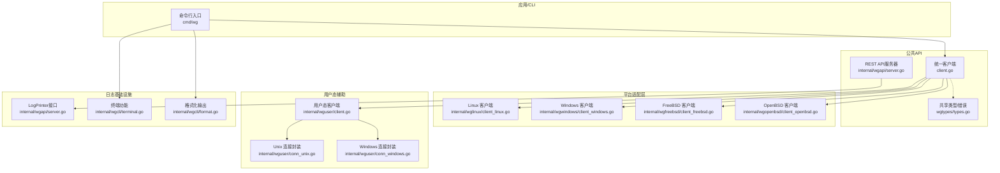
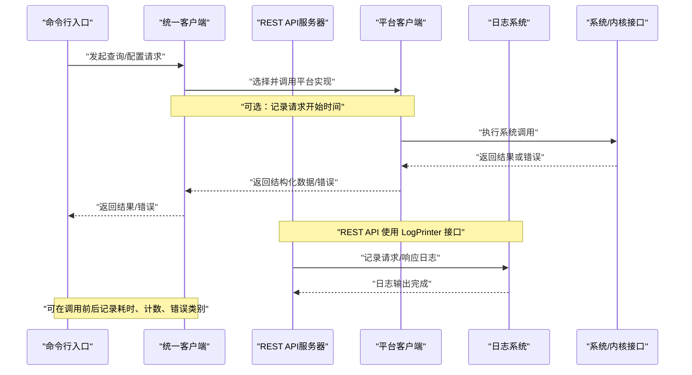
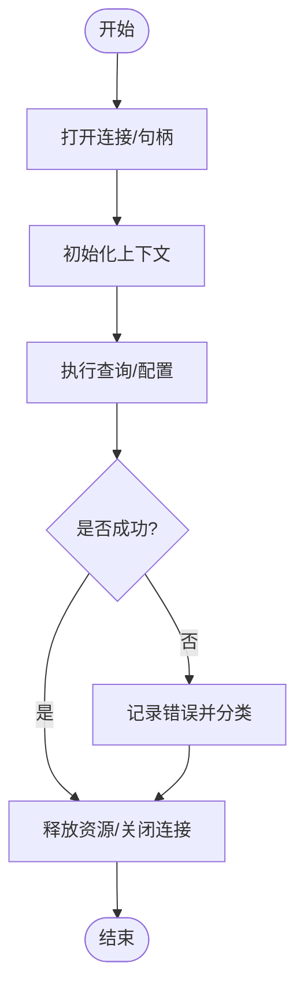
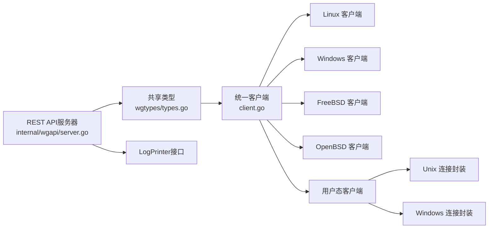

# 监控和日志

<cite>
**本文引用的文件**
- [internal/wgapi/server.go](file://internal/wgapi/server.go)
- [internal/wgcli/terminal.go](file://internal/wgcli/terminal.go)
- [internal/wgcli/format.go](file://internal/wgcli/format.go)
- [internal/wgcli/terminal_test.go](file://internal/wgcli/terminal_test.go)
- [client.go](file://client.go)
- [doc.go](file://doc.go)
- [os_linux.go](file://os_linux.go)
- [os_windows.go](file://os_windows.go)
- [os_freebsd.go](file://os_freebsd.go)
- [os_openbsd.go](file://os_openbsd.go)
- [internal/wginternal/client.go](file://internal/wginternal/client.go)
- [internal/wglinux/client_linux.go](file://internal/wglinux/client_linux.go)
- [internal/wgwindows/client_windows.go](file://internal/wgwindows/client_windows.go)
- [internal/wgfreebsd/client_freebsd.go](file://internal/wgfreebsd/client_freebsd.go)
- [internal/wgopenbsd/client_openbsd.go](file://internal/wgopenbsd/client_openbsd.go)
- [internal/wguser/client.go](file://internal/wguser/client.go)
- [internal/wguser/conn_unix.go](file://internal/wguser/conn_unix.go)
- [internal/wguser/conn_windows.go](file://internal/wguser/conn_windows.go)
- [wgtypes/types.go](file://wgtypes/types.go)
</cite>

## 更新摘要
**所做更改**
- 新增 LogPrinter 抽象日志接口，替代标准 log.Logger 依赖
- 实现灵活的日志输出目标，包括基于文件的日志记录
- 支持自定义日志实现，同时保持向后兼容性
- 增强参数处理，迁移到 pflag 框架
- 更新 REST API 服务器的日志中间件实现

## 目录
1. [简介](#简介)
2. [项目结构](#项目结构)
3. [核心组件](#核心组件)
4. [架构总览](#架构总览)
5. [详细组件分析](#详细组件分析)
6. [依赖关系分析](#依赖关系分析)
7. [性能考量](#性能考量)
8. [故障诊断指南](#故障诊断指南)
9. [结论](#结论)
10. [附录](#附录)

## 简介
本章节面向"监控和日志"主题，围绕连接状态跟踪、性能指标收集、告警机制、日志配置、异步任务管理、可视化与调优、故障诊断等方面，结合仓库中的客户端实现与各平台适配层进行系统性说明。由于该项目主要提供 WireGuard 控制面能力（查询/配置设备与接口），其内置的监控与日志能力以"可观测性支撑"为主：通过结构化数据返回、错误类型定义、平台相关调用路径暴露，为上层应用或 CLI 工具集成监控与日志提供基础。

**更新** 本项目现已引入现代化的日志基础设施，通过抽象的 LogPrinter 接口实现了灵活的日志输出机制，支持多种日志目标和自定义实现。

## 项目结构
从监控与日志视角，代码组织遵循"统一抽象 + 平台适配"的分层模式：
- 顶层 client.go 暴露统一的客户端 API，屏蔽平台差异。
- internal/wginternal 提供内部通用逻辑与共享类型。
- internal/wg{linux,windows,freebsd,openbsd} 按平台实现具体通信与解析。
- internal/wguser 提供用户态辅助能力（如连接封装）。
- wgtypes 定义跨模块共享的数据结构与错误类型。
- internal/wgapi 提供 REST API 服务器，包含现代化的日志基础设施。
- internal/wgcli 提供命令行界面相关的格式化和终端功能。

**图表来源**
- [internal/wgapi/server.go:29-84](file://internal/wgapi/server.go#L29-L84)
- [internal/wgcli/terminal.go:9-29](file://internal/wgcli/terminal.go#L9-L29)
- [internal/wgcli/format.go:32-119](file://internal/wgcli/format.go#L32-L119)

## 核心组件
- 统一客户端（client.go）：对外暴露设备查询、配置等能力；内部根据运行平台选择对应实现；对上层屏蔽平台细节，便于集中接入监控与日志。
- 平台客户端（internal/wg*）：分别实现与内核/系统接口的交互，包括打开句柄、发送请求、接收响应、解析结果。
- 用户态客户端（internal/wguser）：提供用户态下的连接封装与辅助方法，用于特定场景的通信。
- 共享类型（wgtypes/types.go）：定义数据结构与错误类型，确保跨模块一致性与可观测性。
- REST API 服务器（internal/wgapi/server.go）：提供 HTTP 接口，包含现代化的日志中间件和 LogPrinter 抽象。
- 终端功能（internal/wgcli/terminal.go）：处理彩色输出、TTY 检测和终端特性。
- 格式化输出（internal/wgcli/format.go）：提供美观的设备信息展示和字段查询功能。

**更新** 新增 LogPrinter 接口和相关的日志适配器，支持灵活的日志输出配置。

**章节来源**
- [client.go:1-200](file://client.go#L1-L200)
- [internal/wginternal/client.go:1-200](file://internal/wginternal/client.go#L1-L200)
- [internal/wglinux/client_linux.go:1-200](file://internal/wglinux/client_linux.go#L1-L200)
- [internal/wgwindows/client_windows.go:1-200](file://internal/wgwindows/client_windows.go#L1-L200)
- [internal/wgfreebsd/client_freebsd.go:1-200](file://internal/wgfreebsd/client_freebsd.go#L1-L200)
- [internal/wgopenbsd/client_openbsd.go:1-200](file://internal/wgopenbsd/client_openbsd.go#L1-L200)
- [internal/wguser/client.go:1-200](file://internal/wguser/client.go#L1-L200)
- [internal/wgapi/server.go:29-84](file://internal/wgapi/server.go#L29-L84)
- [internal/wgcli/terminal.go:1-29](file://internal/wgcli/terminal.go#L1-L29)
- [internal/wgcli/format.go:1-119](file://internal/wgcli/format.go#L1-L119)
- [wgtypes/types.go:1-200](file://wgtypes/types.go#L1-L200)

## 架构总览
下图展示了从 CLI 到平台适配层的调用链，以及现代化日志基础设施的接入点：
- CLI 层：负责参数解析与命令分发，可在调用前后记录时间戳、输入参数与返回结果。
- 客户端层：统一入口，决定使用哪个平台实现；在此处可注入计时器、计数器与错误统计。
- REST API 层：通过 LogPrinter 接口提供灵活的日志输出，支持中间件模式的请求日志记录。
- 平台层：执行具体系统调用；失败时返回结构化错误，便于上层分类告警。
- 用户态层：在需要时提供连接封装，便于复用与资源清理。

**图表来源**
- [internal/wgapi/server.go:211-233](file://internal/wgapi/server.go#L211-L233)
- [internal/wgapi/server.go:29-84](file://internal/wgapi/server.go#L29-L84)

## 详细组件分析

### 连接状态跟踪机制（建立、维护、断开）
- 建立阶段：CLI 调用统一客户端，客户端根据平台选择具体实现；平台层打开句柄/套接字并初始化上下文。此阶段可记录"建立耗时""失败原因"。
- 维护阶段：在执行查询/配置过程中，平台层与系统接口交互；可统计"请求数""成功/失败次数""平均/分位延迟"。
- 断开阶段：操作完成后释放句柄/关闭连接；若异常退出需确保资源清理，避免泄漏。

**图表来源**
- [internal/wguser/conn_unix.go:1-200](file://internal/wguser/conn_unix.go#L1-L200)
- [internal/wguser/conn_windows.go:1-200](file://internal/wguser/conn_windows.go#L1-L200)
- [internal/wglinux/client_linux.go:1-200](file://internal/wglinux/client_linux.go#L1-L200)
- [internal/wgwindows/client_windows.go:1-200](file://internal/wgwindows/client_windows.go#L1-L200)
- [internal/wgfreebsd/client_freebsd.go:1-200](file://internal/wgfreebsd/client_freebsd.go#L1-L200)
- [internal/wgopenbsd/client_openbsd.go:1-200](file://internal/wgopenbsd/client_openbsd.go#L1-L200)

**章节来源**
- [internal/wguser/conn_unix.go:1-200](file://internal/wguser/conn_unix.go#L1-L200)
- [internal/wguser/conn_windows.go:1-200](file://internal/wguser/conn_windows.go#L1-L200)
- [internal/wglinux/client_linux.go:1-200](file://internal/wglinux/client_linux.go#L1-L200)
- [internal/wgwindows/client_windows.go:1-200](file://internal/wgwindows/client_windows.go#L1-L200)
- [internal/wgfreebsd/client_freebsd.go:1-200](file://internal/wgfreebsd/client_freebsd.go#L1-L200)
- [internal/wgopenbsd/client_openbsd.go:1-200](file://internal/wgopenbsd/client_openbsd.go#L1-L200)

### 性能指标收集（吞吐量、延迟、资源使用）
- 吞吐量：统计单位时间内成功处理的请求数量，可按接口维度聚合。
- 延迟：记录每次请求的开始与结束时间，计算平均、P95、P99 延迟。
- 资源使用：在平台层捕获系统调用失败时的错误码，结合错误类型进行分类统计。

建议接入点：
- 统一客户端入口处：记录请求开始时间、调用栈、目标接口。
- 平台层返回处：记录耗时、错误类别、返回大小。
- REST API 中间件：自动记录每个 HTTP 请求的耗时、状态码和响应大小。
- CLI 层：输出汇总指标，便于人工观察或导出。

**更新** REST API 服务器现在通过 withLogging 中间件自动记录所有 HTTP 请求的详细信息，包括请求方法、URL、远程地址、内容长度、请求体摘要、响应状态码、字节数和耗时。

**章节来源**
- [client.go:1-200](file://client.go#L1-L200)
- [internal/wginternal/client.go:1-200](file://internal/wginternal/client.go#L1-L200)
- [internal/wgapi/server.go:211-233](file://internal/wgapi/server.go#L211-L233)
- [wgtypes/types.go:1-200](file://wgtypes/types.go#L1-L200)

### 告警机制（阈值、通知渠道、事件处理）
- 阈值设置：基于统计指标（如错误率、延迟分位、请求失败次数）设定阈值，超过即触发告警。
- 通知渠道：可通过 CLI 输出告警信息，或由上层应用将告警写入日志系统/监控系统。
- 事件处理：对不同类型的错误进行分类处理（重试、降级、熔断），并记录告警事件。

建议接入点：
- 统一客户端：在错误分支中判断错误类别，决定是否触发告警。
- REST API 服务器：通过 LogPrinter 接口记录错误和警告信息。
- 平台层：将底层错误映射为业务错误类型，便于上层分类。
- CLI：在终端打印告警摘要，便于快速定位问题。

**更新** REST API 服务器现在使用统一的 LogPrinter 接口记录错误信息，支持灵活的目标输出配置。

**章节来源**
- [wgtypes/types.go:1-200](file://wgtypes/types.go#L1-L200)
- [client.go:1-200](file://client.go#L1-L200)
- [internal/wgapi/server.go:528-531](file://internal/wgapi/server.go#L528-L531)

### 日志配置（级别、格式、存储策略）
- 日志级别：建议在 CLI 层提供开关，支持 info/warn/error 等级别。
- 输出格式：结构化 JSON 便于机器消费；文本格式便于人类阅读。
- 存储策略：默认输出到标准输出；可重定向到文件或日志系统。

**更新** 项目现已支持通过 LogPrinter 接口实现灵活的日志配置：
- 支持自定义日志实现，只需实现 Printf 方法
- 提供函数型适配器 LogPrinterFunc，便于快速集成
- 内置 discardLogger 用于禁用日志输出
- 支持通过 Option 模式配置日志器

建议接入点：
- CLI 入口：解析日志级别与格式参数，并在调用前后记录关键事件。
- REST API 服务器：通过 Logger 选项配置日志器。
- 统一客户端：记录关键步骤（打开连接、发送请求、接收响应、释放资源）。
- 平台层：记录系统调用失败详情（错误码、调用位置）。

**章节来源**
- [internal/wgapi/server.go:29-84](file://internal/wgapi/server.go#L29-L84)
- [internal/wgapi/server.go:94-143](file://internal/wgapi/server.go#L94-L143)
- [client.go:1-200](file://client.go#L1-L200)

### 异步监控任务（管理、清理、异常处理）
- 管理：在 CLI 启动时创建监控协程，定期采集指标并上报。
- 清理：程序退出时停止协程并释放资源，避免泄漏。
- 异常处理：捕获协程内异常，记录错误并继续运行其他任务。

建议接入点：
- CLI 主流程：启动监控任务，注册退出钩子。
- 统一客户端：提供指标采集接口（如当前活跃连接数、最近一次错误）。
- REST API 服务器：通过中间件记录请求级别的监控指标。
- 平台层：暴露资源使用情况（如句柄数量、内存占用）。

**更新** REST API 服务器的 withLogging 中间件提供了请求级别的监控能力，自动记录请求处理时间和响应信息。

**章节来源**
- [client.go:1-200](file://client.go#L1-L200)
- [internal/wgapi/server.go:211-233](file://internal/wgapi/server.go#L211-L233)

### 监控数据可视化方案
- 指标导出：将吞吐、延迟、错误率等指标以结构化格式输出，供 Prometheus/Grafana 等采集。
- 实时展示：在 CLI 中提供简洁的表格视图，显示关键指标。
- 历史回溯：将日志与指标持久化，便于事后分析。

**更新** 新增以下可视化支持：
- REST API 健康检查端点：/api/v1/health
- 版本信息端点：/api/v1/version
- 设备列表端点：/api/v1/devices
- 单个设备端点：/api/v1/devices/{name}
- 配置端点：/api/v1/devices/{name}/conf

**章节来源**
- [internal/wgapi/server.go:145-174](file://internal/wgapi/server.go#L145-L174)
- [internal/wgapi/server.go:308-318](file://internal/wgapi/server.go#L308-L318)

### 性能调优指南
- 减少系统调用开销：批量操作、复用连接。
- 合理设置超时：避免长时间阻塞。
- 错误快速失败：尽早返回错误，减少无效处理。
- 监控热点：关注高延迟与高错误率的接口。

**更新** 通过 REST API 中间件的请求日志，可以更容易地识别性能瓶颈：
- 分析请求处理时间分布
- 监控不同端点的响应时间
- 识别慢查询和错误热点

**章节来源**
- [client.go:1-200](file://client.go#L1-L200)
- [internal/wglinux/client_linux.go:1-200](file://internal/wglinux/client_linux.go#L1-L200)
- [internal/wgwindows/client_windows.go:1-200](file://internal/wgwindows/client_windows.go#L1-L200)
- [internal/wgapi/server.go:211-233](file://internal/wgapi/server.go#L211-L233)

### 故障诊断方法
- 错误分类：依据 wgtypes 的错误类型进行归类，快速定位问题域。
- 日志关联：将请求 ID、时间戳、错误码关联起来，形成完整链路。
- 平台差异：对比不同平台的错误表现，识别平台相关问题。

**更新** 新增以下故障诊断能力：
- REST API 中间件自动记录完整的请求/响应日志
- 支持请求体摘要记录，便于调试 API 调用
- 统一的错误处理和日志记录机制
- 支持自定义日志器，便于集成现有日志系统

**章节来源**
- [wgtypes/types.go:1-200](file://wgtypes/types.go#L1-L200)
- [client.go:1-200](file://client.go#L1-L200)
- [internal/wgapi/server.go:211-233](file://internal/wgapi/server.go#L211-L233)
- [internal/wgapi/server.go:528-531](file://internal/wgapi/server.go#L528-L531)

## 依赖关系分析
- 统一客户端依赖平台实现，平台实现依赖系统接口。
- 用户态客户端依赖连接封装，提供跨平台一致的连接语义。
- 共享类型被各层引用，保证数据一致性。
- REST API 服务器依赖 LogPrinter 接口，实现松耦合的日志输出。

**图表来源**
- [wgtypes/types.go:1-200](file://wgtypes/types.go#L1-L200)
- [client.go:1-200](file://client.go#L1-L200)
- [internal/wgapi/server.go:29-84](file://internal/wgapi/server.go#L29-L84)

**章节来源**
- [client.go:1-200](file://client.go#L1-L200)
- [wgtypes/types.go:1-200](file://wgtypes/types.go#L1-L200)
- [internal/wgapi/server.go:29-84](file://internal/wgapi/server.go#L29-L84)

## 性能考量
- 在高并发场景下，优先复用连接与批量操作，降低系统调用频率。
- 对高频接口进行延迟优化，关注 P95/P99 指标。
- 错误快速失败，避免长尾请求影响整体吞吐。
- 通过监控发现瓶颈，针对性调优。

**更新** 新增的性能考量：
- REST API 中间件会复制请求体用于日志记录，注意大请求体的性能影响
- 日志输出可能成为性能瓶颈，应选择合适的日志级别和目标
- 通过合理的日志配置平衡可观测性和性能

## 故障诊断指南
- 查看错误类型与错误码，定位问题域。
- 关联请求时间与日志，还原调用链路。
- 对比不同平台的错误表现，识别平台相关问题。
- 使用 CLI 输出关键指标，快速判断服务健康度。

**更新** 新增故障诊断能力：
- 通过 REST API 健康检查端点验证服务状态
- 利用详细的请求/响应日志进行问题定位
- 使用自定义日志器集成企业级日志系统
- 通过中间件日志分析请求处理性能

**章节来源**
- [wgtypes/types.go:1-200](file://wgtypes/types.go#L1-L200)
- [client.go:1-200](file://client.go#L1-L200)
- [internal/wgapi/server.go:211-233](file://internal/wgapi/server.go#L211-L233)
- [internal/wgapi/server.go:308-318](file://internal/wgapi/server.go#L308-L318)

## 结论
本项目通过统一客户端与平台适配层，为监控与日志提供了清晰的接入点。**更新** 项目现已具备现代化的日志基础设施，通过 LogPrinter 接口实现了灵活的日志输出机制，支持多种日志目标和自定义实现。REST API 服务器的中间件模式提供了请求级别的监控能力，配合终端功能的彩色输出和格式化展示，形成了完整的可观测性解决方案。

建议在 CLI 层完善日志与指标输出，在统一客户端层注入计时与错误统计，在平台层细化错误分类，在 REST API 层利用中间件记录请求处理信息。通过这些措施，可实现连接生命周期跟踪、性能指标收集、告警机制与可视化方案，从而提升系统的可观测性与可维护性。

## 附录
- 术语解释：连接生命周期、吞吐、延迟、告警、日志级别、LogPrinter 接口等。
- 参考文件：上述各文件的行号范围用于定位实现细节。
- **更新** 新增术语：REST API 中间件、日志适配器、请求体摘要等。