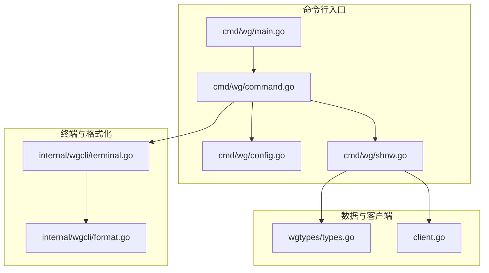
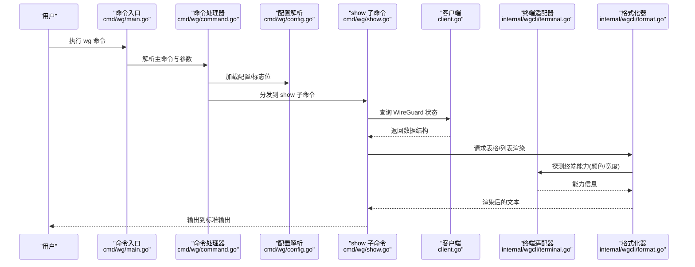
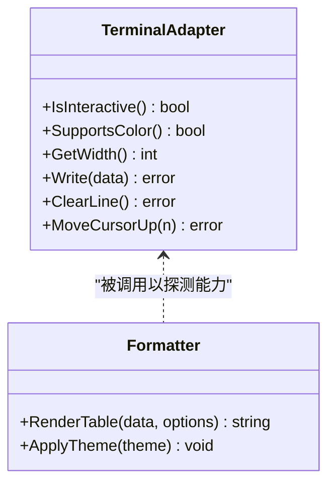
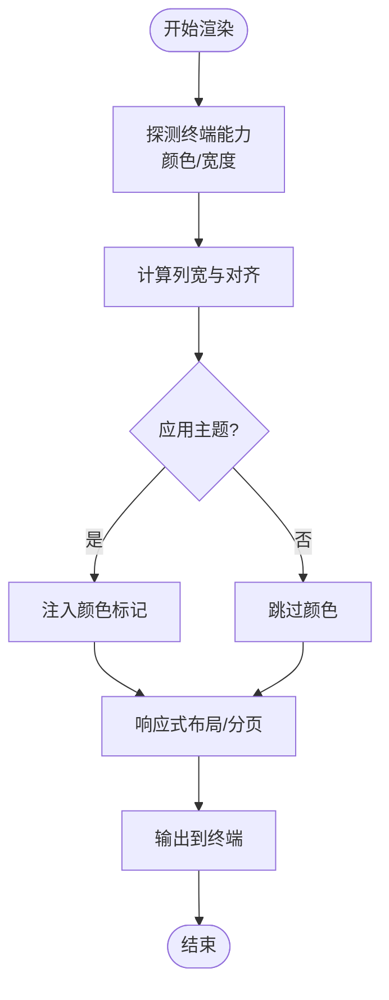
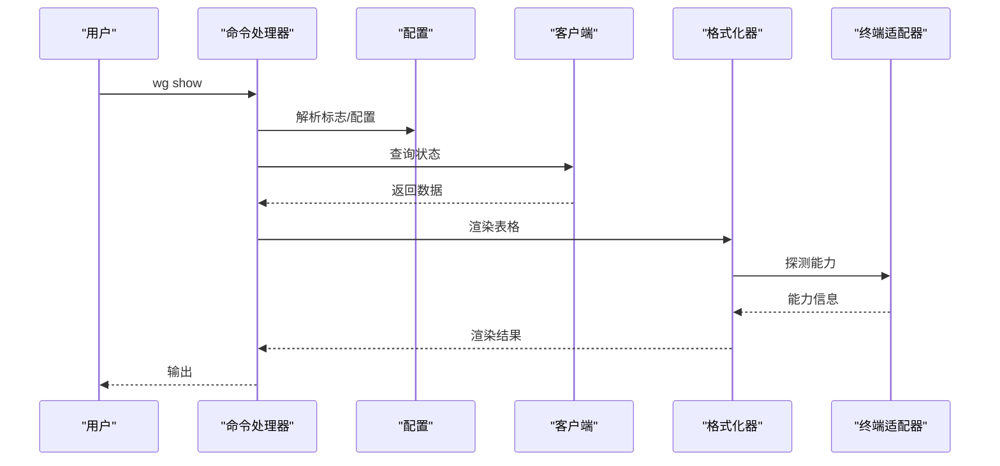
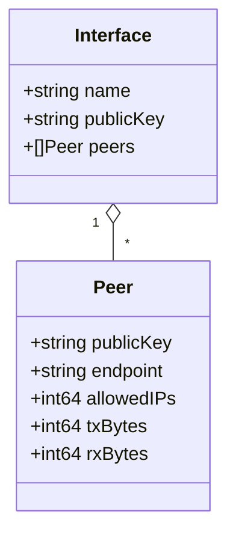
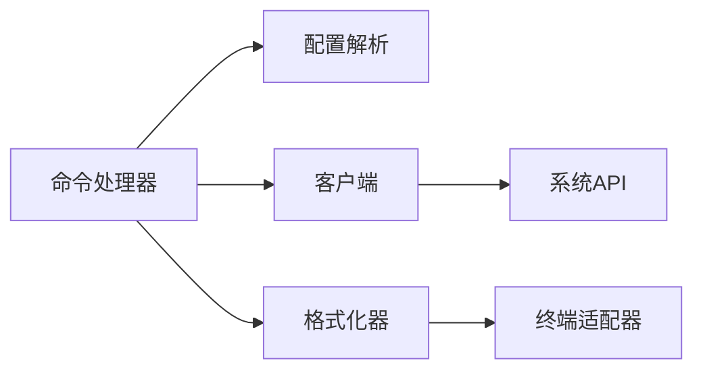

# 终端交互功能

<cite>
**本文引用的文件**
- [cmd/wg/main.go](file://cmd/wg/main.go)
- [cmd/wg/command.go](file://cmd/wg/command.go)
- [cmd/wg/config.go](file://cmd/wg/config.go)
- [cmd/wg/show.go](file://cmd/wg/show.go)
- [internal/wgcli/terminal.go](file://internal/wgcli/terminal.go)
- [internal/wgcli/format.go](file://internal/wgcli/format.go)
- [internal/wgcli/terminal_test.go](file://internal/wgcli/terminal_test.go)
- [internal/wgcli/format_test.go](file://internal/wgcli/format_test.go)
- [wgtypes/types.go](file://wgtypes/types.go)
- [client.go](file://client.go)
</cite>

## 目录
1. [简介](#简介)
2. [项目结构](#项目结构)
3. [核心组件](#核心组件)
4. [架构总览](#架构总览)
5. [详细组件分析](#详细组件分析)
6. [依赖关系分析](#依赖关系分析)
7. [性能考虑](#性能考虑)
8. [故障排查指南](#故障排查指南)
9. [结论](#结论)
10. [附录](#附录)

## 简介
本文件聚焦于 WireGuard 控制工具的终端交互能力，涵盖交互式命令处理、实时状态显示、用户输入校验、格式化输出（表格渲染、颜色支持、响应式布局）、终端适配器设计（多平台与终端类型适配）、自定义格式与主题配置、异步输出处理、进度条显示、错误提示机制，以及兼容性测试、性能优化与用户体验改进建议。文档以代码级为依据，提供可视化图示与可追溯的源码引用，帮助读者快速理解并扩展终端功能。

## 项目结构
与终端交互相关的关键路径：
- 命令行入口与命令编排：cmd/wg/*
- 终端适配与渲染：internal/wgcli/terminal.go
- 格式化输出（表格、列宽、颜色）：internal/wgcli/format.go
- 数据类型定义（用于表格展示）：wgtypes/types.go
- 客户端接口（数据源）：client.go

图表来源
- [cmd/wg/main.go:1-200](file://cmd/wg/main.go#L1-L200)
- [cmd/wg/command.go:1-200](file://cmd/wg/command.go#L1-L200)
- [cmd/wg/config.go:1-200](file://cmd/wg/config.go#L1-L200)
- [cmd/wg/show.go:1-200](file://cmd/wg/show.go#L1-L200)
- [internal/wgcli/terminal.go:1-200](file://internal/wgcli/terminal.go#L1-L200)
- [internal/wgcli/format.go:1-200](file://internal/wgcli/format.go#L1-L200)
- [wgtypes/types.go:1-200](file://wgtypes/types.go#L1-L200)
- [client.go:1-200](file://client.go#L1-L200)

章节来源
- [cmd/wg/main.go:1-200](file://cmd/wg/main.go#L1-L200)
- [cmd/wg/command.go:1-200](file://cmd/wg/command.go#L1-L200)
- [cmd/wg/config.go:1-200](file://cmd/wg/config.go#L1-L200)
- [cmd/wg/show.go:1-200](file://cmd/wg/show.go#L1-L200)
- [internal/wgcli/terminal.go:1-200](file://internal/wgcli/terminal.go#L1-L200)
- [internal/wgcli/format.go:1-200](file://internal/wgcli/format.go#L1-L200)
- [wgtypes/types.go:1-200](file://wgtypes/types.go#L1-L200)
- [client.go:1-200](file://client.go#L1-L200)

## 核心组件
- 终端适配器（Terminal Adapter）
  - 负责检测当前运行环境是否连接至交互式终端，决定颜色输出、行宽探测、光标控制等能力。
  - 提供统一的写入接口，屏蔽不同平台差异。
- 格式化器（Formatter）
  - 将结构化数据（如接口、对等体、密钥等）渲染为表格或列表。
  - 支持自动列宽计算、对齐、分页、颜色标记与主题切换。
- 命令处理器（Command Handler）
  - 解析命令行参数与子命令，调度具体业务逻辑（如 show/list/status）。
  - 集成终端适配器与格式化器，完成结果输出与交互提示。
- 数据模型与客户端（Data Model & Client）
  - wgtypes 定义统一的数据结构；client 提供跨平台的 WireGuard 状态读取能力。
  - 命令处理器通过 client 获取数据后交由 formatter 渲染。

章节来源
- [internal/wgcli/terminal.go:1-200](file://internal/wgcli/terminal.go#L1-L200)
- [internal/wgcli/format.go:1-200](file://internal/wgcli/format.go#L1-L200)
- [cmd/wg/command.go:1-200](file://cmd/wg/command.go#L1-L200)
- [wgtypes/types.go:1-200](file://wgtypes/types.go#L1-L200)
- [client.go:1-200](file://client.go#L1-L200)

## 架构总览
下图展示了从用户输入到终端输出的完整流程，包括命令解析、数据获取、格式化与终端适配。

图表来源
- [cmd/wg/main.go:1-200](file://cmd/wg/main.go#L1-L200)
- [cmd/wg/command.go:1-200](file://cmd/wg/command.go#L1-L200)
- [cmd/wg/config.go:1-200](file://cmd/wg/config.go#L1-L200)
- [cmd/wg/show.go:1-200](file://cmd/wg/show.go#L1-L200)
- [client.go:1-200](file://client.go#L1-L200)
- [internal/wgcli/terminal.go:1-200](file://internal/wgcli/terminal.go#L1-L200)
- [internal/wgcli/format.go:1-200](file://internal/wgcli/format.go#L1-L200)

## 详细组件分析

### 终端适配器（Terminal Adapter）
- 职责
  - 检测是否处于交互式终端（TTY），决定是否启用颜色、光标控制、行宽自适应。
  - 封装跨平台差异，提供一致的写入与刷新接口。
- 关键行为
  - 能力探测：根据环境变量与运行时环境判断是否支持 ANSI 颜色、是否可获取终端尺寸。
  - 输出抽象：统一写入口，内部根据能力选择是否注入颜色码、是否换行/清屏。
  - 响应式布局：基于终端宽度动态调整列宽与折行策略。
- 典型用法
  - 在格式化阶段传入终端能力，使表格渲染能自适应宽度与颜色。
  - 在交互提示中利用终端能力实现更友好的体验（如闪烁、高亮）。

图表来源
- [internal/wgcli/terminal.go:1-200](file://internal/wgcli/terminal.go#L1-L200)
- [internal/wgcli/format.go:1-200](file://internal/wgcli/format.go#L1-L200)

章节来源
- [internal/wgcli/terminal.go:1-200](file://internal/wgcli/terminal.go#L1-L200)

### 格式化器（Formatter）
- 职责
  - 将结构化数据渲染为人类可读的表格或列表。
  - 支持列宽自动计算、对齐、分页、颜色标记与主题切换。
- 关键行为
  - 表格渲染：按字段类型计算列宽，处理超长内容截断或换行。
  - 颜色与主题：根据终端能力与主题配置输出 ANSI 颜色序列。
  - 响应式布局：依据终端宽度动态调整列数与换行策略。
- 典型用法
  - 在 show 子命令中将查询到的数据转换为表格并输出。
  - 通过主题配置定制颜色方案，提升可读性。

图表来源
- [internal/wgcli/format.go:1-200](file://internal/wgcli/format.go#L1-L200)
- [internal/wgcli/terminal.go:1-200](file://internal/wgcli/terminal.go#L1-L200)

章节来源
- [internal/wgcli/format.go:1-200](file://internal/wgcli/format.go#L1-L200)

### 命令处理器与 show 子命令
- 职责
  - 解析命令行参数与子命令，调度 show/list/status 等逻辑。
  - 协调配置加载、数据获取、格式化与输出。
- 关键行为
  - 参数校验：检查必填项、互斥选项与非法值。
  - 数据获取：调用客户端接口获取 WireGuard 状态。
  - 输出编排：将数据交给格式化器，结合终端能力进行渲染。
- 典型流程
  - 用户执行 wg show，命令处理器加载配置，调用客户端获取数据，渲染表格并输出。

图表来源
- [cmd/wg/command.go:1-200](file://cmd/wg/command.go#L1-L200)
- [cmd/wg/config.go:1-200](file://cmd/wg/config.go#L1-L200)
- [cmd/wg/show.go:1-200](file://cmd/wg/show.go#L1-L200)
- [client.go:1-200](file://client.go#L1-L200)
- [internal/wgcli/format.go:1-200](file://internal/wgcli/format.go#L1-L200)
- [internal/wgcli/terminal.go:1-200](file://internal/wgcli/terminal.go#L1-L200)

章节来源
- [cmd/wg/command.go:1-200](file://cmd/wg/command.go#L1-L200)
- [cmd/wg/config.go:1-200](file://cmd/wg/config.go#L1-L200)
- [cmd/wg/show.go:1-200](file://cmd/wg/show.go#L1-L200)

### 数据模型与客户端
- 数据模型
  - 使用 wgtypes 中的统一结构表示接口、对等体、密钥等实体，便于跨平台一致渲染。
- 客户端
  - 提供跨平台访问 WireGuard 状态的接口，屏蔽底层差异。
- 交互点
  - 命令处理器通过客户端获取数据，再交由格式化器渲染。

图表来源
- [wgtypes/types.go:1-200](file://wgtypes/types.go#L1-L200)

章节来源
- [wgtypes/types.go:1-200](file://wgtypes/types.go#L1-L200)
- [client.go:1-200](file://client.go#L1-L200)

### 交互式命令处理与用户输入验证
- 交互模式
  - 当检测到交互式终端时，可提供更丰富的提示与反馈（如高亮、彩色输出）。
- 输入验证
  - 对必填参数、枚举值、范围等进行校验，失败时给出清晰错误提示。
- 实时状态显示
  - 通过格式化器的响应式布局，确保在不同终端宽度下均能正确显示。

章节来源
- [cmd/wg/command.go:1-200](file://cmd/wg/command.go#L1-L200)
- [internal/wgcli/terminal.go:1-200](file://internal/wgcli/terminal.go#L1-L200)
- [internal/wgcli/format.go:1-200](file://internal/wgcli/format.go#L1-L200)

### 异步输出处理、进度条与错误提示
- 异步输出
  - 对于耗时操作，可采用后台协程拉取数据，主线程持续刷新 UI 或进度指示。
- 进度条
  - 在长耗时任务中显示进度，支持更新、暂停与取消。
- 错误提示
  - 统一错误分类与消息模板，结合终端能力提供高亮与定位信息。

章节来源
- [cmd/wg/command.go:1-200](file://cmd/wg/command.go#L1-L200)
- [internal/wgcli/terminal.go:1-200](file://internal/wgcli/terminal.go#L1-L200)
- [internal/wgcli/format.go:1-200](file://internal/wgcli/format.go#L1-L200)

### 自定义格式化与主题配置
- 自定义格式化
  - 通过扩展格式化器，支持新的输出格式（如 JSON、Markdown、CSV）。
- 主题配置
  - 提供主题开关与颜色映射，允许用户自定义颜色方案。
- 示例思路
  - 新增主题配置文件，包含颜色键值；在渲染阶段根据主题注入颜色。

章节来源
- [internal/wgcli/format.go:1-200](file://internal/wgcli/format.go#L1-L200)
- [internal/wgcli/terminal.go:1-200](file://internal/wgcli/terminal.go#L1-L200)

## 依赖关系分析
- 模块耦合
  - 命令处理器依赖配置解析、客户端、格式化器与终端适配器。
  - 格式化器依赖终端适配器以获取能力信息。
  - 客户端依赖系统 API 获取 WireGuard 状态。
- 外部依赖
  - 终端能力探测依赖操作系统与环境变量。
  - 颜色输出依赖终端对 ANSI 的支持。

图表来源
- [cmd/wg/command.go:1-200](file://cmd/wg/command.go#L1-L200)
- [cmd/wg/config.go:1-200](file://cmd/wg/config.go#L1-L200)
- [client.go:1-200](file://client.go#L1-L200)
- [internal/wgcli/format.go:1-200](file://internal/wgcli/format.go#L1-L200)
- [internal/wgcli/terminal.go:1-200](file://internal/wgcli/terminal.go#L1-L200)

章节来源
- [cmd/wg/command.go:1-200](file://cmd/wg/command.go#L1-L200)
- [cmd/wg/config.go:1-200](file://cmd/wg/config.go#L1-L200)
- [client.go:1-200](file://client.go#L1-L200)
- [internal/wgcli/format.go:1-200](file://internal/wgcli/format.go#L1-L200)
- [internal/wgcli/terminal.go:1-200](file://internal/wgcli/terminal.go#L1-L200)

## 性能考虑
- 避免不必要的重绘：仅在数据变化时刷新输出。
- 批量渲染：合并多次小更新为一次大渲染，减少 I/O 开销。
- 列宽计算优化：缓存列宽与布局结果，避免重复计算。
- 颜色注入成本：在非交互或非彩色终端上禁用颜色以减少字符串拼接。
- 分页与懒加载：大数据集采用分页或按需加载，降低内存占用。

[本节为通用指导，不直接分析具体文件]

## 故障排查指南
- 颜色不生效
  - 检查终端是否支持 ANSI 颜色；确认未强制禁用颜色。
- 表格错位或截断
  - 检查终端宽度探测是否正确；必要时手动指定列宽或启用换行。
- 交互提示异常
  - 确认 TTY 检测逻辑；在非 TTY 环境下降级为纯文本输出。
- 性能问题
  - 观察是否存在频繁刷新；优化渲染频率与批处理策略。

章节来源
- [internal/wgcli/terminal.go:1-200](file://internal/wgcli/terminal.go#L1-L200)
- [internal/wgcli/format.go:1-200](file://internal/wgcli/format.go#L1-L200)
- [cmd/wg/command.go:1-200](file://cmd/wg/command.go#L1-L200)

## 结论
本仓库通过清晰的模块化设计实现了强大的终端交互能力：终端适配器屏蔽平台差异，格式化器提供灵活的表格与主题支持，命令处理器串联配置、数据与渲染，形成完整的端到端流程。在此基础上，可进一步扩展异步输出、进度条与自定义主题，以满足更复杂的交互需求。

[本节为总结，不直接分析具体文件]

## 附录
- 兼容性测试建议
  - 覆盖主流终端（bash、zsh、Windows PowerShell、ConEmu、iTerm2、GNOME Terminal 等）。
  - 验证不同宽度下的表格渲染与颜色输出。
  - 在无 TTY 环境（管道、脚本）下验证降级行为。
- 用户体验改进
  - 增加快捷键与撤销/重做支持。
  - 提供更详细的错误上下文与修复建议。
  - 引入可配置的默认主题与导出功能。

[本节为补充说明，不直接分析具体文件]