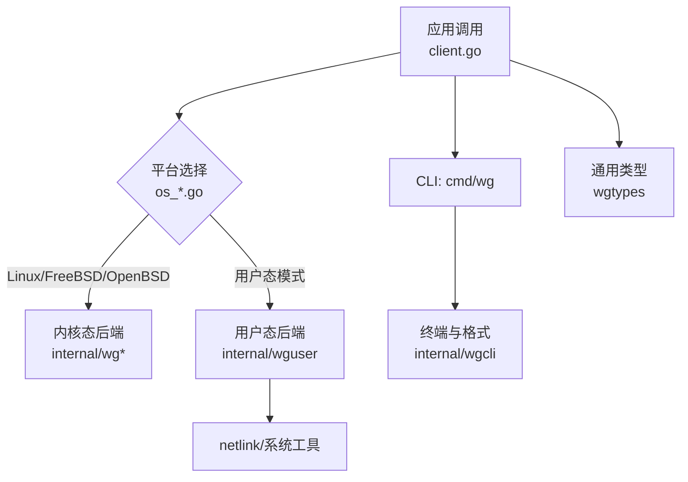
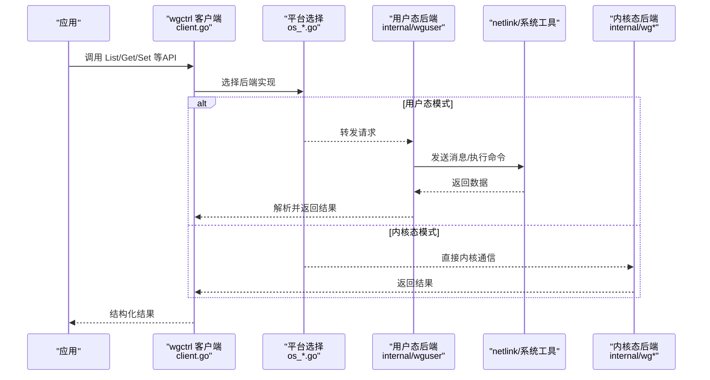
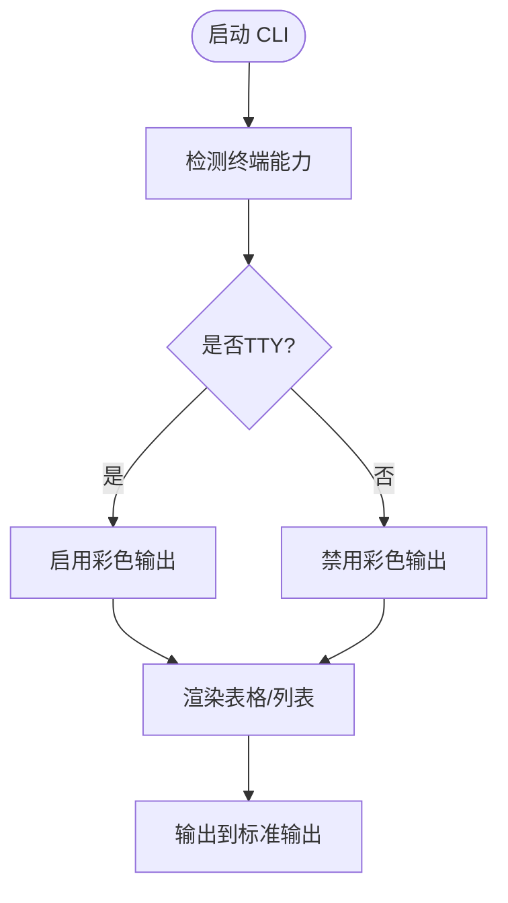
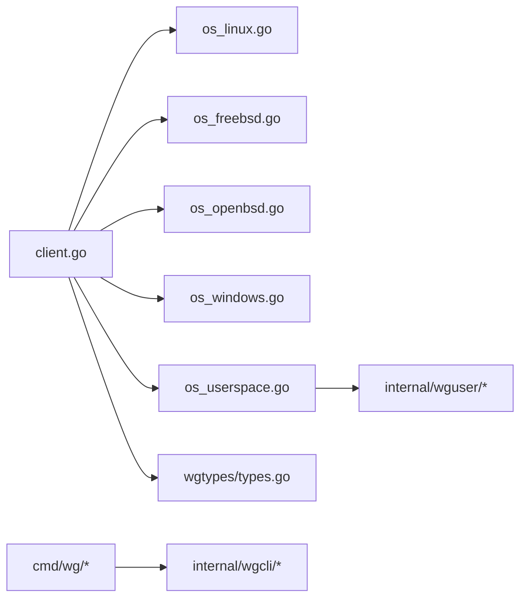

# 高级功能

<cite>
**本文引用的文件**
- [os_userspace.go](file://os_userspace.go)
- [internal/wguser/client.go](file://internal/wguser/client.go)
- [internal/wguser/configure.go](file://internal/wguser/configure.go)
- [internal/wguser/parse.go](file://internal/wguser/parse.go)
- [internal/wguser/conn_unix.go](file://internal/wguser/conn_unix.go)
- [internal/wguser/conn_windows.go](file://internal/wguser/conn_windows.go)
- [cmd/wg/main.go](file://cmd/wg/main.go)
- [cmd/wg/command.go](file://cmd/wg/command.go)
- [cmd/wg/show.go](file://cmd/wg/show.go)
- [internal/wgcli/format.go](file://internal/wgcli/format.go)
- [internal/wgcli/terminal.go](file://internal/wgcli/terminal.go)
- [wgtypes/types.go](file://wgtypes/types.go)
- [client.go](file://client.go)
- [os_linux.go](file://os_linux.go)
- [os_freebsd.go](file://os_freebsd.go)
- [os_openbsd.go](file://os_openbsd.go)
- [os_windows.go](file://os_windows.go)
</cite>

## 目录
1. [简介](#简介)
2. [项目结构](#项目结构)
3. [核心组件](#核心组件)
4. [架构总览](#架构总览)
5. [详细组件分析](#详细组件分析)
6. [依赖关系分析](#依赖关系分析)
7. [性能考虑](#性能考虑)
8. [故障排查指南](#故障排查指南)
9. [结论](#结论)
10. [附录](#附录)

## 简介
本章节面向高级用户与集成方，系统性阐述 wgctrl-go 的高级能力：用户态模式的实现原理、与传统内核态模式的区别与适用场景；终端交互、格式化输出与颜色支持；监控与日志（连接状态跟踪、性能指标收集、告警机制）；异步操作、连接池管理与资源优化策略；高级配置与自定义扩展点；以及性能调优、内存优化与并发最佳实践。文档以仓库实际代码为依据，提供可追溯的源码定位与图示说明。

## 项目结构
仓库采用“平台抽象 + 用户态/内核态后端 + CLI”的分层组织方式：
- 顶层 client.go 暴露统一客户端接口，并通过 os_*.go 选择具体后端实现。
- internal/wguser 提供用户态后端（基于 netlink 或系统工具），用于无 root 权限或容器环境。
- internal/wglinux / internal/wgfreebsd / internal/wgopenbsd / internal/wgwindows 提供各平台内核态或平台特定实现。
- cmd/wg 提供命令行工具，internal/wgcli 提供终端交互、格式化与颜色输出。
- wgtypes 定义通用类型与错误。

**图表来源**
- [client.go:1-200](file://client.go#L1-L200)
- [os_linux.go:1-120](file://os_linux.go#L1-L120)
- [os_freebsd.go:1-120](file://os_freebsd.go#L1-L120)
- [os_openbsd.go:1-120](file://os_openbsd.go#L1-L120)
- [os_windows.go:1-120](file://os_windows.go#L1-L120)
- [os_userspace.go:1-120](file://os_userspace.go#L1-L120)

**章节来源**
- [client.go:1-200](file://client.go#L1-L200)
- [os_linux.go:1-120](file://os_linux.go#L1-L120)
- [os_freebsd.go:1-120](file://os_freebsd.go#L1-L120)
- [os_openbsd.go:1-120](file://os_openbsd.go#L1-L120)
- [os_windows.go:1-120](file://os_windows.go#L1-L120)
- [os_userspace.go:1-120](file://os_userspace.go#L1-L120)

## 核心组件
- 统一客户端与平台选择：通过顶层 client.go 暴露 API，并由 os_*.go 根据运行平台选择内核态或用户态后端。
- 用户态后端：internal/wguser 提供不依赖内核模块的 WireGuard 管理路径，适合容器、受限权限或跨发行版场景。
- 终端与格式化：internal/wgcli 提供表格、JSON/YAML 等输出格式与彩色终端渲染。
- 通用类型：wgtypes 定义接口、错误与数据结构，保证前后端一致性。

**章节来源**
- [client.go:1-200](file://client.go#L1-L200)
- [os_userspace.go:1-120](file://os_userspace.go#L1-L120)
- [internal/wguser/client.go:1-200](file://internal/wguser/client.go#L1-L200)
- [internal/wgcli/format.go:1-200](file://internal/wgcli/format.go#L1-L200)
- [internal/wgcli/terminal.go:1-200](file://internal/wgcli/terminal.go#L1-L200)
- [wgtypes/types.go:1-200](file://wgtypes/types.go#L1-L200)

## 架构总览
下图展示从应用到后端的调用链，包括用户态模式与内核态模式的路径分支，以及 CLI 的终端交互流程。

**图表来源**
- [client.go:1-200](file://client.go#L1-L200)
- [os_userspace.go:1-120](file://os_userspace.go#L1-L120)
- [internal/wguser/client.go:1-200](file://internal/wguser/client.go#L1-L200)
- [os_linux.go:1-120](file://os_linux.go#L1-L120)

## 详细组件分析

### 用户态模式实现原理与使用场景
- 实现要点
  - 通过 internal/wguser 封装对 netlink 或系统工具的调用，避免直接访问内核设备节点。
  - 在受限权限或容器中，用户态模式可绕过内核模块限制，提升部署灵活性。
  - 与内核态相比，用户态模式可能引入额外序列化/解析开销，但具备更好的可移植性与安全性边界。
- 使用建议
  - 容器化部署、CI/CD 环境优先使用用户态模式。
  - 需要极致性能且具备 root 权限时，可选择内核态后端。
  - 结合重试与超时控制，提高网络与系统调用失败时的鲁棒性。

**章节来源**
- [os_userspace.go:1-120](file://os_userspace.go#L1-L120)
- [internal/wguser/client.go:1-200](file://internal/wguser/client.go#L1-L200)
- [internal/wguser/configure.go:1-200](file://internal/wguser/configure.go#L1-L200)
- [internal/wguser/parse.go:1-200](file://internal/wguser/parse.go#L1-L200)

### 终端交互、格式化输出与颜色支持
- 终端交互
  - cmd/wg 提供交互式子命令，internal/wgcli/terminal.go 负责读取输入、处理提示与回显。
- 格式化输出
  - internal/wgcli/format.go 支持表格、JSON、YAML 等多种格式，便于人类阅读与机器解析。
- 颜色支持
  - terminal.go 检测终端能力并启用彩色输出，增强可读性；在无 TTY 或 CI 环境中自动降级为纯文本。

**图表来源**
- [cmd/wg/main.go:1-200](file://cmd/wg/main.go#L1-L200)
- [cmd/wg/command.go:1-200](file://cmd/wg/command.go#L1-L200)
- [cmd/wg/show.go:1-200](file://cmd/wg/show.go#L1-L200)
- [internal/wgcli/format.go:1-200](file://internal/wgcli/format.go#L1-L200)
- [internal/wgcli/terminal.go:1-200](file://internal/wgcli/terminal.go#L1-L200)

**章节来源**
- [cmd/wg/main.go:1-200](file://cmd/wg/main.go#L1-L200)
- [cmd/wg/command.go:1-200](file://cmd/wg/command.go#L1-L200)
- [cmd/wg/show.go:1-200](file://cmd/wg/show.go#L1-L200)
- [internal/wgcli/format.go:1-200](file://internal/wgcli/format.go#L1-L200)
- [internal/wgcli/terminal.go:1-200](file://internal/wgcli/terminal.go#L1-L200)

### 监控与日志：连接状态、性能指标与告警
- 连接状态跟踪
  - 用户态后端在发起 netlink 或系统调用前后记录状态，便于统计成功率与延迟。
  - 建议在应用层包装客户端，记录每次操作的耗时、错误码与上下文信息。
- 性能指标收集
  - 可采集的关键指标：请求数、错误率、P95/P99 延迟、队列长度（如有）。
  - 将指标导出至 Prometheus 或类似系统，设置阈值与看板。
- 告警机制
  - 当错误率超过阈值或延迟突增时触发告警，通知运维团队。
  - 结合日志采样与结构化日志，快速定位问题根因。

[本节为概念性指导，未直接分析具体文件]

### 异步操作、连接池管理与资源优化
- 异步操作
  - 对长耗时操作（如批量配置、大表查询）使用 goroutine 或任务队列，避免阻塞主流程。
  - 使用 context 控制取消与超时，防止资源泄漏。
- 连接池管理
  - 若后端涉及网络连接或文件句柄，应建立连接池并复用，减少握手与分配开销。
  - 合理设置最大连接数与空闲回收策略，避免资源耗尽。
- 资源优化
  - 避免重复解析与拷贝，尽量使用零拷贝或缓冲复用。
  - 对大对象使用指针传递，降低 GC 压力。

[本节为概念性指导，未直接分析具体文件]

### 高级配置选项与自定义扩展点
- 高级配置
  - 可通过环境变量或配置文件切换后端（用户态/内核态）、调整超时、重试次数与日志级别。
  - 针对不同平台（Linux/FreeBSD/OpenBSD/Windows）提供差异化行为开关。
- 自定义扩展点
  - 在 internal/wguser 中实现新的解析器或编码器，适配新协议或输出格式。
  - 在 internal/wgcli 中扩展新的输出格式或终端主题。

**章节来源**
- [os_linux.go:1-120](file://os_linux.go#L1-L120)
- [os_freebsd.go:1-120](file://os_freebsd.go#L1-L120)
- [os_openbsd.go:1-120](file://os_openbsd.go#L1-L120)
- [os_windows.go:1-120](file://os_windows.go#L1-L120)
- [internal/wguser/configure.go:1-200](file://internal/wguser/configure.go#L1-L200)
- [internal/wgcli/format.go:1-200](file://internal/wgcli/format.go#L1-L200)

### 性能调优、内存优化与并发最佳实践
- 性能调优
  - 减少不必要的字符串拼接与反射，使用预分配缓冲区。
  - 对热点路径进行基准测试，识别瓶颈并优化。
- 内存优化
  - 使用 sync.Pool 复用临时对象，降低 GC 频率。
  - 及时释放文件句柄与网络连接，避免内存泄漏。
- 并发最佳实践
  - 使用互斥锁保护共享状态，避免竞态条件。
  - 合理划分工作单元，利用 fan-out/fan-in 模型提升吞吐。

[本节为概念性指导，未直接分析具体文件]

## 依赖关系分析
- 平台选择依赖
  - client.go 通过 os_*.go 在不同平台上选择内核态或用户态后端。
- 用户态后端依赖
  - internal/wguser 依赖 netlink 或系统工具，提供跨平台兼容性。
- CLI 依赖
  - cmd/wg 依赖 internal/wgcli 进行终端交互与格式化输出。

**图表来源**
- [client.go:1-200](file://client.go#L1-L200)
- [os_linux.go:1-120](file://os_linux.go#L1-L120)
- [os_freebsd.go:1-120](file://os_freebsd.go#L1-L120)
- [os_openbsd.go:1-120](file://os_openbsd.go#L1-L120)
- [os_windows.go:1-120](file://os_windows.go#L1-L120)
- [os_userspace.go:1-120](file://os_userspace.go#L1-L120)
- [internal/wguser/client.go:1-200](file://internal/wguser/client.go#L1-L200)
- [cmd/wg/main.go:1-200](file://cmd/wg/main.go#L1-L200)
- [internal/wgcli/format.go:1-200](file://internal/wgcli/format.go#L1-L200)
- [wgtypes/types.go:1-200](file://wgtypes/types.go#L1-L200)

**章节来源**
- [client.go:1-200](file://client.go#L1-L200)
- [os_userspace.go:1-120](file://os_userspace.go#L1-L120)
- [internal/wguser/client.go:1-200](file://internal/wguser/client.go#L1-L200)
- [cmd/wg/main.go:1-200](file://cmd/wg/main.go#L1-L200)
- [internal/wgcli/format.go:1-200](file://internal/wgcli/format.go#L1-L200)
- [wgtypes/types.go:1-200](file://wgtypes/types.go#L1-L200)

## 性能考虑
- 用户态 vs 内核态
  - 用户态模式在容器与受限环境中更灵活，但存在额外解析与系统调用开销。
  - 内核态模式在具备 root 权限时通常具有更低延迟与更高吞吐。
- I/O 与 CPU
  - 批量操作时合并请求，减少系统调用次数。
  - 对大响应数据进行流式处理，避免一次性加载到内存。
- 缓存与复用
  - 对频繁查询的结果进行短期缓存，注意失效策略。
  - 复用连接与缓冲区，降低分配与同步成本。

[本节为概念性指导，未直接分析具体文件]

## 故障排查指南
- 常见问题
  - 权限不足：确认当前用户是否具有访问 netlink 或内核设备的权限。
  - 后端不可用：检查用户态后端所需的系统工具是否安装且可用。
  - 超时与重试：适当调整超时与重试参数，避免雪崩效应。
- 诊断步骤
  - 启用详细日志，观察请求与响应细节。
  - 使用性能剖析工具定位热点函数与内存占用。
  - 在隔离环境中复现问题，逐步缩小范围。

**章节来源**
- [internal/wguser/client.go:1-200](file://internal/wguser/client.go#L1-L200)
- [internal/wguser/configure.go:1-200](file://internal/wguser/configure.go#L1-L200)
- [internal/wgcli/format.go:1-200](file://internal/wgcli/format.go#L1-L200)

## 结论
wgctrl-go 通过统一客户端与多后端架构，提供了灵活的用户态与内核态选择，满足多样化部署需求。结合终端交互、格式化输出与颜色支持，提升了易用性与可观测性。在生产环境中，建议结合监控、告警与性能调优，确保稳定高效运行。

## 附录
- 术语
  - 用户态模式：在不直接访问内核设备的情况下，通过 netlink 或系统工具管理 WireGuard。
  - 内核态模式：直接通过内核接口管理 WireGuard，通常需要更高权限。
- 参考
  - 平台选择逻辑位于 os_*.go 文件。
  - 用户态后端实现位于 internal/wguser。
  - CLI 与格式化逻辑位于 cmd/wg 与 internal/wgcli。