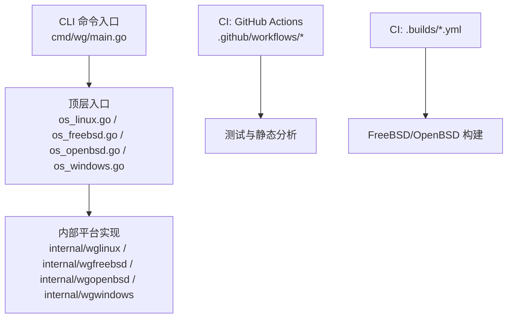
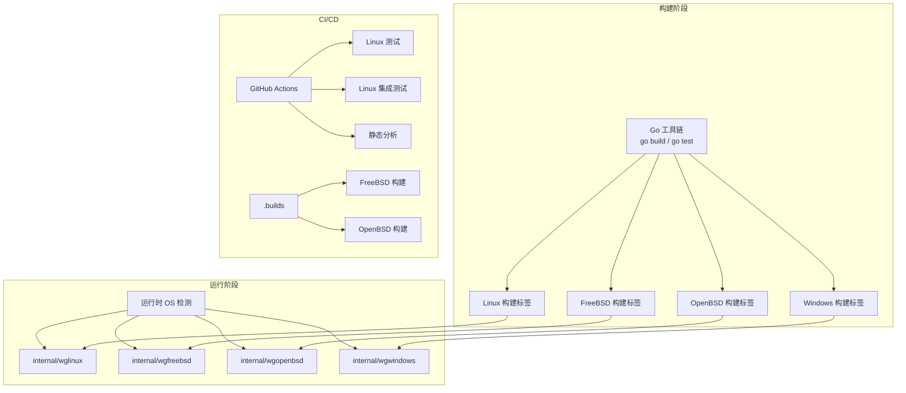
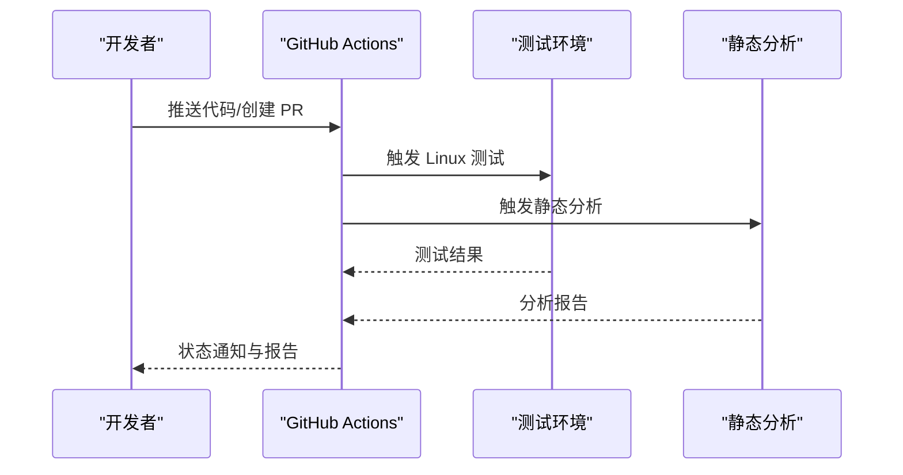
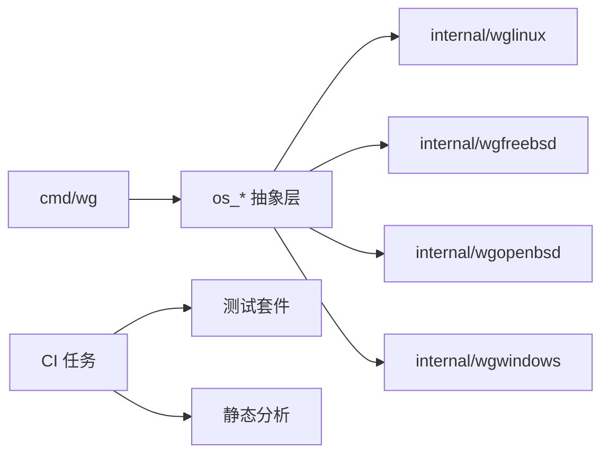

# 构建系统

<cite>
**本文引用的文件**
- [README.md](file://README.md)
- [.cibuild.sh](file://cibuild.sh)
- [.builds/freebsd.yml](file://.builds/freebsd.yml)
- [.builds/openbsd.yml](file://.builds/openbsd.yml)
- [.github/workflows/linux-integration-test.yml](file://.github/workflows/linux-integration-test.yml)
- [.github/workflows/linux-test.yml](file://.github/workflows/linux-test.yml)
- [.github/workflows/static-analysis.yml](file://.github/workflows/static-analysis.yml)
- [go.mod.base](file://go.mod.base)
- [os_linux.go](file://os_linux.go)
- [os_freebsd.go](file://os_freebsd.go)
- [os_openbsd.go](file://os_openbsd.go)
- [os_windows.go](file://os_windows.go)
- [os_userspace.go](file://os_userspace.go)
- [cmd/wg/main.go](file://cmd/wg/main.go)
- [cmd/wg/config.go](file://cmd/wg/config.go)
- [internal/wglinux/client_linux.go](file://internal/wglinux/client_linux.go)
- [internal/wgfreebsd/client_freebsd.go](file://internal/wgfreebsd/client_freebsd.go)
- [internal/wgopenbsd/client_openbsd.go](file://internal/wgopenbsd/client_openbsd.go)
- [internal/wgwindows/client_windows.go](file://internal/wgwindows/client_windows.go)
</cite>

## 目录
1. [简介](#简介)
2. [项目结构](#项目结构)
3. [核心组件](#核心组件)
4. [架构总览](#架构总览)
5. [详细组件分析](#详细组件分析)
6. [依赖关系分析](#依赖关系分析)
7. [性能考虑](#性能考虑)
8. [故障排查指南](#故障排查指南)
9. [结论](#结论)
10. [附录](#附录)

## 简介
本文件面向构建与发布流程，覆盖以下主题：
- 构建流程与编译选项（Go 标准工具链、交叉编译、平台特定标签）
- 平台特定的构建配置（Linux、FreeBSD、OpenBSD、Windows）
- CI/CD 管道配置（自动化测试、静态分析、集成测试、发布流程）
- 生成脚本使用方法与自定义扩展点
- 为新平台添加构建支持的步骤
- 构建优化技巧与常见问题解决方案

本项目为 wgctrl-go，提供跨平台的 WireGuard 客户端能力与命令行工具。构建系统基于 Go 模块与平台构建标签，结合 GitHub Actions 与 Buildah/Buildkite 风格的 .builds 配置文件实现多平台持续集成。

## 项目结构
从构建视角看，项目采用“按平台拆分”的目录组织方式：
- 顶层 os_*.go 文件通过构建标签将不同平台的实现接入统一接口
- internal 下按平台划分子包（wglinux、wgfreebsd、wgopenbsd、wgwindows），封装平台相关逻辑
- cmd 提供可执行入口（wg CLI、wgctrl 库示例）
- .github/workflows 定义 GitHub Actions 流水线
- .builds 定义其他 CI 环境的构建任务
- go.mod.base 作为基础依赖模板或基线

图表来源
- [os_linux.go](file://os_linux.go)
- [os_freebsd.go](file://os_freebsd.go)
- [os_openbsd.go](file://os_openbsd.go)
- [os_windows.go](file://os_windows.go)
- [internal/wglinux/client_linux.go](file://internal/wglinux/client_linux.go)
- [internal/wgfreebsd/client_freebsd.go](file://internal/wgfreebsd/client_freebsd.go)
- [internal/wgopenbsd/client_openbsd.go](file://internal/wgopenbsd/client_openbsd.go)
- [internal/wgwindows/client_windows.go](file://internal/wgwindows/client_windows.go)
- [cmd/wg/main.go](file://cmd/wg/main.go)
- [.github/workflows/linux-test.yml](file://.github/workflows/linux-test.yml)
- [.github/workflows/linux-integration-test.yml](file://.github/workflows/linux-integration-test.yml)
- [.github/workflows/static-analysis.yml](file://.github/workflows/static-analysis.yml)
- [.builds/freebsd.yml](file://.builds/freebsd.yml)
- [.builds/openbsd.yml](file://.builds/openbsd.yml)

章节来源
- [README.md](file://README.md)

## 核心组件
- 平台抽象层：通过 os_*.go 文件暴露统一的运行时接口，由构建标签选择具体实现
- 平台实现层：internal 下的各平台子包负责与内核/系统调用交互
- CLI 层：cmd/wg 提供用户界面，读取配置并调用底层能力
- 依赖基线：go.mod.base 用于锁定或对齐依赖版本

关键职责
- 构建时根据 GOOS/GOARCH 选择对应实现
- 运行时根据操作系统加载相应功能
- CI 中并行运行单元测试、集成测试与静态分析

章节来源
- [os_linux.go](file://os_linux.go)
- [os_freebsd.go](file://os_freebsd.go)
- [os_openbsd.go](file://os_openbsd.go)
- [os_windows.go](file://os_windows.go)
- [cmd/wg/main.go](file://cmd/wg/main.go)
- [go.mod.base](file://go.mod.base)

## 架构总览
下图展示构建系统与运行时的整体关系：构建阶段通过 Go 工具链和平台标签选择代码；运行阶段根据实际 OS 加载对应实现；CI 在多个环境中执行测试与分析。

图表来源
- [os_linux.go](file://os_linux.go)
- [os_freebsd.go](file://os_freebsd.go)
- [os_openbsd.go](file://os_openbsd.go)
- [os_windows.go](file://os_windows.go)
- [internal/wglinux/client_linux.go](file://internal/wglinux/client_linux.go)
- [internal/wgfreebsd/client_freebsd.go](file://internal/wgfreebsd/client_freebsd.go)
- [internal/wgopenbsd/client_openbsd.go](file://internal/wgopenbsd/client_openbsd.go)
- [internal/wgwindows/client_windows.go](file://internal/wgwindows/client_windows.go)
- [.github/workflows/linux-test.yml](file://.github/workflows/linux-test.yml)
- [.github/workflows/linux-integration-test.yml](file://.github/workflows/linux-integration-test.yml)
- [.github/workflows/static-analysis.yml](file://.github/workflows/static-analysis.yml)
- [.builds/freebsd.yml](file://.builds/freebsd.yml)
- [.builds/openbsd.yml](file://.builds/openbsd.yml)

## 详细组件分析

### 构建流程与编译选项
- 使用 Go 标准工具链进行构建与测试
- 通过构建标签区分平台实现（例如 Linux、FreeBSD、OpenBSD、Windows）
- 支持交叉编译以生成多平台二进制
- 使用 go.mod 管理依赖，go.mod.base 可作为依赖基线或模板

典型操作
- 本地构建：针对当前平台构建 CLI 或库
- 交叉构建：指定目标操作系统与架构生成二进制
- 运行测试：执行单元测试与集成测试

章节来源
- [os_linux.go](file://os_linux.go)
- [os_freebsd.go](file://os_freebsd.go)
- [os_openbsd.go](file://os_openbsd.go)
- [os_windows.go](file://os_windows.go)
- [go.mod.base](file://go.mod.base)

### 平台特定构建配置
- Linux：通过 os_linux.go 与 internal/wglinux 提供内核交互能力
- FreeBSD：通过 os_freebsd.go 与 internal/wgfreebsd 适配 FreeBSD 环境
- OpenBSD：通过 os_openbsd.go 与 internal/wgopenbsd 适配 OpenBSD 环境
- Windows：通过 os_windows.go 与 internal/wgwindows 适配 Windows 环境

这些文件共同构成“同一接口、多实现”的平台抽象，构建时由 Go 工具链依据目标平台选择对应实现。

章节来源
- [os_linux.go](file://os_linux.go)
- [os_freebsd.go](file://os_freebsd.go)
- [os_openbsd.go](file://os_openbsd.go)
- [os_windows.go](file://os_windows.go)
- [internal/wglinux/client_linux.go](file://internal/wglinux/client_linux.go)
- [internal/wgfreebsd/client_freebsd.go](file://internal/wgfreebsd/client_freebsd.go)
- [internal/wgopenbsd/client_openbsd.go](file://internal/wgopenbsd/client_openbsd.go)
- [internal/wgwindows/client_windows.go](file://internal/wgwindows/client_windows.go)

### CLI 构建与配置
- 入口位于 cmd/wg/main.go，负责解析参数与调度命令
- 配置解析位于 cmd/wg/config.go，负责读取与校验配置
- 构建产物为可执行的 CLI 程序，供用户直接调用

章节来源
- [cmd/wg/main.go](file://cmd/wg/main.go)
- [cmd/wg/config.go](file://cmd/wg/config.go)

### CI/CD 管道配置
- GitHub Actions
  - Linux 单元测试：在 Linux 环境下执行测试套件
  - Linux 集成测试：在具备必要系统能力的 Linux 环境中执行端到端验证
  - 静态分析：对代码进行质量检查（如 linter、格式检查等）
- .builds
  - FreeBSD 构建：在 FreeBSD 环境中执行构建与测试
  - OpenBSD 构建：在 OpenBSD 环境中执行构建与测试

图表来源
- [.github/workflows/linux-test.yml](file://.github/workflows/linux-test.yml)
- [.github/workflows/linux-integration-test.yml](file://.github/workflows/linux-integration-test.yml)
- [.github/workflows/static-analysis.yml](file://.github/workflows/static-analysis.yml)

章节来源
- [.github/workflows/linux-test.yml](file://.github/workflows/linux-test.yml)
- [.github/workflows/linux-integration-test.yml](file://.github/workflows/linux-integration-test.yml)
- [.github/workflows/static-analysis.yml](file://.github/workflows/static-analysis.yml)
- [.builds/freebsd.yml](file://.builds/freebsd.yml)
- [.builds/openbsd.yml](file://.builds/openbsd.yml)

### 生成脚本与自定义扩展点
- 平台内部可能包含生成脚本（例如 defs 生成），用于从系统头文件或规范生成常量与类型定义
- 扩展点包括：
  - 新增平台实现：在 internal 下新增平台子包，并在顶层 os_*.go 中添加对应实现与标签
  - 新增 CI 任务：在 .github/workflows 或 .builds 中添加新任务
  - 调整依赖基线：更新 go.mod.base 以统一依赖版本

章节来源
- [internal/wglinux/client_linux.go](file://internal/wglinux/client_linux.go)
- [internal/wgfreebsd/client_freebsd.go](file://internal/wgfreebsd/client_freebsd.go)
- [internal/wgopenbsd/client_openbsd.go](file://internal/wgopenbsd/client_openbsd.go)
- [internal/wgwindows/client_windows.go](file://internal/wgwindows/client_windows.go)
- [os_linux.go](file://os_linux.go)
- [os_freebsd.go](file://os_freebsd.go)
- [os_openbsd.go](file://os_openbsd.go)
- [os_windows.go](file://os_windows.go)

### 为新平台添加构建支持（步骤）
- 在 internal 下新增平台子包，实现必要的客户端与配置解析逻辑
- 在顶层新增 os_<platform>.go，暴露统一接口并绑定到平台实现
- 如需生成常量/类型，新增生成脚本并在构建前执行
- 在 CI 中添加对应平台的构建与测试任务（GitHub Actions 或 .builds）
- 更新依赖基线（如需要）并确保依赖兼容

章节来源
- [os_linux.go](file://os_linux.go)
- [os_freebsd.go](file://os_freebsd.go)
- [os_openbsd.go](file://os_openbsd.go)
- [os_windows.go](file://os_windows.go)
- [.github/workflows/linux-test.yml](file://.github/workflows/linux-test.yml)
- [.builds/freebsd.yml](file://.builds/freebsd.yml)
- [.builds/openbsd.yml](file://.builds/openbsd.yml)

## 依赖关系分析
- 构建期依赖：Go 工具链、平台 SDK（交叉编译时需要）
- 运行期依赖：各平台系统调用与内核接口（由 internal 平台包封装）
- 测试依赖：测试框架与可能的系统服务（集成测试需要）

图表来源
- [cmd/wg/main.go](file://cmd/wg/main.go)
- [os_linux.go](file://os_linux.go)
- [os_freebsd.go](file://os_freebsd.go)
- [os_openbsd.go](file://os_openbsd.go)
- [os_windows.go](file://os_windows.go)
- [internal/wglinux/client_linux.go](file://internal/wglinux/client_linux.go)
- [internal/wgfreebsd/client_freebsd.go](file://internal/wgfreebsd/client_freebsd.go)
- [internal/wgopenbsd/client_openbsd.go](file://internal/wgopenbsd/client_openbsd.go)
- [internal/wgwindows/client_windows.go](file://internal/wgwindows/client_windows.go)
- [.github/workflows/linux-test.yml](file://.github/workflows/linux-test.yml)
- [.github/workflows/static-analysis.yml](file://.github/workflows/static-analysis.yml)

章节来源
- [go.mod.base](file://go.mod.base)

## 性能考虑
- 使用增量构建：利用 Go 构建缓存减少重复编译时间
- 合理拆分测试：将单元测试与集成测试分离，缩短反馈周期
- 控制依赖体积：仅引入必要依赖，避免不必要的模块膨胀
- 交叉编译优化：仅在必要时启用多架构构建，减少 CI 资源占用
- 并行执行：在 CI 中并行运行多个任务以提升吞吐

[本节提供通用指导，不直接分析具体文件]

## 故障排查指南
- 构建失败（平台不支持或缺少依赖）
  - 检查目标平台是否已实现对应 os_* 与 internal 包
  - 确认交叉编译所需的工具链与 SDK 已安装
- 测试失败（权限或系统能力不足）
  - 集成测试需要系统级能力，确保运行环境具备相应权限与服务
- 静态分析报错
  - 根据分析报告修复代码风格与潜在问题
- 依赖冲突或版本不一致
  - 参考 go.mod.base 对齐依赖版本，必要时更新模块

章节来源
- [.github/workflows/linux-test.yml](file://.github/workflows/linux-test.yml)
- [.github/workflows/linux-integration-test.yml](file://.github/workflows/linux-integration-test.yml)
- [.github/workflows/static-analysis.yml](file://.github/workflows/static-analysis.yml)

## 结论
本项目的构建系统以 Go 标准工具链为核心，通过平台构建标签与分层实现实现跨平台支持；CI/CD 覆盖单元测试、集成测试与静态分析，并在 FreeBSD/OpenBSD 上执行构建验证。遵循本文档的步骤与最佳实践，可高效地为新平台添加构建支持并持续改进构建质量与性能。

## 附录
- 常用构建命令（概念性说明）
  - 本地构建：在当前平台构建 CLI 或库
  - 交叉构建：为目标操作系统与架构生成二进制
  - 运行测试：执行单元测试与集成测试
- 建议的扩展清单
  - 新增平台：实现 os_* 与 internal 平台包
  - 新增 CI：在 .github/workflows 或 .builds 中添加任务
  - 依赖管理：维护 go.mod.base 以统一依赖版本

[本节为补充信息，不直接分析具体文件]