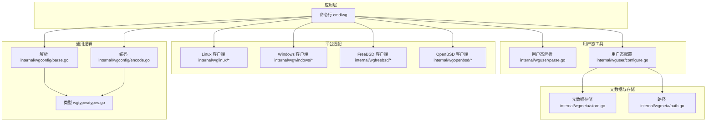
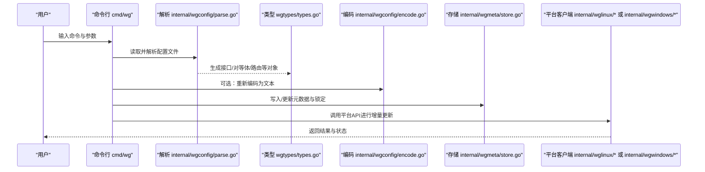
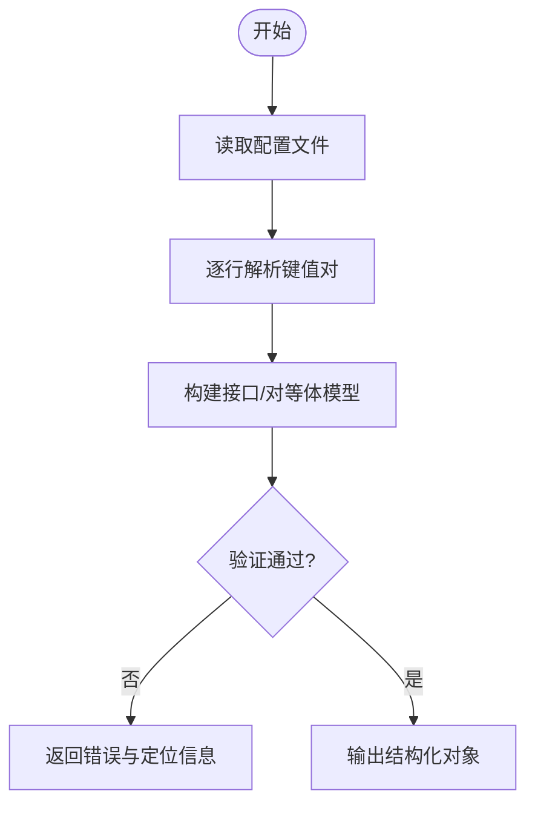
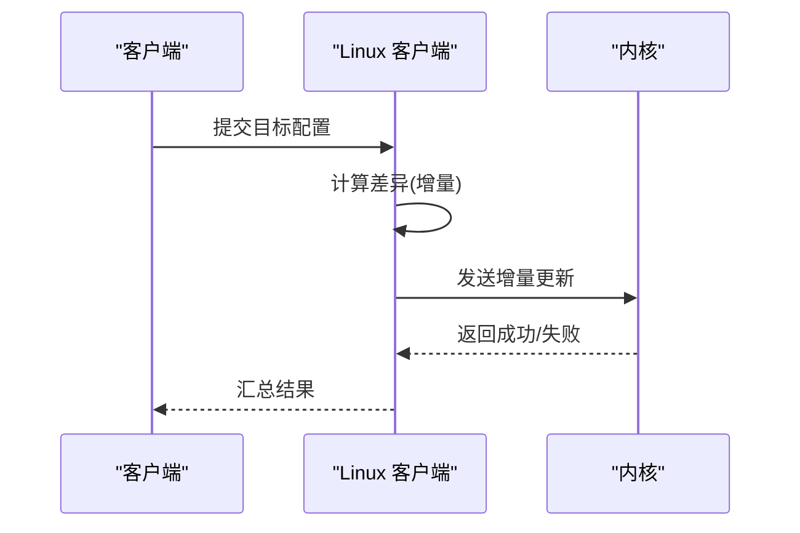
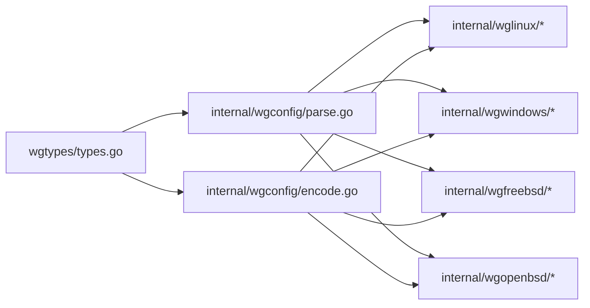

# 配置管理

<cite>
**本文引用的文件**
- [README.md](file://README.md)
- [readme_cn.md](file://readme_cn.md)
- [doc.go](file://doc.go)
- [client.go](file://client.go)
- [wgtypes/types.go](file://wgtypes/types.go)
- [internal/wgconfig/parse.go](file://internal/wgconfig/parse.go)
- [internal/wgconfig/encode.go](file://internal/wgconfig/encode.go)
- [cmd/wg/config.go](file://cmd/wg/config.go)
- [cmd/wg/show.go](file://cmd/wg/show.go)
- [internal/wguser/parse.go](file://internal/wguser/parse.go)
- [internal/wguser/configure.go](file://internal/wguser/configure.go)
- [internal/wgmeta/store.go](file://internal/wgmeta/store.go)
- [internal/wgmeta/path.go](file://internal/wgmeta/path.go)
- [internal/wglinux/client_linux.go](file://internal/wglinux/client_linux.go)
- [internal/wglinux/configure_linux.go](file://internal/wglinux/configure_linux.go)
- [internal/wgwindows/internal/ioctl/configuration_windows.go](file://internal/wgwindows/internal/ioctl/configuration_windows.go)
</cite>

## 目录
1. [简介](#简介)
2. [项目结构](#项目结构)
3. [核心组件](#核心组件)
4. [架构总览](#架构总览)
5. [详细组件分析](#详细组件分析)
6. [依赖关系分析](#依赖关系分析)
7. [性能考量](#性能考量)
8. [故障排查指南](#故障排查指南)
9. [结论](#结论)
10. [附录](#附录)

## 简介
本文件面向使用 wgctrl-go 的开发者与运维人员，系统化说明 WireGuard 配置管理的完整能力：配置文件格式规范、解析与验证流程、编码机制、存储位置与权限、增量更新与同步策略、最佳实践与安全建议，以及常见问题解决方案。文档以仓库实现为依据，确保内容与实际代码行为一致。

## 项目结构
仓库围绕“类型定义—解析/编码—平台客户端—用户态工具”分层组织：
- 类型与错误：wgtypes/types.go 提供统一的接口与对等体模型
- 解析与编码：internal/wgconfig 负责文本到类型的转换与反向序列化
- 平台客户端：internal/wglinux、internal/wgwindows、internal/wgfreebsd、internal/wgopenbsd 封装各平台内核或用户态驱动交互
- 用户态工具：cmd/wg 提供命令行入口；internal/wguser 提供用户态解析与配置下发
- 元数据与持久化：internal/wgmeta 提供路径与锁机制（用于并发安全）
- 顶层 API：client.go、doc.go 暴露统一客户端接口

图表来源
- [internal/wgconfig/parse.go](file://internal/wgconfig/parse.go)
- [internal/wgconfig/encode.go](file://internal/wgconfig/encode.go)
- [wgtypes/types.go](file://wgtypes/types.go)
- [internal/wguser/parse.go](file://internal/wguser/parse.go)
- [internal/wguser/configure.go](file://internal/wguser/configure.go)
- [internal/wgmeta/store.go](file://internal/wgmeta/store.go)
- [internal/wgmeta/path.go](file://internal/wgmeta/path.go)
- [internal/wglinux/client_linux.go](file://internal/wglinux/client_linux.go)
- [internal/wgwindows/internal/ioctl/configuration_windows.go](file://internal/wgwindows/internal/ioctl/configuration_windows.go)

章节来源
- [doc.go:1-200](file://doc.go#L1-L200)
- [client.go:1-200](file://client.go#L1-L200)
- [README.md:1-200](file://README.md#L1-L200)
- [readme_cn.md:1-200](file://readme_cn.md#L1-L200)

## 核心组件
- 类型模型（wgtypes/types.go）：定义接口、对等体、路由、保留字段等核心数据结构，是解析与编码的共同契约。
- 解析器（internal/wgconfig/parse.go）：将文本配置转换为内部类型，处理键值对、数组段、注释与空白。
- 编码器（internal/wgconfig/encode.go）：将内部类型序列化为标准文本格式，保证可读性与可回写性。
- 用户态工具（internal/wguser/*）：在用户态完成解析与配置下发，屏蔽平台差异。
- 平台客户端（internal/wg*）：对接内核或用户态驱动，执行实际的创建、修改、查询操作。
- 元数据与存储（internal/wgmeta/*）：提供配置文件路径、命名约定与并发锁，保障多进程安全。

章节来源
- [wgtypes/types.go:1-200](file://wgtypes/types.go#L1-L200)
- [internal/wgconfig/parse.go:1-200](file://internal/wgconfig/parse.go#L1-L200)
- [internal/wgconfig/encode.go:1-200](file://internal/wgconfig/encode.go#L1-L200)
- [internal/wguser/parse.go:1-200](file://internal/wguser/parse.go#L1-L200)
- [internal/wguser/configure.go:1-200](file://internal/wguser/configure.go#L1-L200)
- [internal/wgmeta/store.go:1-200](file://internal/wgmeta/store.go#L1-L200)
- [internal/wgmeta/path.go:1-200](file://internal/wgmeta/path.go#L1-L200)

## 架构总览
下图展示从命令行到内核配置的端到端流程，包括解析、校验、编码、存储与平台下发。

图表来源
- [cmd/wg/config.go](file://cmd/wg/config.go)
- [cmd/wg/show.go](file://cmd/wg/show.go)
- [internal/wgconfig/parse.go](file://internal/wgconfig/parse.go)
- [internal/wgconfig/encode.go](file://internal/wgconfig/encode.go)
- [wgtypes/types.go](file://wgtypes/types.go)
- [internal/wgmeta/store.go](file://internal/wgmeta/store.go)
- [internal/wglinux/client_linux.go](file://internal/wglinux/client_linux.go)
- [internal/wgwindows/internal/ioctl/configuration_windows.go](file://internal/wgwindows/internal/ioctl/configuration_windows.go)

## 详细组件分析

### 配置文件格式规范
- 基本语法
  - 段落式结构：每个接口一个段落，包含若干键值对
  - 支持注释行与空行
  - 键名大小写敏感，遵循 WireGuard 标准命名
- 接口级选项
  - 私钥、公钥、监听端口、MTU、防火墙标记、预共享密钥等
  - 取值范围与约束由类型模型与平台限制共同决定
- 对等体级选项
  - 公钥、允许IP、预共享密钥、持久连接、KeepAlive 间隔、Endpoint、传输统计等
  - 允许IP 可为单地址或CIDR列表
- 相互依赖关系
  - 私钥与公钥需匹配；若仅设置公钥，则视为只读查看模式
  - Endpoint 与 KeepAlive 配合实现保活
  - AllowedIPs 与路由表联动，影响流量转发
- 扩展字段
  - 保留字段用于未来兼容，解析时忽略未知键但记录日志

章节来源
- [wgtypes/types.go:1-200](file://wgtypes/types.go#L1-L200)
- [internal/wgconfig/parse.go:1-200](file://internal/wgconfig/parse.go#L1-L200)
- [internal/wgconfig/encode.go:1-200](file://internal/wgconfig/encode.go#L1-L200)

### 解析过程与验证规则
- 解析流程
  - 逐行扫描，识别段落与键值对
  - 将字符串值映射为对应类型（如端口号、布尔值、十六进制密钥）
  - 构建接口与对等体层级结构
- 验证规则
  - 必填项检查（如接口私钥或对等体公钥）
  - 数值范围校验（端口、超时、MTU）
  - 格式校验（Base64/Hex 密钥、IPv4/IPv6/CIDR）
  - 一致性校验（公钥与私钥配对、AllowedIPs 合法性）
- 错误处理
  - 遇到非法键或值时返回明确错误信息
  - 支持部分失败定位（行号、键名）

图表来源
- [internal/wgconfig/parse.go:1-200](file://internal/wgconfig/parse.go#L1-L200)
- [wgtypes/types.go:1-200](file://wgtypes/types.go#L1-L200)

章节来源
- [internal/wgconfig/parse.go:1-200](file://internal/wgconfig/parse.go#L1-L200)
- [wgtypes/types.go:1-200](file://wgtypes/types.go#L1-L200)

### 编码机制
- 将内部模型序列化为标准文本格式
- 保持键顺序与可读性，便于人工编辑与版本控制
- 支持回写与最小化变更（仅输出必要字段）

章节来源
- [internal/wgconfig/encode.go:1-200](file://internal/wgconfig/encode.go#L1-L200)
- [wgtypes/types.go:1-200](file://wgtypes/types.go#L1-L200)

### 配置存储机制
- 配置文件位置
  - 默认位于系统指定目录（例如 /etc/wireguard），具体路径由平台与安装方式决定
  - 文件名通常以 .conf 结尾，命名约定见路径模块
- 命名约定
  - 接口名与文件名一一对应，便于管理与识别
- 权限要求
  - 配置文件需受保护，仅允许 root/管理员读写
  - 私钥等敏感信息应避免被其他用户读取
- 并发与锁
  - 使用元数据锁避免多进程同时修改同一接口配置
  - 锁粒度覆盖单个接口文件，减少竞争

章节来源
- [internal/wgmeta/path.go:1-200](file://internal/wgmeta/path.go#L1-L200)
- [internal/wgmeta/store.go:1-200](file://internal/wgmeta/store.go#L1-L200)

### 增量更新与配置同步策略
- 增量更新
  - 对比当前运行配置与目标配置，仅下发差异部分
  - 对等体级别支持新增、删除、更新 AllowedIPs、Endpoint、KeepAlive 等
- 同步策略
  - 先校验目标配置合法性，再原子替换或合并
  - 失败时回滚至上一稳定状态
  - 支持幂等操作，重复应用不会产生副作用
- 平台差异
  - Linux 通过 netlink 接口进行细粒度更新
  - Windows 通过 IOCTL 与用户态驱动交互
  - BSD 系列通过各自内核接口

图表来源
- [internal/wglinux/client_linux.go:1-200](file://internal/wglinux/client_linux.go#L1-L200)
- [internal/wglinux/configure_linux.go:1-200](file://internal/wglinux/configure_linux.go#L1-L200)
- [internal/wgwindows/internal/ioctl/configuration_windows.go:1-200](file://internal/wgwindows/internal/ioctl/configuration_windows.go#L1-L200)

章节来源
- [internal/wglinux/configure_linux.go:1-200](file://internal/wglinux/configure_linux.go#L1-L200)
- [internal/wgwindows/internal/ioctl/configuration_windows.go:1-200](file://internal/wgwindows/internal/ioctl/configuration_windows.go#L1-L200)

### 命令行与用户态工具
- 命令入口
  - show：显示当前接口与对等体状态
  - config：加载、解析、验证与导出配置
- 用户态解析与配置
  - 在用户态完成解析与校验，降低内核耦合
  - 提供跨平台一致的体验

章节来源
- [cmd/wg/show.go:1-200](file://cmd/wg/show.go#L1-L200)
- [cmd/wg/config.go:1-200](file://cmd/wg/config.go#L1-L200)
- [internal/wguser/parse.go:1-200](file://internal/wguser/parse.go#L1-L200)
- [internal/wguser/configure.go:1-200](file://internal/wguser/configure.go#L1-L200)

### 配置示例场景
- 单接口
  - 适用于点对点或简单网关场景
  - 包含监听端口、私钥、单一对等体与 AllowedIPs
- 多接口
  - 适用于多网段或多租户隔离
  - 每个接口独立私钥与路由策略
- 复杂拓扑
  - 多个对等体、重叠 CIDR、动态 Endpoint
  - 结合 KeepAlive 与持久连接提升稳定性

提示：示例的具体键值与取值请参考解析与编码模块的行为边界，确保符合类型与平台限制。

章节来源
- [internal/wgconfig/parse.go:1-200](file://internal/wgconfig/parse.go#L1-L200)
- [internal/wgconfig/encode.go:1-200](file://internal/wgconfig/encode.go#L1-L200)
- [wgtypes/types.go:1-200](file://wgtypes/types.go#L1-L200)

## 依赖关系分析
- 低耦合高内聚
  - 类型定义独立于平台实现，便于测试与复用
  - 解析与编码模块不依赖平台细节
- 平台适配清晰
  - Linux/Windows/BSD 各自封装内核或驱动交互
- 外部依赖
  - 操作系统网络栈与内核模块（WireGuard 内核模块或用户态实现）
  - 文件系统与权限模型

图表来源
- [wgtypes/types.go:1-200](file://wgtypes/types.go#L1-L200)
- [internal/wgconfig/parse.go:1-200](file://internal/wgconfig/parse.go#L1-L200)
- [internal/wgconfig/encode.go:1-200](file://internal/wgconfig/encode.go#L1-L200)
- [internal/wglinux/client_linux.go:1-200](file://internal/wglinux/client_linux.go#L1-L200)
- [internal/wgwindows/internal/ioctl/configuration_windows.go:1-200](file://internal/wgwindows/internal/ioctl/configuration_windows.go#L1-L200)

章节来源
- [wgtypes/types.go:1-200](file://wgtypes/types.go#L1-L200)
- [internal/wgconfig/parse.go:1-200](file://internal/wgconfig/parse.go#L1-L200)
- [internal/wgconfig/encode.go:1-200](file://internal/wgconfig/encode.go#L1-L200)

## 性能考量
- 解析与编码
  - 线性复杂度，适合大配置文件的快速处理
  - 避免不必要的字符串拼接与重复分配
- 增量更新
  - 仅下发差异，减少内核交互开销
  - 批量合并对等体变更，提高吞吐
- I/O 与锁
  - 文件写入前进行完整性校验，避免脏写
  - 锁粒度最小化，缩短持有时间

[本节提供一般性指导，无需特定文件引用]

## 故障排查指南
- 常见错误
  - 非法密钥格式：检查 Base64/Hex 长度与字符集
  - 端口冲突：确认监听端口未被占用
  - 路由冲突：AllowedIPs 重叠导致路由不确定
  - 权限不足：配置文件或目录权限不正确
- 诊断步骤
  - 使用 show 命令查看当前状态
  - 使用 config 命令进行解析与验证
  - 检查平台日志与内核消息
  - 逐步缩小配置范围，定位问题源
- 恢复策略
  - 回滚到已知稳定配置
  - 使用增量更新而非全量替换，降低风险

章节来源
- [cmd/wg/show.go:1-200](file://cmd/wg/show.go#L1-L200)
- [cmd/wg/config.go:1-200](file://cmd/wg/config.go#L1-L200)
- [internal/wguser/parse.go:1-200](file://internal/wguser/parse.go#L1-L200)

## 结论
wgctrl-go 提供了完整的 WireGuard 配置管理能力：标准化的类型模型、健壮的解析与编码、跨平台的客户端实现、安全的存储与并发控制，以及高效的增量更新机制。遵循本文档的最佳实践与安全建议，可在生产环境中稳定部署与维护 WireGuard 网络。

[本节总结性内容，无需特定文件引用]

## 附录
- 最佳实践
  - 使用最小权限原则管理配置文件与目录
  - 定期轮换密钥并备份配置
  - 采用版本控制系统管理配置变更
  - 在生产环境启用审计与告警
- 安全建议
  - 严格限制私钥访问权限
  - 使用强随机数生成密钥
  - 限制 AllowedIPs 的最小集合
  - 启用防火墙标记与策略
- 常见问题
  - 无法建立连接：检查 Endpoint 可达性与 NAT 穿透
  - 流量不通：核对 AllowedIPs 与路由表
  - 性能下降：调整 MTU、KeepAlive 与并发参数

[本节提供一般性指导，无需特定文件引用]